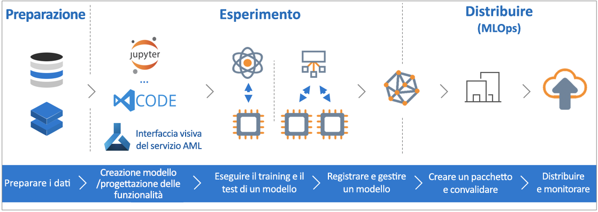

# Informazioni sul servizio Azure Machine Learning (anteprima)

Azure Machine Learning (anteprima) è un servizio cloud usato per sviluppare e distribuire modelli di Machine Learning. Il servizio consente di tenere traccia dei modelli durante le fasi di compilazione, training, distribuzione e gestione, il tutto alle vaste dimensioni di scala offerte dal cloud.

## Che cos'è l'apprendimento automatico?

Machine Learning è una tecnica di analisi scientifica dei dati che consente ai computer di usare i dati esistenti per prevedere comportamenti, tendenze e risultati futuri. Con Machine Learning, i computer apprendono senza essere programmati in modo esplicito.

Queste previsioni o stime di Machine Learning possono rendere più intelligenti le app e i dispositivi. Quando si effettuano acquisti online, l'apprendimento automatico consiglia altri prodotti che potrebbero interessare in base a ciò che si è acquistato. Quando si usa la carta di credito, l'apprendimento automatico confronta la transazione con un database di transazioni e consente di rilevare eventuali frodi. Infine, quando il robot aspirapolvere aspira la polvere in una stanza, l'apprendimento automatico gli consente di decidere se il lavoro è stato completato.

## Informazioni su Azure Machine Learning

Il servizio Azure Machine Learning offre un ambiente basato su cloud utile per sviluppare, eseguire il training, testare, distribuire, gestire e tenere traccia dei modelli di Machine Learning.

[  ] (./media/overview-what-is-azure-ml/aml.png#lightbox)

Il servizio Azure Machine Learning supporta le tecnologie open source e consente pertanto di usare decine di migliaia di pacchetti Python open source con componenti di apprendimento automatico come TensorFlow e scikit-learn.
Strumenti avanzati come i [notebook di Jupyter](http://jupyter.org) o [Visual Studio Code Tools for AI](https://visualstudio.microsoft.com/downloads/ai-tools-vscode/) semplificano l'esplorazione interattiva dei dati, la loro trasformazione e quindi lo sviluppo e il test dei modelli.
Il servizio Azure Machine Learning include anche funzionalità per [automatizzare la generazione e l'ottimizzazione dei modelli](tutorial-auto-train-models.md), per creare modelli in modo semplice, efficiente e accurato.

Consente anche di avviare il training sul computer locale per poi scalare orizzontalmente nel cloud. Grazie al supporto nativo per [Azure Batch per intelligenza artificiale](https://azure.microsoft.com/services/batch-ai/) e con i [servizi di ottimizzazione dei parametri hyper avanzati](how-to-tune-hyperparameters.md), è possibile compilare modelli migliori in tempi più rapidi, sfruttando le potenzialità offerte dal cloud. 

Dopo aver ottenuto il modello più idoneo, è possibile distribuirlo in un contenitore come Docker. In questo modo, sarà semplice da distribuire in [Istanze di contenitore di Azure](how-to-deploy-to-aci.md) o nel [servizio Kubernetes di Azure](how-to-deploy-to-aks.md), oppure sarà possibile usare il contenitore nelle proprie distribuzioni, in locale o nel cloud.
È possibile gestire i modelli distribuiti e tenere traccia delle diverse esecuzioni sperimentate per individuare la soluzione migliore.

[!INCLUDE [aml-preview-note](../../../includes/aml-preview-note.md)]

## Quali operazioni si possono eseguire con Azure Machine Learning?

Azure Machine Learning può generare e ottimizzare automaticamente un modello per l'utente.
Per un esempio, vedere [Tutorial: Automatically train a classification model with Azure Automated Machine Learning](tutorial-auto-train-models.md) (Esercitazione: Eseguire il training automatico di un modello di classificazione con Azure Automated Machine Learning).

Oppure, usando l'<a href="http://aka.ms/aml-sdk" target="_blank">SDK</a> di Azure Machine Learning per Python insieme ai pacchetti Python open source, è possibile compilare ed eseguire autonomamente il training di modelli di apprendimento automatico estremamente precisi e avanzati in un'area di lavoro di Azure Machine Learning.
È possibile scegliere tra i numerosi componenti di apprendimento automatico disponibili come pacchetti Python open source, ad esempio:

- <a href="http://scikit-learn.org/stable/" target="_blank">Scikit-learn</a>
- <a href="https://www.tensorflow.org" target="_blank">Tensorflow</a>
- <a href="https://pytorch.org" target="_blank">PyTorch</a>
- <a href="https://www.microsoft.com/cognitive-toolkit/" target="_blank">CNTK</a>
- <a href="http://mxnet.io" target="_blank">MXNet</a>

Dopo la creazione, il modello può essere usato per creare un contenitore (ad esempio Docker) che può essere distribuito in locale per il test e quindi usato come ambiente di produzione del servizio Web in [Istanze di contenitore di Azure](how-to-deploy-to-aci.md) o nel [servizio Kubernetes di Azure](how-to-deploy-to-aks.md).

È quindi possibile gestire i modelli distribuiti tramite il [portale di Azure](https://portal.azure.com/) o l'[estensione della riga di comando di Azure Machine Learning](https://review.docs.microsoft.com/azure/machine-learning/service/reference-azure-machine-learning-cli).
È possibile valutare le metriche del modello, ripetere il training e ridistribuire le nuove versioni del modello, tenendo al contempo traccia degli esperimenti del modello.

Per iniziare a usare il servizio Azure Machine Learning, vedere la sezione [Passaggi successivi](#next-steps) più avanti.

## Quali sono le differenze tra il servizio Azure Machine Learning e Azure Machine Learning Studio?

Azure Machine Learning Studio è un'area di lavoro collaborativa e grafica con selezione e trascinamento degli elementi, in cui è possibile compilare, testare e distribuire soluzioni di apprendimento automatico senza dover scrivere codice. Usa algoritmi di apprendimento automatico e moduli di gestione dei dati precompilati e preconfigurati.

Azure Machine Learning Studio è adatta a sperimentare modelli di apprendimento automatico in modo semplice e rapido quando gli algoritmi di apprendimento automatico predefiniti sono sufficienti per le soluzioni dell'utente.

Il servizio Azure Machine Learning è adatto agli ambienti Python, quando è necessario disporre di maggior controllo sugli algoritmi di apprendimento automatico oppure si intende usare le librerie di apprendimento automatico open source.

> [!NOTE]
> I modelli creati in Azure Machine Learning Studio non possono essere distribuiti né gestiti dal servizio Azure Machine Learning.

## Versione di prova gratuita
Se non si è abbonati, è possibile [aprire un account Azure gratuitamente](https://azure.microsoft.com/pricing/free-trial/?WT.mc_id=A261C142F). Si ricevono così crediti da spendere in servizi di Azure. Quando i crediti saranno esauriti, sarà possibile mantenere l'account e usare i [servizi di Azure gratuiti](https://azure.microsoft.com/free/). Verranno applicati addebiti alla carta di credito solo se l'utente modifica le impostazioni e richiede esplicitamente l'addebito. In alternativa, è possibile [attivare i benefici della sottoscrizione MSDN](https://azure.microsoft.com/pricing/member-offers/msdn-benefits-details/?WT.mc_id=A261C142F): con la sottoscrizione MSDN ogni mese si accumulano crediti che è possibile usare per i servizi di Azure a pagamento.

## Passaggi successivi

- Creare un'area di lavoro di apprendimento automatico usando l'articolo [Usare il portale di Azure per iniziare](quickstart-get-started.md)
 
- Completare l'esercitazione [Eseguire il training di un modello di classificazione delle immagini con Azure Machine Learning](tutorial-train-models-with-aml.md) per informazioni su come eseguire il training e distribuire modelli con il servizio Azure Machine Learning.

- Per informazioni su come consentire ad Azure Machine Learning di generare e ottimizzare automaticamente il modello, vedere [Tutorial: Automatically train a classification model with Azure Automated Machine Learning](tutorial-auto-train-models.md) (Esercitazione: Eseguire il training automatico di un modello di classificazione con Azure Automated Machine Learning.)

- Per un'approfondita presentazione tecnica del servizio, vedere [Azure Machine Learning service architecture and concepts ](concept-azure-machine-learning-architecture.md)(Nozioni di base e architettura del servizio Azure Machine Learning).

- Per informazioni su altri prodotti di apprendimento automatico Microsoft, vedere [Altri prodotti di apprendimento automatico Microsoft](./overview-more-machine-learning.md).

<!-- 

An intro to AML or an end-to-end quickstart video could go here.

In this 9-minute video, learn how you can benefit your app. You'll learn about key features and what a typical workflow looks like. 

>[!VIDEO https://channel9.msdn.com/Events/Connect/2016/138/player]
 
+ 0-3 minutes covers key features and use-cases.
+ 3-4 minutes covers service provisioning. 
+ 4-6 minutes covers Import Data wizard used to create an index using the built-in real estate dataset.

-->