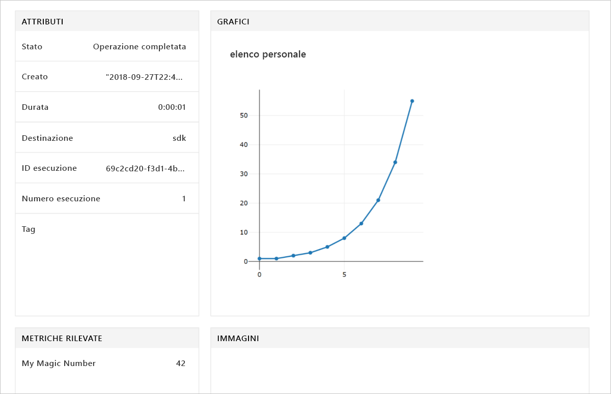

# <a name="quickstart-use-the-python-sdk-to-get-started-with-azure-machine-learning"></a>Guida introduttiva: Usare l'SDK per Python per iniziare a usare Azure Machine Learning

In questo articolo si usa Azure Machine Learning SDK per Python per creare e quindi usare un'[area di lavoro](concept-azure-machine-learning-architecture.md) del servizio Azure Machine Learning. L'area di lavoro rappresenta l'elemento fondamentale nel cloud per eseguire esperimenti, training e distribuzione di modelli di Machine Learning con il servizio Machine Learning. 

Si inizia configurando l'ambiente Python e il server di Jupyter Notebook. Per l'esecuzione senza installazione, vedere [Avvio rapido: Iniziare a usare Azure Machine Learning con il portale di Azure](quickstart-get-started.md).

> [!VIDEO https://www.microsoft.com/en-us/videoplayer/embed/RE2G9N6]

In questo articolo si apprenderà come:
* Installare l'SDK per Python.
* Creare un'area di lavoro nella sottoscrizione di Azure.
* Creare un file di configurazione per l'area di lavoro da usare successivamente in altri notebook e script.
* Scrivere codice per la registrazione di valori nell'area di lavoro.
* Visualizzare i valori registrati nell'area di lavoro.

Si crea un'area di lavoro e un file di configurazione da usare come prerequisiti per altre esercitazioni e procedure dettagliate per il servizio Machine Learning. Come con altri servizi di Azure, al servizio Machine Learning sono associati limiti e quote. [Informazioni sulle quote e come richiederne altre.](how-to-manage-quotas.md)

Le risorse di Azure seguenti vengono aggiunte automaticamente all'area di lavoro quando sono disponibili a livello di area:
 
- [Registro Azure Container](https://azure.microsoft.com/services/container-registry/)
- [Archiviazione di Azure](https://azure.microsoft.com/services/storage/)
- [Azure Application Insights](https://azure.microsoft.com/services/application-insights/) 
- [Insieme di credenziali chiave Azure](https://azure.microsoft.com/services/key-vault/)

Se non si dispone di una sottoscrizione di Azure, creare un account gratuito prima di iniziare. Accedere alla [versione gratuita o a pagamento del servizio Azure Machine Learning](http://aka.ms/AMLFree).

## <a name="install-the-sdk"></a>Installare l'SDK

> [!IMPORTANT]
> Ignorare questa sezione se si usa una Data Science Virtual Machine creata dopo il 27 settembre 2018.
> Nelle Data Science Virtual Machine create dopo questa data, l'SDK per Python è preinstallato.

Il codice in questo articolo richiede Azure Machine Learning SDK versione 1.0.2 o successiva.

Prima di installare l'SDK, è consigliabile creare un ambiente Python isolato. Anche se in questo articolo si usa [Miniconda](https://docs.conda.io/en/latest/miniconda.html), si può usare la versione [Anaconda](https://www.anaconda.com/) completa installata o [Python virtualenv](https://virtualenv.pypa.io/en/stable/).

### <a name="install-miniconda"></a>Installare Miniconda

[Scaricare e installare Miniconda](https://conda.io/miniconda.html). Selezionare Python 3.7 o versione successiva. Non selezionare Python 2.x.

### <a name="create-an-isolated-python-environment"></a>Creare un ambiente Python isolato 

1. Aprire una finestra della riga di comando e creare un nuovo ambiente conda denominato *myenv* con Python 3.6.

    ```shell
    conda create -n myenv -y Python=3.6
    ```

1. Attivare l'ambiente.

    ```shell
    conda activate myenv
    ```

### <a name="install-the-sdk"></a>Installare l'SDK

Installare l'SDK nell'ambiente conda attivato. Questo codice installa i componenti di base di Machine Learning SDK. Installa anche un server Jupyter Notebook nell'ambiente conda. Il completamento dell'installazione richiede alcuni minuti a seconda della configurazione del computer.

```shell
# Install Jupyter
conda install nb_conda

# Install the base SDK and Jupyter Notebook
pip install azureml-sdk[notebooks]
```

È possibile usare parole chiave aggiuntive per installare altri componenti dell'SDK:

```shell
# Install the base SDK and auto ml components
pip install azureml-sdk[automl]

# Install the base SDK and the model explainability component
pip install azureml-sdk[explain]

# Install the base SDK and experimental components
pip install azureml-sdk[contrib]
```

Nell'ambiente di Azure Databricks, usare invece la [procedura di installazione di Databricks](how-to-configure-environment.md#azure-databricks
).


## <a name="create-a-workspace"></a>Creare un'area di lavoro

1. Per avviare Jupyter Notebook, immettere questo comando:

    ```shell
    jupyter notebook
    ```

1. Nella finestra del browser creare un nuovo notebook usando il kernel `Python 3` predefinito. 

1. Per visualizzare la versione dell'SDK, immettere ed eseguire il codice Python seguente in una cella del notebook:

   [!code-python[](~/aml-sdk-samples/ignore/doc-qa/quickstart-create-workspace-with-python/quickstart.py?name=import)]

1. Trovare un valore per il parametro `<azure-subscription-id>` nell'[elenco delle sottoscrizioni nel portale di Azure](https://ms.portal.azure.com/#blade/Microsoft_Azure_Billing/SubscriptionsBlade). Usare qualsiasi sottoscrizione per la quale si ha il ruolo di proprietario o collaboratore.

   ```python
   from azureml.core import Workspace
   ws = Workspace.create(name='myworkspace',
                         subscription_id='<azure-subscription-id>', 
                         resource_group='myresourcegroup',
                         create_resource_group=True,
                         location='eastus2' # Or other supported Azure region   
                        )
   ```

   Quando si esegue il codice, è possibile che venga chiesto di accedere all'account di Azure. Dopo aver effettuato l'accesso, il token di autenticazione viene memorizzato nella cache locale.

1. Per visualizzare i dettagli dell'area di lavoro, ad esempio la risorsa di archiviazione, il registro contenitori e l'insieme di credenziali delle chiavi associati, immettere il codice seguente:

    [!code-python[](~/aml-sdk-samples/ignore/doc-qa/quickstart-create-workspace-with-python/quickstart.py?name=getDetails)]


## <a name="write-a-configuration-file"></a>Scrivere un file di configurazione

Salvare i dettagli dell'area di lavoro in un file di configurazione nella directory corrente. Il file è denominato *aml_config\config.json*.  

La chiamata API `write_config()` crea il file di configurazione nella directory corrente. Il file *config.json* contiene quanto segue:

```json
{
    "subscription_id": "<azure-subscription-id>",
    "resource_group": "myresourcegroup",
    "workspace_name": "myworkspace"
}
```

Con questo file di configurazione dell'area di lavoro sarà possibile caricare più facilmente la stessa area di lavoro in un secondo momento. Sara possibile caricarla con altri notebook e script nella stessa directory o in una sottodirectory. 

[!code-python[](~/aml-sdk-samples/ignore/doc-qa/quickstart-create-workspace-with-python/quickstart.py?name=writeConfig)]


## <a name="use-the-workspace"></a>Usare l'area di lavoro

Scrivere codice che usi le API di base dell'SDK per tenere traccia delle esecuzioni dell'esperimento.

[!code-python[](~/aml-sdk-samples/ignore/doc-qa/quickstart-create-workspace-with-python/quickstart.py?name=useWs)]

## <a name="view-logged-results"></a>Visualizzare i risultati registrati
Al termine è possibile visualizzare l'esecuzione dell'esperimento nel portale di Azure. Per stampare un URL che consente di passare ai risultati dell'ultima esecuzione, usare il codice seguente:

```python
print(run.get_portal_url())
```

Usare il collegamento per visualizzare i valori registrati nel portale di Azure all'interno nel browser.



## <a name="clean-up-resources"></a>Pulire le risorse 
>[!IMPORTANT]
>È possibile usare le risorse create qui come prerequisiti per altre esercitazioni e procedure dettagliate per il servizio Machine Learning.

Se non si prevede di usare le risorse create in questo articolo, eliminarle per evitare eventuali addebiti.

[!code-python[](~/aml-sdk-samples/ignore/doc-qa/quickstart-create-workspace-with-python/quickstart.py?name=delete)]

## <a name="next-steps"></a>Passaggi successivi

In questo articolo sono state create le risorse necessarie per eseguire esperimenti e distribuire modelli. È stato eseguito codice in un notebook ed è stata esaminata la cronologia di esecuzione del codice nell'area di lavoro nel cloud.

Per usare il codice con le esercitazioni di Machine Learning sono necessari alcuni pacchetti aggiuntivi nell'ambiente.

1. Chiudere il notebook nel browser.
1. Nella finestra della riga di comando premere CTRL+C per arrestare il server di Jupyter Notebook.
1. Installare i pacchetti aggiuntivi.  Se `azureml-sdk[automl]` non è stato ancora installato, installarlo ora.

    ```shell
    conda install -y cython matplotlib scikit-learn pandas numpy
    pip install azureml-sdk[automl]
    ```

Dopo aver installato questi pacchetti, continuare con le esercitazioni per eseguire il training e la distribuzione di un modello. 

> [!div class="nextstepaction"]
> [Esercitazione: Eseguire il training di un modello per la classificazione di immagini](tutorial-train-models-with-aml.md)

È anche possibile esaminare [esempi più avanzati in GitHub](https://aka.ms/aml-notebooks).
