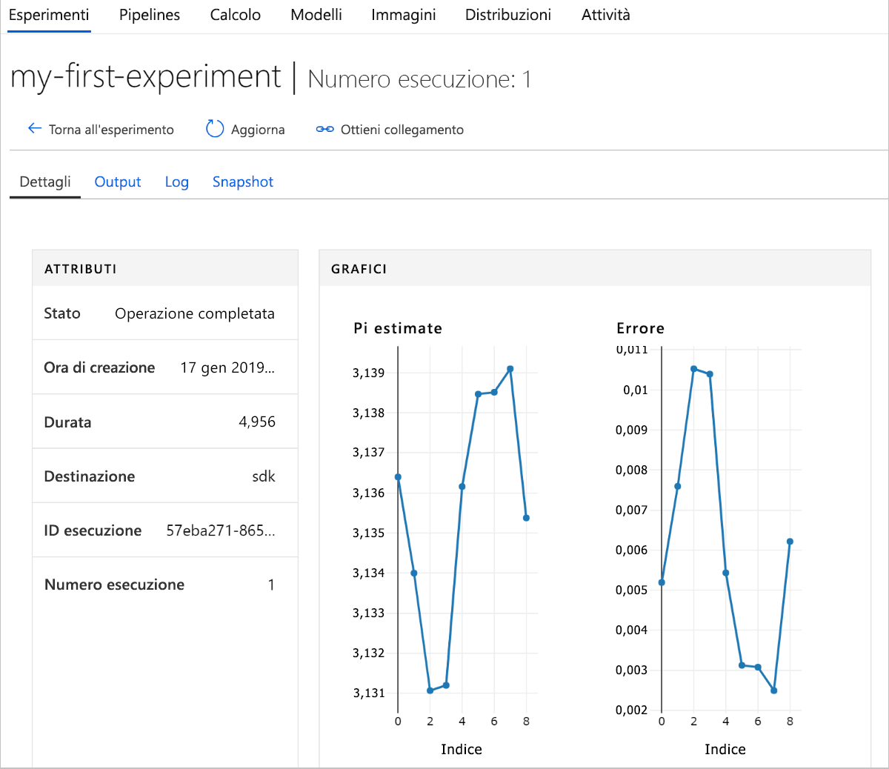

# <a name="quickstart-get-started-with-azure-machine-learning-using-the-cli-extension"></a>Avvio rapido: Iniziare a usare il servizio Azure Machine Learning usando l'estensione dell'interfaccia della riga di comando

In questo avvio rapido si userà un'estensione dell'interfaccia della riga di comando di Azure Machine Learning per iniziare a usare il [servizio Azure Machine Learning](overview-what-is-azure-ml.md) (anteprima).

Usando l'interfaccia della riga di comando si apprenderà come:

1. Creare un'area di lavoro nella sottoscrizione di Azure. L'area di lavoro viene usata da uno o più utenti per archiviare le risorse di calcolo, i modelli, le distribuzioni e le cronologie di esecuzione sul cloud.
1. Collegare un progetto nell'area di lavoro.   Un progetto è una cartella locale contenente gli script e i file di configurazione necessari per risolvere il problema relativo ad Azure Machine Learning.  
1. Eseguire uno script di Python nel progetto che registra alcuni valori in più iterazioni.
1. Visualizzare i valori registrati nella cronologia di esecuzione dell'area di lavoro.

> [!NOTE]
> Per comodità, le risorse di Azure seguenti vengono aggiunte automaticamente all'area di lavoro quando sono disponibili a livello di area: [registro contenitori](https://azure.microsoft.com/services/container-registry/), [risorsa di archiviazione](https://azure.microsoft.com/services/storage/), [Application Insights](https://azure.microsoft.com/services/application-insights/) e [insieme di credenziali delle chiavi](https://azure.microsoft.com/services/key-vault/).

Le risorse create possono essere usate come prerequisiti per altre esercitazioni e procedure dettagliate per Azure Machine Learning.

Questa interfaccia della riga di comando è stata compilata usando l'<a href="http://aka.ms/aml-sdk" target="_blank">SDK</a> basato su Python per il servizio Azure Machine Learning.

## <a name="prerequisites"></a>Prerequisiti

Prima di iniziare i passaggi dell'avvio rapido, verificare che siano stati soddisfati i prerequisiti seguenti:

+ Una sottoscrizione di Azure. Se non si ha una sottoscrizione di Azure, creare un [account gratuito](https://azure.microsoft.com/free/?WT.mc_id=A261C142F) prima di iniziare.
+ [Python 3.5 o versione successiva](https://www.python.org/) installata
+ [Interfaccia della riga di comando di Azure ](https://docs.microsoft.com/cli/azure/install-azure-cli?view=azure-cli-latest) installata.

## <a name="install-the-cli-extension"></a>Installare l'estensione dell'interfaccia della riga di comando

Nel computer aprire un editor di righe di comando e installare l'[estensione di Azure Machine Learning nell'interfaccia della riga di comando di Azure](reference-azure-machine-learning-cli.md).  Il completamento dell'installazione può richiedere alcuni minuti.

```azurecli
az extension add azureml-sdk
```

## <a name="install-the-sdk"></a>Installare l'SDK

[!INCLUDE [aml-install-sdk](../../../includes/aml-install-sdk.md)]

## <a name="create-a-resource-group"></a>Creare un gruppo di risorse

Un gruppo di risorse è un contenitore con risorse correlate per una soluzione Azure. Tramite l'interfaccia della riga di comando di Azure accedere ad Azure, specificare la sottoscrizione e creare un gruppo di risorse.

In una finestra della riga di comando accedere con il comando dell'interfaccia della riga di comando di Azure, `az login`. Seguire le istruzioni per l'accesso interattivo:
    
   ```azurecli
   az login
   ```

Elencare le sottoscrizioni di Azure disponibili e specificare quella da usare:
   ```azurecli
   az account list --output table
   az account set --subscription <your-subscription-id>
   az account show
   ```
   dove \<your-subscription-id\> è il valore ID della sottoscrizione da usare. Non includere le parentesi acute.

Creare un gruppo di risorse per contenere l'area di lavoro.
In questo avvio rapido:
   + Il nome del gruppo di risorse è `docs-aml`.
   + L'area è `eastus2`. 

   ```azurecli
   az group create -n docs-aml -l eastus2
   ```

## <a name="create-a-workspace-and-a-project-folder"></a>Creare un'area di lavoro e una cartella di progetto

Nella finestra della riga di comando creare un'area di lavoro di Azure Machine Learning nel gruppo di risorse.


   In questo avvio rapido:
   + Il nome dell'area di lavoro è `docs-ws`.
   + Il nome del gruppo di risorse è `docs-aml`.

   ```azurecli
   az ml workspace create -n docs-ws -g docs-aml
   ```

Nella finestra della riga di comando creare una cartella nel computer locale per il progetto Azure Machine Learning.

   ```
   mkdir docs-prj
   cd docs-prj
   ```

## <a name="create-a-python-script"></a>Creare uno script Python

[!INCLUDE [aml-create-script-pi](../../../includes/aml-create-script-pi.md)]

## <a name="run-the-script"></a>Esecuzione dello script

Collegare la cartella come progetto all'area di lavoro. L'argomento `--history` specifica un nome per il file della cronologia di esecuzione che acquisisce le metriche per ogni esecuzione.

   ```azurecli
   az ml project attach --history my_history -w docs-ws -g docs-aml
   ```

Eseguire lo script nel computer locale.

   ```azurecli
   az ml run submit -c local pi.py
   ```

   Questo comando esegue il codice e restituisce un collegamento Web alla console. Copiare e incollare il collegamento nel Web browser.

In un Web browser visitare l'URL. Viene visualizzato un portale Web con i risultati dell'esecuzione. È possibile esaminare i risultati dell'esecuzione o le esecuzioni precedenti, se presenti.

Il dashboard del portale è supportato solo nei browser Edge, Chrome e Firefox.

   

## <a name="clean-up-resources"></a>Pulire le risorse

[!INCLUDE [aml-delete-resource-group](../../../includes/aml-delete-resource-group.md)]

## <a name="next-steps"></a>Passaggi successivi
Sono state create le risorse necessarie per iniziare a sperimentare e distribuire modelli. È stato anche creato un progetto, è stato eseguito uno script ed è stata esaminata la cronologia di esecuzione dello script.

Per un'esperienza approfondita del flusso di lavoro, eseguire l'esercitazione di Azure Machine Learning sulla compilazione, il training e la distribuzione di un modello.

> [!div class="nextstepaction"]
> [Esercitazione:Compilare, eseguire il training e distribuire un modello](tutorial-train-models-with-aml.md)