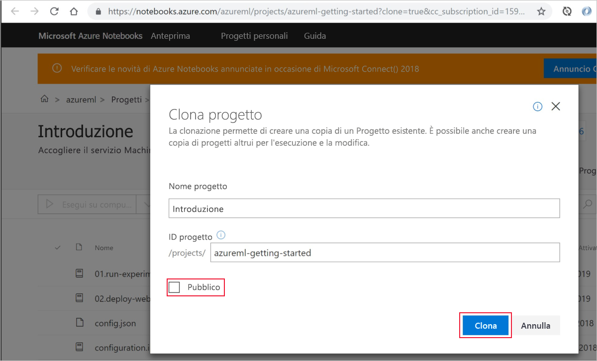
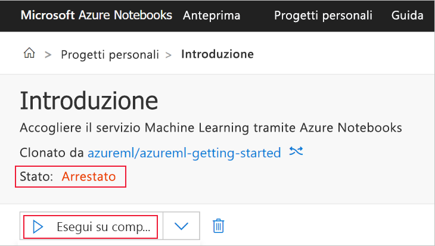
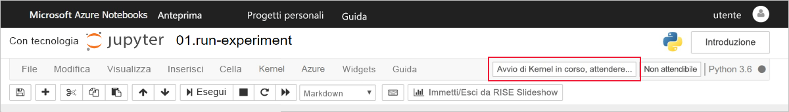

# Guida introduttiva: Iniziare a usare Azure Machine Learning con il portale di Azure

Usare il portale di Azure per creare un'area di lavoro di Azure Machine Learning. Questa area di lavoro rappresenta le fondamenta nel cloud per sperimentare, eseguire il training e distribuire modelli di Machine Learning con il servizio Machine Learning. Questa guida introduttiva usa le risorse cloud e non richiede installazione. Per configurare in alternativa un proprio server di Jupyter Notebook, vedere [Avvio rapido: Iniziare a usare Azure Machine Learning con Python](quickstart-create-workspace-with-python.md).  
 
In questo argomento di avvio rapido si eseguono le operazioni seguenti:

* Creare un'area di lavoro nella sottoscrizione di Azure.
* Provarla con Python in un notebook di Jupyter e registrare i valori per più iterazioni.
* Visualizzare i valori registrati nell'area di lavoro.

Le risorse di Azure seguenti vengono aggiunte automaticamente all'area di lavoro quando sono disponibili a livello di area:

  - [Registro Azure Container](https://azure.microsoft.com/services/container-registry/)
  - [Archiviazione di Azure](https://azure.microsoft.com/services/storage/)
  - [Azure Application Insights](https://azure.microsoft.com/services/application-insights/) 
  - [Insieme di credenziali chiave Azure](https://azure.microsoft.com/services/key-vault/)

Le risorse create possono essere usate come prerequisiti per altre esercitazioni e procedure dettagliate per il servizio Machine Learning. Come con altri servizi di Azure, sono previsti limiti per determinate risorse associate a Machine Learning. Un esempio è dato dalla dimensione del cluster di elaborazione. Sono disponibili altre informazioni sui [limiti predefiniti e su come aumentare la quota](how-to-manage-quotas.md).

Se non è disponibile una sottoscrizione di Azure, creare un account gratuito prima di iniziare. Accedere alla [versione gratuita o a pagamento del servizio Azure Machine Learning](http://aka.ms/AMLFree).

## Creare un'area di lavoro 

[!INCLUDE [aml-create-portal](../../../includes/aml-create-in-portal.md)]

## Usare l'area di lavoro

> [!VIDEO https://www.microsoft.com/en-us/videoplayer/embed/RE2F9Ad]

Ora si vedrà in che modo un'area di lavoro consente di gestire gli script di apprendimento automatico. In questa sezione si eseguono i passaggi seguenti:

* Aprire un notebook in Azure Notebooks.
* Eseguire il codice che crea alcuni valori registrati.
* Visualizzare i valori registrati nell'area di lavoro.

Questo esempio mostra come l'area di lavoro consente di tenere traccia delle informazioni generate in uno script. 

### Aprire un notebook 

[Azure Notebooks](https://notebooks.azure.com) offre una piattaforma cloud gratuita per i notebook di Jupyter preconfigurati con tutto il necessario per eseguire Machine Learning. Dall'area di lavoro è possibile avviare questa piattaforma per iniziare a usare l'area di lavoro del servizio Azure Machine Learning.

1. Nella pagina dell'area di lavoro selezionare **Esplora l'area di lavoro del servizio Azure Machine Learning**.

 

1. Selezionare **Apri Azure Notebooks** per provare il primo esperimento in Azure Notebooks.  Azure Notebooks è un servizio separato che consente di eseguire gratuitamente i notebook di Jupyter nel cloud.  Quando si usa questo collegamento al servizio, le informazioni su come connettersi all'area di lavoro verranno aggiunte alla libreria creata in Azure Notebooks.

 

1. Accedere ad Azure Notebooks.  Assicurarsi di accedere con lo stesso account usato per accedere al portale di Azure. L'organizzazione potrebbe richiedere [il consenso dell'amministratore](https://notebooks.azure.com/help/signing-up/work-or-school-account/admin-consent) per poter accedere.

1. Dopo l'accesso, si apre una nuova scheda e viene visualizzata la richiesta `Clone Library`. La clonazione di questa libreria caricherà un set di notebook e altri file nell'account di Azure Notebooks.  Questi file consentono di esplorare le funzionalità di Azure Machine Learning.

1. Deselezionare l'opzione **Pubblica** in modo da non condividere le informazioni dell'area di lavoro con altri utenti.

1. Selezionare **Clona**.

 

1. Se lo stato del progetto è arrestato, fare clic su **Esegui in ambiente di calcolo gratuito** per usare il server notebook gratuito.

    

### Eseguire il notebook

Nell'elenco di file per questo progetto viene visualizzato il file `config.json`. Questo file di configurazione contiene informazioni sull'area di lavoro creata nel portale di Azure.  Questo file consente al codice di connettersi e di aggiungere informazioni nell'area di lavoro.

1. Selezionare **01.run experiment.ipynb** per aprire il notebook.

1. L'area di notifica indica di attendere fino a quando il kernel non viene avviato.  Il messaggio scomparirà non appena il kernel è pronto.

    

1. Dopo l'avvio del kernel eseguire le celle una alla volta con **MAIUSC+INVIO**. In alternativa, selezionare **Celle** > **Esegui tutto** per eseguire l'intero notebook. Quando viene visualizzato un asterisco, __*__, accanto a una cella, significa che questa è ancora in esecuzione. Al termine dell'esecuzione del codice per la cella, compare un numero. 

1. Seguire le istruzioni nel notebook per autenticare la sottoscrizione di Azure.

Dopo che l'esecuzione di tutte le celle del notebook è completata, è possibile visualizzare i valori registrati nell'area di lavoro.

## Visualizzare i valori registrati

1. L'output della cella `run` contiene un collegamento al portale di Azure per visualizzare i risultati dell'esperimento nell'area di lavoro. 

    

1. Fare cli sul **collegamento al portale di Azure** per visualizzare le informazioni sull'esecuzione nell'area di lavoro.  Questo collegamento apre l'area di lavoro nel portale di Azure.

1. I tracciati dei valori registrati visualizzati sono stati creati automaticamente nell'area di lavoro. Ogni volta che si registrano più valori con lo stesso parametro name, viene generato automaticamente un tracciato.

   

Poiché il codice per approssimare Pi usa valori casuali, i tracciati mostreranno valori diversi.  

## Pulire le risorse 

[!INCLUDE [aml-delete-resource-group](../../../includes/aml-delete-resource-group.md)]

È anche possibile mantenere il gruppo di risorse ma eliminare una singola area di lavoro. Visualizzare le proprietà dell'area di lavoro e selezionare **Elimina**.

## Passaggi successivi

Sono state create le risorse necessarie per provare a usare e distribuire modelli. È stato anche eseguito del codice in un notebook ed è stata esaminata la cronologia di esecuzione di quel codice nell'area di lavoro nel cloud.

Per un'esperienza approfondita del flusso di lavoro, seguire le esercitazioni di Machine Learning riguardanti il training e la distribuzione di un modello:  

> [!div class="nextstepaction"]
> [Esercitazione: Eseguire il training di un modello per la classificazione di immagini](tutorial-train-models-with-aml.md)
