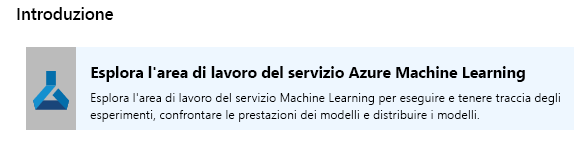
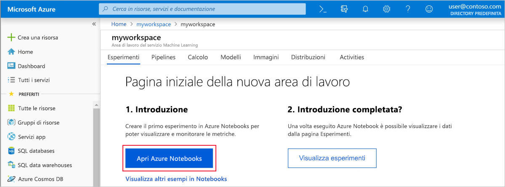
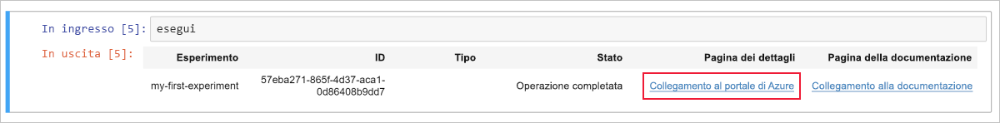
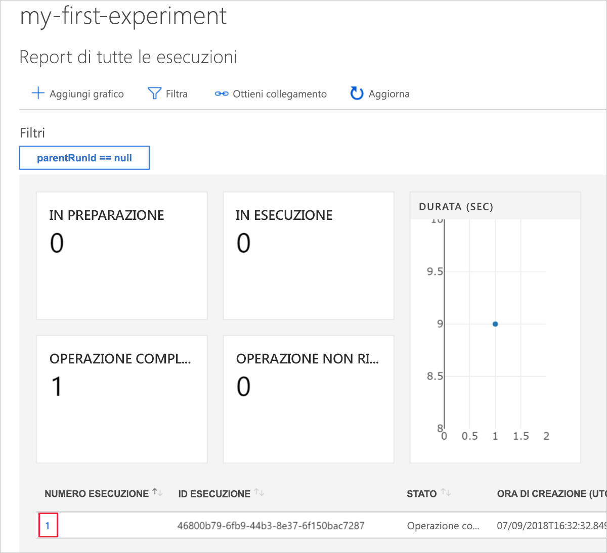
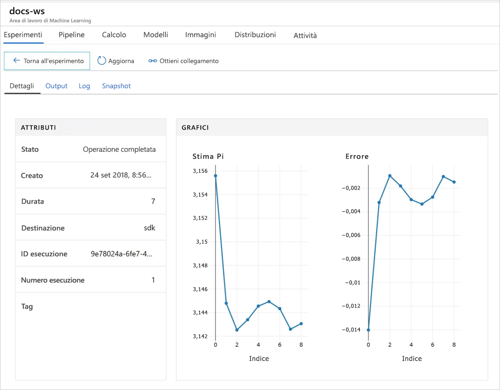

# <a name="quickstart-get-started-with-azure-machine-learning-service"></a>Avvio rapido: Iniziare a usare il servizio Azure Machine Learning

In questa guida introduttiva si userà il portale di Azure per creare un'area di lavoro di Azure Machine Learning. Questa area di lavoro rappresenta le fondamenta nel cloud per sperimentare, eseguire il training e distribuire modelli di Machine Learning con il servizio Azure Machine Learning. 

In questa esercitazione si apprenderà come:

* Creare un'area di lavoro nella sottoscrizione di Azure
* Provarla con Python in un Notebook di Azure e registrare valori per più iterazioni
* Visualizzare i valori registrati nell'area di lavoro

Per comodità, le risorse di Azure seguenti vengono aggiunte automaticamente all'area di lavoro quando sono disponibili a livello di area: [registro contenitori](https://azure.microsoft.com/services/container-registry/), [risorsa di archiviazione](https://azure.microsoft.com/services/storage/), [Application Insights](https://azure.microsoft.com/services/application-insights/) e [insieme di credenziali delle chiavi](https://azure.microsoft.com/services/key-vault/).

Le risorse create possono essere usate come prerequisiti per altre esercitazioni e procedure dettagliate per Azure Machine Learning. Come con altri servizi di Azure, sono previsti limiti per determinate risorse, ad esempio la dimensione del cluster BatchAI, associate al servizio Azure Machine Learning. Leggere [questo](how-to-manage-quotas.md) articolo sui limiti predefiniti e su come richiedere altra quota.

Se non si ha una sottoscrizione di Azure, creare un [account gratuito](https://azure.microsoft.com/free/?WT.mc_id=A261C142F) prima di iniziare.


## <a name="create-a-workspace"></a>Creare un'area di lavoro 

[!INCLUDE [aml-create-portal](../../../includes/aml-create-in-portal.md)]

Nella pagina dell'area di lavoro fare clic su `Explore your Azure Machine Learning Workspace`

 


## <a name="use-the-workspace"></a>Usare l'area di lavoro

Ora si vedrà in che modo un'area di lavoro consente di gestire gli script di apprendimento automatico. Questa sezione spiega come:

* Aprire un notebook in Azure Notebooks
* Eseguire il codice che crea alcuni valori registrati
* Visualizzare i valori registrati nell'area di lavoro

Questo è un esempio di come l'area di lavoro consente di tenere traccia delle informazioni generate in uno script. 

### <a name="open-a-notebook"></a>Aprire un notebook 

Azure Notebooks fornisce una piattaforma cloud gratuita per i notebook di Jupyter, preconfigurata con tutto il necessario per eseguire il servizio Azure Machine Learning.  

Fare clic sul pulsante `Open Azure Notebooks` per provare il primo esperimento.

 

Dopo l'accesso, si apre una nuova scheda e viene visualizzata la richiesta `Clone Library`.  Fare clic su `Clone`.


### <a name="run-the-notebook"></a>Eseguire il notebook

Insieme a due notebook, verrà visualizzato un file `config.json`.  Questo file di configurazione contiene informazioni sull'area di lavoro appena creata.  

Fare clic su `01.run-experiment.ipynb` per aprire il notebook.

È possibile eseguire le celle una alla volta usando `Shift`+`Enter`.  Oppure usare il menu `Cells` > `Run All` per eseguire l'intero notebook.

Verrà richiesto di eseguire l'accesso.  Copiare il codice nel messaggio, quindi fare clic sul collegamento e incollare il codice nella nuova finestra.  Assicurarsi di non copiare spazi prima o dopo il codice.

 

La seconda cella del notebook legge le informazioni da `config.json` per la connessione all'area di lavoro.
```
ws = Workspace.from_config()
```

La terza cella di codice avvia un esperimento con il nome "my-first-experiment".  Si userà questo nome per cercare le informazioni sull'esecuzione nell'area di lavoro.

```
experiment = Experiment(workspace_object=ws, name = "my-first-experiment")
```

Nell'ultima cella del notebook sono visibili i valori che vengono scritti nel file di log.

```
# Log final results
run.log("Final estimate: ",pi_estimate)
run.log("Final error: ",math.pi-pi_estimate)
```

È possibile visualizzare questi valori nell'area di lavoro dopo l'esecuzione del codice.

## <a name="view-logged-values"></a>Visualizzare i valori registrati

Dopo aver completato tutte le celle del notebook, tornare alla pagina del portale.  

Fare clic su `View Experiments`.



Chiudere la finestra popup `Reports`.

Fare clic su `my-first-experiment`.

Visualizzare le informazioni sull'esecuzione appena eseguita.  Scorrere la pagina verso il basso per trovare la tabella delle esecuzioni e fare clic sul collegamento del numero di esecuzione.

 

Vengono visualizzati tracciati dei valori registrati che sono stati creati automaticamente:

   

## <a name="clean-up-resources"></a>Pulire le risorse 

[!INCLUDE [aml-delete-resource-group](../../../includes/aml-delete-resource-group.md)]

È anche possibile mantenere il gruppo di risorse ma eliminare una singola area di lavoro visualizzando le proprietà dell'area di lavoro e selezionando il pulsante di eliminazione.

## <a name="next-steps"></a>Passaggi successivi

Sono state create le risorse necessarie per iniziare a sperimentare e distribuire modelli. Inoltre è stato eseguito codice in un notebook ed è stata esaminata la cronologia di esecuzione da quel codice nell'area di lavoro nel cloud.

Per un'esperienza approfondita del flusso di lavoro, eseguire le esercitazioni di Azure Machine Learning riguardanti il training e la distribuzione dei modelli.  

> [!div class="nextstepaction"]
> [Esercitazione: Eseguire il training di un modello per la classificazione di immagini](tutorial-train-models-with-aml.md)
