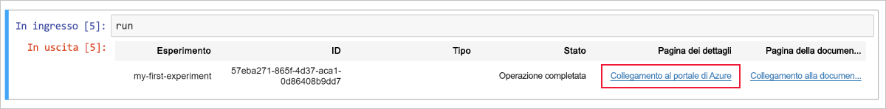
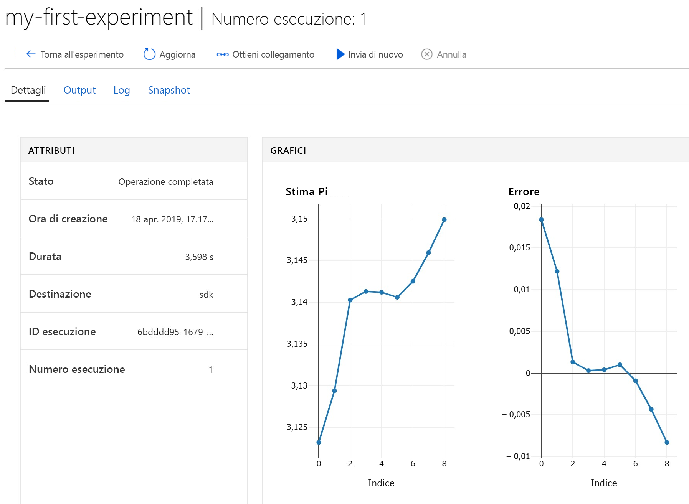

# <a name="quickstart-use-a-cloud-based-notebook-server-to-get-started-with-azure-machine-learning"></a>Guida introduttiva: Usare un server notebook basato sul cloud per iniziare a usare Azure Machine Learning

Questa guida di avvio rapido spiega come iniziare a usare il servizio Azure Machine Learning usando un server notebook gestito nel cloud. Non è richiesta alcuna installazione. Se in alternativa si vuole installare l'SDK nel proprio ambiente Python, vedere [Avvio rapido: Usare il proprio server notebook per iniziare a usare Azure Machine Learning](quickstart-run-local-notebook.md).

Questa guida di avvio rapido illustra come usare l'[area di lavoro del servizio Azure Machine Learning](concept-azure-machine-learning-architecture.md) per tenere traccia degli esperimenti di Machine Learning (ML). Per iniziare si creerà una [macchina virtuale per notebook (anteprima)](how-to-configure-environment.md#notebookvm), ovvero una workstation di Azure sicura, basata su cloud, che fornisce un server Jupyter Notebook, JupyterLab e un ambiente di Machine Learning già preparato. Si eseguirà quindi un notebook di Python in questa macchina virtuale per registrare i valori nell'area di lavoro.

Per effettuare questa operazione, eseguire le azioni seguenti:

* Creare un'area di lavoro.
* Creare una macchina virtuale per notebook nell'area di lavoro.
* Aprire l'interfaccia Web di Jupyter.
* Aprire un notebook che contiene codice per stimare gli errori di pi greco e registra gli errori a ogni iterazione.
* Eseguire il notebook.
* Visualizzare i valori di errore registrati nell'area di lavoro. L'esempio seguente mostra come l'area di lavoro consente di tenere traccia delle informazioni generate in uno script.

Se non è disponibile una sottoscrizione di Azure, creare un account gratuito prima di iniziare. Provare la [versione gratuita o a pagamento del servizio Azure Machine Learning](https://aka.ms/AMLFree).

## <a name="create-a-workspace"></a>Creare un'area di lavoro

Se è già disponibile un'area di lavoro del servizio Azure Machine Learning, passare alla [sezione successiva](#create-notebook). Altrimenti crearne una adesso.

[!INCLUDE [aml-create-portal](../../../includes/aml-create-in-portal.md)]

## <a name="create-notebook"></a>Creare una macchina virtuale per notebook

 Nell'area di lavoro creare una risorsa cloud per iniziare a usare i notebook di Jupyter. Questa risorsa è una piattaforma basata sul cloud preconfigurata con tutto quanto necessario per eseguire il servizio Azure Machine Learning.

1. Aprire l'area di lavoro nel [portale di Azure](https://portal.azure.com/). Se non si sa come individuare l'area di lavoro nel portale, vedere l'articolo su [come visualizzare l'area di lavoro](how-to-manage-workspace.md#view).

1. Nella pagina dell'area di lavoro selezionare **Macchine virtuali per notebook** a sinistra.

1. Selezionare **+Nuova** per creare una nuova macchina virtuale per notebook.  

     

1. Specificare un nome per la macchina virtuale. Selezionare quindi **Crea**.

    > [!NOTE]
    > La lunghezza del nome della macchina virtuale per notebook deve essere compresa tra 2 e 16 caratteri. I caratteri validi includono lettere, cifre e trattini. Il nome deve inoltre essere univoco nella sottoscrizione di Azure.

    

1. Attendere all'incirca 4-5 minuti, fino a quando lo stato cambia in **In esecuzione**.


## <a name="open-the-jupyter-web-interface"></a>Aprire l'interfaccia Web di Jupyter

Dopo che la macchina virtuale è in esecuzione, usare la sezione **Macchine virtuali per notebook** per aprire l'interfaccia Web di Jupyter.

1. Selezionare **Jupyter** nella colonna **URI** relativa alla macchina virtuale.  

    

    Il collegamento consente di avviare il server del notebook e di aprire la pagina Web del notebook Jupyter in una nuova scheda del browser.  Questo collegamento funziona solo per l'utente che crea la macchina virtuale.  Ogni utente dell'area di lavoro deve creare la propria macchina virtuale.

1. Nella pagina Web del notebook di Jupyter il nome della cartella principale corrisponde al nome utente. Selezionare questa cartella.

    > [!TIP]
    > Questa cartella si trova nel [contenitore di archiviazione](concept-workspace.md#resources) nell'area di lavoro anziché sulla macchina virtuale per notebook stessa.  È possibile eliminare la macchina virtuale per notebook e mantenere comunque tutto il lavoro.  Durante la creazione di una nuova macchina virtuale per notebook in un secondo momento,  questa caricherà la stessa cartella.  Se si condivide l'area di lavoro con altri utenti, questi potranno visualizzare la cartella e si potrà visualizzare i rispettivi elementi. 

1. Il nome della cartella degli esempi include un numero di versione, ad esempio **samples-1.0.33.1**. Selezionare la cartella degli esempi.

1. Selezionare la cartella **Avvio rapido**.

## <a name="run-the-notebook"></a>Eseguire il notebook

Eseguire un notebook che stima il pi greco e registra l'errore nell'area di lavoro.

1. Selezionare **01.run experiment.ipynb** per aprire il notebook.

1. Se viene visualizzato l'avviso di kernel non trovato, selezionare il kernel **Python 3.6 - AzureML** (circa a metà dell'elenco) e impostarlo.

1. Selezionare la prima cella del codice e quindi selezionare **Run** (Esegui).

    > [!NOTE]
    > Le celle del codice sono precedute da parentesi quadre. Se le parentesi quadre sono vuote ( __[  ]__ ), il codice non è stato eseguito. Durante l'esecuzione del codice, viene visualizzato un asterisco ( __[*]__ ). Al termine dell'esecuzione del codice, viene visualizzato il numero **[1]** ,  che indica l'ordine di esecuzione delle celle.
    >
    > Usare il tasto di scelta rapida **MAIUSC+INVIO** per eseguire una cella.

    

1. Eseguire la seconda cella di codice. Se vengono visualizzate istruzioni per l'autenticazione, copiare il codice e fare clic sul collegamento per eseguire l'accesso. Dopo l'accesso, il browser memorizzerà questa impostazione.  

    

1. Al termine dell'esecuzione della cella di codice, viene visualizzato il numero di cella __[2]__ . Se è stato necessario eseguire l'accesso, verrà visualizzato un messaggio di stato di autenticazione riuscita.   Se non è stato necessario eseguire l'accesso, non verrà visualizzato alcun output per questa cella, eccetto il numero che indica che la cella è stata eseguita correttamente.

    

1. Eseguire le celle di codice rimanenti. Al termine dell'esecuzione di ogni singola cella, verrà visualizzato il relativo numero di cella. Solo con l'ultima cella viene visualizzato l'eventuale altro output.  

    In più punti della cella di codice più estesa viene visualizzato `run.log`. Ogni occorrenza di `run.log` aggiunge il relativo valore all'area di lavoro.

## <a name="view-logged-values"></a>Visualizzare i valori registrati

1. L'output della cella `run` contiene un collegamento al portale di Azure per visualizzare i risultati dell'esperimento nell'area di lavoro.

    

1. Selezionare il **collegamento al portale di Azure** per visualizzare le informazioni sull'esecuzione nell'area di lavoro. Questo collegamento apre l'area di lavoro nel portale di Azure.

1. I tracciati dei valori registrati visualizzati sono stati creati automaticamente nell'area di lavoro. Ogni volta che si registrano più valori con lo stesso parametro name, viene generato automaticamente un tracciato. Di seguito è fornito un esempio:

   

Poiché il codice per approssimare Pi usa valori casuali, i tracciati potrebbero essere diversi.  

## <a name="clean-up-resources"></a>Pulire le risorse

### <a name="stop-the-notebook-vm"></a>Arrestare la macchina virtuale per notebook

Arrestare la macchina virtuale per notebook quando non viene usata per ridurre i costi.  

1. Nell'area di lavoro selezionare **Macchine virtuali per notebook**.

   

1. Selezionare la macchina virtuale dall'elenco.

1. Selezionare **Arresta**.

1. Quando si è pronti a usare di nuovo il server, selezionare **Avvia**.

### <a name="delete-everything"></a>Eliminare tutto

[!INCLUDE [aml-delete-resource-group](../../../includes/aml-delete-resource-group.md)]

È anche possibile mantenere il gruppo di risorse ma eliminare una singola area di lavoro. Visualizzare le proprietà dell'area di lavoro e selezionare **Elimina**.

## <a name="next-steps"></a>Passaggi successivi

Dopo aver completato queste attività, passare alla pagina Web di Jupyter Notebook. Nella cartella **Avvio rapido** aprire ed eseguire il notebook **02.deploy-web-service.ipynb** per informazioni su come distribuire un servizio Web.

Quando si vogliono installare altri pacchetti Python nell'ambiente Jupyter, usare questo codice all'interno di un notebook:

```
!source activate py36 && pip install <packagename>
```

Nella pagina Web di Jupyter Notebook è anche possibile esplorare altri notebook nella cartella degli esempi per altre informazioni sul servizio Azure Machine Learning.

Per un'esperienza approfondita del flusso di lavoro, seguire le esercitazioni di Machine Learning riguardanti il training e la distribuzione di un modello:  

> [!div class="nextstepaction"]
> [Esercitazione: Eseguire il training di un modello per la classificazione di immagini](tutorial-train-models-with-aml.md)
