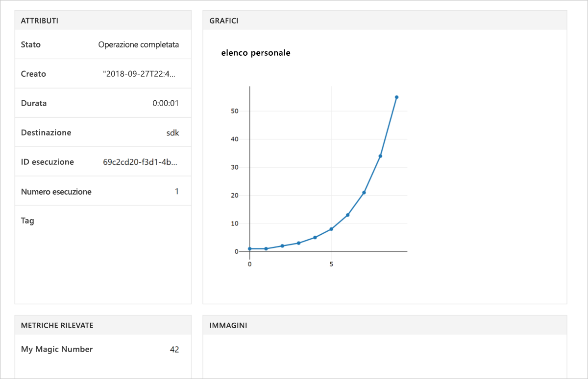

# <a name="quickstart-use-your-own-notebook-server-to-get-started-with-azure-machine-learning"></a>Guida introduttiva: Usare il proprio server notebook per iniziare a usare Azure Machine Learning

Usare il proprio ambiente Python e il server Jupyter Notebook per iniziare a usare il servizio Azure Machine Learning.  Per un avvio rapido senza installazione di SDK, vedere [Avvio rapido: Usare un server notebook basato sul cloud per iniziare a usare Azure Machine Learning](quickstart-run-cloud-notebook.md).

Questo argomento di avvio rapido illustra come usare l'[area di lavoro del servizio Azure Machine Learning](concept-azure-machine-learning-architecture.md) per tenere traccia di esperimenti di Machine Learning. Si eseguirà il codice Python che registra i valori nell'area di lavoro.

Ecco una versione video di questa guida introduttiva:

> [!VIDEO https://www.microsoft.com/en-us/videoplayer/embed/RE2G9N6]

Se non è disponibile una sottoscrizione di Azure, creare un account gratuito prima di iniziare. Provare subito la [versione gratuita o a pagamento del servizio Azure Machine Learning](https://aka.ms/AMLFree).

## <a name="prerequisites"></a>Prerequisiti

* Un server notebook Python 3.6 con Azure Machine Learning SDK installato
* Un'area di lavoro del servizio Azure Machine Learning
* Un file di configurazione dell'area di lavoro ( **.azureml/config.json**).

Tutti questi prerequisiti sono ottenibili in [Creare un'area di lavoro del servizio Azure Machine Learning](setup-create-workspace.md#sdk).


## <a name="use-the-workspace"></a>Usare l'area di lavoro

Creare uno script o avviare un notebook nella stessa directory del file di configurazione dell'area di lavoro ( **.azureml/config.json**).

### <a name="attach-to-workspace"></a>Creare un collegamento all'area di lavoro

Questo codice legge le informazioni dal file di configurazione da collegare all'area di lavoro.

```
from azureml.core import Workspace

ws = Workspace.from_config()
```

### <a name="log-values"></a>Registrare i valori

Eseguire questo codice che usa le API di base dell'SDK per tenere traccia delle esecuzioni dell'esperimento.

1. Creare un esperimento nell'area di lavoro.
1. Registrare un singolo valore nell'esperimento.
1. Registrare un elenco di valori nell'esperimento.

[!code-python[](~/aml-sdk-samples/ignore/doc-qa/quickstart-create-workspace-with-python/quickstart.py?name=useWs)]

## <a name="view-logged-results"></a>Visualizzare i risultati registrati

Al termine è possibile visualizzare l'esecuzione dell'esperimento nel portale di Azure. Per stampare un URL che consente di passare ai risultati dell'ultima esecuzione, usare il codice seguente:

```python
print(run.get_portal_url())
```

Questo codice restituisce un collegamento che si può usare per visualizzare i valori registrati nel portale di Azure all'interno nel browser.



## <a name="clean-up-resources"></a>Pulire le risorse 

>[!IMPORTANT]
>È possibile usare le risorse create qui come prerequisiti per altre esercitazioni e procedure dettagliate per il servizio Machine Learning.

Se non si prevede di usare le risorse create in questo articolo, eliminarle per evitare eventuali addebiti.

[!code-python[](~/aml-sdk-samples/ignore/doc-qa/quickstart-create-workspace-with-python/quickstart.py?name=delete)]

## <a name="next-steps"></a>Passaggi successivi

In questo articolo sono state create le risorse necessarie per eseguire esperimenti e distribuire modelli. È stato eseguito codice in un notebook ed è stata esaminata la cronologia di esecuzione del codice nell'area di lavoro nel cloud.

> [!div class="nextstepaction"]
> [Esercitazione: Eseguire il training di un modello per la classificazione di immagini](tutorial-train-models-with-aml.md)

È anche possibile esaminare alcuni [esempi più avanzati in GitHub](https://aka.ms/aml-notebooks) oppure visualizzare il [manuale dell'utente dell'SKD](https://docs.microsoft.com/python/api/overview/azure/ml/intro?view=azure-ml-py).
