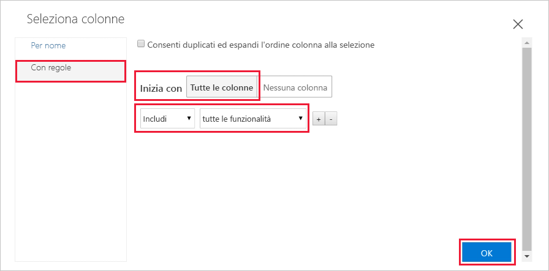
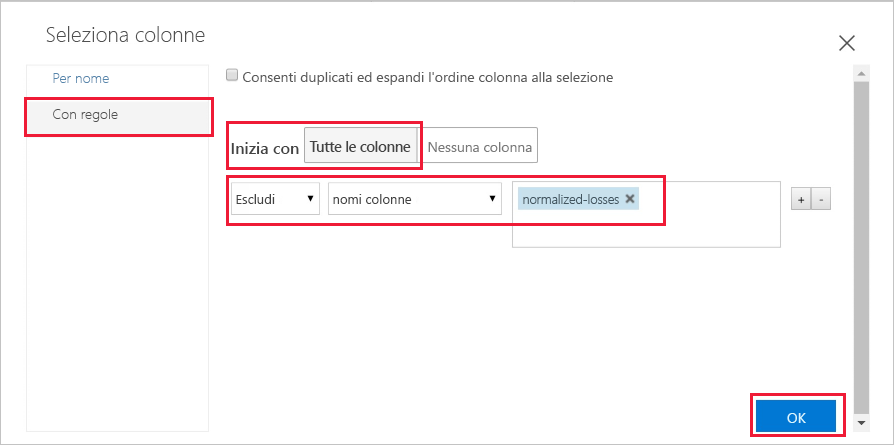
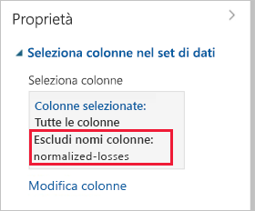
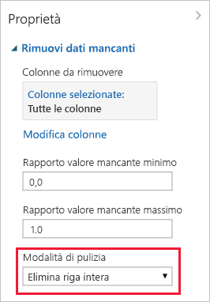

# Guida introduttiva: Preparare e visualizzare dati senza scrivere codice in Azure Machine Learning

Preparare e visualizzare i dati nell'interfaccia visiva grafica con trascinamento della selezione (anteprima) per Azure Machine Learning. Il set di dati usato include le voci relative a diverse automobili, nonché informazioni su marca, modello, specifiche tecniche e prezzo.  

In questa guida di avvio rapido si esploreranno e si prepareranno i dati:

- Creare il primo esperimento per aggiungere e visualizzare l'anteprima dei dati
- Preparare i dati rimuovendo i valori mancanti
- Eseguire l'esperimento
- Visualizzare i dati risultanti

Se non si ha esperienza con l'apprendimento automatico, la serie di video [Data Science for Beginners](https://docs.microsoft.com/azure/machine-learning/studio/data-science-for-beginners-the-5-questions-data-science-answers) (Data science per principianti) offre un'ottima introduzione all'apprendimento automatico.

## Prerequisiti

Se non è disponibile una sottoscrizione di Azure, creare un account gratuito prima di iniziare. Accedere alla [versione gratuita o a pagamento del servizio Azure Machine Learning](https://aka.ms/AMLFree).

### Creare un'area di lavoro

Se è già disponibile un'area di lavoro del servizio Azure Machine Learning, passare alla [sezione successiva](#start). Altrimenti crearne una adesso.

[!INCLUDE [aml-create-portal](../../../includes/aml-create-in-portal.md)]

##  Aprire la pagina Web dell'interfaccia visiva grafica

1. Aprire l'area di lavoro nel [portale di Azure](https://portal.azure.com/).  

1. Nell'area di lavoro selezionare **Interfaccia visiva grafica**.  Selezionare quindi **Avvia interfaccia visiva grafica**.  
 
    

    La pagina Web dell'interfaccia viene aperta apre in una nuova finestra del browser.  

## Creare la prima sperimentazione

Lo strumento dell'interfaccia visiva grafica offre un'area visiva e interattiva per eseguire facilmente le operazioni di compilazione, test e iterazione di un modello di analisi predittiva. È possibile trascinare set di dati e moduli di analisi selezionati in un'area di disegno interattiva, collegandoli tra loro per ottenere un _esperimento_.  Creare ora il primo esperimento.

1. Nell'angolo in basso a sinistra selezionare **Aggiungi nuovo**.

1. Selezionare **Blank Experiment** (Esperimento vuoto).

1. All'esperimento viene assegnato un nome predefinito. Selezionare il testo e rinominarlo in "Esplorazione dati avvio rapido". Questo nome non deve essere univoco.

1. La **minimappa** nella parte inferiore della schermata è utile per visualizzare esperimenti di grandi dimensioni.  In questo avvio rapido non è necessaria, quindi fare clic sulla freccia nella parte superiore per ridurla a icona.  

    

## Aggiungere dati

Il primo elemento necessario per l'apprendimento automatico è rappresentato dai dati. In questa interfaccia sono disponibili numerosi set di dati di esempio da usare oppure è possibile importare dati da numerose altre origini. Per questo esempio verrà usato il set di dati di esempio **Automobile price data (Raw)** . 

1. A sinistra dell'area di disegno dell'esperimento è presente una tavolozza di set di dati e moduli. Selezionare **Saved Datasets** (Set di dati salvati) e quindi **Samples** (Esempi) per visualizzare i set di dati di esempio disponibili.

1. Selezionare il set di dati **Automobile price data (raw)** e trascinarlo nell'area di disegno.

   

## Selezione colonne

Selezionare le colonne di dati da usare.  Per iniziare, configurare il modulo in modo da visualizzare tutte le colonne disponibili.

> [!TIP]
> Se si conosce il nome dei dati o del modulo desiderato, usare la barra di ricerca nella parte superiore della tavolozza per individuarlo rapidamente.  Nel resto della guida di avvio rapido verrà usato questo collegamento.

1. Digitare **Select** (Seleziona) nella casella di ricerca per trovare il modulo **Select Columns in Dataset** (Seleziona colonne nel set di dati).

1. Fare clic e trascinare il modulo **Select Columns in Dataset** (Seleziona colonne nel set di dati) nell'area di disegno. Trascinare il modulo sotto il set di dati aggiunto in precedenza.

1. Connettere il set di dati al modulo **Select Columns in Dataset** (Seleziona colonne nel set di dati): fare clic sulla porta di output del set di dati, trascinare sulla porta di input di **Select Columns in Dataset** e quindi rilasciare il pulsante del mouse. Il set di dati e il modulo resteranno connessi anche se vengono spostati in un'altra posizione nell'area di disegno.

    > [!TIP]
    > I set di dati e i moduli hanno porte di input e output rappresentate da piccoli cerchi: le porte di input nella parte superiore e le porte di output nella parte inferiore. Viene creato un flusso di dati tramite l'esperimento quando si connette la porta di output di un modulo a una porta di input di un altro.
    >
    > Se si riscontrano problemi durante la connessione dei moduli, provare a trascinare tutto nel nodo a cui ci si vuole connettere.

     

    Il punto esclamativo rosso indica che le proprietà del modulo non sono ancora state impostate. Questa operazione verrà eseguita più avanti.
   
1. Selezionare il modulo **Select Columns in Dataset** (Seleziona colonne nel set di dati).

1. Nel riquadro **Properties** (Proprietà) a destra dell'area di disegno selezionare **Edit columns** (Modifica colonne).

    Nella finestra di dialogo **Select columns** (Seleziona colonne) selezionare **ALL COLUMNS** (TUTTE LE COLONNE) e includere **tutte le funzionalità**. La finestra di dialogo dovrebbe essere simile alla seguente:

     

1. Nell'angolo in basso a destra fare clic su **OK** per chiudere il selettore di colonne.

## Eseguire l'esperimento

In qualsiasi momento fare clic sulla porta di output di un set di dati o di un modulo per visualizzare l'aspetto dei dati in tale punto specifico del flusso di dati.  Se l'opzione **Visualize** (Visualizza) è disabilitata, è prima necessario eseguire l'esperimento.  Questa operazione verrà eseguita più avanti.

[!INCLUDE [aml-ui-create-training-compute](../../../includes/aml-ui-create-training-compute.md)]

Quando la destinazione di calcolo è disponibile, viene eseguito l'esperimento. Al termine dell'esecuzione, viene visualizzato un segno di spunta verde su ogni modulo.

## Visualizzare l'anteprima dei dati

Ora che è stato eseguito l'esperimento iniziale, è possibile visualizzare i dati per comprendere meglio le informazioni necessarie per lavorare.

1. Selezionare la porta di output nella parte inferiore del modulo **Select Columns in Dataset** (Seleziona colonne nel set di dati) e quindi selezionare **Visualize** (Visualizza).

1. Fare clic su colonne diverse nella finestra dei dati per visualizzare le informazioni relative alle singole colonne.  

    In questo set di dati ogni riga rappresenta un'automobile e le variabili associate a ogni automobile sono rappresentate da colonne.    In questo set di dati sono presenti 205 righe e 26 colonne.

     Ogni volta che si fa clic su una colonna di dati, sulla sinistra vengono visualizzate le informazioni sulle **statistiche** e l'immagine della **visualizzazione** di tale colonna.  Ad esempio, quando si fa clic su **num-of-doors**, è possibile notare che contiene 2 valori univoci e 2 valori mancanti.  Scorrere verso il basso per visualizzare i valori, ovvero due e quattro porte.

     

1. Fare clic su ogni colonna per visualizzare maggiori informazioni sul set di dati.

## Preparazione dei dati

Prima di poter analizzare un set di dati è in genere necessario pre-elaborarlo. È possibile che si sia notata l'assenza di valori nelle colonne di diverse righe. Per consentire al modello di analizzare correttamente i dati, è necessario eseguire la pulizia di questi valori mancanti. Verranno rimosse le righe con i valori mancanti. Inoltre, la colonna **normalized-losses** ha molti valori mancanti, pertanto verrà esclusa completamente dal modello.

> [!TIP]
> La pulizia dei valori mancanti dai dati di input è un prerequisito all'uso della maggior parte dei moduli.  

### Rimuovere la colonna

Rimuovere prima completamente la colonna **normalized-losses**.

1. Selezionare il modulo **Select Columns in Dataset** (Seleziona colonne nel set di dati).

1. Nel riquadro **Properties** (Proprietà) a destra dell'area di disegno selezionare **Edit columns** (Modifica colonne).

    * Lasciare selezionate **With rules** (Con regole) e **ALL COLUMNS** (TUTTE LE COLONNE).

    * Negli elenchi a discesa selezionare **Escludi** e **nomi colonna**, quindi fare clic all'interno della casella di testo. Digitare **normalized-losses**.

    * Nell'angolo in basso a destra fare clic su **OK** per chiudere il selettore di colonne.

    
        
    Il riquadro delle proprietà del modulo Select Columns in Dataset (Seleziona colonne in set di dati) indica che verranno analizzate tutte le colonne del set di dati ad eccezione di **normalized-losses**.
        
    Il riquadro delle proprietà mostra che la colonna **normalized-losses** è stata esclusa.
        
    
        
    È possibile aggiungere un commento a un modulo facendo doppio clic sul modulo e immettendo del testo. In tal modo sarà possibile individuare subito l'operazione eseguita dal modulo nell'esperimento. 

1. Fare doppio clic sul modulo **Select Columns in Dataset** (Seleziona colonne in set di dati) e immettere il commento "Escludi perdite normalizzate". 
    
    Dopo aver digitato il commento, fare clic all'esterno del modulo.  Viene visualizzata una freccia verso il basso per indicare che il modulo contiene un commento.

1. Fare clic sulla freccia verso il basso per visualizzare il commento.

    Nel modulo è ora visualizzata una freccia verso l'alto per nascondere il commento.
        
    

### Pulire i dati mancanti

Aggiungere ora un altro modulo che rimuove tutte le righe rimanenti con dati mancanti.

1. Digitare **Clean** (Pulizia) nella casella di ricerca per trovare il modulo **Clean Missing Data** (Pulisci dati mancanti).

1. Trascinare il modulo **Clean Missing Data** (Pulisci dati mancanti) nell'area di disegno dell'esperimento e connetterlo al modulo **Select Columns in Dataset** (Seleziona colonne in set di dati). 

1. Nel riquadro delle proprietà selezionare **Remove entire row** (Rimuovi riga intera) in **Cleaning mode** (Modalità pulizia).

    Queste opzioni indicano al modulo **Clean Missing Data** (Pulisci dati mancanti) di pulire i dati rimuovendo le righe con valori mancanti.

1. Fare doppio clic sul modulo e digitare il commento "Rimuovi righe valori mancanti".
 
    

    L'esperimento avrà ora un aspetto analogo al seguente:
    
    

## Visualizzare i risultati

Poiché sono state apportate modifiche ai moduli nell'esperimento, lo stato è cambiato in "In draft" (Bozza).  Per visualizzare i nuovi dati puliti, è prima necessario eseguire di nuovo l'esperimento.

1. Selezionare **Run** (Esegui) nella parte inferiore per eseguire l'esperimento.

    Questa volta è possibile riutilizzare la destinazione di calcolo creata in precedenza.  

1. Selezionare **Run** (Esegui) nella finestra di dialogo.

   

1. Al termine dell'esecuzione, fare clic sul modulo **Clean Missing Data** (Pulisci dati mancanti) per visualizzare i nuovi dati puliti.  

    

1. Fare clic su colonne diverse nella finestra dei dati puliti per visualizzare le modifiche apportate ai dati.  

    

    Sono ora presenti 193 righe e 25 colonne.

    Quando si fa clic su **num-of-doors**, è possibile notare che sono ancora presenti 2 valori univoci, ma 0 valori mancanti.  

## Pulire le risorse

[!INCLUDE [aml-ui-cleanup](../../../includes/aml-ui-cleanup.md)]

## Passaggi successivi

In questa guida introduttiva si è appreso come:

- Creare il primo esperimento per aggiungere e visualizzare l'anteprima dei dati
- Preparare i dati rimuovendo i valori mancanti
- Visualizzare i dati risultanti

Passare all'esercitazione per usare questi dati per stimare il prezzo di un'automobile.

> [!div class="nextstepaction"]
> [Esercitazione: Stimare il prezzo di un'automobile con l'interfaccia visiva grafica](ui-tutorial-automobile-price-train-score.md)
