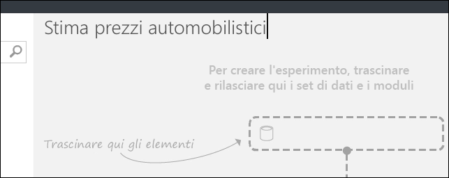
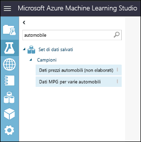
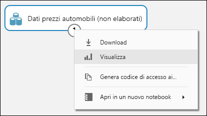
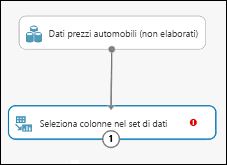
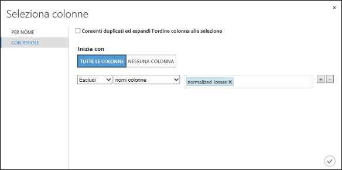
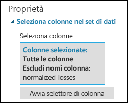
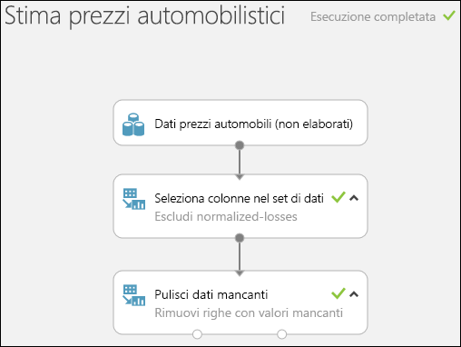
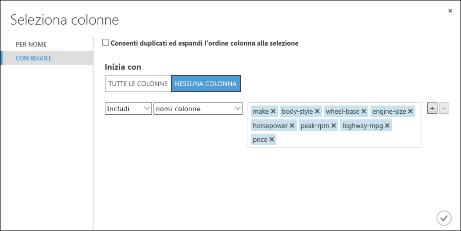
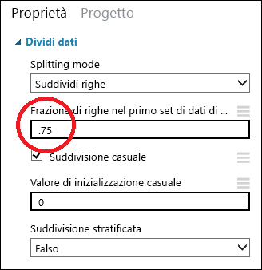
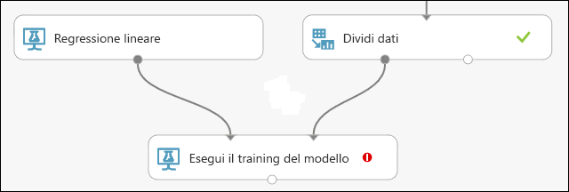

# Guida introduttiva: Creare il primo esperimento data science in Azure Machine Learning Studio

In questa guida introduttiva si crea un esperimento di apprendimento automatico in [Azure Machine Learning Studio](what-is-ml-studio.md) per stimare il prezzo di un'automobile in base a diverse variabili, ad esempio il marchio e le specifiche tecniche.

Se non si ha esperienza con l'apprendimento automatico, la serie di video [Data Science for Beginners](data-science-for-beginners-the-5-questions-data-science-answers.md) (Data science per principianti) offre un'ottima introduzione all'apprendimento automatico con linguaggio e concetti comuni.

Questa guida introduttiva segue il flusso di lavoro predefinito di un esperimento:

1. **Creare un modello**
    - [Ottenere i dati]
    - [Preparare i dati]
    - [Definire le caratteristiche]
1. **Eseguire il training del modello**
    - [Scegliere e applicare un algoritmo]
1. **Assegnare un punteggio e testare il modello**
    - [Stimare i prezzi delle nuove automobili]

[Ottenere i dati]: #get-the-data
[Preparare i dati]: #prepare-the-data
[Definire le caratteristiche]: #define-features
[Scegliere e applicare un algoritmo]: #choose-and-apply-an-algorithm
[Stimare i prezzi delle nuove automobili]: #predict-new-automobile-prices

Se non si ha un account Studio, passare alla [home page di Studio](https://studio.azureml.net) e selezionare **Sign up here** (Iscriversi qui) per creare un account gratuito. L'area di lavoro gratuita mette a disposizione tutte le funzionalità necessarie per questa guida introduttiva.

## Ottenere i dati

Il primo elemento necessario nell'apprendimento automatico è rappresentato dai dati.
In Studio sono disponibili numerosi set di dati di esempio da usare oppure è possibile importare dati da molte altre origini. Per questo esempio, verrà usato il set di dati di esempio **Automobile price data (Raw)** (Dati non elaborati sui prezzi delle automobili) incluso nell'area di lavoro.
Questo set di dati include voci per diverse automobili e include informazioni su marca, modello, specifiche tecniche e prezzo.

> [!TIP]
> Una copia di lavoro dell'esperimento seguente è disponibile in [Azure AI Gallery](https://gallery.azure.ai). Passare a **[Your first data science experiment - Automobile price prediction](https://gallery.azure.ai/Experiment/Your-first-data-science-experiment-Automobile-price-prediction-1)** (Primo esperimento scientifico sui dati - stima dei prezzi delle automobili) e fare clic su **Open in Studio** (Apri in Studio) per scaricare una copia dell'esperimento nell'area di lavoro di Machine Learning Studio.

Di seguito viene illustrato come ottenere il set di dati nell'esperimento.

1. Creare un nuovo esperimento facendo clic su **+NEW** (NUOVO) nella parte inferiore della finestra di Machine Learning Studio. Selezionare **EXPERIMENT (ESPERIMENTO)**  >  **Blank Experiment** (Esperimento vuoto).

1. All'esperimento viene assegnato un nome predefinito visualizzato nella parte superiore dell'area di disegno. Selezionare il testo e rinominarlo in modo significativo, ad esempio **Stima prezzi automobili**. Il nome non deve essere univoco.

    

1. A sinistra dell'area di disegno dell'esperimento è presente una tavolozza di set di dati e moduli. Digitare **automobile** nella casella di ricerca nella parte superiore della tavolozza per trovare il set di dati denominato **Automobile price data (Raw)** . Trascinare il set di dati nell'area di disegno dell'esperimento.

    

Per visualizzare l'aspetto dei dati, fare clic sulla porta di output nella parte inferiore del set di dati relativo alle automobili e selezionare **Visualize** (Visualizza).

> [!TIP]
> I set di dati e i moduli hanno porte di input e output rappresentate da piccoli cerchi: le porte di input nella parte superiore e le porte di output nella parte inferiore.
Per creare un flusso di dati nell'esperimento, connettere una porta di output di un modulo a una porta di input di un altro.
In qualsiasi momento, è possibile fare clic sulla porta di output di un set di dati o di un modulo per visualizzare l'aspetto dei dati in tale punto specifico del flusso di dati.

In questo set di dati ogni riga rappresenta un'automobile e le variabili associate a ogni automobile sono rappresentate da colonne. Il prezzo verrà stimato nella colonna all'estrema destra, ovvero la colonna 26 denominata "price" (prezzo) usando le variabili per un'automobile specifica.

Chiudere la finestra di visualizzazione facendo clic sulla "**x**" nell'angolo superiore destro.

## Preparare i dati

Prima di poter analizzare un set di dati è in genere necessario pre-elaborarlo. È possibile che si sia notata l'assenza di valori nelle colonne di diverse righe. Per consentire al modello di analizzare correttamente i dati, è necessario eseguire la pulizia di questi valori mancanti. Verranno rimosse le righe con i valori mancanti. Inoltre, la colonna **normalized-losses** ha molti valori mancanti, pertanto verrà esclusa completamente dal modello.

> [!TIP]
> La pulizia dei valori mancanti dai dati di input è un prerequisito all'uso della maggior parte dei moduli.

In primo luogo si aggiunge un modulo che rimuove completamente la colonna **normalized-losses**. Si aggiunge quindi un altro modulo che rimuove tutte le righe con dati mancanti.

1. Digitare **select columns** nella casella di ricerca nella parte superiore del pannello dei moduli per trovare il modulo [Select Columns in Dataset][select-columns]. Trascinare il set di dati nel canvas dell'esperimento. Questo modulo consente di selezionare le colonne di dati da includere o escludere nel modello.

1. Connettere la porta di output del set di dati **Automobile price data (Raw)** (Dati non elaborati sui prezzi delle automobili) alla porta di input del modulo Select Columns in Dataset (Seleziona colonne in set di dati).

    

1. Fare clic su [Select Columns in Dataset][select-columns] (Seleziona colonne in set di dati) e quindi su **Launch column selector** (Avvia selettore di colonna) nel riquadro **Properties** (Proprietà).

   - A sinistra, fare clic su **With rules** (Con regole)
   - In **Begin With** (Inizia con), fare clic su **All columns** (Tutte le colonne). Queste regole indicano a [Select Columns in Dataset][select-columns] di analizzare tutte le colonne, ad eccezione di quelle che verranno escluse.
   - Negli elenchi a discesa selezionare **Escludi** e **nomi colonna**, quindi fare clic all'interno della casella di testo. Verrà visualizzato un elenco di colonne. Selezionare **normalized-losses** per aggiungere la colonna alla casella di testo.
   - Fare clic sul pulsante del segno di spunta (OK) per chiudere il selettore di colonne nella parte inferiore destra.

     

     Il riquadro delle proprietà del modulo **Select Columns in Dataset** indica ora che verranno analizzate tutte le colonne del set di dati, a eccezione di **normalized-losses**.

     

     > [!TIP] 
     > È possibile aggiungere un commento a un modulo facendo doppio clic sul modulo e immettendo del testo. In tal modo sarà possibile individuare subito l'operazione eseguita dal modulo nell'esperimento. In questo caso, fare doppio clic sul modulo [Select Columns in Dataset][select-columns] (Seleziona colonne in set di dati) e immettere il commento "Escludi perdite normalizzate".

     

1. Trascinare il modulo [Clean Missing Data][clean-missing-data] (Pulisci dati mancanti) nell'area di disegno dell'esperimento e connetterlo al modulo [Select Columns in Dataset][select-columns] (Seleziona colonne in set di dati). Nel riquadro delle **proprietà** selezionare **Remove entire row** (Rimuovi riga intera) in **modalità Cleaning** (Pulizia). Queste opzioni indicano al modulo [Clean Missing Data][clean-missing-data] di pulire i dati rimuovendo le righe con valori mancanti. Fare doppio clic sul modulo e digitare il commento "Rimuovi righe valori mancanti".

    

1. Eseguire l'esperimento facendo clic su **RUN** (ESEGUI) nella parte inferiore della pagina.

    Al termine dell'esecuzione dell'esperimento, tutti i moduli saranno contraddistinti da un segno di spunta verde per indicarne il corretto completamento. Si noti anche lo stato **Finished running** nell'angolo in alto a destra.

    

> [!TIP]
> Perché è stato eseguito l'esperimento ora? Con l'esecuzione dell'esperimento, le definizioni delle colonne per i dati passano dal set di dati, attraverso i moduli [Select Columns in Dataset][select-columns] (Seleziona colonne in set di dati) e [Clean Missing Data][clean-missing-data] (Pulisci dati mancanti). Ciò significa che anche tutti i moduli connessi a [Clean Missing Data][clean-missing-data] (Pulisci dati mancanti) avranno queste stesse informazioni.

Ora sono disponibili dati puliti. Per visualizzare il set di dati pulito, fare clic sulla porta di output sinistra del modulo [Clean Missing Data][clean-missing-data] (Pulisci dati mancanti) e selezionare **Visualize** (Visualizza). Si noti che la colonna **normalized-losses** non è più inclusa e che non ci sono valori mancanti.

A questo punto, una volta puliti i dati è possibile specificare le caratteristiche da usare nel modello predittivo.

## Definire le caratteristiche

In Machine Learning le *caratteristiche* sono singole proprietà misurabili di un elemento a cui si è interessati. Nel set di dati corrente ogni riga rappresenta un'automobile e ogni colonna è una caratteristica di tale automobile.

Per cercare un set di caratteristiche adeguato per creare un modello predittivo, è necessario sperimentare e conoscere approfonditamente il problema che si desidera risolvere. Alcune caratteristiche sono infatti migliori di altre per le stime. Alcune caratteristiche sono strettamente correlate ad altre e possono essere rimosse. Ad esempio, city-mpg e highway-mpg sono strettamente correlate ed è possibile rimuoverne una senza influire in modo significativo sulla stima.

Verrà ora creato un modello che usa un sottoinsieme delle caratteristiche del set di dati. È possibile tornare più tardi e selezionare caratteristiche diverse, eseguire di nuovo l'esperimento e verificare se i risultati ottenuti sono migliori. Per iniziare verranno tuttavia provate le funzionalità seguenti:

    make, body-style, wheel-base, engine-size, horsepower, peak-rpm, highway-mpg, price

1. Trascinare un altro modulo [Select Columns in Dataset][select-columns] (Seleziona colonne in set di dati) nell'area di disegno dell'esperimento. Connettere la porta di output sinistra del modulo [Clean Missing Data][clean-missing-data] (Pulisci dati mancanti) alla porta di input del modulo [Select Columns in Dataset][select-columns] (Seleziona colonne in set di dati).

    

1. Fare doppio clic sul modulo e digitare "Selezionare le caratteristiche per la stima".

1. Fare clic su **Launch column selector** nel riquadro **Proprietà**.

1. Fare clic su **With rules**(Con regole).

1. In **Begin With** (Inizia con), fare clic su **No columns** (Nessuna colonna). Nella riga del filtro, scegliere **Include** (Includi) e **i nomi delle colonne** e selezionare l'elenco dei nomi delle colonne nella casella di testo. Questo filtro indica al modulo di non analizzare le colonne (caratteristiche), a eccezione di quelle specificate.

1. Fare clic sul pulsante di segno di spunta (OK).

    

Questo modulo produce un set di dati filtrato contenente solo le caratteristiche da passare all'algoritmo di apprendimento che si userà nel passaggio successivo. In seguito, è possibile tornare indietro e provare a selezionare caratteristiche diverse.

## Scegliere e applicare un algoritmo

I dati sono pronti, di conseguenza la creazione del modello predittivo implica la fase di training e test. Questi dati verranno usati per il training del modello e verrà testata la sua capacità di precisione per stimare i prezzi.
<!-- For now, don't worry about *why* we need to train and then test a model.-->

*Classificazione* e *regressione* sono due tipi di algoritmi di Machine Learning sottoposti a supervisione. La classificazione stima una risposta da un set di categorie definito, ad esempio un colore (rosso, blu o verde). La regressione viene usata per stimare un numero.

Poiché si vuole stimare il prezzo, ovvero un numero, si userà un algoritmo di regressione. Per questo esempio si userà un modello *a regressione lineare*.

Il training del modello viene eseguito tramite l'assegnazione di un set di dati che include i prezzi. Il modello analizza i dati e cerca le correlazioni tra le caratteristiche di un'automobile e il prezzo. Il modello viene quindi testato: viene assegnato un set di caratteristiche per le automobili di cui si ha familiarità e viene visualizzata la precisione con la quale il modello stima il prezzo noto.

Il training e il test del modello verranno eseguiti con dati separati in un set di dati per il training e in un set di dati per il test.

1. Selezionare e trascinare il modulo [Split Data][split] (Dividi dati) nell'area di disegno dell'esperimento e connetterlo all'output dell'ultimo modulo [Select Columns in Dataset][select-columns] (Seleziona colonne in set di dati).

1. Fare clic sul modulo [Split Data][split] (Dividi dati) per selezionarlo. Trovare l'opzione **Fraction of rows in the first output dataset** (Frazione di righe nel primo set di dati di output) nel riquadro delle **proprietà** a destra dell'area di disegno e impostarlo a 0,75. In questo modo per il training del modello verrà usato il 75% dei dati, mentre il restante 25% verrà usato per il testing.

    

    > [!TIP]
    > Modificando il parametro **Random seed**, è possibile ottenere esempi casuali diversi per training e test. Questo parametro controlla il seeding del generatore di numeri pseudocasuali.

1. Eseguire l'esperimento. Durante l'esecuzione dell'esperimento, i moduli [Select Columns in Dataset][select-columns] (Seleziona colonne in set di dati) e [Split Data][split] (Dividi dati) passano le definizioni di colonna ai moduli che verranno aggiunti successivamente.  

1. Per selezionare l'algoritmo di apprendimento, espandere la categoria **Machine Learning** nella tavolozza dei moduli a sinistra dell'area di disegno e quindi espandere **Initialize Model** (Inizializza modello). Verranno visualizzate diverse categorie di moduli che possono essere usate per inizializzare gli algoritmi di Machine Learning. Per questo esperimento, selezionare il modulo [Linear Regression][linear-regression] (Regressione lineare) della categoria **Regression** (Regressione) e trascinarlo nell'area di disegno dell'esperimento. È anche possibile trovare il modulo digitando "linear regression" nella casella di ricerca della tavolozza.

1. Trovare e trascinare il modulo [Train Model][train-model] (Training modello) nell'area di disegno dell'esperimento. Connettere l'output del modulo [Linear Regression][linear-regression] all'input sinistro del modulo [Train Model][train-model] e l'output dei dati di training (porta sinistra) del modulo [Split Data][split] all'input destro del modulo [Train Model][train-model].

    

1. Fare clic sul modulo [Train Model][train-model] (Training modello), fare clic su **Launch column selector** (Avvia selettore di colonna) nel riquadro **Properties** (Proprietà) e quindi selezionare la colonna **price** (prezzo). **Price** (Prezzo) è il valore che si intende stimare con il modello.

    Per selezionare la colonna **price** nel selettore delle colonne, spostarla dall'elenco **Available columns** (Colonne disponibili) all'elenco **Selected columns** (Colonne selezionate).

    

1. Eseguire l'esperimento.

Il risultato è un modello di regressione, del quale è stato eseguito il training, che può essere usato per assegnare un punteggio ai nuovi dati delle automobili per effettuare stime sui prezzi.

## Stimare i prezzi delle nuove automobili

Dopo aver eseguito il training del modello usando il 75% dei dati, è possibile usarlo per classificare il restante 25% e verificarne il funzionamento.

1. Trovare e trascinare il modulo [Score Model][score-model] (Assegna un punteggio al modello) nell'area di disegno dell'esperimento. Connettere l'output del modulo [Train Model][train-model] alla porta di input sinistra del modulo [Score Model][score-model]. Connettere l'output dei dati di test (porta destra) del modulo [Split Data][split] alla porta di input destra di [Score Model][score-model].

    

1. Eseguire l'esperimento e visualizzare l'output del modulo [Score Model][score-model] (Assegna un punteggio al modello), fare clic sulla porta di output di [Score Model][score-model] e selezionare **Visualize** (Visualizza). L'output mostra i valori stimati per il prezzo e i valori noti dai dati di test.  

    

1. Alla fine viene testata la qualità dei risultati. Selezionare e trascinare il modulo [Evaluate Model][evaluate-model] (Valuta modello) nell'area di disegno dell'esperimento e connettere la porta di output del modulo [Score Model][score-model] alla porta di input sinistra del modulo [Evaluate Model][evaluate-model]. L'esperimento dovrebbe avere un aspetto simile al seguente:

    

1. Eseguire l'esperimento.

Per visualizzare l'output del modulo [Evaluate Model][evaluate-model], fare clic sulla porta di output e selezionare **Visualize** (Visualizza).

Per il modello vengono visualizzate le seguenti statistiche:

- **Errore assoluto medio** (MAE): Media degli errori assoluti (un *errore* è la differenza tra il valore stimato e quello effettivo).
- **Radice dell'errore quadratico medio** (RMSE): Radice quadrata della media degli errori quadratici delle stime effettuate sul set di dati di test.
- **Errore assoluto relativo**: Media degli errori assoluti relativamente alla differenza assoluta tra i valori effettivi e la media di tutti i valori effettivi.
- **Errore quadratico relativo**: Media degli errori quadratici relativamente alla differenza quadratica tra i valori effettivi e la media di tutti i valori effettivi.
- **Coefficiente di determinazione**: Noto anche come **valore quadratico R**, è una metrica statistica che indica l'esattezza del modello rispetto ai dati.

Per ogni statistica di errore, sono preferibili i valori più piccoli. Un valore più piccolo indica che le stime sono più vicine ai valori effettivi. Per **Coefficient of Determination**più il valore si avvicina a uno (1,0) più le stime sono migliori.

## Pulire le risorse

[!INCLUDE [machine-learning-studio-clean-up](../../../includes/machine-learning-studio-clean-up.md)]

## Passaggi successivi

In questa guida introduttiva è stato creato un semplice esperimento con un set di dati di esempio. Per esplorare il processo di creazione e distribuzione di un modello in modo più approfondito, passare all'esercitazione sulla soluzione di analisi predittiva.

> [!div class="nextstepaction"]
> [Esercitazione: Sviluppare una soluzione predittiva in Studio](tutorial-part1-credit-risk.md)

<!-- Module References -->
[evaluate-model]: https://msdn.microsoft.com/library/azure/927d65ac-3b50-4694-9903-20f6c1672089/
[linear-regression]: https://msdn.microsoft.com/library/azure/31960a6f-789b-4cf7-88d6-2e1152c0bd1a/
[clean-missing-data]: https://msdn.microsoft.com/library/azure/d2c5ca2f-7323-41a3-9b7e-da917c99f0c4/
[select-columns]: https://msdn.microsoft.com/library/azure/1ec722fa-b623-4e26-a44e-a50c6d726223/
[score-model]: https://msdn.microsoft.com/library/azure/401b4f92-e724-4d5a-be81-d5b0ff9bdb33/
[split]: https://msdn.microsoft.com/library/azure/70530644-c97a-4ab6-85f7-88bf30a8be5f/
[train-model]: https://msdn.microsoft.com/library/azure/5cc7053e-aa30-450d-96c0-dae4be720977/
