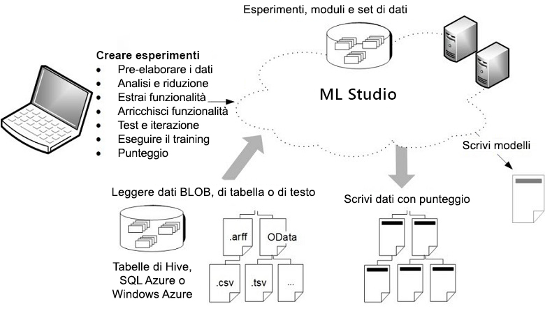

# Che cos'è Machine Learning Studio (versione classica)?

[!INCLUDE [Designer notice](../../../includes/designer-notice.md)]

Microsoft Machine Learning Studio (versione classica) è uno strumento di trascinamento della selezione collaborativo che consente di compilare, testare e distribuire soluzioni di analisi predittiva ai dati.  La versione classica di Machine Learning Studio pubblica i modelli come servizi Web che possono essere facilmente usati da applicazioni personalizzate o strumenti di Business Intelligence, ad esempio Excel.

Machine Learning Studio (versione classica) è il punto di incontro di scienza dei dati, analisi predittive, risorse cloud e dati.

## Area di lavoro interattiva di Machine Learning Studio (versione classica)
Per sviluppare un modello di analisi predittiva, in genere si usano dati provenienti da una o più origini, che vengono trasformati e analizzati tramite varie funzioni di modifica dei dati e statistiche e da cui viene generato un set di risultati. Lo sviluppo di un modello come questo è un processo iterativo. Man mano che si modificano le varie funzioni e i relativi parametri, i risultati convergono fino a quando l'utente non è soddisfatto del modello sottoposto a training.

La versione classica di Azure Machine Learning Studio offre un'area di lavoro visiva e interattiva per eseguire facilmente le operazioni di compilazione, test e iterazione di un modello di analisi predittiva. È possibile trascinare la selezione di ***set di dati*** e ***moduli*** di analisi in un'area di disegno interattiva, collegandoli tra loro per ottenere un ***esperimento*** da eseguire in Machine Learning Studio (versione classica). Per eseguire l'iterazione della progettazione del modello, modificare l'esperimento, salvare eventualmente una copia e ripeterne l'esecuzione. Quando si è pronti, è possibile convertire l'***esperimento di training*** in un ***esperimento predittivo*** e quindi pubblicarlo come un ***servizio Web*** in modo che altri utenti possano accedere al modello.

Non sono necessarie operazioni di programmazione, è sufficiente collegare visivamente i set di dati e i moduli per costruire un modello di analisi predittiva.

## Quali sono le differenze tra Machine Learning Studio (versione classica) e Azure Machine Learning?

[Azure Machine Learning](../service/overview-what-is-azure-ml.md) offre gli SDK **e** la finestra di progettazione di Azure Machine Learning (anteprima) per eseguire rapidamente la preparazione dei dati e il training e la distribuzione dei modelli di Machine Learning. La finestra di progettazione offre un'esperienza di trascinamento della selezione simile a Studio (versione classica). A differenza della piattaforma di calcolo proprietaria di Studio, tuttavia, la finestra di progettazione usa le risorse di calcolo dell'utente ed è pienamente integrata in Azure Machine Learning.

Ecco un confronto rapido:

|| Machine Learning Studio (versione classica) | Azure Machine Learning |
|---| --- | --- |
| Interfaccia per il trascinamento della selezione | Sì | Sì - [Finestra di progettazione di Azure Machine Learning (anteprima)](../service/concept-designer.md) |
| Esperimento | Scalabile (limite dei dati di training di 10 GB) | Ridimensionamento con destinazione di calcolo |
| Moduli per l'interfaccia di trascinamento della selezione | Molti | Set iniziale di [moduli](../algorithm-module-reference/module-reference.md) più diffusi|
|Destinazioni di calcolo del training| Destinazione di calcolo proprietaria, solo supporto di CPU| Supporta destinazioni di calcolo di Azure Machine Learning (GPU o CPU) e macchine virtuali per Notebook. ([Altre destinazioni di calcolo supportate nell'SDK](../service/concept-compute-target.md#train))|
|Destinazioni di calcolo di inferenza| Formato di servizio Web proprietario, non personalizzabile |  Servizio Azure Kubernetes e Servizi di calcolo di Azure Machine Learning  ([Altre destinazioni di calcolo supportate nell'SDK](../service/how-to-deploy-and-where.md)) |
| Pipeline di Machine Learning | Non supportate | [Pipeline](../service/concept-ml-pipelines.md) supportate |
| MLOps | Gestione e distribuzione dei modelli di base | Distribuzione configurabile - controllo delle versioni e rilevamento di modelli e pipeline |
| Formato dei modelli | Formato proprietario, solo Studio | Formato standard a seconda del tipo di processo di training |
|Training automatizzato dei modelli e ottimizzazione degli iperparametri | No | Non ancora presente nella finestra di progettazione   ([Supportato nell'SDK e nella pagina di destinazione dell'area di lavoro](../service/concept-automated-ml.md)) | 

Provare la finestra di progettazione con [Esercitazione: Stimare il prezzo di un'automobile con la finestra di progettazione](../service/tutorial-designer-automobile-price-train-score.md)

> [!NOTE]
> I modelli creati in Studio (versione classica) non possono essere distribuiti né gestiti con Azure Machine Learning. I modelli creati e distribuiti nella finestra di progettazione del servizio possono invece essere gestiti nell'area di lavoro di Azure Machine Learning.

## Scaricare il diagramma della panoramica di Machine Learning Studio (versione classica)
Scaricare il diagramma **Panoramica delle funzionalità di Microsoft Azure Machine Learning Studio (versione classica)** per avere una panoramica di alto livello delle funzionalità di Machine Learning Studio (versione classica). Per tenerlo a portata di mano, stampare il diagramma in formato tabloid (27 x 43 cm circa).

**Scaricare il diagramma qui: [Panoramica delle funzionalità di Microsoft Azure Machine Learning Studio (versione classica)](https://download.microsoft.com/download/C/4/6/C4606116-522F-428A-BE04-B6D3213E9E52/ml_studio_overview_v1.1.pdf)** 

## Componenti di un esperimento di Studio (versione classica)
Un esperimento è costituito da set di dati che forniscono i dati a moduli di analisi, che sono collegati tra loro per costruire un modello di analisi predittiva. In particolare, un esperimento valido ha le caratteristiche seguenti:

* Ha almeno un set di dati e un modulo.
* I set di dati possono essere collegati solo ai moduli.
* I moduli possono essere collegati a set di dati o ad altri moduli.
* Tutte le porte di input per i moduli devono avere un collegamento al flusso di dati.
* Tutti i parametri necessari per ogni modulo devono essere impostati.

È possibile creare un esperimento da zero oppure è possibile usare un esperimento di esempio esistente come modello. Per altre informazioni, vedere [Copiare gli esperimenti di esempio per creare nuovi esperimenti di Machine Learning](sample-experiments.md).

Per un esempio di creazione di un esperimento, vedere [Creare un semplice esperimento in Azure Machine Learning Studio (versione classica)](create-experiment.md).

Per una procedura dettagliata più completa della creazione di una soluzione di analisi predittiva, vedere [Sviluppare una soluzione predittiva con Azure Machine Learning Studio (versione classica)](tutorial-part1-credit-risk.md).

### Set di dati
Un set di dati include dati caricati in Machine Learning Studio (versione classica) per essere usati nel processo di modellazione. In Machine Learning Studio (versione classica) sono inclusi alcuni set di dati di esempio per provare a usare il programma. È possibile caricare altri set di dati in base alle esigenze. Ecco alcuni esempi di set di dati inclusi:

* **MPG data for various automobiles** : valori di consumo del carburante per le automobili identificate in base a numero di cilindri, potenza e così via.
* **Breast cancer data** : dati relativi alla diagnosi del tumore al seno.
* **Forest fires data** : dimensioni degli incendi boschivi nel nord-est del Portogallo.

Quando si compila un esperimento, è possibile effettuare una selezione nell'elenco dei set di dati disponibile a sinistra dell'area di disegno.

Per un elenco dei set di dati di esempio inclusi in Machine Learning Studio (versione classica), vedere [Usare i set di dati di esempio in Azure Machine Learning Studio (versione classica)](use-sample-datasets.md).

### Moduli
Un modulo è un algoritmo che è possibile applicare ai dati.  La versione classica di Machine Learning Studio include diversi moduli, da funzioni di ingresso dei dati a processi di training, valutazione e convalida. Ecco alcuni esempi di moduli inclusi:

* [Convert to ARFF][convert-to-arff] (Converti in ARFF): converte un set di dati serializzato .NET nel formato ARFF (Attribute-Relation File Format).
* [Compute Elementary Statistics][elementary-statistics] (Calcola statistiche elementari): calcola le statistiche elementari come media, deviazione standard e così via.
* [Linear Regression][linear-regression] (Regressione lineare): crea un modello di regressione lineare online basato su discesa del gradiente.
* [Score Model][score-model] (Assegna un punteggio al modello): assegna un punteggio a un modello di regressione o di classificazione con training.

Quando si compila un esperimento, è possibile effettuare una selezione nell'elenco dei moduli disponibile a sinistra dell'area di disegno.

Un modulo può avere un set di parametri che è possibile usare per configurare gli algoritmi interni del modulo. Quando si seleziona un modulo nell'area di disegno, i parametri del modulo sono visualizzati nel riquadro **Properties** a destra dell'area di disegno. È possibile modificare i parametri in questo riquadro per ottimizzare il modello.

Per altre informazioni di riferimento sull'ampia raccolta di algoritmi di Machine Learning disponibili, vedere [Come scegliere gli algoritmi per Microsoft Azure Machine Learning Studio (versione classica)](algorithm-choice.md).

## Distribuzione di un servizio Web di analisi predittiva
Quando il modello di analisi predittiva è pronto, è possibile distribuirlo come servizio Web direttamente da Machine Learning Studio (versione classica). Per altre informazioni su questo processo, vedere [Distribuire un servizio Web di Azure Machine Learning](publish-a-machine-learning-web-service.md).

## Passaggi successivi
È possibile ottenere informazioni di base sulle analisi predittive e sull'apprendimento automatico tramite una[guida introduttiva dettagliata](create-experiment.md) e gli [esempi](sample-experiments.md).

<!-- Module References -->
[convert-to-arff]: https://msdn.microsoft.com/library/azure/62d2cece-d832-4a7a-a0bd-f01f03af0960/
[elementary-statistics]: https://msdn.microsoft.com/library/azure/3086b8d4-c895-45ba-8aa9-34f0c944d4d3/
[linear-regression]: https://msdn.microsoft.com/library/azure/31960a6f-789b-4cf7-88d6-2e1152c0bd1a/
[score-model]: https://msdn.microsoft.com/library/azure/401b4f92-e724-4d5a-be81-d5b0ff9bdb33/
