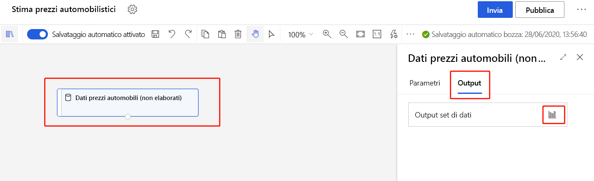
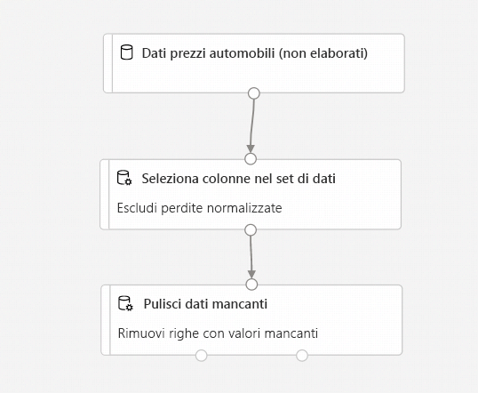
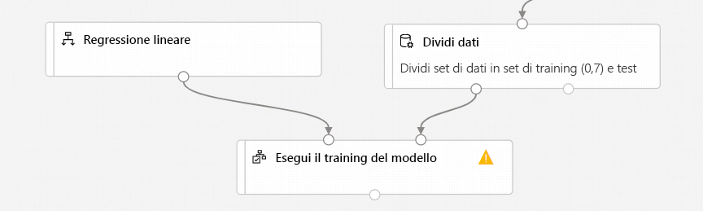
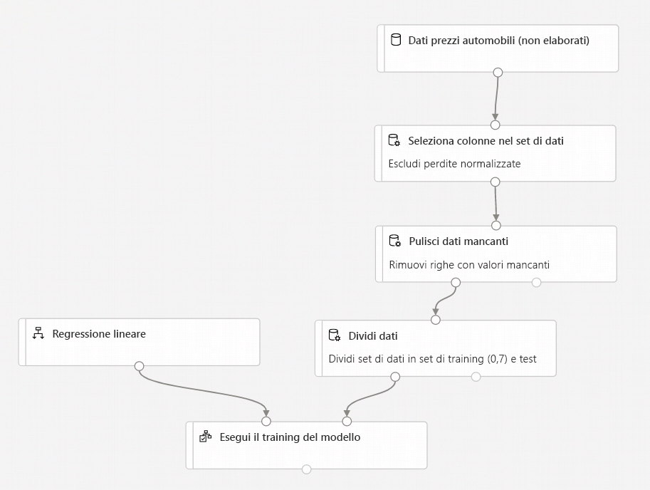
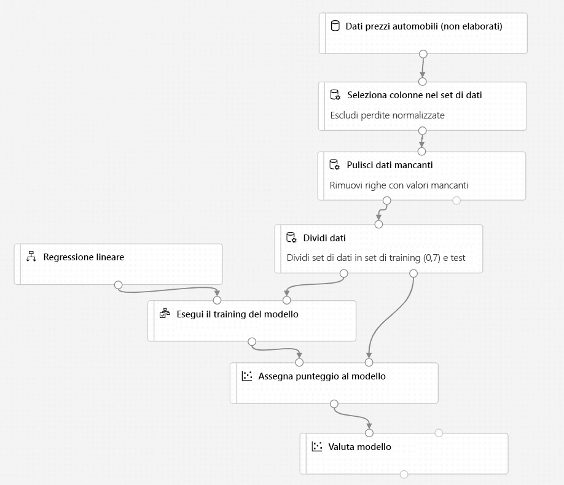
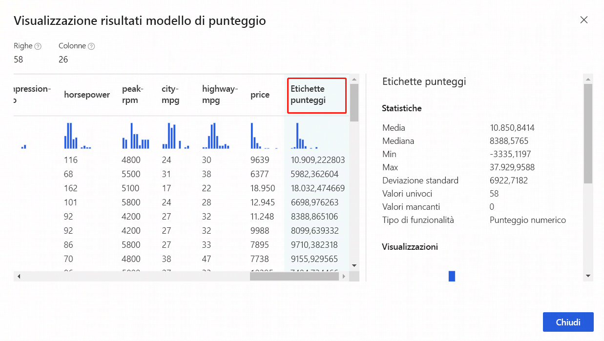

# Esercitazione: Stimare il prezzo di un'automobile con la finestra di progettazione (anteprima)
[!INCLUDE [applies-to-skus](../../includes/aml-applies-to-enterprise-sku.md)]

In questa esercitazione in due parti si apprenderà come usare la finestra di progettazione di Azure Machine Learning per eseguire il training e la distribuzione di un modello di Machine Learning che stima il prezzo di qualsiasi automobile. La finestra di progettazione è uno strumento con trascinamento della selezione che consente di creare modelli di Machine Learning senza scrivere una sola riga di codice.

Nella prima parte dell'esercitazione si è apprenderà come:

> [!div class="checklist"]
> * Creare una nuova pipeline.
> * Importare i dati.
> * Preparare i dati.
> * Eseguire il training di un modello di Machine Learning.
> * Valutare un modello di Machine Learning.

Nella [seconda parte](tutorial-designer-automobile-price-deploy.md) dell'esercitazione, il modello verrà distribuito come endpoint di inferenza in tempo reale per prevedere il prezzo di qualsiasi automobile in base alle specifiche tecniche inviate. 

> [!NOTE]
>Una versione completa dell'esercitazione è disponibile come pipeline di esempio.
>
>Per trovarla, passare alla finestra di progettazione nell'area di lavoro. Nella sezione **New pipeline** (Nuova pipeline) selezionare **Sample 1 - Regression: Automobile Price Prediction(Basic)** .

## Creare una nuova pipeline

Le pipeline di Azure Machine Learning organizzano più passaggi di Machine Learning ed elaborazione dati in un'unica risorsa. Le pipeline consentono di organizzare, gestire e riutilizzare flussi di lavoro di Machine Learning complessi in più progetti e utenti.

Per creare una pipeline di Azure Machine Learning, è necessaria un'area di lavoro di Azure Machine Learning. In questa sezione viene descritto come creare entrambe queste risorse.

### Creazione di una nuova area di lavoro

Per usare la finestra di progettazione, occorre innanzitutto un'area di lavoro di Azure Machine Learning. L'area di lavoro è la risorsa di primo livello per Azure Machine Learning e fornisce una posizione centralizzata da cui gestire tutti gli artefatti creati in Azure Machine Learning.

Se è già disponibile un'area di lavoro di Azure Machine Learning con un'edizione Enterprise, [passare alla sezione successiva](#create-the-pipeline).

[!INCLUDE [aml-create-portal](../../includes/aml-create-in-portal-enterprise.md)]

### Creare la pipeline

1. Accedere a <a href="https://ml.azure.com?tabs=jre" target="_blank">ml.azure.com</a> e selezionare l'area di lavoro che si vuole usare.

1. Selezionare **Designer** (Finestra di progettazione).

    

1. Selezionare **Easy-to-use prebuilt modules** (Moduli predefiniti facili da usare).

1. Nella parte superiore del canvas selezionare il nome predefinito della pipeline, **Pipeline-Created-on**. Ridenominarla in *Automobile price prediction*. Il nome non deve essere univoco.

## Impostare la destinazione di calcolo predefinita

Una pipeline viene eseguita in una destinazione di calcolo, ossia una risorsa di calcolo collegata all'area di lavoro. Dopo aver creato una destinazione di calcolo, è possibile riusarla per le esecuzioni future.

È possibile impostare una **destinazione di calcolo predefinita** per l'intera pipeline, in modo da indicare a ogni modulo di usare la stessa destinazione di calcolo per impostazione predefinita. È però possibile specificare le destinazioni di calcolo solo per modulo.

1. Accanto al nome della pipeline selezionare l'**icona a forma di ingranaggio**  nella parte superiore dell'area di disegno per aprire il riquadro **Impostazioni**.

1. Nel riquadro **Impostazioni** a destra dell'area di disegno selezionare **Seleziona destinazione di calcolo**.

    Se è già disponibile una destinazione di calcolo, è possibile selezionarla per eseguire questa pipeline.

    > [!NOTE]
    > Il progettista può eseguire esperimenti di training solo nell'ambiente di calcolo di Aure Machine Learning e in istanze di calcolo di Azure Machine Learning, mentre le altre destinazioni di calcolo non verranno visualizzate.

1. Immettere un nome per la risorsa di calcolo.

1. Selezionare **Salva**.

    > [!NOTE]
    > La creazione di una risorsa di calcolo richiede circa cinque minuti. Dopo aver creato la risorsa, è possibile riusarla e saltare questo tempo di attesa per le esecuzioni future.
    >
    > La risorsa di calcolo si ridimensiona automaticamente a zero nodi quando è inattiva per risparmiare sui costi. Quando la si usa di nuovo dopo un breve intervallo di tempo, è possibile che si verifichi nuovamente un tempo di attesa di circa cinque minuti, mentre viene riaumentato il numero di nodi.

## Importa dati

Nella finestra di progettazione sono disponibili diversi set di dati di esempio con cui sperimentare. Per questa esercitazione, usare **Automobile price data (Raw)** . 

1. A sinistra del canvas della pipeline è presente un pannello di set di dati e moduli. Selezionare **Datasets** (Set di dati), quindi nella sezione **Samples** (Esempi) visualizzare i set di dati di esempio disponibili.

1. Selezionare il set di dati **Automobile price data (Raw)** e trascinarlo nel canvas.

   

### Visualizzare i dati

È possibile visualizzare i dati per comprendere il set di dati che verrà usato.

1. Selezionare il modulo **Automobile price data (Raw)** .

1. Nel riquadro dei dettagli del modulo a destra del canvas selezionare **Output + log**.

1. Selezionare l'icona del grafico per visualizzare i dati.

    

1. Selezionare le diverse colonne nella finestra dei dati per visualizzare le informazioni relative a ciascuna.

    Ogni riga rappresenta un'automobile e le variabili associate a ogni automobile sono rappresentate da colonne. In questo set di dati sono presenti 205 righe e 26 colonne.

## Preparazione dei dati

I set di dati in genere richiedono una pre-elaborazione prima dell'analisi. Durante l'ispezione del set di dati si potrebbe aver notato che mancano alcuni valori. Per consentire al modello di analizzare correttamente i dati, è necessario eseguire la pulizia di questi valori mancanti.

### Rimuovere una colonna

Quando si esegue il training di un modello, occorre fare qualcosa in merito ai dati mancanti. In questo set di dati, nella colonna **normalized-losses** mancano molti valori, pertanto la si escluderà completamente dal modello.

1. Nel pannello dei moduli a sinistra dell'area di disegno espandere la sezione **Trasformazione dati** e individuare il modulo **Select Columns in Dataset** (Seleziona colonne in set di dati).

1. Trascinare il modulo **Select Columns in Dataset** (Seleziona colonne nel set di dati) nel canvas. Rilasciare il modulo sotto il modulo del set di dati.

1. Connettere il set di dati **Automobile price data (Raw)** al modulo **Select Columns in Dataset** (Seleziona colonne nel set di dati). Trascinare il mouse dalla porta di output del set di dati, ovvero il piccolo cerchio nella parte inferiore del set di dati nel canvas, fino alla porta di input di **Select Columns in Dataset** (Seleziona colonne nel set di dati), ovvero il piccolo cerchio nella parte superiore del modulo.

    > [!TIP]
    > Viene creato un flusso di dati attraverso la pipeline quando si connette la porta di output di un modulo alla porta di input di un altro.
    >

    

1. Selezionare il modulo **Select Columns in Dataset** (Seleziona colonne nel set di dati).

1. Nel riquadro dei dettagli del modulo a destra dell'area di disegno selezionare **Modifica colonna**.

1. Espandere l'elenco a discesa **Nomi colonne** accanto a **Includi** e selezionare **Tutte le colonne**.

1. Selezionare il segno **+** per aggiungere una nuova regola.

1. Nel menu a discesa selezionare **Escludi** e **Nomi colonne**.
    
1. Immettere *normalized-losses* nella casella di testo.

1. Nell'angolo in basso a destra selezionare **Save** (Salva) per chiudere il selettore di colonne.

    

1. Selezionare il modulo **Select Columns in Dataset** (Seleziona colonne nel set di dati). 

1. Nel riquadro dei dettagli del modulo a destra dell'area di disegno selezionare la casella di testo **Commento** e immettere *Escludi perdite normalizzate*.

    I commenti verranno visualizzati nel grafo per facilitare l'organizzazione della pipeline.

### Pulire i dati mancanti

Dopo la rimozione della colonna **normalized-losses**, il set di dati contiene ancora colonne con valori mancanti. È possibile rimuovere i rimanenti dati mancanti usando il modulo **Clean Missing Data** (Pulisci dati mancanti).

> [!TIP]
> La pulizia dei valori mancanti dai dati di input è un prerequisito per l'uso della maggior parte dei moduli nella finestra di progettazione.

1. Nel pannello dei moduli a sinistra dell'area di disegno espandere la sezione **Trasformazione dati** e individuare il modulo **Clean Missing Data** (Pulisci dati mancanti).

1. Trascinare il modulo **Clean Missing Data** (Pulisci dati mancanti) nel canvas della pipeline. Connetterlo al modulo **Select Columns in Dataset** (Seleziona colonne nel set di dati). 

1. Selezionare il modulo **Clean Missing Data** (Pulisci dati mancanti).

1. Nel riquadro dei dettagli del modulo a destra dell'area di disegno selezionare **Modifica colonna**.

1. Nella finestra **Columns to be cleaned** (Colonne da pulire) visualizzata espandere il menu a discesa accanto a **Include** (Includi). Selezionare **All columns** (Tutte le colonne)

1. Selezionare **Salva**

1. Nel riquadro dei dettagli del modulo a destra dell'area di disegno selezionare **Remove entire row** (Rimuovi riga intera) in **Cleaning mode** (Modalità pulizia).

1. Nel riquadro dei dettagli del modulo a destra dell'area di disegno selezionare la casella **Commento** e immettere *Rimuovi righe valori mancanti*. 

    La pipeline avrà ora un aspetto analogo al seguente:
    
    

## Eseguire il training di un modello di Machine Learning

A questo punto, dopo aver creato i moduli per elaborare i dati, è possibile configurare i moduli di training.

Poiché si vuole stimare il prezzo, ovvero un numero, è possibile usare un algoritmo di regressione. Per questo esempio si userà un modello di regressione lineare.

### Dividere i dati

La divisione dei dati è un'attività comune in Machine Learning. I dati verranno divisi in due set di dati separati. Un set di dati eseguirà il training del modello e l'altro ne verificherà le prestazioni.

1. Nel pannello del modulo espandere la sezione **Trasformazione dati** e individuare il modulo **Split Data** (Dividi i dati).

1. Trascinare il modulo **Split Data** nell'area di disegno della pipeline.

1. Connettere la porta sinistra del modulo **Clean Missing Data** (Pulisci dati mancanti) al modulo **Split Data** (Dividi i dati).

    > [!IMPORTANT]
    > Assicurarsi che la porte di output sinistra di **Clean Missing Data** (Pulisci dati mancanti) si connetta a **Split Data** (Dividi i dati). La porta sinistra contiene i dati puliti. La porta destra contiene i dati rimossi.

1. Selezionare il modulo **Split Data**.

1. Nel riquadro dei dettagli del modulo a destra dell'area di disegno impostare l'opzione **Fraction of rows in the first output dataset** (Frazione di righe nel primo set di dati di output) su 0,7.

    Con questa opzione, per il training del modello verrà usato il 70% dei dati, mentre il restante 30% verrà usato per i test. Il set di dati del 70% sarà accessibile tramite la porta di output sinistra. I dati rimanenti saranno disponibili tramite la porta di output destra.

1. Nel riquadro dei dettagli del modulo a destra dell'area di disegno selezionare la casella **Commento** e immettere *Suddividi il set di dati in set per il training (0,7) e set per i test (0,3)* .

### Eseguire il training del modello

Eseguire il training del modello assegnando un set di dati che include il prezzo. L'algoritmo crea un modello che spiega la relazione tra le caratteristiche e il prezzo come presentato dai dati di training.

1. Nel pannello del modulo espandere **Machine Learning Algorithms** (Algoritmi di Machine Learning).
    
    Questa opzione visualizza diverse categorie di moduli che è possibile usare per inizializzare gli algoritmi di Machine Learning.

1. Selezionare il modulo **Regression** > **Linear Regression** (Regressione > Regressione lineare) e trascinarlo nel canvas della pipeline.

1. Nel pannello del modulo espandere la sezione **Module training** (Training del modulo) e trascinare il modulo **Train Model** (Training modello) nell'area di disegno.

1. Connettere l'output del modulo **Linear Regression** (Regressione lineare) alla porta di input sinistra del modulo **Train Model** (Training modello).

1. Connettere l'output dei dati di training (porta sinistra) del modulo **Split Data** (Divisione dati) alla porta di input destra del modulo **Train Model** (Training modello).
    
    > [!IMPORTANT]
    > Assicurarsi che la porta di output sinistra di **Split Data** (Dividi i dati) si connetta a **Train Model** (Training modello). La porta sinistra contiene il set di training. La porta destra contiene il set di test.

    

1. Selezionare il modulo **Train Model**.

1. Nel riquadro dei dettagli del modulo a destra dell'area di disegno selezionare il selettore **Modifica colonna**.

1. Nella finestra di dialogo **Label column** (Colonna etichetta) espandere il menu a discesa e selezionare **Column names** (Nomi di colonna). 

1. Nella casella di testo immettere *price* per specificare il valore che verrà previsto dal modello.

    >[!IMPORTANT]
    > Assicurarsi di immettere esattamente il nome della colonna. Usare l'iniziale maiuscola per **price**. 

    La pipeline dovrebbe avere un aspetto simile al seguente:

    

### Aggiungere il modulo Score Model (Punteggio modello)

Dopo aver eseguito il training del modello usando il 70% dei dati, è possibile usarlo per assegnare punteggi al restante 30% e verificarne il funzionamento.

1. Immettere *score model* nella casella di ricerca per trovare il modulo **Score Model** (Punteggio modello) e trascinarlo nel canvas della pipeline. 

1. Connettere l'output del modulo **Train Model** alla porta di input sinistra del modulo **Score Model**. Connettere l'output dei dati di test (porta destra) del modulo **Split Data** alla porta di input destra di **Score Model**.

### Aggiungere il modulo Evaluate Model (Modello di valutazione)

Usare il modulo **Evaluate Model** (Valutazione modello) per valutare il punteggio assegnato al modello nel set di dati di test.

1. Immettere *evaluate* nella casella di ricerca per trovare il modulo **Evaluate Model** (Valutazione modello) e trascinarlo nel canvas della pipeline. 

1. Connettere l'output del modulo **Score Model** all'input sinistro di **Evaluate Model**. 

    La pipeline finale avrà un aspetto analogo al seguente:

    

## Inviare la pipeline

Ora che la pipeline è completamente configurata, è possibile inviare un'esecuzione della pipeline per eseguire il training del modello di Machine Learning. È possibile inviare un'esecuzione di pipeline valida in qualsiasi momento, che può essere usata per esaminare le modifiche apportate alla pipeline durante lo sviluppo.

1. Nella parte superiore dell'area di disegno selezionare **Invia**.

1. Nella finestra di dialogo **Configura esecuzione della pipeline** selezionare **Crea nuova**.

    > [!NOTE]
    > Gli esperimenti raggruppano esecuzioni di pipeline simili. Se una pipeline viene eseguita più volte, è possibile selezionare lo stesso esperimento per le esecuzioni successive.

    1. Immettere un nome descrittivo per **Nome nuovo esperimento**.

    1. Selezionare **Submit** (Invia).
    
    È possibile visualizzare lo stato di esecuzione e i dettagli nella parte superiore destra dell'area di disegno.
    
    La prima volta, l'esecuzione della pipeline potrebbe richiedere fino a 20 minuti. Le impostazioni di calcolo predefinite prevedono una dimensione minima del nodo pari a 0, il che significa che la finestra di progettazione deve allocare risorse dopo l'inattività. Le esecuzioni ripetute della pipeline richiederanno meno tempo, perché le risorse di calcolo sono già allocate. Inoltre, la finestra di progettazione usa i risultati memorizzati nella cache per ogni modulo per migliorare ulteriormente l'efficienza.

### Visualizzare le etichette dei punteggi

Al termine dell'esecuzione, è possibile visualizzare i risultati dell'esecuzione della pipeline. Prima di tutto, esaminare le previsioni generate dal modello di regressione.

1. Selezionare il modulo **Score Model** (Punteggio modello) per visualizzare il relativo output.

1. Nel riquadro dei dettagli del modulo a destra dell'area di disegno selezionare **Output + log** > icona del grafo  per visualizzare i risultati.

    Qui è possibile visualizzare i prezzi stimati e i prezzi effettivi dai dati di test.

    

### Valutare i modelli

Usare **Evaluate Model** (Valutazione modello) per verificare le prestazioni del modello sottoposto a training nel set di dati di test.

1. Selezionare il modulo **Evaluate Model** (Valutazione modello) per visualizzare il relativo output.

1. Nel riquadro dei dettagli del modulo a destra dell'area di disegno selezionare **Output + log** > icona del grafo  per visualizzare i risultati.

Per il modello vengono visualizzate le seguenti statistiche:

* **Errore assoluto medio** (MAE): la media degli errori assoluti. Un errore è la differenza tra il valore stimato e quello effettivo.
* **Radice dell'errore quadratico medio** (RMSE): Radice quadrata della media degli errori quadratici delle stime effettuate sul set di dati di test.
* **Errore assoluto relativo**: Media degli errori assoluti relativamente alla differenza assoluta tra i valori effettivi e la media di tutti i valori effettivi.
* **Errore quadratico relativo**: Media degli errori quadratici relativamente alla differenza quadratica tra i valori effettivi e la media di tutti i valori effettivi.
* **Coefficiente di determinazione**: noto anche come valore quadratico R, è una metrica statistica che indica l'esattezza del modello rispetto ai dati.

Per ogni statistica di errore, sono preferibili i valori più piccoli. Un valore più piccolo indica che le stime sono più vicine ai valori effettivi. Per il coefficiente di determinazione, più il valore si avvicina a uno (1,0) più le stime sono precise.

## Pulire le risorse

Saltare questa sezione se si vuole continuare con la parte 2 dell'esercitazione relativa alla [distribuzione di modelli](tutorial-designer-automobile-price-deploy.md).

[!INCLUDE [aml-ui-cleanup](../../includes/aml-ui-cleanup.md)]

## Passaggi successivi

Nella seconda parte si apprenderà come distribuire il modello come endpoint in tempo reale.

> [!div class="nextstepaction"]
> [Continuare a distribuire modelli](tutorial-designer-automobile-price-deploy.md)
