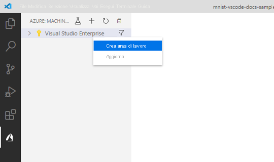
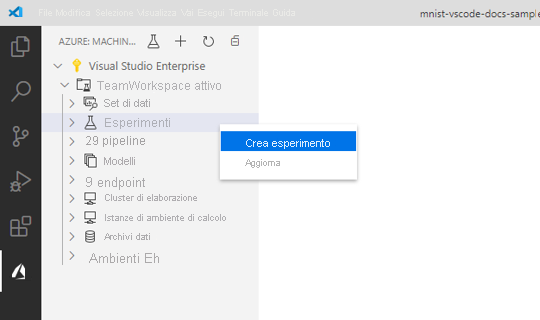
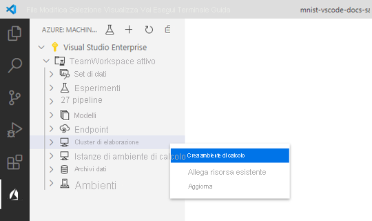
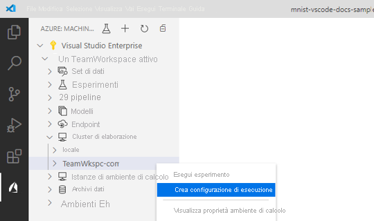
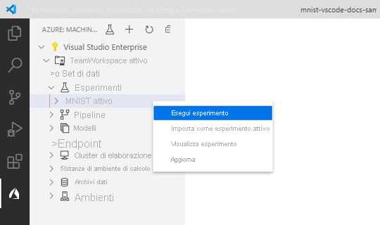
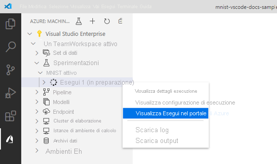
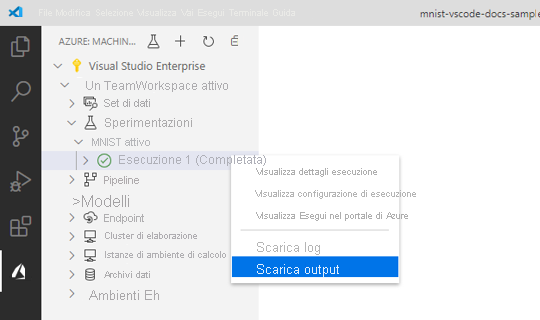
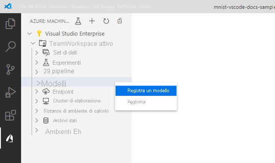

# <a name="train-and-deploy-an-image-classification-tensorflow-model-using-the-azure-machine-learning-visual-studio-code-extension"></a>Eseguire il training e distribuire un modello di classificazione delle immagini TensorFlow usando l'estensione Azure Machine Learning per Visual Studio Code

Informazioni su come eseguire il training e distribuire un modello di classificazione delle immagini per riconoscere i numeri scritti a mano usando TensorFlow e l'estensione Azure Machine Learning per Visual Studio Code.

In questa esercitazione si apprenderanno informazioni sulle attività seguenti:

> [!div class="checklist"]
> * Informazioni sul codice
> * Creare un'area di lavoro
> * Creare un esperimento
> * Configurare le destinazioni di calcolo
> * Eseguire un file di configurazione
> * Eseguire il training di un modello
> * Registrare un modello
> * Distribuire un modello

## <a name="prerequisites"></a>Prerequisiti

- Sottoscrizione di Azure. Se non se ne possiede una, iscriversi per provare la [versione gratuita o a pagamento di Azure Machine Learning](https://aka.ms/AMLFree).
- Installare [Visual Studio Code](https://code.visualstudio.com/docs/setup/setup-overview), un editor di codice leggero multipiattaforma.
- Estensione Azure Machine Learning Studio per Visual Studio Code. Per le istruzioni di installazione, vedere l'[esercitazione su come installare l'estensione Azure Machine Learning Studio per Visual Studio Code](./tutorial-setup-vscode-extension.md)

## <a name="understand-the-code"></a>Informazioni sul codice

Il codice per questa esercitazione usa TensorFlow per eseguire il training di un modello di Machine Learning di classificazione delle immagini che categorizza le cifre scritte a mano da 0 a 9. A tale scopo, crea una rete neurale che accetta i valori pixel di un'immagine da 28 pixel x 28 pixel come input e restituisce un elenco di 10 probabilità, una per ogni cifra classificata. L'aspetto dei dati è simile al seguente.  


Per ottenere il codice per questa esercitazione, scaricare e decomprimere il [repository VS Code Tools for AI](https://github.com/microsoft/vscode-tools-for-ai/archive/master.zip) in qualsiasi posizione nel computer.

## <a name="create-a-workspace"></a>Creare un'area di lavoro

La prima operazione da effettuare per creare un'applicazione in Azure Machine Learning consiste nel creare un'area di lavoro. Un'area di lavoro contiene le risorse necessarie per eseguire il training dei modelli, oltre ai modelli con training esistenti. Per altre informazioni, vedere [Che cos'è un'area di lavoro](./concept-workspace.md). 

1. Nella barra attività di Visual Studio Code selezionare l'icona **Azure** per aprire la visualizzazione Azure Machine Learning.
1. Fare clic con il pulsante destro sulla sottoscrizione di Azure e selezionare **Creare area di lavoro**. 
    
    > [!div class="mx-imgBorder"]
    > 

1. Per impostazione predefinita, viene generato un nome che contiene la data e l'ora della creazione. Nella casella di input di testo sostituire il nome con "TeamWorkspace" e premere **INVIO**.
1. Selezionare **Crea un nuovo gruppo di risorse**. 
1. Assegnare al gruppo di risorse il nome "TeamWorkspace-rg" e premere **INVIO**. 
1. Scegliere una posizione per l'area di lavoro. È consigliabile scegliere la località più vicina a quella in cui si intende distribuire il modello. Ad esempio, "Stati Uniti occidentali 2".
1. Quando viene richiesto di selezionare il tipo di area di lavoro, selezionare **Basic** per creare un'area di lavoro Basic. Per altre informazioni sulle varie offerte disponibili per le aree di lavoro, vedere [Panoramica di Azure Machine Learning](./overview-what-is-azure-ml.md#sku).

A questo punto, viene inviata una richiesta ad Azure per creare una nuova area di lavoro nell'account. Dopo alcuni minuti, la nuova area di lavoro verrà visualizzata nel nodo della sottoscrizione. 

## <a name="create-an-experiment"></a>Creare un esperimento

È possibile creare uno o più esperimenti nell'area di lavoro per tenere traccia e analizzare le singole esecuzioni di training dei modelli. Le esecuzioni possono essere eseguite nel cloud di Azure o nel computer locale.

1. Selezionare l'icona **Azure** nella barra attività di Visual Studio Code. Verrà aperta la visualizzazione di Azure Machine Learning.
1. Espandere il nodo della sottoscrizione.
1. Espandere il nodo **TeamWorkspace**. 
1. Fare clic con il pulsante destro del mouse sul nodo **Esperimenti**.
1. Nel menu di scelta rapida scegliere **Crea esperimento**.

    > [!div class="mx-imgBorder"]
    > 

1. Assegnare all'esperimento il nome "MNIST" e premere **INVIO** per creare il nuovo esperimento. 

Come per le aree di lavoro, viene inviata una richiesta ad Azure per creare un esperimento con le configurazioni specificate. Dopo alcuni minuti, il nuovo esperimento viene visualizzato nel nodo *Esperimenti* dell'area di lavoro. 

## <a name="configure-compute-targets"></a>Configurare le destinazioni di calcolo

Una destinazione di calcolo è la risorsa o l'ambiente di calcolo in cui si eseguono gli script e si distribuiscono modelli con training. Per altre informazioni, vedere la [documentazione per le destinazioni di calcolo di Azure Machine Learning](./concept-compute-target.md).

Per creare una destinazione di calcolo:

1. Selezionare l'icona **Azure** nella barra attività di Visual Studio Code. Verrà aperta la visualizzazione di Azure Machine Learning. 
1. Espandere il nodo della sottoscrizione. 
1. Espandere il nodo **TeamWorkspace**. 
1. Sotto il nodo dell'area di lavoro fare clic con il pulsante destro del mouse sul nodo **Compute** (Calcolo) e scegliere **Create Compute** (Crea calcolo). 

    > [!div class="mx-imgBorder"]
    > 

1. Selezionare **Ambiente di calcolo di Azure Machine Learning (AmlCompute)** . L'ambiente di calcolo di Azure Machine Learning è un'infrastruttura di calcolo gestito che consente all'utente di creare facilmente un ambiente di calcolo a uno o più nodi che può essere usato insieme ad altri utenti nell'area di lavoro.
1. Scegliere le dimensioni per la macchina virtuale. Selezionare **Standard_F2s_v2** dall'elenco di opzioni. Le dimensioni della macchina virtuale hanno un effetto sulla quantità di tempo necessaria per il training dei modelli. Per altre informazioni sulle dimensioni di macchina virtuale, vedere [Dimensioni delle macchine virtuali Linux in Azure](https://docs.microsoft.com/azure/virtual-machines/linux/sizes).
1. Assegnare il nome "TeamWkspc-com" al nodo di calcolo e premere **INVIO** per creare la risorsa di calcolo.

    In VS Code viene visualizzato un file con un contenuto simile a quello riportato di seguito:

    ```json
    {
        "location": "westus2",
        "tags": {},
        "properties": {
            "computeType": "AmlCompute",
            "description": "",
            "properties": {
                "vmSize": "Standard_F2s_v2",
                "vmPriority": "dedicated",
                "scaleSettings": {
                    "maxNodeCount": 4,
                    "minNodeCount": 0,
                    "nodeIdleTimeBeforeScaleDown": 120
                },
                "userAccountCredentials": {
                    "adminUserName": "",
                    "adminUserPassword": "",
                    "adminUserSshPublicKey": ""
                },
                "subnetName": "",
                "vnetName": "",
                "vnetResourceGroupName": "",
                "remoteLoginPortPublicAccess": ""
            }
        }
    }
    ```

1. Al termine della configurazione, aprire il riquadro comandi selezionando **Visualizza > Riquadro comandi**.
1. Immettere il comando seguente nel riquadro comandi per salvare il file di configurazione di esecuzione.

    ```text
    Azure ML: Save and Continue
    ```

Dopo alcuni minuti, la nuova destinazione di calcolo viene visualizzata nel nodo *Calcolo* dell'area di lavoro.

## <a name="create-a-run-configuration"></a>Creare una configurazione di esecuzione

Quando si invia un'esecuzione di training a una destinazione di calcolo, si invia anche la configurazione necessaria per eseguire il processo di training. Ad esempio, lo script che contiene il codice di training e le dipendenze di Python necessarie per eseguirlo.

Per creare una configurazione di esecuzione:

1. Selezionare l'icona **Azure** nella barra attività di Visual Studio Code. Verrà aperta la visualizzazione di Azure Machine Learning. 
1. Espandere il nodo della sottoscrizione. 
1. Espandere il nodo **TeamWorkspace > Calcolo**. 
1. Nel nodo di calcolo fare clic con il pulsante destro del mouse sul nodo di calcolo **TeamWkspc-com** e scegliere **Crea configurazione di esecuzione**.

    > [!div class="mx-imgBorder"]
    > 

1. Assegnare il nome "MNIST-rc" alla configurazione di esecuzione e premere **INVIO** per creare la configurazione di esecuzione.
1. Selezionare quindi **Create new Azure ML Environment** (Crea nuovo ambiente di Azure ML). Gli ambienti definiscono le dipendenze necessarie per eseguire gli script.
1. Assegnare all'ambiente il nome "MNIST-env" e premere **INVIO**.
1. selezionare **File di dipendenze Conda** dall'elenco.
1. Premere **INVIO** per esplorare il file di dipendenze Conda. In questo caso, il file di dipendenze è costituito dal file `env.yml` all'interno della directory `vscode-tools-for-ai/mnist-vscode-docs-sample`.

    In VS Code viene visualizzato un file con un contenuto simile a quello riportato di seguito:

    ```json
    {
        "name": "MNIST-env",
        "version": "1",
        "python": {
            "interpreterPath": "python",
            "userManagedDependencies": false,
            "condaDependencies": {
                "name": "vs-code-azure-ml-tutorial",
                "channels": [
                    "defaults"
                ],
                "dependencies": [
                    "python=3.6.2",
                    "tensorflow=1.15.0",
                    "pip",
                    {
                        "pip": [
                            "azureml-defaults"
                        ]
                    }
                ]
            },
            "baseCondaEnvironment": null
        },
        "environmentVariables": {},
        "docker": {
            "baseImage": "mcr.microsoft.com/azureml/base:intelmpi2018.3-ubuntu16.04",
            "baseDockerfile": null,
            "baseImageRegistry": {
                "address": null,
                "username": null,
                "password": null
            },
            "enabled": false,
            "arguments": []
        },
        "spark": {
            "repositories": [],
            "packages": [],
            "precachePackages": true
        },
        "inferencingStackVersion": null
    }
    ```

1. Al termine della configurazione, per salvarla aprire il riquadro comandi e immettere il comando seguente:

    ```text
    Azure ML: Save and Continue
    ```

1. Premere **INVIO** per esplorare il file script da eseguire nel nodo di calcolo. In questo caso, lo script per eseguire il training del modello è costituito dal file `train.py` all'interno della directory `vscode-tools-for-ai/mnist-vscode-docs-sample`.

    In VS Code viene visualizzato un file denominato `MNIST-rc.runconfig` con un contenuto simile a quello riportato di seguito:

    ```json
    {
        "script": "train.py",
        "framework": "Python",
        "communicator": "None",
        "target": "TeamWkspc-com",
        "environment": {
            "name": "MNIST-env",
            "version": "1",
            "python": {
                "interpreterPath": "python",
                "userManagedDependencies": false,
                "condaDependencies": {
                    "name": "vs-code-azure-ml-tutorial",
                    "channels": [
                        "defaults"
                    ],
                    "dependencies": [
                        "python=3.6.2",
                        "tensorflow=1.15.0",
                        "pip",
                        {
                            "pip": [
                                "azureml-defaults"
                            ]
                        }
                    ]
                },
                "baseCondaEnvironment": null
            },
            "environmentVariables": {},
            "docker": {
                "baseImage": "mcr.microsoft.com/azureml/base:intelmpi2018.3-ubuntu16.04",
                "baseDockerfile": null,
                "baseImageRegistry": {
                    "address": null,
                    "username": null,
                    "password": null
                },
                "enabled": false,
                "arguments": []
            },
            "spark": {
                "repositories": [],
                "packages": [],
                "precachePackages": true
            },
            "inferencingStackVersion": null
        },
        "history": {
            "outputCollection": true,
            "snapshotProject": false,
            "directoriesToWatch": [
                "logs"
            ]
        }
    }
    ```

1. Al termine della configurazione, per salvarla aprire il riquadro comandi e immettere il comando seguente:

    ```text
    Azure ML: Save and Continue
    ```

La configurazione di esecuzione `MNIST-rc` viene aggiunta nel nodo di calcolo *TeamWkspc-com* e la configurazione dell'ambiente `MNIST-env` viene aggiunta nel nodo *Ambienti*.

## <a name="train-the-model"></a>Eseguire il training del modello

Durante il processo di training, viene creato un modello TensorFlow elaborando i dati di training e i modelli di apprendimento incorporati al suo interno per ognuna delle rispettive cifre classificate. 

Per eseguire un esperimento di Azure Machine Learning:

1. Selezionare l'icona **Azure** nella barra attività di Visual Studio Code. Verrà aperta la visualizzazione di Azure Machine Learning. 
1. Espandere il nodo della sottoscrizione. 
1. Espandere il nodo **TeamWorkspace > Esperimenti**. 
1. Fare clic con il pulsante destro del mouse sull'esperimento **MNIST**.
1. Selezionare **Run Experiment** (Esegui esperimento).

    > [!div class="mx-imgBorder"]
    > 

1. Dall'elenco delle opzioni di destinazione di calcolo selezionare la destinazione di calcolo **TeamWkspc-com**.
1. Selezionare quindi la configurazione di esecuzione **MNIST-rc**.
1. A questo punto, viene inviata una richiesta ad Azure per eseguire l'esperimento nella destinazione di calcolo selezionata nell'area di lavoro. Questo processo richiede alcuni minuti. L'intervallo di tempo per l'esecuzione del processo di training dipende da numerosi fattori, ad esempio il tipo di calcolo e le dimensioni dei dati di training. Per tenere traccia dello stato di avanzamento dell'esperimento, fare clic con il pulsante destro del mouse sul nodo esecuzione corrente e selezionare **View Run in Azure portal** (Visualizza esecuzione in portale di Azure).
1. Quando viene visualizzata la finestra di dialogo che richiede di aprire un sito Web esterno, selezionare **Apri**.

    > [!div class="mx-imgBorder"]
    > 

Al termine del training del modello, l'etichetta dello stato accanto al nodo di esecuzione viene aggiornata e mostra la dicitura "Completato".

## <a name="register-the-model"></a>Registrare il modello

Dopo avere eseguito il training del modello, è possibile registrarlo nell'area di lavoro. 

Per registrare il modello:

1. Selezionare l'icona **Azure** nella barra attività di Visual Studio Code. Verrà aperta la visualizzazione di Azure Machine Learning.
1. Espandere il nodo della sottoscrizione. 
1. Espandere il nodo **TeamWorkspace > Esperimenti > MNIST**.
1. Ottenere gli output del modello generati dal training del modello. Fare clic con il pulsante destro del mouse sul nodo di esecuzione **Esecuzione 1** e scegliere **Download outputs** (Scarica output). 

    > [!div class="mx-imgBorder"]
    > 

1. Scegliere la directory in cui salvare gli output scaricati. Per impostazione predefinita, gli output vengono salvati nella directory attualmente aperta in Visual Studio Code.
1. Fare clic con il pulsante destro del mouse sul nodo **Modelli** e scegliere **Registra modello**.

    > [!div class="mx-imgBorder"]
    > 

1. Assegnare al modello il nome "MNIST-TensorFlow-Model" e premere **INVIO**.
1. Un modello di TensorFlow è costituito da più file. Selezionare **Cartella del modello** come formato del percorso del modello nell'elenco di opzioni. 
1. Selezionare la directory `azureml_outputs/Run_1/outputs/outputs/model`.

    In Visual Studio Code viene visualizzato un file contenente le configurazioni del modello con un contenuto simile a quello riportato di seguito:

    ```json
    {
        "modelName": "MNIST-TensorFlow-model",
        "tags": {
            "": ""
        },
        "modelPath": "c:\\Dev\\vscode-tools-for-ai\\mnist-vscode-docs-sample\\azureml_outputs\\Run_1\\outputs\\outputs\\model",
        "description": ""
    }
    ```

1. Al termine della configurazione, per salvarla aprire il riquadro comandi e immettere il comando seguente:

    ```text
    Azure ML: Save and Continue
    ```

Dopo alcuni minuti, il modello viene visualizzato nel nodo *Modelli*.

## <a name="deploy-the-model"></a>Distribuire il modello

In Visual Studio Code è possibile distribuire il modello come servizio Web in:

+ Istanze di Azure Container.
+ Servizio Azure Kubernetes.

Non è necessario creare un contenitore in Istanze di Azure Container per eseguire il test in anticipo, perché tali contenitori vengono creati in base alle esigenze. Tuttavia, è invece necessario configurare i cluster servizio Azure Kubernetes in anticipo. Per altre informazioni sulle opzioni di distribuzione, vedere [Distribuire modelli con Azure Machine Learning](how-to-deploy-and-where.md).

Come distribuire un servizio Web come un'istanza di Azure Container:

1. Selezionare l'icona **Azure** nella barra attività di Visual Studio Code. Verrà aperta la visualizzazione di Azure Machine Learning.
1. Espandere il nodo della sottoscrizione. 
1. Espandere il nodo **TeamWorkspace > Modelli**. 
1. Fare clic con il pulsante destro del mouse su **MNIST-TensorFlow-model** e scegliere **Deploy Service from Registered Model** (Distribuisci servizio dal modello registrato).

    > [!div class="mx-imgBorder"]
    > 

1. Selezionare **Istanze di Azure Container**.
1. Assegnare al servizio il nome "mnist-tensorflow-svc" e premere **INVIO**.
1. Per scegliere lo script da eseguire nel contenitore, premere **INVIO** nella casella di input e selezionare il file `score.py` nella directory `mnist-vscode-docs-sample`.
1. Per specificare le dipendenze necessarie per eseguire lo script, premere **INVIO** nella casella di input e selezionare il file `env.yml` nella directory `mnist-vscode-docs-sample`.

    In Visual Studio Code viene visualizzato un file contenente le configurazioni del modello con un contenuto simile a quello riportato di seguito:

    ```json
    {
        "name": "mnist-tensorflow-svc",
        "imageConfig": {
            "runtime": "python",
            "executionScript": "score.py",
            "dockerFile": null,
            "condaFile": "env.yml",
            "dependencies": [],
            "schemaFile": null,
            "enableGpu": false,
            "description": ""
        },
        "deploymentConfig": {
            "cpu_cores": 1,
            "memory_gb": 10,
            "tags": {
                "": ""
            },
            "description": ""
        },
        "deploymentType": "ACI",
        "modelIds": [
            "MNIST-TensorFlow-model:1"
        ]
    }
    ```

1. Al termine della configurazione, per salvarla aprire il riquadro comandi e immettere il comando seguente:

    ```text
    Azure ML: Save and Continue
    ```

A questo punto, viene inviata una richiesta ad Azure per distribuire il servizio Web. Questo processo richiede alcuni minuti. Una volta distribuito, il nuovo servizio viene visualizzato nel nodo *Endpoint*.

## <a name="next-steps"></a>Passaggi successivi

* Per una procedura dettagliata su come eseguire il training con Azure Machine Learning all'esterno di Visual Studio Code, vedere [Esercitazione: Eseguire il training di modelli con Azure Machine Learning](tutorial-train-models-with-aml.md).
* Per una procedura dettagliata su come modificare, eseguire il codice ed eseguire il debug in locale, vedere l'[esercitazione Hello World in Python](https://code.visualstudio.com/docs/Python/Python-tutorial).

