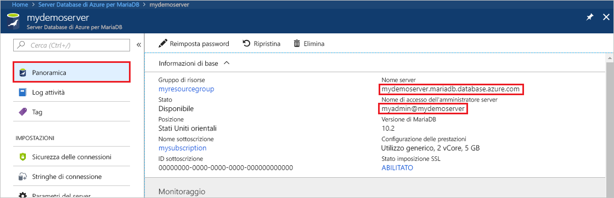
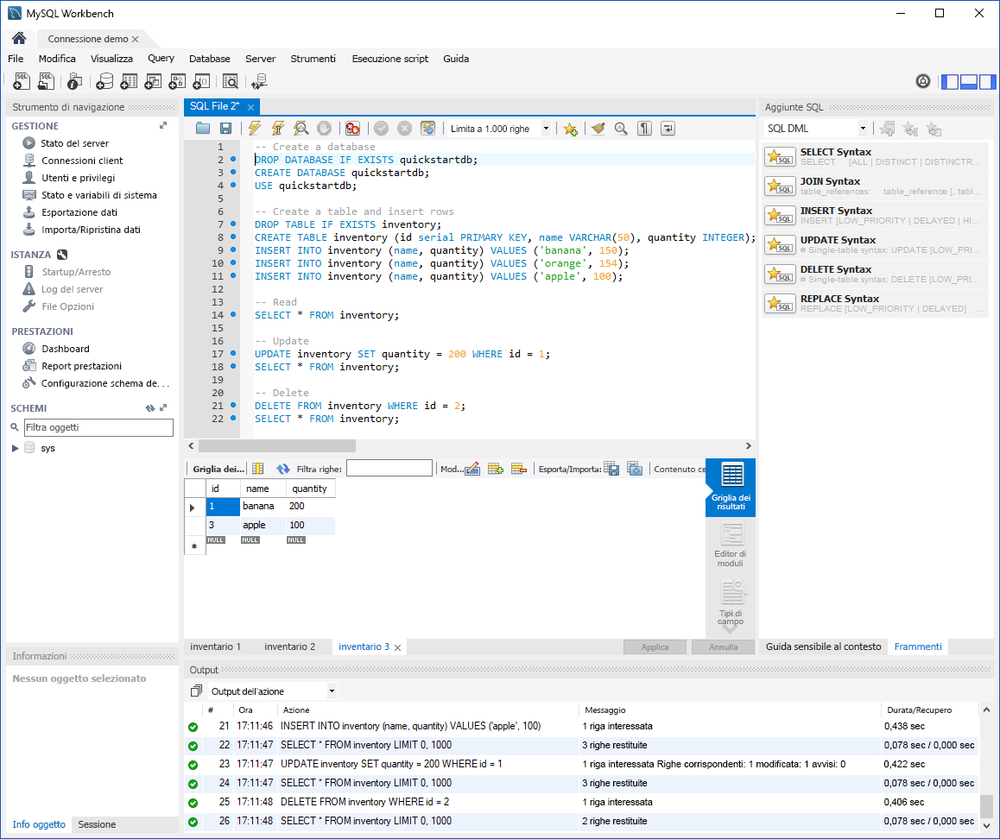

# <a name="azure-database-for-mariadb-use-mysql-workbench-to-connect-and-query-data"></a>Database di Azure per MariaDB: Usare MySQL Workbench per connettersi ai dati ed eseguire query su di essi

Questa guida introduttiva illustra come connettersi a un'istanza di Database di Azure per MariaDB usando MySQL Workbench. 

## <a name="prerequisites"></a>Prerequisiti

Questa guida introduttiva usa le risorse create in una delle guide seguenti come punto di partenza:

- [Creare un server di Database di Azure per MariaDB usando il portale di Azure](./quickstart-create-mariadb-server-database-using-azure-portal.md)
- [Creare un server di Database di Azure per MariaDB usando l'interfaccia della riga di comando di Azure](./quickstart-create-mariadb-server-database-using-azure-cli.md)

## <a name="install-mysql-workbench"></a>Installare MySQL Workbench

[Scaricare MySQL Workbench](https://dev.mysql.com/downloads/workbench/) e installarlo nel computer.

## <a name="get-connection-information"></a>Ottenere informazioni di connessione

Ottenere le informazioni di connessione necessarie per connettersi all'istanza di Database di Azure per MariaDB. Sono necessari il nome del server completo e le credenziali di accesso.

1. Accedere al [portale di Azure](https://portal.azure.com/).

2. Nel menu a sinistra nel portale di Azure selezionare **Tutte le risorse**. Cercare il server creato (ad esempio **mydemoserver**).

3. Selezionare il nome del server.

4. Nella pagina **Panoramica** del server prendere nota dei valori per **Nome server** e **Nome di accesso dell'amministratore server**. Se si dimentica la password, in questa pagina è anche possibile reimpostarla.

 

## <a name="connect-to-the-server-by-using-mysql-workbench"></a>Connettersi al server con MySQL Workbench

Per connettersi a un server di Database di Azure per MariaDB tramite MySQL Workbench:

1.  Aprire MySQL Workbench nel computer. 

2.  Nella finestra di dialogo **Setup New Connection** (Configura nuova connessione) immettere le informazioni seguenti nella scheda **Parameters** (Parametri):

    | Impostazione | Valore consigliato | Descrizione campo |
    |---|---|---|
    |   Connection Name (Nome connessione) | **Demo Connection** | Specificare un'etichetta per la connessione. |
    | Connection Method (Metodo di connessione) | **Standard (TCP/IP)** | Standard (TCP/IP) è sufficiente. |
    | Nome host | *nome del server* | Specificare il nome del server usato per creare l'istanza del server di Database di Azure per MariaDB. Il server dell'esempio è **mydemoserver.mariadb.database.azure.com**. Usare il nome di dominio completo (\*.mariadb.database.azure.com) come illustrato nell'esempio. Se non si ricorda il nome del server, completare la procedura descritta nella sezione precedente per ottenere le informazioni di connessione.  |
    | Porta | **3306** | Usare sempre la porta 3306 per la connessione al Database di Azure per MariaDB. |
    | Username |  *nome di accesso amministratore server* | Immettere il nome di accesso dell'amministratore del server usato per creare l'istanza di Database di Azure per MariaDB. Il nome utente dell'esempio è **myadmin@mydemoserver**. Se non si ricorda il nome di accesso dell'amministratore del server, completare la procedura descritta nella sezione precedente per ottenere le informazioni di connessione. Il formato è *username@servername*.
    | Password | *password* | Per salvare la password, selezionare **Store in Vault** (Archivia nell'insieme di credenziali). |

    

3.   Per verificare che tutti i parametri siano configurati correttamente, selezionare **Test Connection** (Test connessione). 

4.   Selezionare **OK** per salvare la connessione. 

5.   In **MySQL Connections** (Connessioni MySQL) selezionare il riquadro corrispondente al server. Attendere che venga stabilita la connessione.

    Verrà visualizzata una nuova scheda SQL con un editor vuoto in cui è possibile digitare le query.
    
    > [!NOTE]
    > Per impostazione predefinita, la sicurezza della connessione SSL è obbligatoria e applicata nel server di Database di Azure per MariaDB. Anche se non sono in genere necessarie configurazioni aggiuntive per certificati SSL per la connessione di MySQL Workbench al server, è consigliabile associare il certificato CA SSL a MySQL Workbench. Se è necessario disabilitare SSL, nella pagina di panoramica del server nel portale di Azure scegliere **Sicurezza connessione** dal menu. Per **Imponi connessione SSL** selezionare **Disabilitato**.

## <a name="create-table-and-insert-read-update-and-delete-data"></a>Creare una tabella e inserire, leggere, aggiornare ed eliminare dati

1. Copiare e incollare il codice SQL di esempio seguente nella pagina di una scheda SQL vuota per illustrare alcuni dati di esempio.

    Questo codice crea un database vuoto denominato **quickstartdb**. Crea quindi una tabella di esempio denominata **inventory**. Il codice inserisce alcune righe e quindi legge le righe. Modifica i dati con un'istruzione update e quindi legge nuovamente le righe. Infine, il codice elimina una riga e quindi legge nuovamente le righe.
    
    ```sql
    -- Create a database
    -- DROP DATABASE IF EXISTS quickstartdb;
    CREATE DATABASE quickstartdb;
    USE quickstartdb;
    
    -- Create a table and insert rows
    DROP TABLE IF EXISTS inventory;
    CREATE TABLE inventory (id serial PRIMARY KEY, name VARCHAR(50), quantity INTEGER);
    INSERT INTO inventory (name, quantity) VALUES ('banana', 150);
    INSERT INTO inventory (name, quantity) VALUES ('orange', 154);
    INSERT INTO inventory (name, quantity) VALUES ('apple', 100);
    
    -- Read
    SELECT * FROM inventory;
    
    -- Update
    UPDATE inventory SET quantity = 200 WHERE id = 1;
    SELECT * FROM inventory;
    
    -- Delete
    DELETE FROM inventory WHERE id = 2;
    SELECT * FROM inventory;
    ```

    Lo screenshot mostra un esempio di codice SQL in MySQL Workbench e l'output dopo l'esecuzione:
    
    

2. Per eseguire il codice SQL di esempio, fare clic sull'icona a forma di saetta nella barra degli strumenti nella scheda **File SQL**.
3. Notare i tre risultati a schede nella sezione **Griglia risultati** nella parte centrale della pagina. 
4. Notare l'elenco **Output** nella parte inferiore della pagina. Viene visualizzato lo stato di ogni comando. 

In questa guida introduttiva è stata stabilita la connessione a Database di Azure per MariaDB tramite MySQL Workbench ed è stata eseguita una query sui dati con il linguaggio SQL.

<!--
## Next steps
> [!div class="nextstepaction"]
> [Migrate your database using Export and Import](./concepts-migrate-import-export.md)
-->
