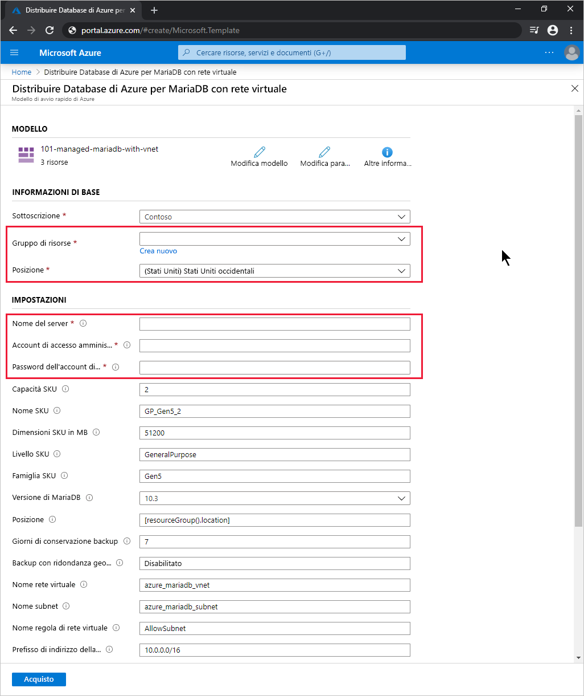

# <a name="quickstart-use-a-resource-manager-template-to-create-an-azure-database-for-mariadb-server"></a>Avvio rapido: Usare un modello di Resource Manager per creare un server di Database di Azure per MariaDB

Database di Azure per MariaDB è un servizio gestito che consente di eseguire, gestire e ridimensionare database MariaDB a disponibilità elevata nel cloud. In questo argomento di Avvio rapido si userà un modello di Resource Manager per creare un server di Database di Azure per MariaDB nel portale di Azure, in PowerShell o nell'interfaccia della riga di comando di Azure.

[!INCLUDE [About Azure Resource Manager](../../includes/resource-manager-quickstart-introduction.md)]

## <a name="prerequisites"></a>Prerequisiti

# <a name="portal"></a>[Portale](#tab/azure-portal)

Un account Azure con una sottoscrizione attiva. [È possibile crearne uno gratuitamente](https://azure.microsoft.com/free/).

# <a name="powershell"></a>[PowerShell](#tab/PowerShell)

* Un account Azure con una sottoscrizione attiva. [È possibile crearne uno gratuitamente](https://azure.microsoft.com/free/).
* Per eseguire il codice in locale, [Azure PowerShell](/powershell/azure/).

# <a name="cli"></a>[CLI](#tab/CLI)

* Un account Azure con una sottoscrizione attiva. [È possibile crearne uno gratuitamente](https://azure.microsoft.com/free/).
* Per eseguire il codice in locale, [interfaccia della riga di comando di Azure](/cli/azure/).

---

## <a name="create-an-azure-database-for-mariadb-server"></a>Creare un database di Azure per un server MariaDB

Si crea un server di Database di Azure per MariaDB con un set definito di risorse di calcolo e di archiviazione. Per altre informazioni, vedere [Piani tariffari di Database di Azure per MariaDB](concepts-pricing-tiers.md). Il server viene creato all'interno di un [gruppo di risorse di Azure](../azure-resource-manager/management/overview.md).

### <a name="review-the-template"></a>Rivedere il modello

Il modello usato in questo avvio rapido proviene dai [modelli di avvio rapido di Azure](https://azure.microsoft.com/resources/templates/101-managed-mariadb-with-vnet/).

:::code language="json" source="~/quickstart-templates/101-managed-mariadb-with-vnet/azuredeploy.json" range="001-231" highlight="149,162,176,199,213":::

Il modello definisce cinque risorse di Azure:

* [**Microsoft.Network/virtualNetworks**](/azure/templates/microsoft.network/virtualnetworks)
* [**Microsoft.Network/virtualNetworks/subnets**](/azure/templates/microsoft.network/virtualnetworks/subnets)
* [**Microsoft.DBforMariaDB/servers**](/azure/templates/microsoft.dbformariadb/servers)
* [**Microsoft.DBforMariaDB/servers/virtualNetworkRules**](/azure/templates/microsoft.dbformariadb/servers/virtualnetworkrules)
* [**Microsoft.DBforMariaDB/servers/firewallRules**](/azure/templates/microsoft.dbformariadb/servers/firewallrules)

Altri modelli campione di Database di Azure per MariaDB sono disponibili in [Modelli di avvio rapido di Azure](https://azure.microsoft.com/resources/templates/?resourceType=Microsoft.Dbformariadb&pageNumber=1&sort=Popular).

### <a name="deploy-the-template"></a>Distribuire il modello

# <a name="portal"></a>[Portale](#tab/azure-portal)

Selezionare il collegamento seguente per distribuire il modello di server di Database di Azure per MariaDB nel portale di Azure:

[](https://portal.azure.com/#create/Microsoft.Template/uri/https%3a%2f%2fraw.githubusercontent.com%2fAzure%2fazure-quickstart-templates%2fmaster%2f101-managed-mariadb-with-vnet%2fazuredeploy.json)

Nella pagina **Deploy Azure Database for MariaDB with VNet** (Distribuisci Database di Azure per MariaDB con la rete virtuale):

1. In **Gruppo di risorse** selezionare **Crea nuovo**, immettere un nome per il nuovo gruppo di risorse e quindi fare clic su **OK**.

2. Se è stato creato un nuovo gruppo di risorse, selezionare un valore per **Località** per il gruppo di risorse e il nuovo server.

3. Immettere i valori per **Nome server**, **Account di accesso amministratore** e **Password di accesso amministratore**.

    

4. Modificare le altre impostazioni predefinite in base alle esigenze:

    * **Sottoscrizione**: sottoscrizione di Azure da usare per il server.
    * **Capacità SKU**: capacità di vCore, che può essere *2* (impostazione predefinita), *4*, *8*, *16*, *32*o *64*.
    * **Nome SKU**: prefisso del livello SKU, famiglia SKU e capacità dello SKU, uniti da caratteri di sottolineatura, ad esempio *B_Gen5_1*, *GP_Gen5_2* (impostazione predefinita) o *MO_Gen5_32*.
    * **Dimensioni SKU (MB)** : dimensioni di archiviazione in megabyte del server di Database di Azure per MariaDB (impostazione predefinita *51200*).
    * **Livello SKU**: livello di distribuzione, ad esempio *Basic*, *Utilizzo generico* (impostazione predefinita) o *Ottimizzato per la memoria*.
    * **Famiglia SKU**: *Gen4* o *Gen5* (impostazione predefinita), che indica la generazione hardware per la distribuzione del server.
    * **Versione di MariaDB**: versione del server MariaDB da distribuire, ad esempio *10.2* o *10.3* (impostazione predefinita).
    * **Giorni di conservazione backup**: periodo desiderato per la conservazione del backup con ridondanza geografica, in giorni (impostazione predefinita *7*).
    * **Backup con ridondanza geografica**: *Abilitato* o *Disabilitato* (impostazione predefinita), a seconda dei requisiti per il ripristino di emergenza geografico.
    * **Nome rete virtuale**: nome della rete virtuale (impostazione predefinita *azure_mariadb_vnet*).
    * **Nome subnet**: nome della subnet (impostazione predefinita *azure_mariadb_subnet*).
    * **Nome regola di rete virtuale**:nome della regola di rete virtuale che consente la subnet (impostazione predefinita *AllowSubnet*).
    * **Prefisso dell'indirizzo della rete virtuale**: prefisso dell'indirizzo della rete virtuale (impostazione predefinita *10.0.0.0/16*).
    * **Prefisso subnet**: prefisso dell'indirizzo per la subnet (impostazione predefinita *10.0.0.0/16*).

5. Leggere le condizioni, quindi selezionare **Accetto le condizioni riportate sopra**.

6. Selezionare **Acquisto**.

# <a name="powershell"></a>[PowerShell](#tab/PowerShell)

Usare il codice interattivo seguente per creare un nuovo server di Database di Azure per MariaDB usando il modello. Il codice richiede il nome del nuovo server, il nome e la località di un nuovo gruppo di risorse e il nome e la password di un account amministratore.

Per eseguire il codice in Azure Cloud Shell, selezionare **Prova** nell'angolo superiore di qualsiasi blocco di codice.

```azurepowershell-interactive
$serverName = Read-Host -Prompt "Enter a name for the new Azure Database for MariaDB server"
$resourceGroupName = Read-Host -Prompt "Enter a name for the new resource group where the server will exist"
$location = Read-Host -Prompt "Enter an Azure region (for example, centralus) for the resource group"
$adminUser = Read-Host -Prompt "Enter the Azure Database for MariaDB server's administrator account name"
$adminPassword = Read-Host -Prompt "Enter the administrator password" -AsSecureString

New-AzResourceGroup -Name $resourceGroupName -Location $location # Use this command when you need to create a new resource group for your deployment
New-AzResourceGroupDeployment -ResourceGroupName $resourceGroupName `
    -TemplateUri https://raw.githubusercontent.com/Azure/azure-quickstart-templates/master/101-managed-mariadb-with-vnet/azuredeploy.json `
    -serverName $serverName `
    -administratorLogin $adminUser `
    -administratorLoginPassword $adminPassword

Read-Host -Prompt "Press [ENTER] to continue: "
```

# <a name="cli"></a>[CLI](#tab/CLI)

Usare il codice interattivo seguente per creare un nuovo server di Database di Azure per MariaDB usando il modello. Il codice richiede il nome del nuovo server, il nome e la località di un nuovo gruppo di risorse e il nome e la password di un account amministratore.

Per eseguire il codice in Azure Cloud Shell, selezionare **Prova** nell'angolo superiore di qualsiasi blocco di codice.

```azurecli-interactive
read -p "Enter a name for the new Azure Database for MariaDB server:" serverName &&
read -p "Enter a name for the new resource group where the server will exist:" resourceGroupName &&
read -p "Enter an Azure region (for example, centralus) for the resource group:" location &&
read -p "Enter the Azure Database for MariaDB server's administrator account name:" adminUser &&
read -p "Enter the administrator password:" adminPassword &&
params='serverName='$serverName' administratorLogin='$adminUser' administratorLoginPassword='$adminPassword &&
az group create --name $resourceGroupName --location $location &&
az deployment group create --resource-group $resourceGroupName --parameters $params --template-uri https://raw.githubusercontent.com/Azure/azure-quickstart-templates/master/101-managed-mariadb-with-vnet/azuredeploy.json &&
read -p "Press [ENTER] to continue: "
```

---

## <a name="review-deployed-resources"></a>Esaminare le risorse distribuite

# <a name="portal"></a>[Portale](#tab/azure-portal)

Seguire questa procedura per visualizzare una panoramica del nuovo server di Database di Azure per MariaDB:

1. Nel [portale di Azure](https://portal.azure.com) cercare e selezionare **Server database di Azure per MariaDB**.

2. Nell'elenco dei database selezionare il nuovo server. Verrà visualizzata la pagina **Panoramica** per il nuovo server di Database di Azure per MariaDB.

# <a name="powershell"></a>[PowerShell](#tab/PowerShell)

Eseguire il codice interattivo seguente per visualizzare i dettagli del server di Database di Azure per MariaDB. Sarà necessario immettere il nome del nuovo server.

```azurepowershell-interactive
$serverName = Read-Host -Prompt "Enter the name of your Azure Database for MariaDB server"
Get-AzResource -ResourceType "Microsoft.DbForMariaDB/servers" -Name $serverName | ft
Read-Host -Prompt "Press [ENTER] to continue: "
```

# <a name="cli"></a>[CLI](#tab/CLI)

Eseguire il codice interattivo seguente per visualizzare i dettagli del server di Database di Azure per MariaDB. Sarà necessario immettere il nome e il gruppo di risorse del nuovo server.

```azurecli-interactive
read -p "Enter your Azure Database for MariaDB server name: " serverName &&
read -p "Enter the resource group where the Azure Database for MariaDB server exists: " resourcegroupName &&
az resource show --resource-group $resourcegroupName --name $serverName --resource-type "Microsoft.DbForMariaDB/servers" &&
read -p "Press [ENTER] to continue: "
```

---

## <a name="clean-up-resources"></a>Pulire le risorse

Quando non è più necessario, eliminare il gruppo di risorse per eliminare tutte le risorse contenute al suo interno.

# <a name="portal"></a>[Portale](#tab/azure-portal)

1. Nel [portale di Azure](https://portal.azure.com) cercare e selezionare **Gruppi di risorse**.

2. Nell'elenco dei gruppi di risorse scegliere il nome del gruppo di risorse.

3. Nella pagina **Panoramica** del gruppo di risorse selezionare **Elimina gruppo di risorse**.

4. Nella finestra di dialogo di conferma, digitare il nome del gruppo di risorse e quindi selezionare **Elimina**.

# <a name="powershell"></a>[PowerShell](#tab/PowerShell)

```azurepowershell-interactive
$resourceGroupName = Read-Host -Prompt "Enter the Resource Group name"
Remove-AzResourceGroup -Name $resourceGroupName
Read-Host -Prompt "Press [ENTER] to continue: "
```

# <a name="cli"></a>[CLI](#tab/CLI)

```azurecli-interactive
read -p "Enter the Resource Group name: " resourceGroupName &&
az group delete --name $resourceGroupName &&
read -p "Press [ENTER] to continue: "
```

---

## <a name="next-steps"></a>Passaggi successivi

Per un'esercitazione dettagliata che illustra il processo di creazione di un modello, vedere:

> [!div class="nextstepaction"]
> [ Esercitazione: Creare e distribuire il primo modello di Azure Resource Manager](../azure-resource-manager/templates/template-tutorial-create-first-template.md)
