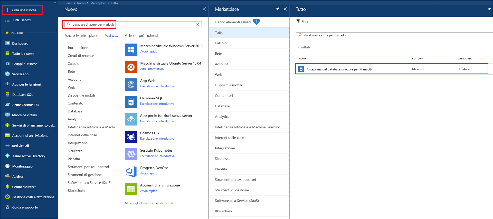
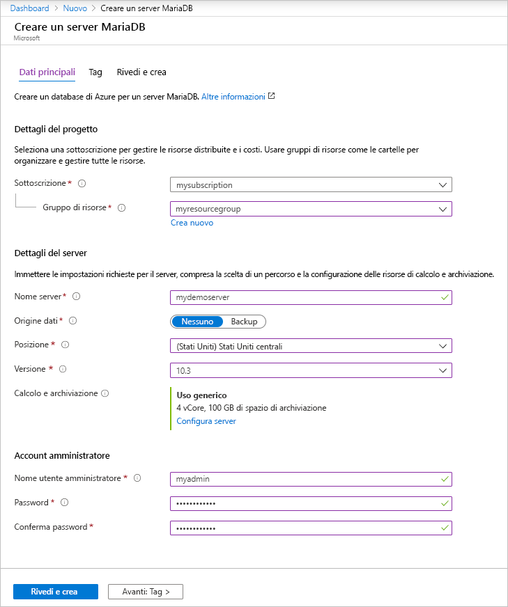
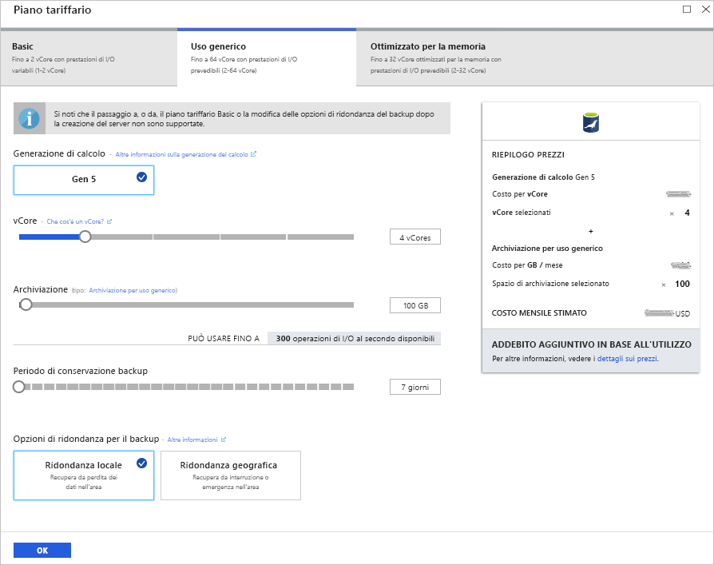
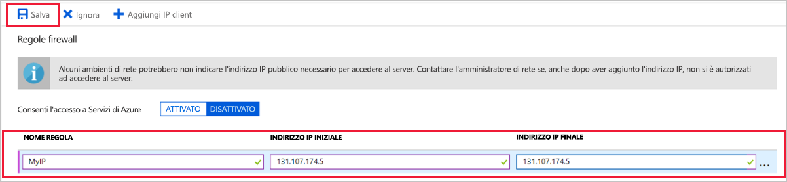
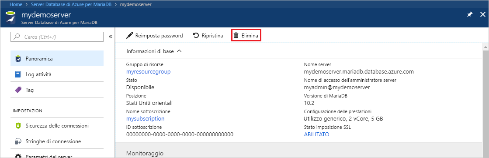

# <a name="quickstart-create-an-azure-database-for-mariadb-server-by-using-the-azure-portal"></a>Avvio rapido: Creare un database di Azure per il server MariaDB con il portale di Azure

Database di Azure per MariaDB è un servizio gestito che è possibile usare per eseguire, gestire e ridimensionare database MariaDB a disponibilità elevata nel cloud. Questa guida introduttiva illustra come creare un server di Database di Azure per MariaDB in circa cinque minuti usando il portale di Azure.  

Se non si ha una sottoscrizione di Azure, creare un [account Azure gratuito](https://azure.microsoft.com/free/) prima di iniziare.

## <a name="sign-in-to-the-azure-portal"></a>Accedere al portale di Azure

Nel Web browser passare al [portale di Azure](https://portal.azure.com/). Immettere le credenziali per accedere al portale. La visualizzazione predefinita è il dashboard del servizio.

## <a name="create-an-azure-database-for-mariadb-server"></a>Creare un database di Azure per un server MariaDB

Si crea un server di Database di Azure per MariaDB con un set definito di [risorse di calcolo e di archiviazione](concepts-pricing-tiers.md). Il server viene creato all'interno di un [gruppo di risorse di Azure](../azure-resource-manager/resource-group-overview.md).

Per creare un server di Database di Azure per MariaDB:

1. Selezionare il pulsante **Crea una risorsa** (+) nell'angolo superiore sinistro del portale.

2. Digitare **Database di Azure per MariaDB** nella casella di ricerca per trovare il servizio.

   

3. Immettere o selezionare i dettagli del server seguenti:
   
   

    Impostazione | Valore consigliato | Descrizione
    ---|---|---
    Nome server | *Nome server univoco* | Scegliere un nome univoco per identificare il database di Azure per il server MariaDB. Ad esempio, **mydemoserver**. Al nome del server specificato viene aggiunto il nome di dominio *.mariadb.database.azure.com*. Il nome del server può contenere solo lettere minuscole, numeri e il segno meno (-) Deve contenere tra 3 e 63 caratteri.
    Sottoscrizione | *sottoscrizione in uso* | Selezionare la sottoscrizione di Azure da usare per il server. Se si hanno più sottoscrizioni, scegliere quella in cui viene fatturata la risorsa.
    Gruppo di risorse | **myresourcegroup** | Immettere il nome di un nuovo gruppo di risorse o selezionare un gruppo di risorse esistente. 
    Selezionare l'origine | **Vuoto** | Selezionare **Vuoto** per creare un nuovo server da zero. Selezionare **Backup** se si sta creando un server da un backup geografico di un server di Database di Azure per MariaDB esistente.
    Accesso amministratore server | **myadmin** | Account di accesso da usare per la connessione al server. Il nome di accesso dell'amministratore non può essere **azure_superuser**, **admin**, **administrator**, **root**, **guest** o **public**.
    Password | *A scelta dell'utente* | Immettere una nuova password per l'account dell'amministratore del server. Deve contenere tra 8 e 128 caratteri. La password deve contenere caratteri di tre delle categorie seguenti: lettere maiuscole, lettere minuscole, numeri (0-9) e caratteri non alfanumerici (!, $, #, % e così via).
    Conferma password | *A scelta dell'utente*| Confermare la password dell'account amministratore.
    Località | *Area più vicina ai propri utenti*| Scegliere la località più vicina agli utenti o alle altre applicazioni Azure.
    Versione | *Ultima versione*| Ultima versione, a meno che non si abbiano requisiti specifici per cui deve esserne usata un'altra.
    Piano tariffario | Vedere la descrizione. | Configurazioni di calcolo, archiviazione e backup per il nuovo server. Selezionare **Piano tariffario** > **Utilizzo generico**. Mantenere i valori predefiniti per le impostazioni seguenti:<br><ul><li>**Generazione di calcolo** (Generazione 5)</li><li>**vCore** (2 vCore)</li><li>**Archiviazione** (5 GB)</li><li>**Periodo di conservazione backup** (7 giorni)</li></ul><br>Per abilitare l'archiviazione con ridondanza geografica dei backup del server, in **Opzioni di ridondanza per il backup** selezionare **Con ridondanza geografica**. <br><br>Per salvare la selezione del piano tariffario, selezionare **OK**. Lo screenshot successivo mostra queste selezioni.
  
   > [!NOTE]
   > È consigliabile usare il piano tariffario Basic se le esigenze di calcolo e di prestazioni I/O sono adeguate per il carico di lavoro. Si noti che i server creati nel piano tariffario Basic non possono essere scalati in un secondo momento per utilizzo generico o ottimizzati per la memoria. Per altre informazioni, vedere la [pagina dei prezzi](https://azure.microsoft.com/pricing/details/mariadb/).
   > 

   

4.  Selezionare **Crea** per effettuare il provisioning del server. Il provisioning può richiedere fino a 20 minuti.
   
5.  Per monitorare il processo di distribuzione, selezionare **Notifiche** sulla barra degli strumenti (icona a forma di campana).
   
Per impostazione predefinita, vengono creati i database seguenti nel server: **information_schema**, **mysql**, **performance_schema** e **sys**.


## <a name="configure-firewall-rule"></a>Configurare una regola del firewall a livello di server

Il servizio Database di Azure per MariaDB crea un firewall a livello di server, Il firewall impedisce alle applicazioni e agli strumenti esterni di connettersi al server o ai database nel server, a meno che non venga creata una regola del firewall per aprire il firewall per indirizzi IP specifici. 

Per creare una regola del firewall a livello di server:

1. Al termine della distribuzione, individuare il server. Se necessario, è possibile eseguire una ricerca. Ad esempio, nel menu a sinistra selezionare **Tutte le risorse**. Quindi, immettere il nome del server. Ad esempio, immettere **mydemoserver** per cercare il server appena creato. Selezionare il nome del server nell'elenco dei risultati della ricerca. Si apre la pagina **Panoramica** del server in questione. In questa pagina è possibile modificare impostazioni aggiuntive.

2. Nella pagina di panoramica del server selezionare **Sicurezza connessione**.

3. In **Regole del firewall** selezionare la casella di testo vuota nella colonna **Nome regola** per iniziare a creare la regola del firewall. Specificare l'intervallo IP preciso dei client che si connetteranno a questo server.
   
   

4. Sulla barra degli strumenti superiore della pagina **Sicurezza connessione** selezionare **Salva**. Prima di continuare, attendere che venga visualizzata la notifica che informa che l'aggiornamento è stato completato. 

   > [!NOTE]
   > Le connessioni al database di Azure per MariaDB comunicano sulla porta 3306. Se si prova a connettersi dall'interno di una rete aziendale, il traffico in uscita sulla porta 3306 potrebbe non essere consentito. In questo caso, per connettersi al server il reparto IT deve aprire la porta 3306.
   > 

## <a name="get-connection-information"></a>Ottenere informazioni di connessione

Per connettersi al server di database, è necessario il nome del server completo e le credenziali di accesso amministratore. È possibile che si sia preso nota di questi valori in precedenza in questo articolo. In caso contrario, è possibile trovare facilmente il nome del server e le informazioni di accesso nella pagina **Proprietà** o nella pagina **Panoramica** del server nel portale di Azure:

1. Passare alla pagina **Panoramica** del server. Prendere nota dei valori per **Nome server** e **Nome di accesso dell'amministratore server**. 

2. Per copiare i valori, posizionare il cursore sul campo da copiare. A destra del testo compare l'icona di copia. Selezionare l'icona di copia necessaria per copiare i valori.

In questo esempio, il nome del server è **mydemoserver.mariadb.database.azure.com** e il nome di accesso dell'amministratore server è **myadmin\@mydemoserver**.

## <a name="connect-to-azure-database-for-mariadb-by-using-the-mysql-command-line"></a>Connettersi al server di Database di Azure per MariaDB usando la riga di comando mysql

Per connettersi al server di Database di Azure per MariaDB è possibile usare diverse applicazioni.

Prima di tutto verrà usato lo strumento da riga di comando [mysql](https://dev.mysql.com/doc/refman/5.7/en/mysql.html) per illustrare la connessione al server. È anche possibile usare un Web browser e Azure Cloud Shell senza installare software. È possibile connettersi anche dall'utilità mysql eventualmente installata in locale.

1. Avviare Azure Cloud Shell tramite l'icona del terminale (**>_**) sulla barra degli strumenti in alto a destra del portale di Azure.
   

2. Azure Cloud Shell si apre nel browser. In Cloud Shell è quindi possibile digitare i comandi della shell Bash.

   

3. Al prompt di Cloud Shell connettersi al server di Database di Azure per MariaDB digitando la riga di comando mysql.

    Per connettersi a un server di Database di Azure per MariaDB con l'utilità mysql, usare il formato seguente:

    ```bash
    mysql --host <fully qualified server name> --user <server admin login name>@<server name> -p
    ```

    Ad esempio, il comando seguente stabilisce la connessione al server di esempio:

    ```azurecli-interactive
    mysql --host mydemoserver.mariadb.database.azure.com --user myadmin@mydemoserver -p
    ```

    Parametro di mysql |Valore consigliato|Descrizione
    ---|---|---
    --host | *nome del server* | Valore del nome del server usato per creare il server di Database di Azure per MariaDB. Il server dell'esempio è **mydemoserver.mariadb.database.azure.com**. Usare il nome di dominio completo (**\*.mariadb.database.azure.com**) come illustrato nell'esempio. Se non si ricorda il nome del server, completare la procedura descritta nella sezione precedente per ottenere le informazioni di connessione.
    --user | *nome di accesso amministratore server* |Valore del nome di accesso dell'amministratore server usato per creare il server di Database di Azure per MariaDB. Se non si ricorda il nome utente, completare la procedura descritta nella sezione precedente per ottenere le informazioni di connessione. Il formato è *nome utente\@nome server*.
    -p | *password*<br>(attendere finché non viene richiesta) |Quando richiesto, immettere la password usata per creare il server. I caratteri della password digitati non vengono visualizzati nel prompt di Bash durante la digitazione. Dopo aver immesso la password, premere INVIO.

   Quando l'utilità mysql è connessa, viene visualizzato un prompt `mysql>`. Nel prompt è possibile immettere comandi. 

   Ecco un esempio di output mysql:

    ```bash
    Welcome to the MySQL monitor.  Commands end with ; or \g.
    Your MySQL connection id is 65505
    Server version: 5.6.39.0 MariaDB Server
    
    Copyright (c) 2000, 2017, Oracle and/or its affiliates. All rights reserved.
    
    Oracle is a registered trademark of Oracle Corporation and/or its
    affiliates. Other names may be trademarks of their respective
    owners.

    Type 'help;' or '\h' for help. Type '\c' to clear the current input statement.
    
    mysql>
    ```
    
    > [!TIP]
    > Se il firewall non è configurato per consentire l'indirizzo IP di Azure Cloud Shell, verrà visualizzato l'errore seguente:
    >
    >   ERRORE 2003 (28000): Al client con indirizzo IP 123.456.789.0 non è consentito l'accesso al server.
    >
    > Per risolvere l'errore, assicurarsi che la configurazione del server corrisponda alla procedura illustrata nella sezione [Configurare una regola del firewall a livello di server](#configure-firewall-rule).

4. Per verificare la connessione, digitare **status** nel prompt `mysql>` per controllare lo stato del server.

    ```sql
    status
    ```

   > [!TIP]
   > Per altri comandi, vedere il capitolo 4.5.1 di [MySQL 5.7 Reference Manual](https://dev.mysql.com/doc/refman/5.7/en/mysql.html) (Manuale di riferimento di MySQL 5.7).

5. Creare un database vuoto al prompt `mysql>` digitando il comando seguente:

   ```sql
   CREATE DATABASE quickstartdb;
   ```
   Il completamento del comando può richiedere alcuni minuti. 

   In un server di Database di Azure per MariaDB è possibile creare uno o più database. Si può creare un singolo database per ogni server per usare tutte le risorse o creare più database per condividere le risorse. Il numero di database che è possibile creare è illimitato, ma più database condividono le stesse risorse del server. 

6. Per elencare i database, al prompt `mysql>` digitare il comando seguente:

    ```sql
    SHOW DATABASES;
    ```

7. Digitare **\q** e quindi premere INVIO per chiudere lo strumento mysql. È quindi possibile chiudere Azure Cloud Shell.

Si è stabilita la connessione al server di Database di Azure per MariaDB e si è creato un database utente vuoto. Nella prossima sezione viene stabilita la connessione allo stesso server usando un altro strumento comune, MySQL Workbench.

## <a name="connect-to-the-server-by-using-mysql-workbench"></a>Connettersi al server con MySQL Workbench

Per connettersi al server usando MySQL Workbench:

1. Aprire MySQL Workbench nel computer client. Per scaricare e installare MySQL Workbench, passare alla pagina [Download MySQL Workbench](https://dev.mysql.com/downloads/workbench/) (Scaricare MySQL Workbench).

2. Per creare una nuova connessione, selezionare l'icona del segno più (**+**) accanto all'intestazione **MySQL Connections** (Connessioni MySQL).

3. Nella finestra di dialogo **Setup New Connection** (Configura nuova connessione) immettere le informazioni di connessione server nella scheda **Parameters** (Parametri). I valori segnaposto sono visualizzati a titolo di esempio. Sostituire **Hostname** (Nome host), **Username** (Nome utente) e **Password** con valori personalizzati.

   

    |Impostazione |Valore consigliato|Descrizione campo|
    |---|---|---|
     Nome connessione | **Demo Connection** | Etichetta per la connessione. |
    Connection Method (Metodo di connessione) | **Standard (TCP/IP)** | Standard (TCP/IP) è sufficiente. |
    Nome host | *nome del server* | Valore del nome del server usato per creare il server di Database di Azure per MariaDB. Il server dell'esempio è **mydemoserver.mariadb.database.azure.com**. Usare il nome di dominio completo (**\*.mariadb.database.azure.com**) come illustrato nell'esempio. Se non si ricorda il nome del server, completare i passaggi descritti in precedenza in questo articolo per ottenere le informazioni di connessione.|
     Porta | 3306 | Porta da usare per la connessione al server di Database di Azure per MariaDB. |
    Username |  *nome di accesso amministratore server* | Informazioni di accesso dell'amministratore server usate per creare il server di Database di Azure per MariaDB. Il nome utente di esempio è **myadmin\@mydemoserver**. Se non si ricorda il nome utente, completare i passaggi descritti in precedenza in questo articolo per ottenere le informazioni di connessione. Il formato è *nome utente\@nome server*.
    Password | *password* | Per salvare la password, selezionare **Store in Vault** (Archivia nell'insieme di credenziali). |

4. Per verificare che tutti i parametri siano configurati correttamente, selezionare **Test Connection** (Test connessione). Selezionare quindi **OK** per salvare la connessione. 

    > [!NOTE]
    > SSL viene applicato per impostazione predefinita nel server. Per completare correttamente la connessione richiede una configurazione aggiuntiva. Per altre informazioni, vedere [Configurare la connettività SSL nell'applicazione per la connessione sicura a Database di Azure per MariaDB](./howto-configure-ssl.md). Per disabilitare SSL per questa guida introduttiva, nella pagina di panoramica del server nel portale di Azure selezionare **Sicurezza connessione** nel menu. Per **Imponi connessione SSL** selezionare **Disabilitato**.
    >

## <a name="clean-up-resources"></a>Pulire le risorse

È possibile eseguire la pulizia delle risorse create nel corso della guida introduttiva in due modi. Si può eliminare il [gruppo di risorse Azure](../azure-resource-manager/resource-group-overview.md). In questo modo vengono eliminate tutte le risorse nel gruppo di risorse. Se invece si vogliono mantenere intatte le altre risorse, eliminare solo la risorsa server.

> [!TIP]
> Altre guide introduttive della raccolta si basano su questa. Se si intende continuare a usare le guide introduttive di Database di Azure per MariaDB, non eseguire la pulizia delle risorse create in questa. Se non si intende continuare, usare la procedura seguente per eliminare tutte le risorse create in questa guida introduttiva.
>

Per eliminare l'intero gruppo di risorse, incluso il server appena creato:

1.  Individuare il gruppo di risorse nel portale di Azure. Scegliere **Gruppi di risorse** dal menu a sinistra e quindi selezionare il nome del gruppo di risorse, che in questo esempio è **myresourcegroup**.

2.  Nella pagina del gruppo di risorse selezionare **Elimina**. Quindi, immettere nella casella di testo il nome del gruppo di risorse, che in questo esempio è **myresourcegroup**, per confermare l'eliminazione. Selezionare **Elimina**.

Per eliminare solo il server appena creato:

1. Individuare il server nel portale di Azure, se non è già aperto. Nel menu a sinistra selezionare **Tutte le risorse**. Cercare quindi il server creato.

2. Nella pagina **Panoramica** selezionare **Elimina**. 

   

3. Confermare il nome del server da eliminare. Visualizzare i database sottostanti interessati dall'eliminazione. Immettere il nome del server, che in questo esempio è **mydemoserver**, per confermare l'eliminazione. Selezionare **Elimina**.

## <a name="next-steps"></a>Passaggi successivi

- [Progettare il primo database di Azure per il database MariaDB](./tutorial-design-database-using-portal.md)
