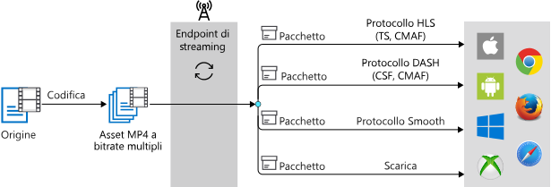

# Codifica con Servizi multimediali

Servizi multimediali di Azure consente di codificare i file multimediali digitali di alta qualità in file MP4 a bitrate adattivo in modo che i contenuti possono essere riprodotti su un'ampia gamma di browser e dispositivi. Un processo di codifica di servizi multimediali ha esito positivo viene creato un output Asset con un set di velocità in bit adattiva MP4s e streaming i file di configurazione. I file di configurazione includono ISM, con estensione ismc, .mpi e altri file che non deve essere modificato. Al termine il processo di codifica, è possibile sfruttare [creazione dinamica dei pacchetti](dynamic-packaging-overview.md) e avviare lo streaming.

Per rendere i video nell'output di Asset disponibili per i client per la riproduzione, è necessario creare un **localizzatore di Streaming** e creare URL di streaming. Quindi, in base al formato specificato nel manifesto, il client ricevano il flusso nel protocollo prescelto.

Il diagramma seguente illustra lo streaming on demand con flusso di lavoro di creazione dinamica dei pacchetti.

Questo argomento contiene indicazioni su come codificare il contenuto con Servizi multimediali v3.

## Trasformazioni e processi

Per eseguire la codifica con Servizi multimediali v3, è necessario creare una [trasformazione](https://docs.microsoft.com/rest/api/media/transforms) e un [processo](https://docs.microsoft.com/rest/api/media/jobs). Una trasformazione definisce la serie di istruzioni per le impostazioni di codifica e gli output e il processo è un'istanza della serie di istruzioni. Per altre informazioni, vedere [Trasformazioni e processi](transforms-jobs-concept.md)

Durante la codifica con Servizi multimediali si usano set di impostazioni per indicare al codificatore come elaborare i file multimediali di input. Ad esempio, è possibile specificare la risoluzione video e/o il numero di canali audio desiderati nel contenuto codificato. 

Si può iniziare rapidamente con uno dei set di impostazioni predefiniti basati sulle procedure consigliate del settore oppure si può compilare un set di impostazioni personalizzato per i requisiti di uno specifico scenario o dispositivo. Per altre informazioni, vedere l'articolo sulla [codifica con una trasformazione personalizzata](customize-encoder-presets-how-to.md). 

A partire da gennaio 2019, durante la codifica con Media Encoder Standard per produrre file MP4, un nuovo file con estensione mpi viene generato e aggiunto all'asset di output. Questo file MPI è progettato per migliorare le prestazioni per scenari di [creazione dinamica dei pacchetti](dynamic-packaging-overview.md) e streaming.

> [!NOTE]
> Non è consigliabile modificare o rimuovere il file MPI né creare dipendenze nel proprio servizio sull'esistenza o meno di tale file.

## Set di impostazioni predefiniti

Attualmente Servizi multimediali supporta i set di impostazioni di codifica predefiniti seguenti:  

### Set di impostazioni BuiltInStandardEncoderPreset

[BuiltInStandardEncoderPreset](https://docs.microsoft.com/rest/api/media/transforms/createorupdate#builtinstandardencoderpreset) viene usato per configurare un set di impostazioni predefinito per la codifica del video di input con il codificatore Standard. 

Attualmente sono supportati i set di impostazioni seguenti:

- **EncoderNamedPreset.AACGoodQualityAudio**: genera un singolo file MP4 contenente solo audio stereo con codifica a 192 kbps.
- **EncoderNamedPreset.AdaptiveStreaming** (scelta consigliata). Per altre informazioni, vedere [Codificare con una tabella di coppie velocità in bit-risoluzione generata automaticamente](autogen-bitrate-ladder.md).
- **EncoderNamedPreset.ContentAwareEncodingExperimental** -espone un set di impostazioni sperimentale per la codifica compatibile con il contenuto. Dato qualsiasi contenuto di input, il servizio tenta di determinare automaticamente il numero ottimale di livelli, con velocità in bit appropriati e le impostazioni di risoluzione per il recapito per lo streaming adattivo. Gli algoritmi sottostanti continuerà a evolversi nel tempo. L'output conterrà file MP4 con video e audio con interfogliati. Per altre informazioni, vedere [sperimentale set di impostazioni per la codifica compatibile con contenuto](cae-experimental.md).
- **EncoderNamedPreset.H264MultipleBitrate1080p**: genera un set di 8 file MP4 con audio AAC stereo e allineamento GOP, con velocità compresa fra 6000 e 400 kbps. La risoluzione parte da 1080p e può scendere fino a 360p.
- **EncoderNamedPreset.H264MultipleBitrate720p**: genera un set di 6 file MP4 con audio AAC stereo e allineamento GOP, con velocità compresa fra 3400 e 400 kbps. La risoluzione parte da 720p e può scendere fino a 360p.
- **EncoderNamedPreset.H264MultipleBitrateSD**: genera un set di 5 file MP4 con audio AAC stereo e allineamento GOP, con velocità compresa fra 1600 e 400 kbps. La risoluzione parte da 480p e può scendere fino a 360p.
- **EncoderNamedPreset.H264SingleBitrate1080p** -genera un file MP4 in cui il video è codificato con codec H.264 a 6750 kbps e un'altezza immagine di 1080 pixel e l'audio stereo è codificato con codec AAC-LC a 64 kbps.
- **EncoderNamedPreset.H264SingleBitrate720p** -genera un file MP4 in cui il video è codificato con codec H.264 a 4500 kbps e un'altezza immagine pari a 720 pixel e l'audio stereo è codificato con codec AAC-LC a 64 kbps.
- **EncoderNamedPreset.H264SingleBitrateSD** -genera un file MP4 in cui il video è codificato con codec H.264 a 2200 kbps e un'altezza immagine di 480 pixel e l'audio stereo è codificato con codec AAC-LC a 64 kbps.

Per visualizzare l'elenco di set di impostazioni più aggiornata, vedere [predefiniti incorporati da utilizzare per la codifica video](https://docs.microsoft.com/rest/api/media/transforms/createorupdate#encodernamedpreset).

Per vedere come vengono usati i set di impostazioni, consultare [caricamento, codifica e streaming di file](stream-files-tutorial-with-api.md).

### Set di impostazioni StandardEncoderPreset

[StandardEncoderPreset](https://docs.microsoft.com/rest/api/media/transforms/createorupdate#standardencoderpreset) descrive le impostazioni da usare per la codifica del video di input con il codificatore Standard. Usare questo set di impostazioni quando si personalizzano i set di impostazioni di trasformazione. 

#### Considerazioni

Durante la creazione di set di impostazioni personalizzati, si applicano le considerazioni seguenti:

- Tutti i valori per l'altezza e larghezza su contenuto AVC devono essere un multiplo di 4.
- In servizi multimediali di Azure v3, tutte le velocità in bit di codifica sono in bit al secondo. Ciò è diverso dal set di impostazioni con le nostre API v2, che usato kilobit al secondo come unità. Ad esempio, se la velocità in bit nella versione 2 è stato specificato come 128 (kilobit/sec), in v3 valore potrebbe essere impostato su 128000 (bit/sec).

#### Esempi

Servizi multimediali supporta in modo completo la personalizzazione di tutti i valori nei set di impostazioni per soddisfare le esigenze e i requisiti di codifica specifici. Per esempi che illustrano come personalizzare i set di impostazioni del codificatore, vedere:

- [Personalizzare i set di impostazioni con .NET](customize-encoder-presets-how-to.md)
- [Personalizzare i set di impostazioni con CLI](custom-preset-cli-howto.md)
- [Personalizzare i set di impostazioni con REST](custom-preset-rest-howto.md)

## Ridimensionamento della codifica nella versione v3

Per ridimensionare l'elaborazione multimediale, vedere [scalabilità con CLI](media-reserved-units-cli-how-to.md).

## Fornire commenti e suggerimenti

Consultare l'articolo [Community di Servizi multimediali di Azure](media-services-community.md) per esaminare i diversi modi in cui è possibile porre domande, fornire feedback e ottenere aggiornamenti su Servizi multimediali.

## Passaggi successivi

* [Eseguire la codifica da un URL HTTPS usando i set di impostazioni predefinite](job-input-from-http-how-to.md)
* [Codificare un file locale usando i set di impostazioni predefinite](job-input-from-local-file-how-to.md)
* [Creare un set di impostazioni per i requisiti specifici di uno scenario o un dispositivo di destinazione personalizzato](customize-encoder-presets-how-to.md)
* [Eseguire il caricamento, la codifica e lo streaming con Servizi multimediali](stream-files-tutorial-with-api.md)
