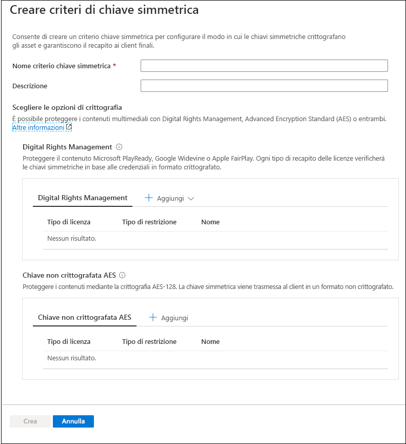
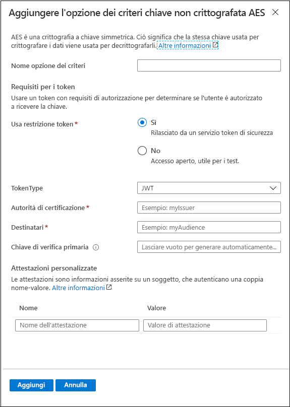
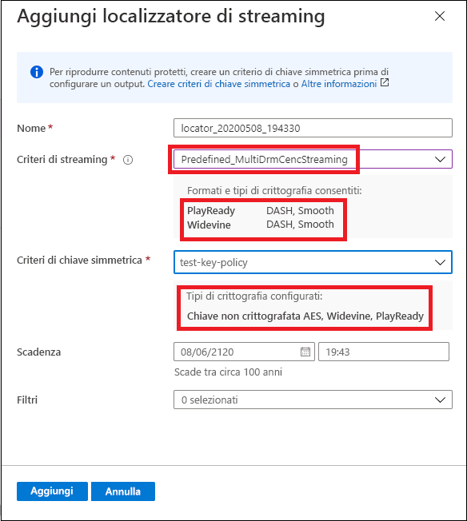

# Avvio rapido: Usare il portale per crittografare contenuto

[!INCLUDE [media services api v3 logo](./includes/v3-hr.md)]

Usare Servizi multimediali di Azure per proteggere i file multimediali dal momento in cui escono dal computer fino alle fasi di archiviazione, elaborazione e recapito. Con Servizi multimediali è possibile distribuire contenuti live e on demand crittografati dinamicamente con AES-128 (Advanced Encryption Standard) o con uno dei principali sistemi DRM (Digital Rights Management): Microsoft PlayReady, Google Widevine e Apple FairPlay. Servizi multimediali offre anche un servizio per la distribuzione di chiavi AES e licenze DRM (PlayReady, Widevine e FairPlay) ai client autorizzati. 
 
Per specificare le eventuali opzioni di crittografia nel flusso, occorre usare i **criteri di streaming** e associarli al localizzatore di streaming. Si devono creare i **criteri chiave simmetrica** per configurare il modo in cui la chiave simmetrica (che fornisce l'accesso sicuro gli **asset**) viene recapitata ai client finali. È necessario impostare i requisiti (restrizioni) sui criteri chiave simmetrica che devono essere soddisfatti affinché le chiavi con la configurazione specificata possano essere recapitate ai client. 

> [!NOTE]
> I criteri chiave simmetrica non sono necessari per lo streaming non crittografato o il download.

Quando un flusso viene richiesto da un lettore, Servizi multimediali usa la chiave specificata per crittografare dinamicamente i contenuti mediante la chiave non crittografata AES o la crittografia DRM. Per decrittografare il flusso, il lettore richiede la chiave dal servizio di distribuzione delle chiavi di Servizi multimediali o il servizio di distribuzione delle chiavi specificato. Per decidere se l'utente è autorizzato a ottenere la chiave, il servizio valuta i **criteri chiave simmetrica** specificati per tale chiave.

Questo argomento di avvio rapido illustra come creare un criterio chiave simmetrica in cui si specifica il tipo di crittografia da applicare all'asset quando questo viene trasmesso in streaming. Spiega anche come impostare la crittografia configurata nell'asset.

### Letture consigliate

* [Crittografia dinamica e distribuzione delle chiavi](content-protection-overview.md)
* [Localizzatori di streaming](streaming-locators-concept.md)
* [Criteri di streaming](streaming-policy-concept.md)
* [Criteri chiave simmetrica](content-key-policy-concept.md)

## Prerequisiti

Caricare ed elaborare il contenuto come descritto in [Caricamento, codifica e streaming di contenuto con il portale](manage-assets-quickstart.md)

## Creare i criteri chiave simmetrica

Creare i **criteri chiave simmetrica** per configurare il modo in cui la chiave simmetrica (che fornisce l'accesso sicuro gli **asset**) viene recapitata ai client finali.

1. Accedere al [portale di Azure](https://portal.azure.com/).
1. Individuare e selezionare l'account di Servizi multimediali.
1. Selezionare **Criteri chiave simmetrica (novità)** .
1. Selezionare **+ Aggiungi criterio chiave simmetrica** nella parte superiore della finestra. 

Viene visualizzata la finestra **Crea criterio chiave simmetrica**. In questa finestra selezionare le opzioni di crittografia. È possibile scegliere di proteggere i contenuti multimediali con Digital Rights Management, Advanced Encryption Standard (AES) o entrambi.  

Sia che si scelga una delle opzioni Digital Rights Management o una chiave non crittografata AES-128, verrà consigliato di specificare come si vogliono configurare le restrizioni. È possibile scegliere una restrizione aperta o relativa al token. Per una spiegazione dettagliata, vedere [Controllo dell'accesso ai contenuti](content-protection-overview.md#controlling-content-access).

### Aggiungere una chiave simmetrica Digital Rights Management

È possibile scegliere di proteggere il contenuto con Microsoft PlayReady e/o Google Widevine o Apple FairPlay. Ogni tipo di recapito delle licenze verificherà le chiavi simmetriche in base alle credenziali in formato crittografato.

#### Modelli di licenza

Per informazioni dettagliate sui modelli di licenza, vedere:

* [Modello di licenza di Google Widevine](widevine-license-template-overview.md)

    > [!NOTE]
    > È possibile creare un modello di licenza vuoto senza alcun valore, semplicemente "{}". Quindi viene creato un modello di licenza con le impostazioni predefinite. Il valore predefinito funziona nella maggior parte dei casi.
* [Configurazione e requisiti della licenza Apple FairPlay](fairplay-license-overview.md)
* [Modello di licenza PlayReady](playready-license-template-overview.md)

### Aggiungere una chiave non crittografata AES

È anche possibile aggiungere la crittografia con chiave non crittografata AES-128 al contenuto. La chiave simmetrica viene trasmessa al client in un formato non crittografato.

## Creare un localizzatore di streaming per l'asset

1. Individuare e selezionare l'account di Servizi multimediali.
1. Selezionare **Asset (novità)** .
1. Nell'elenco degli asset selezionare quello che si vuole crittografare.  
1. Nella sezione **Localizzatore di streaming** relativa all'asset selezionato scegliere **+ Aggiungi localizzatore di streaming**. 
1. Selezionare un **criterio di streaming** appropriato per i **criteri chiave simmetrica** configurati.

    L'argomento [Criteri di streaming](streaming-policy-concept.md) fornisce informazioni dettagliate sui criteri di streaming corrispondenti ai criteri chiave simmetrica.
1. Dopo aver selezionato i criteri di streaming appropriati, è possibile selezionare i criteri chiave simmetrica dall'elenco a discesa.
1. Scegliere **Aggiungi** per aggiungere il localizzatore di streaming all'asset.

    L'asset viene pubblicato e vengono generati gli URL di streaming.

## Risorse di pulizia

Se si prevede di provare gli altri avvii rapidi, è necessario mantenere le risorse create. In caso contrario, passare al portale di Azure, passare ai gruppi di risorse, selezionare il gruppo di risorse in cui è stato eseguito l'avvio rapido ed eliminare tutte le risorse.

## Passaggi successivi

[Gestire le risorse](manage-assets-quickstart.md)
