# Creare un evento di streaming live di Servizi multimediali di Azure

[!INCLUDE [media services api v3 logo](./includes/v3-hr.md)]

Questo argomento di avvio rapido consente di creare un evento di streaming live di Servizi multimediali di Azure con il portale di Azure e Telestream Wirecast. Si presuppone che si abbia una sottoscrizione di Azure e che sia stato creato un account di Servizi multimediali di Azure.

Se non si ha una sottoscrizione di Azure, creare un [account gratuito](https://azure.microsoft.com/free/) prima di iniziare.

## Accedere al portale di Azure

Aprire il Web browser e passare al [portale di Microsoft Azure](https://portal.azure.com/). Immettere le credenziali per accedere al portale. La visualizzazione predefinita è il dashboard del servizio.

In questo argomento di avvio rapido verrà illustrato come:

- Configurare un codificatore locale con una versione di valutazione gratuita di Telestream Wirecast.
- Configurare un evento di streaming live.
- Configurare gli output dell'evento di streaming live.
- Eseguire un endpoint di streaming predefinito.
- Usare Azure Media Player per visualizzare l'evento di streaming live e l'output su richiesta.

Per semplicità, si useranno un set di impostazioni di codifica per Servizi multimediali di Azure in Wirecast, la codifica cloud pass-through e RTMP.

## Configurare un codificatore locale con Wirecast

1. Scaricare e installare Wirecast per il sistema operativo in uso sul [sito Web Telestream](https://www.telestream.net).
1. Avviare l'applicazione e usare l'indirizzo di posta elettronica preferito per registrare il prodotto. Tenere aperta l'applicazione.
1. Nel messaggio di posta elettronica ricevuto, verificare il proprio indirizzo. Quindi, verrà avviata la versione di valutazione dell'applicazione.
1. Consigliato: guardare l'esercitazione video nella schermata di apertura dell'applicazione.

## Configurare un evento di streaming live di Servizi multimediali di Azure

1. Passare all'account di Servizi multimediali di Azure all'interno del portale, quindi selezionare **Streaming live** nell'elenco **Servizi multimediali**.

   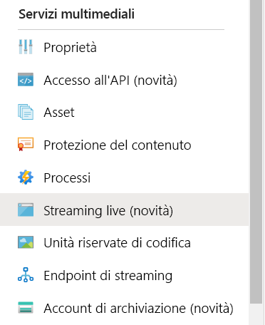
1. Selezionare **Aggiungi evento live** per creare un nuovo evento di streaming live.

   
1. Immettere un nome per il nuovo evento, ad esempio *TestLiveEvent*, nella casella **Nome evento live**.

   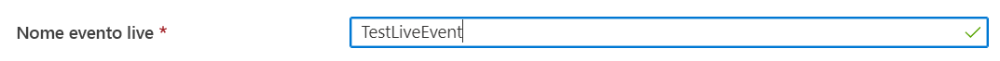
1. Immettere una descrizione facoltativa dell'evento nella casella **Descrizione**.
1. Selezionare l'opzione **Pass-through - nessuna codifica cloud**.

   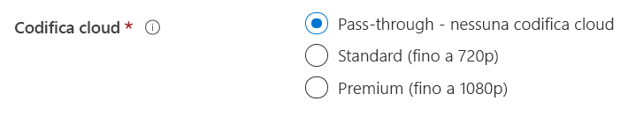
1. Selezionare l'opzione **RTMP**.
1. Assicurarsi che per **Avvia evento live** sia selezionata l'opzione **No**, per evitare di ricevere addebiti per l'evento live prima che sia pronto. La fatturazione inizierà dopo l'avvio dell'evento live.

   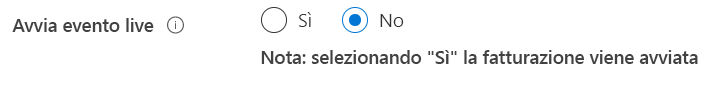
1. Selezionare il pulsante **Rivedi e crea** per rivedere le impostazioni.
1. Selezionare il pulsante **Crea** per creare l'evento live. Verrà visualizzato di nuovo l'elenco di eventi live.
1. Selezionare il collegamento all'evento live appena creato. Si noti che l'evento è stato arrestato.
1. Lasciare aperta questa pagina nel browser. Verrà usato più tardi.

## Configurare un evento di streaming live con Wirecast Studio

1. Nell'applicazione Wirecast scegliere **Create Empty Documento** (Crea documento vuoto) dal menu principale, quindi selezionare **Continua**.

   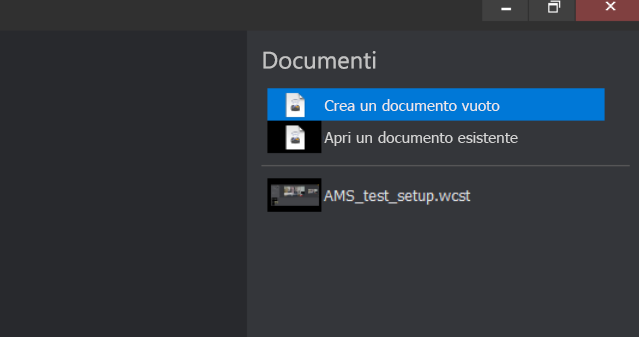
1. Passare il puntatore del mouse sul primo livello nell'area di **livelli Wirecast**.  Selezionare l'icona **Aggiungi** visualizzata e quindi l'input video da trasmettere in streaming.

   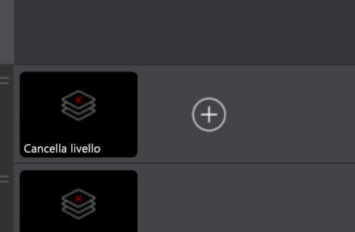

   Viene visualizzata la finestra di dialogo **Master Layer 1** (Livello master 1).
1. Scegliere **Video Capture** (Acquisizione video) dal menu e quindi selezionare la fotocamera da usare.

   

   Nell'area di anteprima viene mostrata la vista della fotocamera.
1. Passare il puntatore del mouse sul secondo livello nell'area di **livelli Wirecast**. Selezionare l'icona **Aggiungi** visualizzata e quindi l'input audio da trasmettere in streaming. Viene visualizzata la finestra di dialogo **Master Layer 2** (Livello master 2).
1. Scegliere **Audio capture** (Acquisizione audio) dal menu e quindi selezionare l'input audio da usare.

   
1. Scegliere **Output settings** (Impostazioni output) dal menu principale. Viene visualizzata la finestra di dialogo **Select an Output Destination** (Seleziona destinazione di output).
1. Selezionare **Servizi multimediali di Azure** nell'elenco a discesa **Destinazione**. Per Servizi multimediali di Azure vengono popolate automaticamente la *maggior parte* delle impostazioni di output.

   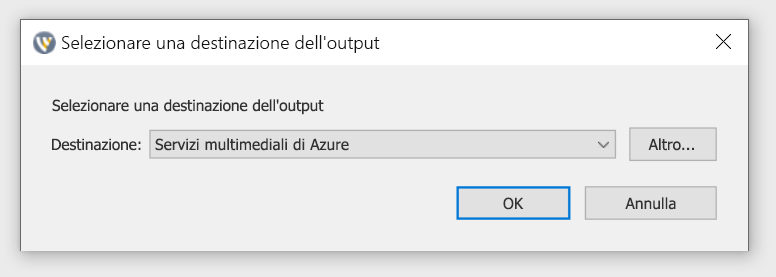

Nella procedura successiva si tornerà in Servizi multimediali di Azure nel browser per copiare l'URL di input da immettere nelle impostazioni di output:

1. Nella pagina Servizi multimediali di Azure del portale selezionare **Avvia** per avviare l'evento di streaming live. La fatturazione inizia in questo momento.

   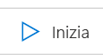
2. Selezionare l'interruttore **Sicuro/Non sicuro** per impostarlo su **Non sicuro**. Questo passaggio imposta il protocollo su RTMP invece che su RTMPS.
3. Copiare l'URL della casella **URL di input** negli Appunti.

   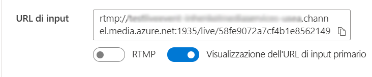
4. Passare all'applicazione Wirecast e incollare l'**URL di input** nel campo **Address** (Indirizzo) delle impostazioni di output.

   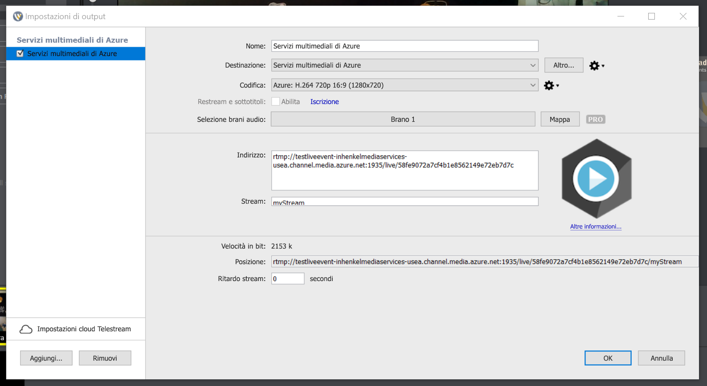
5. Selezionare **OK**.

## Configurare gli output

In questa parte verranno configurati gli output e sarà possibile salvare una registrazione dell'evento di streaming live.  

> [!NOTE]
> Per trasmettere in streaming questo output, è necessario che l'endpoint di streaming sia in esecuzione. Vedere la sezione [Eseguire l'endpoint di streaming predefinito](#run-the-default-streaming-endpoint) più avanti.

1. Selezionare il collegamento **Create outputs** (Crea output) sotto il visualizzatore di video **output**.
1. Se si desidera, modificare il nome dell'output nella casella **Name** (Nome) specificandone uno più intuitivo e facile da trovare in seguito.
   
   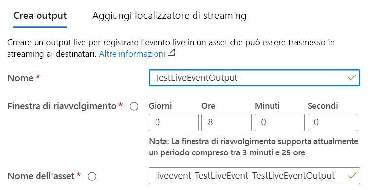
1. Lasciare invariate tutte le restanti caselle per il momento.
1. Selezionare **Avanti** per aggiungere un localizzatore di streaming.
1. Cambiare il nome del localizzatore specificandone uno più intuitivo, se si desidera.
   
   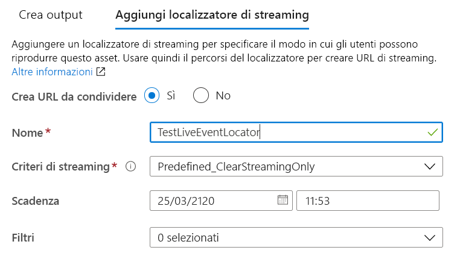
1. Lasciare invariati tutti gli altri campi della schermata per il momento.
1. Selezionare **Create** (Crea).

## Avviare la trasmissione

1. In Wirecast selezionare **Output** > **Start/Stop broadcasting** > **Start Azure Media Services (Output > Avvia/Arresta trasmissione > Avvia Servizi multimediali di Azure): Servizi multimediali di Azure** dal menu principale.

   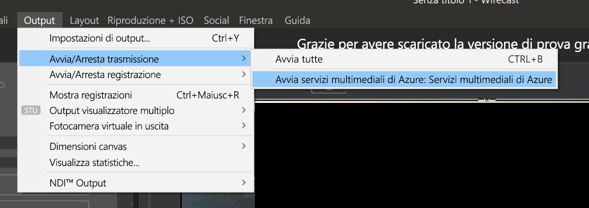

   Una volta inviato lo streaming all'evento live, nel lettore video della pagina dell'evento live in Servizi multimediali di Azure viene visualizzata la finestra **Live** di Wirecast.

1. Selezionare il pulsante **Go** (Vai) sotto la finestra di anteprima per avviare la trasmissione del video e dell'audio selezionati per i livelli di Wirecast.

   

   > [!TIP]
   > Se si verifica un errore, provare a ricaricare il lettore facendo clic sul collegamento **Reload player** (Ricarica lettore).

## Eseguire l'endpoint di streaming predefinito

1. Selezionare **Endpoint di streaming** nell'elenco Servizi multimediali.

   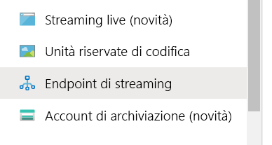
1. Se lo stato dell'endpoint di streaming predefinito è arrestato, selezionarlo. Verrà visualizzata la pagina relativa a questo endpoint.
1. Selezionare **Start**.
   
   

## Riprodurre l'output trasmesso con Azure Media Player

1. Copiare l'URL di streaming sotto il lettore video **Output**.
1. In un Web browser aprire la [demo di Azure Media Player](https://ampdemo.azureedge.net/azuremediaplayer.html).
1. Incollare l'URL di streaming nella casella **URL** di Azure Media Player.
1. Selezionare il pulsante **Update Player** (Aggiorna lettore).
1. Selezionare l'icona **Riproduci** sul video per visualizzare lo streaming live.

## Arrestare la trasmissione

Quando si ritiene di avere trasmesso un contenuto sufficiente, arrestare la trasmissione.

1. In Wirecast selezionare il pulsante **Broadcast**. La trasmissione verrà arrestata da Wirecast.
1. Nel portale selezionare **Arresta**. Viene quindi visualizzato un messaggio di avviso che indica che lo streaming live verrà arrestato, ma che l'output diventerà ora un asset su richiesta.
1. Selezionare **Arresta** nel messaggio di avviso. Azure Media Player ora visualizzerà un errore, perché lo streaming live non è più disponibile.

## Riprodurre l'output su richiesta con Azure Media Player

L'output creato è ora disponibile per lo streaming su richiesta, purché l'endpoint di streaming sia in esecuzione.

1. Passare all'elenco Servizi multimediali e selezionare **Asset**.
1. Trovare l'output dell'evento creato in precedenza e selezionare il collegamento all'asset. Viene visualizzata la pagina di output dell'asset.
1. Copiare l'URL di streaming sotto il lettore video per l'asset.
1. Tornare in Azure Media Player nel browser e incollare l'URL di streaming nella casella URL.
1. Selezionare **Update Player** (Aggiorna il lettore).
1. Selezionare l'icona **Riproduci** nel video per visualizzare l'asset su richiesta.

## Pulire le risorse

> [!IMPORTANT]
> Arrestare i servizi. Una volta completati i passaggi di questo argomento di avvio rapido, assicurarsi di arrestare l'evento live e l'endpoint di streaming, altrimenti si riceveranno addebiti per il tempo in cui rimangono in esecuzione. Per arrestare l'evento live, vedere i passaggi 2 e 3 della procedura [Arrestare la trasmissione](#stop-the-broadcast).

Per arrestare l'endpoint di streaming:

1. Nell'elenco Servizi multimediali selezionare **Endpoint di streaming**.
2. Selezionare l'endpoint di streaming predefinito avviato in precedenza. Verrà visualizzata la pagina dell'endpoint.
3. Selezionare **Arresta**.

> [!TIP]
> Se non si vogliono mantenere gli asset di questo evento, assicurarsi di eliminarli per evitare di ricevere addebiti per l'archiviazione.

## Passaggi successivi
> [!div class="nextstepaction"]
> [Eventi live e output live in Servizi multimediali](./live-events-outputs-concept.md)
