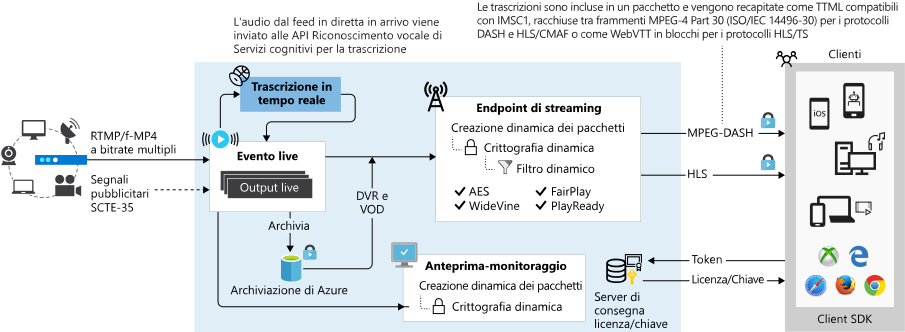

# Streaming live con Servizi multimediali di Azure v3

Servizi multimediali di Azure consente di offrire eventi live per i clienti nel cloud di Azure. Per eseguire lo streaming di eventi live con Servizi multimediali, è necessario quanto segue:  

- Una fotocamera usata per riprendere l'evento live. Per alcune idee per la configurazione, vedere [Simple and portable event video gear setup]( https://link.medium.com/KNTtiN6IeT) (Configurazione semplice e portabile di attrezzature video per eventi).

    Se non hai accesso a una fotocamera, strumenti, ad esempio [Telestream Wirecast](https://www.telestream.net/wirecast/overview.htm) consente di generare un feed live da un file video.
- Un codificatore video live in grado di convertire i segnali provenienti da una fotocamera (o da un altro dispositivo, come un portatile) in un feed di contributi inviato a Servizi multimediali. Il feed di contributi può includere segnali relativi alla pubblicità, ad esempio i marcatori SCTE-35. Per un elenco dei codificatori consigliati di streaming live, vedere [Codificatori di streaming live consigliati](recommended-on-premises-live-encoders.md). Vedere anche questo blog: [Live streaming production with OBS](https://link.medium.com/ttuwHpaJeT) (Produzione di streaming live con OBS).
- I componenti in Servizi multimediali, che consentono di inserire, visualizzare in anteprima, includere in un pacchetto, registrare, crittografare e trasmettere l'evento live ai clienti o a una rete CDN per un'ulteriore distribuzione.

Questo articolo offre una panoramica e informazioni aggiuntive dello streaming live con servizi multimediali e include collegamenti ad altri articoli pertinenti.

> [!NOTE]
> Non è attualmente possibile usare il portale di Azure per gestire le risorse v3. Usare l'[API REST](https://aka.ms/ams-v3-rest-ref), l'[interfaccia della riga di comando](https://aka.ms/ams-v3-cli-ref) o uno degli [SDK](media-services-apis-overview.md#sdks) supportati.

## Creazione dinamica dei pacchetti

Con servizi multimediali, è possibile sfruttare [creazione dinamica dei pacchetti](dynamic-packaging-overview.md), che consente di visualizzare in anteprima e la trasmissione di flussi live nella [formati MPEG DASH, HLS e Smooth Streaming](https://en.wikipedia.org/wiki/Adaptive_bitrate_streaming) dal feed di contributo che viene inviata al servizio. Gli utenti possono riprodurre il flusso live con qualsiasi lettore compatibile per HLS, DASH o Smooth Streaming. È possibile usare [Azure Media Player](https://amp.azure.net/libs/amp/latest/docs/index.html) nelle applicazioni web o per dispositivi mobili per distribuire lo streaming in uno di questi protocolli.

## Crittografia dinamica

Crittografia dinamica consente di crittografare dinamicamente i contenuti live o on demand tramite AES-128 o uno dei tre principali digital rights management (DRM) sistemi: Microsoft PlayReady, Google Widevine e Apple FairPlay. Servizi multimediali offre anche un servizio per la distribuzione di chiavi AES e licenze DRM (PlayReady, Widevine e FairPlay) ai client autorizzati. Per altre informazioni, vedere [crittografia dinamica](content-protection-overview.md).

## Manifesto dinamico

Applicazione di filtri dinamici viene utilizzato per controllare il numero di intervalli di tempo di presentazione che vengono inviati ai giocatori, i formati, velocità in bit e tiene traccia. Per altre informazioni, vedere [filtri e manifesti dinamici](filters-dynamic-manifest-overview.md).

## Tipi di evento live

Un evento Live può essere uno dei due tipi: codifica pass-through e in tempo reale. Per informazioni dettagliate sullo streaming live in servizi multimediali v3, vedere [eventi in tempo reale e Live output](live-events-outputs-concept.md).

### Pass-through

Quando si usa l'**evento live** pass-through, al codificatore live locale è affidata la generazione di un flusso video con velocità in bit multipla e l'invio come feed di contributi all'evento live (tramite il protocollo RTMP o MP4 frammentato). L'evento live esegue quindi i flussi video in ingresso senza ulteriori elaborazioni. Questo tipo un pass-through evento Live è ottimizzato per gli eventi in tempo reale con esecuzione prolungata o lo streaming live 24 x 365 lineare. 

### Codifica live  

Quando si usa la codifica live con Servizi multimediali, è possibile configurare il codificatore live locale per l'invio di un video a bitrate singolo come feed di contributi all'evento live (tramite il protocollo RTMP o Mp4 frammentato). L'evento live codifica tale flusso a bitrate singolo in ingresso in un [flusso video con velocità in bit multipla](https://en.wikipedia.org/wiki/Adaptive_bitrate_streaming) e lo rende disponibile per la distribuzione e la riproduzione in dispositivi tramite protocolli come MPEG-DASH, HLS e Smooth Streaming. 

## Flusso di lavoro dello streaming live

Per comprendere il flusso di lavoro streaming live in servizi multimediali v3, è necessario esaminare prima e comprendere i concetti seguenti: 

- [Gli endpoint API di streaming](streaming-endpoint-concept.md)
- [In tempo reale degli eventi e API di output in tempo reale](live-events-outputs-concept.md)
- [I localizzatori di API di streaming](streaming-locators-concept.md)

### Passaggi generali

1. Nell'account di servizi multimediali, assicurarsi che il **Endpoint di Streaming** (origine) sia in esecuzione. 
2. Creare un [Evento live](live-events-outputs-concept.md).  Quando si crea l'evento, è possibile impostarne l'avvio automatico. In alternativa, è possibile avviare l'evento quando si è pronti ad avviare lo streaming.  Quando l'avvio automatico è impostato su true, l'evento live verrà avviato subito dopo la creazione. La fatturazione inizia non appena viene avviata l'esecuzione dell'evento live. È necessario chiamare esplicitamente Stop sulla risorsa evento live per interrompere la fatturazione. Per altre informazioni, vedere [Stati e fatturazione dell'evento live](live-event-states-billing.md).
3. Ottenere gli URL di inserimento e configurare un codificatore locale per usare l'URL per inviare il feed di contributo. Vedere i [codificatori live consigliati](recommended-on-premises-live-encoders.md).
4. Ottenere l'URL di anteprima e usarlo per verificare che l'input dal codificatore venga effettivamente ricevuto.
5. Creare un nuovo oggetto **Asset**.
6. Creare un **LiveOutput** e usare il nome dell'asset creato. L'**output live** archivierà il flusso nell'**asset**.
7. Creare un **localizzatore di streaming** con i tipi di **Criterio di streaming** predefiniti. Se si prevede di crittografare il contenuto, rivedere la [Panoramica della protezione del contenuto](content-protection-overview.md).
8. Elencare i percorsi nel **localizzatore di streaming** per ottenere gli URL da usare (questi sono deterministici).
9. Ottenere il nome host per il **Endpoint di Streaming** (Origin) si desidera trasmettere dal.
10. Combinare l'URL del passaggio 8 con il nome host del passaggio 9 per ottenere l'URL completo.
11. Se si vuole interrompere la creazione dell'**evento live** visualizzabile, è necessario arrestare lo streaming dell'evento ed eliminare il **localizzatore di streaming**.

## Altri articoli importanti

- [Codificatori live consigliati](recommended-on-premises-live-encoders.md)
- [Utilizzo di un DVR cloud](live-event-cloud-dvr.md)
- [Confronto tra le funzionalità dei tipi di eventi live](live-event-types-comparison.md)
- [Stati e fatturazione](live-event-states-billing.md)
- [Latency](live-event-latency.md)

## Porre domande, fornire feedback, ottenere aggiornamenti

Consultare l'articolo [Community di Servizi multimediali di Azure](media-services-community.md) per esaminare i diversi modi in cui è possibile porre domande, fornire feedback e ottenere aggiornamenti su Servizi multimediali.

## Passaggi successivi

* [Esercitazione sullo streaming live](stream-live-tutorial-with-api.md)
* [Materiale sussidiario sulla migrazione per aggiornare Servizi multimediali da v2 a v3](migrate-from-v2-to-v3.md)
