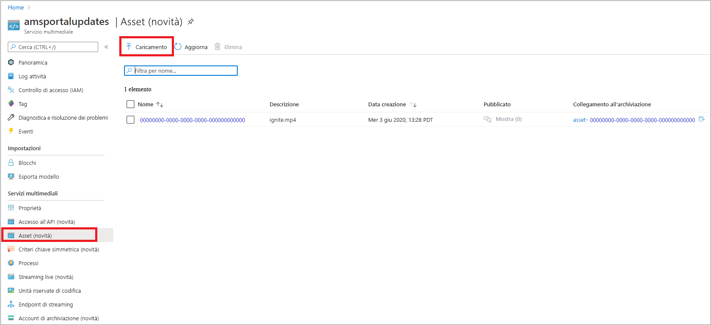
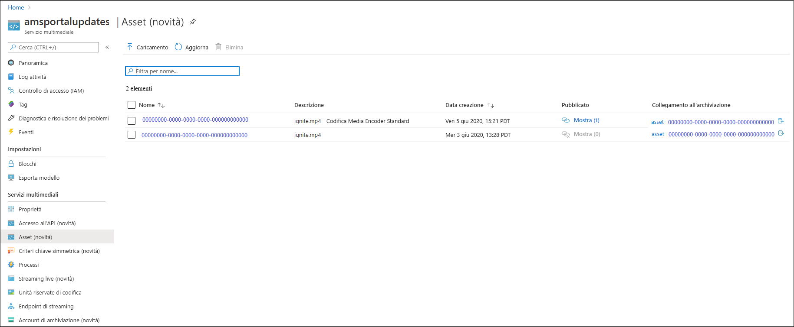
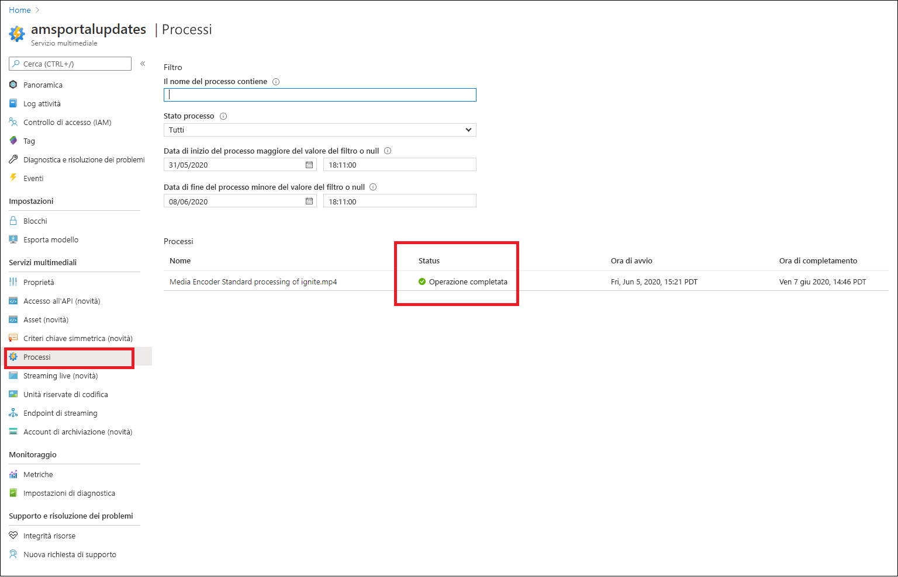
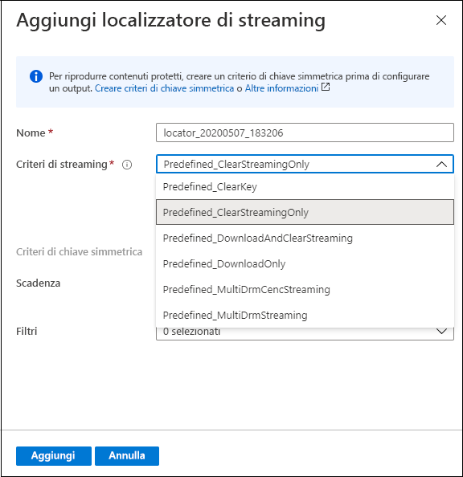
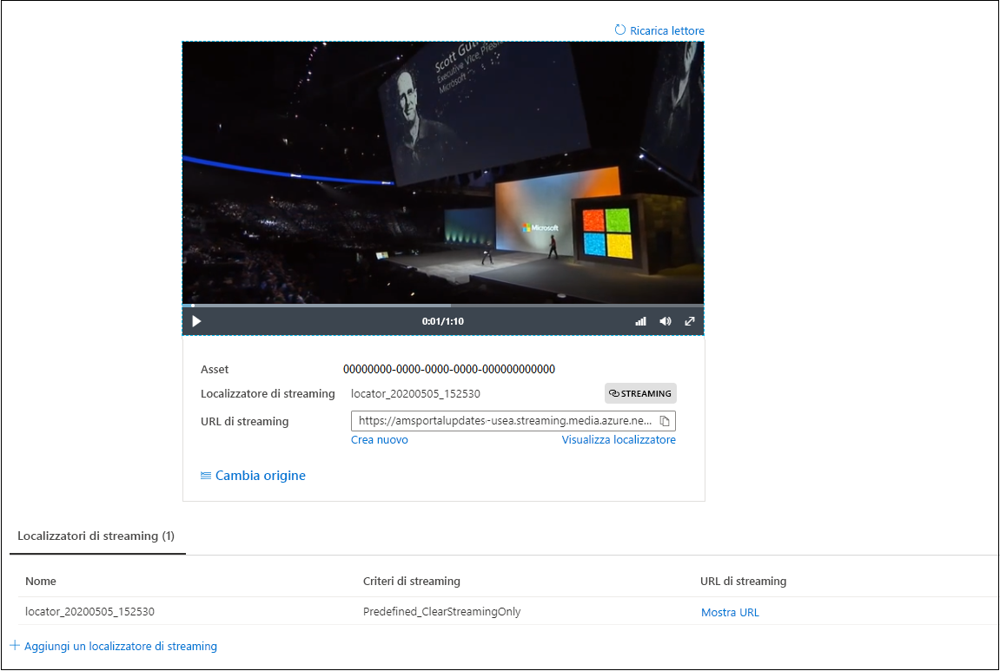

# Avvio rapido: Caricamento, codifica e streaming di contenuto con il portale

Questa esercitazione illustra come usare il portale di Azure per il caricamento, la codifica e lo streaming di contenuto con Servizi multimediali di Azure.

> [!NOTE]
> Assicurarsi di esaminare le [limitazioni del portale di Azure per Servizi multimediali v3](frequently-asked-questions.md#what-are-the-azure-portal-limitations-for-media-services-v3).
  
## Panoramica

* Per avviare le operazioni di gestione, crittografia, codifica, analisi e streaming di contenuto multimediale in Azure, è necessario creare un account di Servizi multimediali e caricare un file multimediale digitale di alta qualità in un **asset**. 
    
    > [!NOTE]
    > Se il video è stato caricato in precedenza nell'account di Servizi multimediali tramite l'API di Servizi multimediali v3 oppure il contenuto è stato generato in base a un output live, non sarà possibile visualizzare i pulsanti **Codifica**, **Analizza** o **Crittografa** nel portale di Azure. Usare le API di Servizi multimediali v3 per eseguire queste attività.

    Vedere gli articoli seguenti: 

  * [Caricamento e archiviazione nel cloud](storage-account-concept.md)
  * [Concetto di asset](assets-concept.md)
  * [Gestione degli asset](manage-asset-concept.md)
* Una volta caricato il file multimediale digitale di alta qualità in un asset (di input), è possibile elaborarlo, ossia codificarlo o analizzarlo. Il contenuto elaborato passa a un altro asset (di output). 
    * Scegliere [Codifica](encoding-concept.md) per codificare il file caricato in formati riproducibili in un'ampia varietà di browser e dispositivi.
    * Scegliere [Analizza](analyzing-video-audio-files-concept.md) per analizzare il file caricato. 

        Attualmente, usando il portale di Azure è possibile generare file con sottotitoli TTML e WebVTT. I file in questi formati possono essere usati per creare file audio e video accessibili a persone con problemi uditivi. È anche possibile estrarre parole chiave dal contenuto.

        Per un'esperienza avanzata che consente di estrarre informazioni dettagliate dai file audio e video, usare le impostazioni predefinite di Servizi multimediali v3, come descritto in [Esercitazione: Analizzare i video con Servizi multimediali v3](analyze-videos-tutorial-with-api.md).  Per ottenere informazioni più dettagliate, usare direttamente [Video Indexer](https://docs.microsoft.com/azure/media-services/video-indexer/).    
* Una volta elaborato, il contenuto multimediale può essere distribuito ai lettori client. Per rendere i video dell'asset di output disponibili per la riproduzione nei client, è necessario creare un **localizzatore di streaming**. Quando si crea un **localizzatore di streaming**, è necessario specificare un **criterio di streaming**. I **criteri di streaming** consentono di definire protocolli di streaming ed eventuali opzioni di crittografia per i **localizzatori di streaming**.
    
    Vedere:

    * [Localizzatori di streaming](streaming-locators-concept.md)
    * [Criteri di streaming](streaming-policy-concept.md)
    * [Creazione di pacchetti e distribuzione](dynamic-packaging-overview.md)
    * [Filtri](filters-concept.md)
* È possibile proteggere il contenuto tramite crittografia AES-128 (Advanced Encryption Standard) o/e con uno dei tre sistemi Digital Rights Management principali: Microsoft PlayReady, Google Widevine e Apple FairPlay. L'argomento di avvio rapido [Crittografare contenuti con il portale di Azure](encrypt-content-quickstart.md) illustra come configurare la protezione del contenuto.
        
## Prerequisiti

[!INCLUDE [quickstarts-free-trial-note](../../../includes/quickstarts-free-trial-note.md)]

[Creare un account di Servizi multimediali di Azure.](create-account-howto.md#use-the-azure-portal)

## Caricamento

1. Accedere al [portale di Azure](https://portal.azure.com/).
1. Individuare e selezionare l'account di Servizi multimediali.
1. Selezionare **Asset (novità)** .
1. Premere **Carica** nella parte superiore della finestra. 
1. Trascinare o selezionare un file da caricare.

Se si passa alla finestra degli asset, si noterà che all'elenco è stato aggiunto un nuovo asset:

## Codificare

1. Selezionare **Asset (novità)** .
1. Selezionare il nuovo asset (aggiunto nel passaggio precedente).
1. Fare clic su **Codifica** nella parte superiore della finestra.

    Premendo questo pulsante viene avviato il processo di codifica. Al termine viene generato un asset di output che include il contenuto codificato.

Se si passa alla finestra degli asset, si noterà che all'elenco è stato aggiunto un asset di output:

## Monitorare lo stato di avanzamento del processo

Per visualizzare lo stato del processo, passare a **Processi**. Il processo attraversa in genere gli stati seguenti: Pianificato, In coda, In elaborazione, Terminato (stato finale). Se nel corso del processo si verifica un errore, viene restituito lo stato Errore.

## Pubblicare e trasmettere in streaming

Per pubblicare un asset, è ora necessario aggiungere un localizzatore di streaming all'asset.

### Localizzatore di streaming 

1. Nella sezione **Localizzatore di streaming** premere **+ Aggiungi localizzatore di streaming**.
    L'asset viene pubblicato e vengono generati gli URL di streaming.

    > [!NOTE]
    > Se si vuole che lo streaming sia crittografato, è necessario creare un criterio di chiave simmetrica e impostarlo sul localizzatore di streaming. Per i dettagli, vedere [Crittografare contenuti con il portale di Azure](encrypt-content-quickstart.md).
1. Nella finestra **Aggiungi localizzatore di streaming** scegliere uno dei criteri di streaming predefiniti. Per informazioni dettagliate, vedere [Criteri di streaming](streaming-policy-concept.md)

    

Una volta pubblicato, l'asset può essere trasmesso in streaming direttamente nel portale. 

In alternativa, copiare l'URL di streaming e usarlo nel lettore client.

> [!NOTE]
> Assicurarsi che l'[endpoint di streaming](streaming-endpoint-concept.md) sia in esecuzione. Quando si crea per la prima volta un account di Servizi multimediali, viene creato l'endpoint di streaming predefinito, il cui stato è interrotto, quindi è necessario avviarlo prima di trasmettere in streaming il contenuto. Si ricevono addebiti solo quando l'eseguire di streaming è in esecuzione.

## Risorse di pulizia

Se si prevede di provare gli altri avvii rapidi, è necessario mantenere le risorse create. In caso contrario, passare al portale di Azure, passare ai gruppi di risorse, selezionare il gruppo di risorse in cui è stato eseguito l'avvio rapido ed eliminare tutte le risorse.

## Passaggi successivi

[Usare il portale per crittografare contenuto](encrypt-content-quickstart.md)
