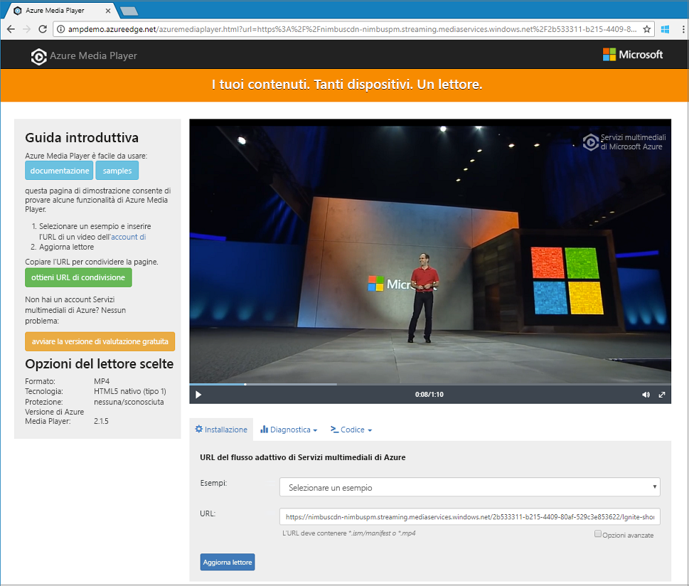

# <a name="quickstart-stream-video-files---net"></a>Guida introduttiva: Eseguire lo streaming di file video - .NET

Questa guida introduttiva illustra quanto sia facile codificare e iniziare a eseguire lo streaming di video su un'ampia gamma di browser e dispositivi tramite Servizi multimediali di Azure. È possibile specificare il contenuto di input usando URL HTTPS, URL di firma di accesso condiviso o percorsi ai file che si trovano nell'archivio BLOB di Azure.
L'esempio in questo argomento codifica contenuti resi accessibili tramite un URL HTTPS. Attualmente AMS v3 non supporta la codifica di trasferimenti in blocchi su URL HTTPS.

Al termine della guida introduttiva, sarà possibile eseguire lo streaming di un video.  



[!INCLUDE [quickstarts-free-trial-note](../../../includes/quickstarts-free-trial-note.md)]

## <a name="prerequisites"></a>Prerequisiti

- Se Visual Studio non è installato, è possibile scaricare [Visual Studio Community 2017](https://www.visualstudio.com/thank-you-downloading-visual-studio/?sku=Community&rel=15).
- [Creare un account di Servizi multimediali di Azure](create-account-cli-how-to.md).<br/>Assicurarsi di ricordare i valori usati per il nome del gruppo di risorse e il nome dell'account di Servizi multimediali.
- Seguire la procedura descritta in [Accedere all'API di Servizi multimediali di Azure usando l'interfaccia della riga di comando di Azure](access-api-cli-how-to.md) e salvare le credenziali. Sarà necessario usarle per accedere all'API.

## <a name="download-and-configure-the-sample"></a>Scaricare e configurare l'esempio

Clonare nel computer un repository GitHub contenente l'esempio .NET di streaming usando il comando seguente:  

 ```bash
 git clone http://github.com/Azure-Samples/media-services-v3-dotnet-quickstarts.git
 ```

L'esempio è disponibile nella cartella [EncodeAndStreamFiles](https://github.com/Azure-Samples/media-services-v3-dotnet-quickstarts/tree/master/AMSV3Quickstarts/EncodeAndStreamFiles).

Aprire [appsettings.json](https://github.com/Azure-Samples/media-services-v3-dotnet-quickstarts/blob/master/AMSV3Quickstarts/EncodeAndStreamFiles/appsettings.json) nel progetto scaricato. Sostituire i valori con le credenziali ottenute dall'[accesso alle API](access-api-cli-how-to.md).

L'esempio esegue le azioni seguenti:

1. Crea una **trasformazione** (in primo luogo, controlla se esiste la trasformazione specificata). 
2. Crea un **asset** di output usato come output del **processo** di codifica.
3. Crea l'input del **processo** basato su un URL HTTPS.
4. Invia il **processo** di codifica usando l'input e l'output creati in precedenza.
5. Controlla lo stato del processo.
6. Crea un **localizzatore di streaming**.
7. Crea gli URL di streaming.

Per una spiegazione delle operazioni eseguite da ogni funzione nell'esempio, esaminare il codice e i commenti in [questo file di origine](https://github.com/Azure-Samples/media-services-v3-dotnet-quickstarts/blob/master/AMSV3Quickstarts/EncodeAndStreamFiles/Program.cs).

## <a name="run-the-sample-app"></a>Eseguire l'app di esempio

Quando si esegue l'app, vengono visualizzati gli URL che è possibile usare per riprodurre il video usando protocolli diversi. 

1. Premere CTRL+F5 per eseguire l'applicazione *EncodeAndStreamFiles*.
2. Scegliere il protocollo **HLS** di Apple (termina con *manifest(format=m3u8-aapl)*) e copiare l'URL di streaming dalla console.


Nel [codice di origine](https://github.com/Azure-Samples/media-services-v3-dotnet-quickstarts/blob/master/AMSV3Quickstarts/EncodeAndStreamFiles/Program.cs) dell'esempio è possibile vedere come viene creato l'URL. Per creare un URL, è necessario concatenare il nome host dell'endpoint di streaming e il percorso del localizzatore di streaming.  

## <a name="test-with-azure-media-player"></a>Eseguire il test con Azure Media Player

Per testare lo streaming, in questo articolo viene usato Azure Media Player. 

> [!NOTE]
> Se un lettore è ospitato in un sito https, assicurarsi di aggiornare l'URL impostandolo su "https".

1. Aprire un Web browser e passare [https://aka.ms/azuremediaplayer/](https://aka.ms/azuremediaplayer/).
2. Nella casella **URL** incollare uno degli URL di streaming ottenuto quando si è eseguita l'applicazione. 
3. Scegliere il pulsante **Update Player** (Aggiorna il lettore).

Azure Media Player può essere usato a scopo di test ma non deve essere usato in un ambiente di produzione. 

## <a name="clean-up-resources"></a>Pulire le risorse

Se l'intero contenuto del gruppo di risorse non è più necessario, compresi gli account di archiviazione e di Servizi multimediali creati per questa guida introduttiva, eliminare il gruppo di risorse.

Eseguire il comando dell'interfaccia della riga di comando seguente:

```azurecli
az group delete --name amsResourceGroup
```

## <a name="examine-the-code"></a>Esaminare il codice

Per una spiegazione delle operazioni eseguite da ogni funzione nell'esempio, esaminare il codice e i commenti in [questo file di origine](https://github.com/Azure-Samples/media-services-v3-dotnet-quickstarts/blob/master/AMSV3Quickstarts/EncodeAndStreamFiles/Program.cs).

L'esercitazione [Eseguire il caricamento, la codifica e lo streaming di file](stream-files-tutorial-with-api.md) fornisce un esempio di streaming più avanzato con spiegazioni dettagliate. 

## <a name="multithreading"></a>Multithreading

Gli SDK di Servizi multimediali di Azure v3 non sono thread-safe. Quando si usa un'applicazione multithreading, è necessario generare un nuovo oggetto AzureMediaServicesClient per ogni thread.

## <a name="next-steps"></a>Passaggi successivi

> [!div class="nextstepaction"]
> [Esercitazione: Eseguire il caricamento, la codifica e lo streaming di video](stream-files-tutorial-with-api.md)
