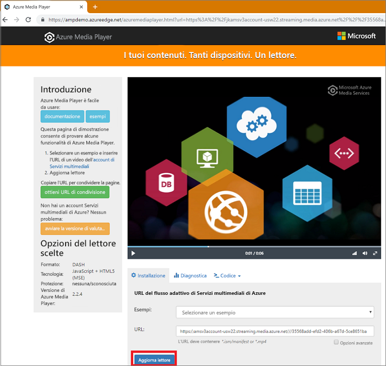

# <a name="quickstart-stream-video-files---nodejs"></a>Guida introduttiva: Eseguire lo streaming di file video - Node.js

Questa guida introduttiva illustra quanto sia facile codificare e iniziare a eseguire lo streaming di video su un'ampia gamma di browser e dispositivi tramite Servizi multimediali di Azure. È possibile specificare il contenuto di input usando URL HTTPS, URL di firma di accesso condiviso o percorsi ai file che si trovano nell'archivio BLOB di Azure.
L'esempio in questo argomento codifica contenuti resi accessibili tramite un URL HTTPS. Attualmente AMS v3 non supporta la codifica di trasferimenti in blocchi su URL HTTPS.

Al termine della guida introduttiva, sarà possibile eseguire lo streaming di un video.  



[!INCLUDE [quickstarts-free-trial-note](../../../includes/quickstarts-free-trial-note.md)]

## <a name="prerequisites"></a>Prerequisiti

- Installare [Node.js](https://nodejs.org/en/download/)
- [Creare un account di Servizi multimediali di Azure](create-account-cli-how-to.md).<br/>Assicurarsi di ricordare i valori usati per il nome del gruppo di risorse e il nome dell'account di Servizi multimediali.
- Seguire la procedura descritta in [Accedere all'API di Servizi multimediali di Azure usando l'interfaccia della riga di comando di Azure](access-api-cli-how-to.md) e salvare le credenziali. Sarà necessario usarle per accedere all'API.

## <a name="download-and-configure-the-sample"></a>Scaricare e configurare l'esempio

Clonare nel computer un repository GitHub contenente l'esempio Node.js di streaming usando il comando seguente:  

 ```bash
 git clone https://github.com/Azure-Samples/media-services-v3-node-tutorials.git
 ```

L'esempio è disponibile nella cartella [StreamFilesSample](https://github.com/Azure-Samples/media-services-v3-node-tutorials/tree/master/AMSv3Samples/StreamFilesSample).

Aprire [index.js](https://github.com/Azure-Samples/media-services-v3-node-tutorials/blob/master/AMSv3Samples/StreamFilesSample/index.js#L25) nel progetto scaricato. Sostituire i valori `endpoint config` con le credenziali ottenute dall'[accesso alle API](access-api-cli-how-to.md).

L'esempio esegue le azioni seguenti:

1. Crea una **trasformazione** (in primo luogo, controlla se esiste la trasformazione specificata). 
2. Crea un **asset** di output usato come output del **processo** di codifica.
3. Crea l'input del **processo** basato su un URL HTTPS.
4. Invia il **processo** di codifica usando l'input e l'output creati in precedenza.
5. Controlla lo stato del processo.
6. Crea un **localizzatore di streaming**.
7. Crea gli URL di streaming.

## <a name="run-the-sample-app"></a>Eseguire l'app di esempio

1. L'app scarica file codificati. Creare una cartella in cui generare i file di output e aggiornare il valore della variabile **outputFolder** nel file [index.js](https://github.com/Azure-Samples/media-services-v3-node-tutorials/blob/master/AMSv3Samples/StreamFilesSample/index.js#L39).
1. Aprire un **prompt dei comandi**, passare alla directory dell'esempio ed eseguire i comandi seguenti.

    ```
    npm install 
    node index.js
    ```

Al termine dell'esecuzione, verrà visualizzato un output simile:


## <a name="test-with-azure-media-player"></a>Eseguire il test con Azure Media Player

Per testare lo streaming, in questo articolo viene usato Azure Media Player. 

> [!NOTE]
> Se un lettore è ospitato in un sito https, assicurarsi di aggiornare l'URL impostandolo su "https".

1. Aprire un Web browser e passare [https://aka.ms/azuremediaplayer/](https://aka.ms/azuremediaplayer/).
2. Nella casella **URL** incollare uno degli URL di streaming ottenuto quando si è eseguita l'applicazione. 
 
     È possibile incollare l'URL in formato HLS, Dash o Smooth e Azure Media Player passerà automaticamente a un protocollo di streaming appropriato per la riproduzione sul dispositivo.
3. Scegliere il pulsante **Update Player** (Aggiorna il lettore).

Azure Media Player può essere usato a scopo di test ma non deve essere usato in un ambiente di produzione. 

## <a name="clean-up-resources"></a>Pulire le risorse

Se l'intero contenuto del gruppo di risorse non è più necessario, compresi gli account di archiviazione e di Servizi multimediali creati per questa guida introduttiva, eliminare il gruppo di risorse.

Eseguire il comando dell'interfaccia della riga di comando seguente:

```azurecli
az group delete --name amsResourceGroup
```

## <a name="see-also"></a>Vedere anche 

[Codici di errore dei processi](https://docs.microsoft.com/rest/api/media/jobs/get#joberrorcode).

## <a name="next-steps"></a>Passaggi successivi

> [!div class="nextstepaction"]
> [Concetti relativi ai Servizi multimediali](concepts-overview.md)
