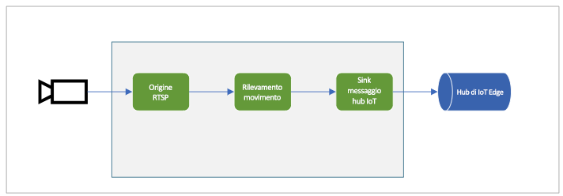

# <a name="quickstart-detect-motion-and-emit-events"></a>Avvio rapido: Rilevare il movimento e generare eventi

Questo avvio rapido illustra la procedura per iniziare a usare Live Video Analytics in IoT Edge. Usa una macchina virtuale di Azure come dispositivo IoT Edge e un flusso video live simulato. Dopo il completamento della procedura di configurazione, sarà possibile eseguire un flusso di video live simulato tramite un grafo multimediale che rileva e segnala eventuali movimenti nel flusso. Il diagramma seguente mostra una rappresentazione grafica del grafo multimediale.

 

Questo articolo è basato su [codice di esempio](https://github.com/Azure-Samples/live-video-analytics-iot-edge-csharp) scritto in C#.

## <a name="prerequisites"></a>Prerequisiti

* Un account Azure con una sottoscrizione attiva. [Creare un account gratuitamente](https://azure.microsoft.com/free/?WT.mc_id=A261C142F).
* [Visual Studio Code](https://code.visualstudio.com/) nel computer dell'utente con le estensioni seguenti:
    1. [Azure IoT Tools](https://marketplace.visualstudio.com/items?itemName=vsciot-vscode.azure-iot-tools)
    2. [C#](https://marketplace.visualstudio.com/items?itemName=ms-dotnettools.csharp)
* [.NET Core 3.1 SDK](https://dotnet.microsoft.com/download/dotnet-core/3.1) installato nel sistema

> [!TIP]
> È possibile che venga richiesta l'installazione di Docker durante l'installazione dell'estensione Azure IoT Tools. Ignorare la richiesta.

## <a name="set-up-azure-resources"></a>Configurare le risorse di Azure

Per questa esercitazione sono necessarie le risorse di Azure seguenti.

* Hub IoT
* Account di archiviazione
* Account Servizi multimediali di Azure
* Macchina virtuale Linux in Azure, con [runtime IoT Edge](https://docs.microsoft.com/azure/iot-edge/how-to-install-iot-edge-linux) installato

Per questo avvio rapido è consigliabile usare lo [script di configurazione delle risorse di Live Video Analytics](https://github.com/Azure/live-video-analytics/tree/master/edge/setup) per distribuire le risorse di Azure indicate in precedenza nella sottoscrizione di Azure. A tale scopo, seguire questa procedura:

1. Passare a https://shell.azure.com.
1. Se si sta usando Cloud Shell per la prima volta, verrà richiesta la selezione di una sottoscrizione per la creazione di un account di archiviazione e una condivisione di File di Microsoft Azure. Selezionare "Create storage" (Crea risorsa di archiviazione) per creare un account di archiviazione per l'archiviazione delle informazioni sulla sessione Cloud Shell. Questo account di archiviazione è distinto da quello che verrà creato dallo script per l'uso con l'account di Servizi multimediali di Azure.
1. Selezionare "Bash" come ambiente dall'elenco a discesa sul lato sinistro della finestra della shell.

    

1. Eseguire il comando seguente

    ```
    bash -c "$(curl -sL https://aka.ms/lva-edge/setup-resources-for-samples)"
    ```

    Se lo script viene completato correttamente, dovrebbero essere visualizzate tutte le risorse indicate in precedenza nella sottoscrizione.

1. Al termine dello script, fare clic sulle parentesi graffe per esporre la struttura di cartelle. Vengono visualizzati alcuni file creati nella directory ~/clouddrive/lva-sample. I file rilevanti per questo avvio rapido sono:

     * ~/clouddrive/lva-sample/edge-deployment/.env - Contiene le proprietà usate da Visual Studio Code per distribuire i moduli in un dispositivo Edge
     * ~/clouddrive/lva-sample/appsetting.json - Usato da Visual Studio Code per l'esecuzione del codice di esempio
     
Questi file saranno necessari per aggiornare i file in Visual Studio Code più avanti nell'avvio rapido. È consigliabile copiarli in un file locale per il momento.


 

## <a name="set-up-your-development-environment"></a>Configurazione dell'ambiente di sviluppo

1. Clonare il repository da https://github.com/Azure-Samples/live-video-analytics-iot-edge-csharp.
1. Avviare Visual Studio Code e aprire la cartella in cui è stato scaricato il repository.
1. In Visual Studio Code passare alla cartella "src/cloud-to-device-console-app" e creare un file denominato "appsettings.json". Questo file conterrà le impostazioni necessarie per eseguire il programma.
1. Copiare il contenuto dal file ~/clouddrive/lva-sample/appsettings.json generato nella sezione precedente (vedere il Passaggio 5)

    Il testo sarà simile al seguente:

    ```
    {  
        "IoThubConnectionString" : "HostName=xxx.azure-devices.net;SharedAccessKeyName=iothubowner;SharedAccessKey=XXX",  
        "deviceId" : "lva-sample-device",  
        "moduleId" : "lvaEdge"  
    }
    ```
1. Passare quindi alla cartella "src/edge" e creare un file denominato ".env".
1. Copiare il contenuto dal file "/clouddrive/lva-sample/edge-deployment/.env. Il testo sarà simile al seguente:

    ```
    SUBSCRIPTION_ID="<Subscription ID>"  
    RESOURCE_GROUP="<Resource Group>"  
    AMS_ACCOUNT="<AMS Account ID>"  
    IOTHUB_CONNECTION_STRING="HostName=xxx.azure-devices.net;SharedAccessKeyName=iothubowner;SharedAccessKey=xxx"  
    AAD_TENANT_ID="<AAD Tenant ID>"  
    AAD_SERVICE_PRINCIPAL_ID="<AAD SERVICE_PRINCIPAL ID>"  
    AAD_SERVICE_PRINCIPAL_SECRET="<AAD SERVICE_PRINCIPAL ID>"  
    INPUT_VIDEO_FOLDER_ON_DEVICE="/home/lvaadmin/samples/input"  
    OUTPUT_VIDEO_FOLDER_ON_DEVICE="/home/lvaadmin/samples/input"
    APPDATA_FOLDER_ON_DEVICE="/var/local/mediaservices"
    CONTAINER_REGISTRY_USERNAME_myacr="<your container registry username>"  
    CONTAINER_REGISTRY_PASSWORD_myacr="<your container registry username>"      
    ```

## <a name="examine-the-sample-files"></a>Esaminare i file di esempio

1. In Visual Studio Code passare a "src/edge". Verranno visualizzati il file .env creato e alcuni file modello di distribuzione.

    Il modello di distribuzione fa riferimento al manifesto della distribuzione per il dispositivo perimetrale con alcuni valori segnaposto. Il file .env include i valori per questa variabili.
1. Passare quindi alla cartella "src/cloud-to-device-console-app". Verrà visualizzato il file appsettings.json creato insieme ad altri file:

    * c2d-console-app.csproj: il file di progetto per Visual Studio Code.
    * operations.json: il file che elenca le diverse operazioni che il programma deve eseguire.
    * Program.cs: il codice del programma di esempio che esegue le operazioni seguenti:
    
        * Carica le impostazioni dell'app
        * Richiama i metodi diretti esposti da Live Video Analytics nel modulo IoT Edge. È possibile usare il modulo per analizzare i flussi video live richiamando i [metodi diretti](direct-methods.md) 
        * Sospende l'esecuzione per consentire di esaminare l'output del programma nella finestra del terminale e gli eventi generati dal modulo nella finestra di output
        * Richiama i metodi diretti per pulire le risorse   

## <a name="generate-and-deploy-the-iot-edge-deployment-manifest"></a>Generare e distribuire il manifesto della distribuzione di IoT Edge

Il manifesto della distribuzione definisce i moduli che vengono distribuiti in un dispositivo Edge e le impostazioni di configurazione dei moduli. Seguire questa procedura per generare il manifesto dal file modello e quindi distribuirlo nel dispositivo Edge.

1. Aprire Visual Studio Code
1. Impostare la stringa di connessione dell'hub IoT facendo clic sull'icona "Altre azioni" accanto al riquadro dell'hub IoT di Azure nell'angolo inferiore sinistro. È possibile copiare la stringa dal file src/cloud-to-device-console-app/appsettings.json. 

    
1. Quindi fare clic con il pulsante destro del mouse sul file "src/edge/deployment.template.json" e fare clic su "Generate IoT Edge Deployment Manifest" (Genera manifesto della distribuzione di IoT Edge).
    

    Questa operazione crea un file manifesto nella cartella src/edge/config denominato "deployment.amd64.json".
1. Fare clic con il pulsante destro del mouse su "src/edge/config/deployment.amd64.json", quindi fare clic su "Create Deployment for Single Device" (Crea la distribuzione per un unico dispositivo) e selezionare il nome del dispositivo perimetrale.

    
1. Verrà quindi chiesto di selezionare un dispositivo dell'hub IoT. Selezionare lva-sample-device dall'elenco a discesa.
1. Entro circa 30 secondi, aggiornare l'hub IoT di Azure nella sezione inferiore sinistra. Verrà visualizzato il dispositivo Edge con i moduli seguenti distribuiti:

    * Live Video Analytics in IoT Edge (nome del modulo "lvaEdge")
    * Simulatore RTSP (nome del modulo "rtspsim")

Il modulo Simulatore RTSP simula un flusso video live usando un file video archiviato che è stato copiato nel dispositivo perimetrale quando è stato eseguito lo [script di configurazione delle risorse di Live Video Analytics](https://github.com/Azure/live-video-analytics/tree/master/edge/setup). In questa fase i moduli sono distribuito ma non sono presenti grafi multimediali attivi.

## <a name="prepare-for-monitoring-events"></a>Operazioni preliminari al monitoraggio degli eventi

Sarà possibile usare il modulo di Live Video Analytics in IoT Edge per rilevare il movimento nel flusso video live in ingresso e inviare eventi all'Hub IoT. Per visualizzare gli eventi, seguire questa procedura:

1. Aprire il riquadro Explorer in Visual Studio Code e cercare l'hub IoT di Azure nell'angolo inferiore sinistro.
1. Espandere il nodo Dispositivi.
1. Fare clic con il pulsante destro del mouse su lva-sample-device e scegliere l'opzione "Avvia monitoraggio endpoint eventi predefinito".

    

## <a name="run-the-sample-program"></a>Eseguire il programma di esempio

Per eseguire il codice di esempio, seguire questa procedura.
1. In Visual Studio Code passare a "src/cloud-to-device-console-app/operations.json".
1. Nel nodo GraphTopologySet, verificare quanto segue:

    ` "topologyUrl" : "https://raw.githubusercontent.com/Azure/live-video-analytics/master/MediaGraph/topologies/motion-detection/topology.json"`
1. Nei nodi GraphInstanceSet e GraphTopologyDelete assicurarsi quindi che il valore di topologyName corrisponda al valore della proprietà "name" nella topologia del grafo precedente:

    `"topologyName" : "MotionDetection"`
    
1. Avviare una sessione di debug (premere F5). Verranno visualizzati alcuni messaggi stampati nella finestra del terminale.
1. Il file operations.json inizia con le chiamate a GraphTopologyList e GraphInstanceList. Se sono state pulite le risorse dopo gli avvii rapidi precedenti, verranno restituiti elenchi vuoti e verrà sospesa l'esecuzione per consentire di premere INVIO.

    ```
    --------------------------------------------------------------------------
    Executing operation GraphTopologyList
    -----------------------  Request: GraphTopologyList  --------------------------------------------------
    {
        "@apiVersion": "1.0"
    }
    ---------------  Response: GraphTopologyList - Status: 200  ---------------
    {
        "value": []
    }
    --------------------------------------------------------------------------
    Executing operation WaitForInput
    Press Enter to continue
    ```
1. Quando si preme il tasto "INVIO" nella finestra del terminale, viene eseguita la serie successiva di chiamate ai metodi diretti
     
     * Una chiamata a GraphTopologySet usando il valore topologyUrl precedente
     * Una chiamata a GraphInstanceSet usando il corpo seguente
     
     ```
     {
       "@apiVersion": "1.0",
       "name": "Sample-Graph",
       "properties": {
         "topologyName": "MotionDetection",
         "description": "Sample graph description",
         "parameters": [
           {
             "name": "rtspUrl",
             "value": "rtsp://rtspsim:554/media/camera-300s.mkv"
           },
           {
             "name": "rtspUserName",
             "value": "testuser"
           },
           {
             "name": "rtspPassword",
             "value": "testpassword"
           }
         ]
       }
     }
     ```
     
     * Una chiamata a GraphInstanceActivate per avviare l'istanza del grafo e avviare il flusso di video.
     * Una seconda chiamata a GraphInstanceList per indicare che l'istanza del grafo è effettivamente nello stato in esecuzione.
1. L'output nella finestra del terminale verrà sospeso quando viene visualizzato un prompt 'Premere INVIO per continuare'. Non premere "INVIO". È possibile scorrere verso l'alto per visualizzare i payload di risposta JSON per i metodi diretti richiamati
1. Se ora si passa alla finestra di output in Visual Studio Code, verranno visualizzati i messaggi inviati all'hub IoT dal modulo di Live Video Analytics in IoT Edge.
     * Questi messaggi sono descritti nella sezione seguente
1. L'esecuzione del grafo multimediale continuerà e verranno stampati i risultati: il simulatore RTSP continuerà a eseguire il loop del video di origine. Per arrestare il grafo multimediale, tornare alla finestra del terminale e premere "INVIO". Per pulire le risorse vengono eseguite le serie successive di chiamate:
     * Una chiamata a GraphInstanceDeactivate per disattivare l'istanza del grafo
     * Una chiamata a GraphInstanceDelete per eliminare l'istanza
     * Una chiamata a GraphTopologyDelete per eliminare la topologia
     * Una chiamata finale a GraphTopologyList per indicare che l'elenco è ora vuoto

## <a name="interpret-results"></a>Interpretare i risultati

Quando si esegue il grafo multimediale, i risultati dal processo di rilevamento dei movimenti vengono inviati all'Hub IoT tramite il nodo del sink dell'Hub IoT. I messaggi visualizzati nella finestra di output di Visual Studio Code contengono una sezione "body" e una sezione "applicationProperties". Per comprendere cosa rappresentano queste sezioni, leggere [questo](https://docs.microsoft.com/azure/iot-hub/iot-hub-devguide-messages-construct) articolo.

Nei messaggi seguenti le proprietà dell'applicazione e il contenuto del corpo sono definiti dal modulo di Live Video Analytics.

## <a name="mediasession-established-event"></a>Evento MediaSessionEstablished

Quando viene creata un'istanza del grafo multimediale, il nodo di origine RTSP prova a connettersi al server RTSP in esecuzione nel contenitore rtspsim-live555. In caso di esito positivo, viene visualizzato questo evento:

```
[IoTHubMonitor] [9:42:18 AM] Message received from [lvaedgesample/lvaEdge]:  
{  
"body": {
"sdp": "SDP:\nv=0\r\no=- 1586450538111534 1 IN IP4 xxx.xxx.xxx.xxx\r\ns=Matroska video+audio+(optional)subtitles, streamed by the LIVE555 Media Server\r\ni=media/camera-300s.mkv\r\nt=0 0\r\na=tool:LIVE555 Streaming Media v2020.03.06\r\na=type:broadcast\r\na=control:*\r\na=range:npt=0-300.000\r\na=x-qt-text-nam:Matroska video+audio+(optional)subtitles, streamed by the LIVE555 Media Server\r\na=x-qt-text-inf:media/camera-300s.mkv\r\nm=video 0 RTP/AVP 96\r\nc=IN IP4 0.0.0.0\r\nb=AS:500\r\na=rtpmap:96 H264/90000\r\na=fmtp:96 packetization-mode=1;profile-level-id=4D0029;sprop-parameter-sets={SPS}\r\na=control:track1\r\n"  
},  
"applicationProperties": {  
    "dataVersion": "1.0",  
    "topic": "/subscriptions/{subscriptionID}/resourceGroups/{name}/providers/microsoft.media/mediaservices/hubname",  
    "subject": "/graphInstances/GRAPHINSTANCENAMEHERE/sources/rtspSource",  
    "eventType": "Microsoft.Media.MediaGraph.Diagnostics.MediaSessionEstablished",  
    "eventTime": "2020-04-09T16:42:18.1280000Z"  
    }  
}
```

* Il messaggio è l'evento di diagnostica MediaSessionEstablished che indica che il nodo di origine RTSP (oggetto) è stato in grado di stabilire una connessione con il simulatore RTSP e iniziare a ricevere un feed live (simulato).
* "subject" in applicationProperties fa riferimento al nodo nella topologia del grafo da cui è stato generato il messaggio. In questo caso il messaggio viene originato dal nodo di origine RTSP.
* "eventType" in applicationProperties indica che si tratta di un evento di diagnostica.
* "eventTime" indica l'ora in cui si è verificato l'evento.
* "body" contiene i dati sull'evento di diagnostica che in questo caso è rappresentato dai dettagli [SDP](https://en.wikipedia.org/wiki/Session_Description_Protocol).


## <a name="motion-detection-event"></a>Evento di rilevamento movimento

Quando viene rilevato movimento, il modulo di Live Video Analytics in Edge invia un evento di inferenza. Il tipo viene impostato su "motion" per indicare che si tratta di un risultato dal processore di rilevamento movimento ed eventTime indica l'ora (UTC) in cui si è verificato il movimento. Di seguito è riportato un esempio:

```
  {  
  "body": {  
    "timestamp": 142843967343090,
    "inferences": [  
      {  
        "type": "motion",  
        "motion": {  
          "box": {  
            "l": 0.573222,  
            "t": 0.492537,  
            "w": 0.141667,  
            "h": 0.074074  
          }  
        }  
      }  
    ]  
  },  
  "applicationProperties": {  
    "topic": "/subscriptions/{subscriptionID}/resourceGroups/{name}/providers/microsoft.media/mediaservices/hubname",  
    "subject": "/graphInstances/GRAPHINSTANCENAME/processors/md",  
    "eventType": "Microsoft.Media.Graph.Analytics.Inference",  
    "eventTime": "2020-04-17T20:26:32.7010000Z",
    "dataVersion": "1.0"  
  }  
}  
```

* "subject" in applicationProperties fa riferimento al nodo nel grafo multimediale da cui è stato generato il messaggio. In questo caso il messaggio è stato originato dal nodo del processore di rilevamento movimento.
* "eventType" in applicationProperties indica che si tratta di un evento di analisi.
* "eventTime" indica l'ora in cui si è verificato l'evento.
"body" contiene dati sull'evento di analisi. In questo caso si tratta di un evento di inferenza e quindi il corpo contiene dati di tipo "timestamp" e "inferences".
* I dati di tipo "inferences" indicano che il valore "type" è "motion" e include dati aggiuntivi sull'evento "motion".
* La sezione "box" contiene le coordinate per un rettangolo delimitatore intorno all'oggetto in movimento. I valori vengono normalizzati per la larghezza e l'altezza del video in pixel (ad esempio, larghezza pari a 1920 e altezza pari a 1080).

    ```
    l - distance from left of image
    t - distance from top of image
    w - width of bounding box
    h - height of bounding box
    ```
    
## <a name="cleanup-resources"></a>Risorse di pulizia

Se si prevede di provare gli altri avvii rapidi, è necessario mantenere le risorse create. In caso contrario, passare al portale di Azure, passare ai gruppi di risorse, selezionare il gruppo di risorse in cui è stato eseguito l'avvio rapido ed eliminare tutte le risorse.

## <a name="next-steps"></a>Passaggi successivi

Eseguire altri avvii rapidi, ad esempio il rilevamento di un oggetto in un feed video live.        
