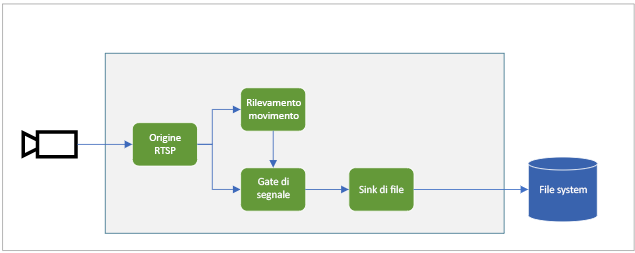

# <a name="quickstart-detect-motion-and-record-video-on-edge-devices"></a>Avvio rapido: Rilevare il movimento e registrare video nei dispositivi perimetrali
 
Questo argomento di avvio rapido illustra come usare Analisi video live in IoT Edge per analizzare un feed di video live proveniente da una videocamera IP simulata. Spiega come rilevare eventuali movimenti e, nel caso, registrare un clip video MP4 nel file system locale sul dispositivo perimetrale. Vengono usati una VM di Azure come dispositivo IoT Edge e uno streaming di video live simulato. 

Questo articolo è basato su codice di esempio scritto in C#. Si basa sull'argomento di avvio rapido [Rilevare il movimento e generare eventi](detect-motion-emit-events-quickstart.md). 

## <a name="prerequisites"></a>Prerequisiti

* Un account Azure con una sottoscrizione attiva. Se non si ha un account, [crearne uno gratuito](https://azure.microsoft.com/free/?WT.mc_id=A261C142F).
* [Visual Studio Code](https://code.visualstudio.com/) con le estensioni seguenti:
    * [Azure IoT Tools](https://marketplace.visualstudio.com/items?itemName=vsciot-vscode.azure-iot-tools)
    * [C#](https://marketplace.visualstudio.com/items?itemName=ms-dotnettools.csharp)
* [.NET Core 3.1 SDK](https://dotnet.microsoft.com/download/dotnet-core/3.1).
* Se non è stato completato l'argomento di avvio rapido [Rilevare il movimento e generare eventi](detect-motion-emit-events-quickstart.md), eseguire questi passaggi:
     1. [Configurare le risorse di Azure](detect-motion-emit-events-quickstart.md#set-up-azure-resources)
     1. [Configurare l'ambiente di sviluppo](detect-motion-emit-events-quickstart.md#set-up-your-development-environment)
     1. [Generare e distribuire il manifesto della distribuzione di IoT Edge](detect-motion-emit-events-quickstart.md#generate-and-deploy-the-deployment-manifest)
     1. [Preparare il monitoraggio degli eventi](detect-motion-emit-events-quickstart.md#prepare-to-monitor-events)

> [!TIP]
> Quando si installa Azure IoT Tools, è possibile che venga chiesto di installare Docker. Ignorare tranquillamente questa richiesta.

## <a name="review-the-sample-video"></a>Esaminare il video di esempio
Mentre si configurano le risorse per questo argomento di avvio rapido, un breve video su un'area di parcheggio viene copiato nella macchina virtuale Linux di Azure usata come dispositivo IoT Edge. Questo file video verrà usato per simulare un flusso di streaming live per questa esercitazione.

Aprire un'applicazione come il [lettore multimediale VLC](https://www.videolan.org/vlc/), premere CTRL+N e incollare [questo collegamento](https://lvamedia.blob.core.windows.net/public/lots_015.mkv) al video sull'area di parcheggio per avviare la riproduzione. Quando l'indicazione del tempo è circa a 5 secondi una macchina bianca passa attraverso il parcheggio.

Completare la procedura seguente per usare Analisi video live in IoT Edge per rilevare il movimento dell'auto e registrare un clip video iniziando quando l'indicazione del tempo è circa a 5 secondi.

## <a name="overview"></a>Panoramica



Il diagramma riportato sopra mostra il flusso dei segnali in questo argomento di avvio rapido. Un [modulo Edge](https://github.com/Azure/live-video-analytics/tree/master/utilities/rtspsim-live555) simula una videocamera IP che ospita un server RTSP (Real-Time Streaming Protocol). Un nodo di [origine RTSP](media-graph-concept.md#rtsp-source) estrae il feed video da questo server e invia i fotogrammi video al nodo del [processore di rilevamento del movimento](media-graph-concept.md#motion-detection-processor). L'origine RTSP invia gli stessi fotogrammi video a un nodo del [processore di controllo del segnale](media-graph-concept.md#signal-gate-processor), che rimane chiuso finché non viene attivato da un evento.

Quando il processore di rilevamento del movimento rileva un movimento nel video, invia un evento al nodo del processore di controllo del segnale, attivandolo. Il controllo si apre per il periodo di tempo configurato, inviando i fotogrammi video al nodo [sink di file](media-graph-concept.md#file-sink). Il nodo sink registra il video come file MP4 nel file system locale del dispositivo perimetrale. Il file viene salvato nel percorso configurato.

Contenuto dell'avvio rapido:

1. Creare e distribuire il grafico multimediale.
1. Interpretare i risultati.
1. Pulire le risorse.

## <a name="examine-and-edit-the-sample-files"></a>Esaminare e modificare i file di esempio
Come parte dei prerequisiti per questo argomenti di avvio rapido, il codice di esempio è stato scaricato in una cartella. Seguire questa procedura per esaminare e modificare il codice di esempio.

1. In Visual Studio Code passare a *src/edge*. Si noteranno il file *.env* e alcuni file modello di distribuzione.

    Il modello di distribuzione fa riferimento al manifesto della distribuzione per il dispositivo perimetrale, in cui per alcune proprietà vengono usate delle variabili. Il file *.env* include i valori per queste variabili.
1. Passare alla cartella *src/cloud-to-device-console-app*. Sono inclusi il file *appsettings.json* e alcuni altri file:
    * ***c2d-console-app.csproj***: il file di progetto per Visual Studio Code.
    * ***operations.json***: l'elenco di operazioni che il programma dovrà eseguire.
    * ***Program.cs***: il codice del programma di esempio. Questo codice:

        * Carica le impostazioni dell'app.
        * Richiama i metodi diretti esposti dal modulo Analisi video live in IoT Edge. È possibile usare il modulo per analizzare i flussi video live richiamando i [metodi diretti](direct-methods.md). 
        * Sospende l'esecuzione per consentire di esaminare l'output del programma nella finestra **TERMINALE** e gli eventi generati dal modulo nella finestra **OUTPUT**.
        * Richiama i metodi diretti per pulire le risorse.

1. Modificare il file *operations.json*:
    * Cambiare il collegamento alla topologia del grafo:

        `"topologyUrl" : "https://raw.githubusercontent.com/Azure/live-video-analytics/master/MediaGraph/topologies/evr-motion-files/topology.json"`
    * In `GraphInstanceSet` modificare il nome della topologia del grafo in modo che corrisponda al valore nel collegamento precedente:
    
      `"topologyName" : "EVRToFilesOnMotionDetection"`

    * Modificare l'URL RTSP in modo che punti al file video:

        `"value": "rtsp://rtspsim:554/media/lots_015.mkv"`

    * In `GraphTopologyDelete` modificare il nome:

        `"name": "EVRToFilesOnMotionDetection"`

## <a name="review---check-the-modules-status"></a>Revisione - Controllare lo stato dei moduli

Nel passaggio di [generazione e distribuzione del manifesto della distribuzione di IoT Edge](detect-motion-emit-events-quickstart.md#generate-and-deploy-the-deployment-manifest) in Visual Studio Code espandere il nodo **lva-sample-device** in **HUB IOT DI AZURE** (sezione in basso a sinistra). Si noterà che sono distribuiti i moduli seguenti:

* Il modulo Analisi video live, denominato `lvaEdge`
* Il modulo `rtspsim`, che simula un server RTSP che funge da origine di un feed di video live

  

> [!NOTE]
> Se si usa un dispositivo perimetrale personalizzato invece del dispositivo sottoposto a provisioning dallo script di configurazione, passare al dispositivo perimetrale ed eseguire i comandi seguenti con **diritti di amministratore** per eseguire il pull e archiviare il file del video di esempio usato per questo avvio rapido:  

```
mkdir /home/lvaadmin/samples
mkdir /home/lvaadmin/samples/input    
curl https://lvamedia.blob.core.windows.net/public/camera-300s.mkv > /home/lvaadmin/samples/input/camera-300s.mkv  
chown -R lvaadmin /home/lvaadmin/samples/  
```

## <a name="review---prepare-for-monitoring-events"></a>Revisione - Operazioni preliminari al monitoraggio degli eventi
Assicurarsi di aver completato i passaggi descritti in [Preparare il monitoraggio degli eventi](detect-motion-emit-events-quickstart.md#prepare-to-monitor-events).


## <a name="run-the-sample-program"></a>Eseguire il programma di esempio

1. Avviare una sessione di debug premendo F5. Nella finestra **TERMINALE** vengono visualizzati alcuni messaggi.
1. Il codice *operations.json* chiama i metodi diretti `GraphTopologyList` e `GraphInstanceList`. Se dopo aver completato gli argomenti di avvio rapido precedenti sono state pulite le risorse, questa procedura restituirà elenchi vuoti e quindi verrà sospesa. Premere INVIO.

```
--------------------------------------------------------------------------
Executing operation GraphTopologyList
-----------------------  Request: GraphTopologyList  --------------------------------------------------
{
  "@apiVersion": "1.0"
}
---------------  Response: GraphTopologyList - Status: 200  ---------------
{
  "value": []
}
--------------------------------------------------------------------------
Executing operation WaitForInput
Press Enter to continue
```

  La finestra **TERMINALE** mostra il set successivo di chiamate ai metodi diretti:  
  * Una chiamata a `GraphTopologySet` che usa `topologyUrl` 
  * Una chiamata a `GraphInstanceSet` che usa il corpo seguente:

```
{
  "@apiVersion": "1.0",
  "name": "Sample-Graph",
  "properties": {
    "topologyName": "EVRToFilesOnMotionDetection",
    "description": "Sample graph description",
    "parameters": [
      {
        "name": "rtspUrl",
        "value": "rtsp://rtspsim:554/media/lots_015.mkv"
      },
      {
        "name": "rtspUserName",
        "value": "testuser"
      },
      {
        "name": "rtspPassword",
        "value": "testpassword"
      }
    ]
  }
}
```

  * Una chiamata a `GraphInstanceActivate` che avvia l'istanza del grafo e il flusso di video
  * Una seconda chiamata a `GraphInstanceList` che mostra che l'istanza del grafo è in esecuzione  

3. L'output della finestra **TERMINALE** viene sospeso in corrispondenza di `Press Enter to continue`. Non premere ancora INVIO. Scorrere in alto per visualizzare i payload della risposta JSON per i metodi diretti richiamati.
1. Passare alla finestra **OUTPUT** in Visual Studio Code. Vengono visualizzati i messaggi inviati dal modulo Analisi video live in IoT Edge all'hub IoT. La sezione seguente di questo argomento di avvio rapido descrive questi messaggi.

1. Il grafo multimediale continua a essere eseguito e a stampare i risultati. Il simulatore RTSP continua a eseguire il video di origine in un ciclo. Quindi, per arrestare il grafo multimediale, tornare nella finestra **TERMINALE** e premere INVIO. 

    La serie successiva di chiamate pulisce le risorse:
     * Una chiamata a `GraphInstanceDeactivate` disattiva l'istanza del grafo.
     * Una chiamata a `GraphInstanceDelete` elimina l'istanza.
     * Una chiamata a `GraphTopologyDelete` elimina la topologia.
     * Una chiamata finale a `GraphTopologyList` mostra che l'elenco è ora vuoto.

## <a name="interpret-results"></a>Interpretare i risultati 
Quando si esegue il grafo multimediale, i risultati dal nodo del processore di rilevamento dei movimenti vengono inviati all'hub IoT passando attraverso il nodo sink dell'hub IoT. I messaggi visualizzati nella finestra **OUTPUT** di Visual Studio Code contengono una sezione `body` e una sezione `applicationProperties`. Per altre informazioni, vedere [Creare e leggere messaggi dell'hub IoT](../../iot-hub/iot-hub-devguide-messages-construct.md).

Nei messaggi seguenti il modulo Analisi video live definisce le proprietà dell'applicazione e il contenuto del corpo.

### <a name="mediasessionestablished-event"></a>Evento MediaSessionEstablished

Quando viene creata un'istanza del grafo multimediale, il nodo di origine RTSP prova a connettersi al server RTSP in esecuzione nel contenitore rtspsim-live555. Se la connessione riesce, viene visualizzato l'evento seguente.

```
[IoTHubMonitor] [05:37:21 AM] Message received from [lva-sample-device/lvaEdge]:
{  
"body": {
"sdp": "SDP:\nv=0\r\no=- 1586450538111534 1 IN IP4 xxx.xxx.xxx.xxx\r\ns=Matroska video+audio+(optional)subtitles, streamed by the LIVE555 Media Server\r\ni=media/camera-300s.mkv\r\nt=0 0\r\na=tool:LIVE555 Streaming Media v2020.03.06\r\na=type:broadcast\r\na=control:*\r\na=range:npt=0-300.000\r\na=x-qt-text-nam:Matroska video+audio+(optional)subtitles, streamed by the LIVE555 Media Server\r\na=x-qt-text-inf:media/camera-300s.mkv\r\nm=video 0 RTP/AVP 96\r\nc=IN IP4 0.0.0.0\r\nb=AS:500\r\na=rtpmap:96 H264/90000\r\na=fmtp:96 packetization-mode=1;profile-level-id=4D0029;sprop-parameter-sets={SPS}\r\na=control:track1\r\n"  
},  
"applicationProperties": {  
    "dataVersion": "1.0",  
    "topic": "/subscriptions/{subscriptionID}/resourceGroups/{name}/providers/microsoft.media/mediaservices/hubname",  
    "subject": "/graphInstances/Sample-Graph-1/sources/rtspSource",  
    "eventType": "Microsoft.Media.MediaGraph.Diagnostics.MediaSessionEstablished",  
    "eventTime": "2020-05-21T05:37:21.398Z",
    }  
}
```

Nell'output precedente: 

* Il messaggio è un evento di diagnostica, `MediaSessionEstablished`. Indica che il nodo di origine RTSP (subject) ha stabilito una connessione con il simulatore RTSP e ha iniziato a ricevere un feed live simulato.
* In `applicationProperties` `subject` fa riferimento al nodo nella topologia del grafo da cui è stato generato il messaggio. In questo caso il messaggio viene originato dal nodo di origine RTSP.
* In `applicationProperties` `eventType` indica che questo evento è un evento di diagnostica.
* Il valore di `eventTime` indica la data e l'ora in cui si è verificato l'evento.
* La sezione `body` contiene dati sull'evento di diagnostica. In questo caso, i dati sono costituiti dai dettagli di [SDP (Session Description Protocol)](https://en.wikipedia.org/wiki/Session_Description_Protocol).

### <a name="recordingstarted-event"></a>Evento RecordingStarted

Quando viene rilevato un movimento, il nodo del processore di controllo del segnale viene attivato e il nodo sink di file nel grafo multimediale avvia la scrittura di un file MP4. Il nodo sink di file invia un evento operativo. `type` è impostato su `motion` per indicare che è un risultato del processore di rilevamento del movimento. Il valore `eventTime` è l'ora UTC in cui si è verificato il movimento. Per altre informazioni su questo processo, vedere la sezione [Panoramica](#overview) in questo argomento di avvio rapido.

Ecco un esempio di questo messaggio:

```
[IoTHubMonitor] [05:37:27 AM] Message received from [lva-sample-device/lvaEdge]:
{
  "body": {
    "outputType": "filePath",
    "outputLocation": "/var/media/sampleFilesFromEVR-filesinkOutput-20200521T053726Z.mp4"
  },
  "applicationProperties": {
    "topic": "/subscriptions/{subscriptionID}/resourceGroups/{name}/providers/microsoft.media/mediaservices/hubname",  
    "subject": "/graphInstances/Sample-Graph-1/sinks/fileSink",
    "eventType": "Microsoft.Media.Graph.Operational.RecordingStarted",
    "eventTime": "2020-05-21T05:37:27.713Z",
    "dataVersion": "1.0"
  }
}
```

Nel messaggio precedente: 

* In `applicationProperties` `subject` fa riferimento al nodo nel grafo multimediale da cui è stato generato il messaggio. In questo caso il messaggio viene originato dal nodo sink di file.
* In `applicationProperties` `eventType` indica che questo evento è un evento operativo.
* Il valore di `eventTime` indica la data e l'ora in cui si è verificato l'evento. Si verifica da 5 a 6 secondi dopo `MediaSessionEstablished` e dopo l'inizio del flusso del video. L'ora corrisponde all'indicazione dei 5-6 secondi dopo i quali l'[auto ha iniziato a muoversi](#review-the-sample-video) nel parcheggio.
* La sezione `body` contiene dati sull'evento operativo. In questo caso i dati comprendono `outputType` e `outputLocation`.
* La variabile `outputType` indica che queste informazioni riguardano il percorso del file.
* Il valore `outputLocation` è il percorso del file MP4 nel modulo Edge.

### <a name="recordingstopped-and-recordingavailable-events"></a>Eventi RecordingStopped e RecordingAvailable

Se si esaminano le proprietà del nodo del processore di controllo del segnale nella [topologia del grafo](https://github.com/Azure/live-video-analytics/blob/master/MediaGraph/topologies/evr-motion-files/topology.json), si noterà che i tempi di attivazione sono impostati su 5 secondi. Quindi, circa 5 secondi dopo la ricezione dell'evento `RecordingStarted`, vengono generati:

* Un evento `RecordingStopped`, che indica che la registrazione è stata interrotta.
* Un evento `RecordingAvailable`, che indica che è ora possibile usare il file MP4 per la visualizzazione.

I due eventi di solito vengono generati a pochi secondi l'uno dall'altro.

## <a name="play-the-mp4-clip"></a>Riprodurre il clip MP4

I file MP4 vengono scritti in una directory del dispositivo perimetrale configurata nel file *.env* usando la chiave OUTPUT_VIDEO_FOLDER_ON_DEVICE. Se è stato usato il valore predefinito, i risultati dovrebbero essere nella cartella */var/media/* .

Per riprodurre il clip MP4:

1. Passare al gruppo di risorse, individuare la macchina virtuale e connettersi usando Azure Bastion.

    
    
    

1. Accedere usando le credenziali generate al momento della [configurazione delle risorse di Azure](detect-motion-emit-events-quickstart.md#set-up-azure-resources). 
1. Al prompt dei comandi passare alla directory pertinente. Il percorso predefinito è */var/media*. Si vedranno i file MP4 nella directory.

     

1. Usare il comando [SCP (copia sicura)](../../virtual-machines/linux/copy-files-to-linux-vm-using-scp.md) per copiare i file nel computer locale. 
1. Riprodurre i file usando il [lettore multimediale VLC](https://www.videolan.org/vlc/) o un qualsiasi altro lettore MP4.

## <a name="clean-up-resources"></a>Pulire le risorse

Se si intende provare gli altri argomenti di avvio rapido, non eliminare le risorse create. In caso contrario, nel portale di Azure passare ai gruppi di risorse, selezionare il gruppo di risorse in cui è stato eseguito questo argomento di avvio rapido e quindi eliminare tutte le risorse.

## <a name="next-steps"></a>Passaggi successivi

* Seguire l'avvio rapido [Eseguire l'analisi di video live con un modello personalizzato](use-your-model-quickstart.md) per applicare l'intelligenza artificiale ai feed video live.
* Esaminare altri problemi per utenti avanzati:

    * Usare una [videocamera IP](https://en.wikipedia.org/wiki/IP_camera) che supporti RTSP invece di usare il simulatore RTSP. È possibile trovare videocamere IP che supportano RTSP nella pagina dei [prodotti conformi a ONVIF](https://www.onvif.org/conformant-products). Cercare dispositivi conformi ai profili G, S o T.
    * Usare un dispositivo Linux AMD64 o x64 invece di una macchina virtuale Linux in Azure. Il dispositivo deve trovarsi nella stessa rete della videocamera IP. Seguire le istruzioni riportate in [Installare il runtime Azure IoT Edge in Linux](../../iot-edge/how-to-install-iot-edge-linux.md). Quindi seguire le istruzioni in [Distribuire il primo modulo IoT Edge in un dispositivo Linux virtuale](../../iot-edge/quickstart-linux.md) per registrare il dispositivo con l'hub IoT di Azure.
