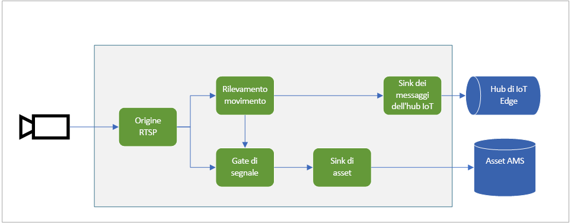
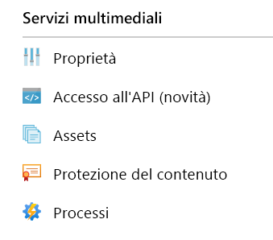
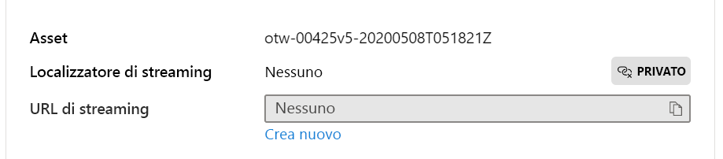

# <a name="quickstart-detect-motion-record-video-to-media-services"></a>Avvio rapido: Rilevare il movimento, registrare video in Servizi multimediali

Questo articolo illustra i passaggi da seguire per usare l'analisi di video live in IoT Edge per la [registrazione basata su eventi](event-based-video-recording-concept.md). Si usa una macchina virtuale Linux in Azure come dispositivo IoT Edge e un flusso video live simulato. Il flusso video viene analizzato per verificare la presenza di oggetti in fase di spostamento. Quando viene rilevato un movimento, gli eventi vengono inviati all'hub IoT di Azure e la parte pertinente del flusso video viene registrata come asset in Servizi multimediali di Azure.

Questo articolo si basa sull'[avvio rapido Introduzione](get-started-detect-motion-emit-events-quickstart.md).

## <a name="prerequisites"></a>Prerequisiti

* Un account Azure con una sottoscrizione attiva. [Creare un account gratuitamente](https://azure.microsoft.com/free/?WT.mc_id=A261C142F).
* [Visual Studio Code](https://code.visualstudio.com/) nel computer in uso con l'[estensione Azure IoT Tools](https://marketplace.visualstudio.com/items?itemName=vsciot-vscode.azure-iot-tools).
* Se prima non è stato completato l'[avvio rapido Introduzione](get-started-detect-motion-emit-events-quickstart.md), seguire questa procedura:
    * [Configurare le risorse di Azure](get-started-detect-motion-emit-events-quickstart.md#set-up-azure-resources)
    * [Distribuire i moduli](get-started-detect-motion-emit-events-quickstart.md#deploy-modules-on-your-edge-device)
    * [Configurare Visual Studio Code](get-started-detect-motion-emit-events-quickstart.md#configure-the-azure-iot-tools-extension)

## <a name="review-the-sample-video"></a>Esaminare il video di esempio

Nell'ambito della procedura precedente per la configurazione delle risorse di Azure, un breve video su un'area di parcheggio verrà copiato nella macchina virtuale Linux in Azure usata come dispositivo IoT Edge. Questo file video verrà usato per simulare un flusso di streaming live per questa esercitazione.

È possibile usare un'applicazione come [VLC Player](https://www.videolan.org/vlc/), avviarla, premere CTRL + N e incollare [questo](https://lvamedia.blob.core.windows.net/public/lots_015.mkv) collegamento al video sull'area di parcheggio per avviare la riproduzione. Quando l'indicazione del tempo è circa a 5 secondi una macchina bianca passa attraverso il parcheggio.

Nel corso della procedura descritta di seguito si userà l'analisi di video live in IoT Edge per rilevare il movimento dell'auto e registrare un clip video iniziando quando l'indicazione del tempo è 5 secondi. Il diagramma seguente è la rappresentazione visiva del flusso complessivo.



## <a name="use-direct-methods"></a>Usare metodi diretti

È possibile usare il modulo per analizzare i flussi video live richiamando metodi diretti. Leggere [Metodi diretti per Analisi di video live in IoT Edge](direct-methods.md) per conoscere tutti i metodi diretti forniti dal modulo. 

### <a name="invoke-graphtopologylist"></a>Richiamare GraphTopologyList
In questo passaggio vengono enumerate tutte le [topologie del grafo](media-graph-concept.md#media-graph-topologies-and-instances) presenti nel modulo.

1. Fare clic con il pulsante destro del mouse sul modulo "lvaEdge" e selezionare "Invoke Module Direct Method" (Richiama metodo diretto modulo) dal menu di scelta rapida.
1. Si aprirà una casella di modifica nella parte superiore centrale della finestra di Visual Studio Code. Immettere "GraphTopologyList" nella casella di modifica e premere INVIO.
1. Quindi copiare e incollare il payload JSON seguente nella casella di modifica e premere INVIO.
    
    ```
    {
        "@apiVersion" : "1.0"
    }
    ```

    In pochi secondi si aprirà la finestra OUTPUT nel popup di Visual Studio Code con la risposta seguente
    
    ```
    [DirectMethod] Invoking Direct Method [GraphTopologyList] to [lva-sample-device/lvaEdge] ...
    [DirectMethod] Response from [lva-sample-device/lvaEdge]:
    {
      "status": 200,
      "payload": {
        "value": []
      }
    }
    ```
    
    La risposta precedente è prevista perché non sono state create topologie del grafo.

### <a name="invoke-graphtopologyset"></a>Richiamare GraphTopologySet

Seguendo la stessa procedura illustrata per richiamare GraphTopologyList, è possibile richiamare GraphTopologySet per impostare una [topologia del grafo](media-graph-concept.md#media-graph-topologies-and-instances) usando il codice JSON seguente come payload. Verrà creata una topologia del grafo denominata "EVRtoAssetsOnMotionDetecion".

```
{
    "@apiVersion": "1.0",
    "name": "EVRtoAssetsOnMotionDetecion",
    "properties": {
      "description": "Event-based video recording to Assets based on motion events",
      "parameters": [
        {
            "name": "rtspUserName",
            "type": "String",
            "description": "rtsp source user name.",
            "default": "dummyUserName"
        },
        {
            "name": "rtspPassword",
            "type": "String",
            "description": "rtsp source password.",
            "default" : "dummyPassword"
        },
        {
            "name": "rtspUrl",
            "type": "String",
            "description": "rtsp Url"
        },
        {
            "name": "motionSensitivity",
            "type": "String",
            "description": "motion detection sensitivity",
            "default" : "medium"
        },
        {
            "name": "hubSinkOutputName",
            "type": "String",
            "description": "hub sink output name",
            "default" : "iothubsinkoutput"
        }                              
    ],         

      "sources": [
        {
          "@type": "#Microsoft.Media.MediaGraphRtspSource",
          "name": "rtspSource",
          "endpoint": {
            "@type": "#Microsoft.Media.MediaGraphUnsecuredEndpoint",
            "url": "${rtspUrl}",
            "credentials": {
              "@type": "#Microsoft.Media.MediaGraphUsernamePasswordCredentials",
              "username": "${rtspUserName}",
              "password": "${rtspPassword}"
            }
          }
        }
      ],
      "processors": [
        {
          "@type": "#Microsoft.Media.MediaGraphMotionDetectionProcessor",
          "name": "motionDetection",
          "sensitivity": "${motionSensitivity}",
          "inputs": [
            {
              "nodeName": "rtspSource"
            }
          ]
        },
        {
          "@type": "#Microsoft.Media.MediaGraphSignalGateProcessor",
          "name": "signalGateProcessor",
          "inputs": [
            {
              "nodeName": "motionDetection"
            },
            {
              "nodeName": "rtspSource"
            }
          ],
          "activationEvaluationWindow": "PT1S",
          "activationSignalOffset": "PT0S",
          "minimumActivationTime": "PT30S",
          "maximumActivationTime": "PT30S"
        }
      ],
      "sinks": [
        {
          "@type": "#Microsoft.Media.MediaGraphAssetSink",
          "name": "assetSink",
          "assetNamePattern": "sampleAssetFromEVR-LVAEdge-${System.DateTime}",
          "segmentLength": "PT0M30S",
          "localMediaCacheMaximumSizeMiB": "2048",
          "localMediaCachePath": "/var/lib/azuremediaservices/tmp/",
          "inputs": [
            {
              "nodeName": "signalGateProcessor"
            }
          ]
        },
        {
          "@type": "#Microsoft.Media.MediaGraphIoTHubMessageSink",
          "name": "hubSink",
          "hubOutputName": "${hubSinkOutputName}",
          "inputs": [
            {
              "nodeName": "motionDetection"
            }
          ]
        }
      ]
    }
}
```

Il payload JSON precedente genera una topologia del grafo che definisce cinque parametri, quattro dei quali hanno valori predefiniti. La topologia ha un nodo di origine ([origine RTSP](media-graph-concept.md#rtsp-source)), due nodi del processore ([processore di rilevamento movimento](media-graph-concept.md#motion-detection-processor) e [processore di controllo del segnale](media-graph-concept.md#signal-gate-processor) e due nodi sink (sink dell'hub IoT e [sink dell'asset](media-graph-concept.md#asset-sink)). La rappresentazione visiva della topologia è illustrata qui sopra.

In pochi secondi, nella finestra OUTPUT viene visualizzata la risposta seguente.

```
[DirectMethod] Invoking Direct Method [GraphTopologySet] to [lva-sample-device/lvaEdge] ...
[DirectMethod] Response from [lva-sample-device/lvaEdge]:
{
  "status": 201,
  "payload": {
    "systemData": {
      "createdAt": "2020-05-12T22:05:31.603Z",
      "lastModifiedAt": "2020-05-12T22:05:31.603Z"
    },
    "name": "EVRtoAssetsOnMotionDetecion",
    "properties": {
      "description": "Event-based video recording to assets based on motion events",
      "parameters": [
        {
          "name": "rtspUserName",
          "type": "String",
          "description": "rtsp source user name.",
          "default": "dummyUserName"
        },
        {
          "name": "rtspPassword",
          "type": "String",
          "description": "rtsp source password.",
          "default": "dummyPassword"
        },
        {
          "name": "rtspUrl",
          "type": "String",
          "description": "rtsp Url"
        },
        {
          "name": "motionSensitivity",
          "type": "String",
          "description": "motion detection sensitivity",
          "default": "medium"
        },
        {
          "name": "hubSinkOutputName",
          "type": "String",
          "description": "hub sink output name",
          "default": "iothubsinkoutput"
        }
      ],
      "sources": [
        {
          "@type": "#Microsoft.Media.MediaGraphRtspSource",
          "name": "rtspSource",
          "transport": "Tcp",
          "endpoint": {
            "@type": "#Microsoft.Media.MediaGraphUnsecuredEndpoint",
            "url": "${rtspUrl}",
            "credentials": {
              "@type": "#Microsoft.Media.MediaGraphUsernamePasswordCredentials",
              "username": "${rtspUserName}",
              "password": "${rtspPassword}"
            }
          }
        }
      ],
      "processors": [
        {
          "@type": "#Microsoft.Media.MediaGraphMotionDetectionProcessor",
          "sensitivity": "${motionSensitivity}",
          "name": "motionDetection",
          "inputs": [
            {
              "nodeName": "rtspSource",
              "outputSelectors": []
            }
          ]
        },
        {
          "@type": "#Microsoft.Media.MediaGraphSignalGateProcessor",
          "activationEvaluationWindow": "PT1S",
          "activationSignalOffset": "PT0S",
          "minimumActivationTime": "PT30S",
          "maximumActivationTime": "PT30S",
          "name": "signalGateProcessor",
          "inputs": [
            {
              "nodeName": "motionDetection",
              "outputSelectors": []
            },
            {
              "nodeName": "rtspSource",
              "outputSelectors": []
            }
          ]
        }
      ],
      "sinks": [
        {
          "@type": "#Microsoft.Media.MediaGraphAssetSink",
          "localMediaCachePath": "/var/lib/azuremediaservices/tmp/",
          "localMediaCacheMaximumSizeMiB": "2048",
          "segmentLength": "PT0M30S",
          "assetNamePattern": "sampleAssetFromEVR-LVAEdge-${System.DateTime}",
          "name": "assetSink",
          "inputs": [
            {
              "nodeName": "signalGateProcessor",
              "outputSelectors": []
            }
          ]
        },
        {
          "@type": "#Microsoft.Media.MediaGraphIoTHubMessageSink",
          "hubOutputName": "${hubSinkOutputName}",
          "name": "hubSink",
          "inputs": [
            {
              "nodeName": "motionDetection",
              "outputSelectors": []
            }
          ]
        }
      ]
    }
  }
}
```

Lo stato restituito è 201, che indica che è stata creata una nuova topologia del grafo. Provare a usare i metodi diretti seguenti come passaggi successivi:

* Richiamare nuovamente GraphTopologySet e verificare se il codice di stato restituito è 200. Il codice di stato 200 indica che è stata aggiornata una topologia del grafo esistente.
* Richiamare di nuovo GraphTopologySet modificando però la stringa di descrizione. Verificare che il codice di stato nella risposta sia 200 e che la descrizione sia aggiornata con il nuovo valore.
* Richiamare GraphTopologyList come descritto nella sezione precedente e verificare se ora la topologia del grafo "EVRtoAssetsOnMotionDetecion" è visualizzata nel payload restituito.

### <a name="invoke-graphtopologyget"></a>Richiamare GraphTopologyGet

Ora richiamare GraphTopologyGet con il payload seguente
```

{
    "@apiVersion" : "1.0",
    "name" : "EVRtoAssetsOnMotionDetecion"
}
```

Entro pochi secondi nella finestra dell'output verrà visualizzata la risposta seguente

```
[DirectMethod] Invoking Direct Method [GraphTopologyGet] to [lva-sample-device/lvaEdge] ...
[DirectMethod] Response from [lva-sample-device/lvaEdge]:
{
  "status": 200,
  "payload": {
    "systemData": {
      "createdAt": "2020-05-12T22:05:31.603Z",
      "lastModifiedAt": "2020-05-12T22:05:31.603Z"
    },
    "name": "EVRtoAssetsOnMotionDetecion",
    "properties": {
      "description": "Event-based video recording to Assets based on motion events",
      "parameters": [
        {
          "name": "rtspUserName",
          "type": "String",
          "description": "rtsp source user name.",
          "default": "dummyUserName"
        },
        {
          "name": "rtspPassword",
          "type": "String",
          "description": "rtsp source password.",
          "default": "dummyPassword"
        },
        {
          "name": "rtspUrl",
          "type": "String",
          "description": "rtsp Url"
        },
        {
          "name": "motionSensitivity",
          "type": "String",
          "description": "motion detection sensitivity",
          "default": "medium"
        },
        {
          "name": "hubSinkOutputName",
          "type": "String",
          "description": "hub sink output name",
          "default": "iothubsinkoutput"
        }
      ],
      "sources": [
        {
          "@type": "#Microsoft.Media.MediaGraphRtspSource",
          "name": "rtspSource",
          "transport": "Tcp",
          "endpoint": {
            "@type": "#Microsoft.Media.MediaGraphUnsecuredEndpoint",
            "url": "${rtspUrl}",
            "credentials": {
              "@type": "#Microsoft.Media.MediaGraphUsernamePasswordCredentials",
              "username": "${rtspUserName}",
              "password": "${rtspPassword}"
            }
          }
        }
      ],
      "processors": [
        {
          "@type": "#Microsoft.Media.MediaGraphMotionDetectionProcessor",
          "sensitivity": "${motionSensitivity}",
          "name": "motionDetection",
          "inputs": [
            {
              "nodeName": "rtspSource",
              "outputSelectors": []
            }
          ]
        },
        {
          "@type": "#Microsoft.Media.MediaGraphSignalGateProcessor",
          "activationEvaluationWindow": "PT1S",
          "activationSignalOffset": "PT0S",
          "minimumActivationTime": "PT30S",
          "maximumActivationTime": "PT30S",
          "name": "signalGateProcessor",
          "inputs": [
            {
              "nodeName": "motionDetection",
              "outputSelectors": []
            },
            {
              "nodeName": "rtspSource",
              "outputSelectors": []
            }
          ]
        }
      ],
      "sinks": [
        {
          "@type": "#Microsoft.Media.MediaGraphAssetSink",
          "localMediaCachePath": "/var/lib/azuremediaservices/tmp/",
          "localMediaCacheMaximumSizeMiB": "2048",
          "segmentLength": "PT0M30S",
          "assetNamePattern": "sampleAssetFromEVR-LVAEdge-${System.DateTime}",
          "name": "assetSink",
          "inputs": [
            {
              "nodeName": "signalGateProcessor",
              "outputSelectors": []
            }
          ]
        },
        {
          "@type": "#Microsoft.Media.MediaGraphIoTHubMessageSink",
          "hubOutputName": "${hubSinkOutputName}",
          "name": "hubSink",
          "inputs": [
            {
              "nodeName": "motionDetection",
              "outputSelectors": []
            }
          ]
        }
      ]
    }
  }
}
```

Si notino queste proprietà nel payload della risposta:

* Il codice di stato è 200, a indicare che l'operazione è stata eseguita correttamente.
* Il payload include i timestamp "created" e "lastModified".

### <a name="invoke-graphinstanceset"></a>Richiamare GraphInstanceSet

A questo punto creare un istanza del grafo che faccia riferimento alla topologia del grafo sopra specificata. Come descritto [qui](media-graph-concept.md#media-graph-topologies-and-instances), le istanze del grafo consentono di analizzare i flussi di video live provenienti da molte videocamere con la stessa topologia del grafo.

Richiamare ora il metodo diretto GraphInstanceSet con il payload seguente:

```
{
    "@apiVersion" : "1.0",
    "name" : "Sample-Graph-2",
    "properties" : {
        "topologyName" : "EVRtoAssetsOnMotionDetecion",
        "description" : "Sample graph description",
        "parameters" : [
            { "name" : "rtspUrl", "value" : "rtsp://rtspsim:554/media/lots_015.mkv" }
        ]
    }
}
```

Tenere presente quanto segue:

* Il payload precedente specifica il nome della topologia del grafo (EVRtoAssetsOnMotionDetecion) per cui è necessario creare l'istanza del grafo.
* Il payload contiene il valore del parametro per "rtspUrl", che non aveva un valore predefinito nel payload della topologia.

In pochi secondi, nella finestra dell'output viene visualizzata la risposta seguente:

```
[DirectMethod] Invoking Direct Method [GraphInstanceSet] to [lva-sample-device/lvaEdge] ...
[DirectMethod] Response from [lva-sample-device/lvaEdge]:
{
  "status": 201,
  "payload": {
    "systemData": {
      "createdAt": "2020-05-12T23:30:20.666Z",
      "lastModifiedAt": "2020-05-12T23:30:20.666Z"
    },
    "name": "Sample-Graph-2",
    "properties": {
      "state": "Inactive",
      "description": "Sample graph description",
      "topologyName": "EVRtoAssetsOnMotionDetecion",
      "parameters": [
        {
          "name": "rtspUrl",
          "value": "rtsp://rtspsim:554/media/lots_015.mkv"
        }
      ]
    }
  }
}
```

Si notino queste proprietà nel payload della risposta:

* Il codice di stato è 201, a indicare che è stata creata una nuova istanza.
* Lo stato è "Inactive", a indicare che l'istanza del grafo è stata creata ma non attivata. Per altre informazioni, vedere gli stati dei [grafi multimediali](media-graph-concept.md).

Provare a usare i metodi diretti seguenti come passaggi successivi:

* Richiamare nuovamente GraphInstanceSet con lo stesso payload e verificare che il codice di stato restituito ora è 200.
* Richiamare nuovamente GraphInstanceSet con una descrizione diversa e osservare la descrizione aggiornata nel payload della risposta, che indica che l'istanza del grafico è stata aggiornata correttamente.
* Richiamare GraphInstanceSet, modificando però il nome in "Sample-Graph-3" e osservare il payload della risposta. Si noti che viene creata una nuova istanza del grafo, quindi il codice di stato è 201. Ricordarsi di eliminare le istanze duplicate al termine dell'avvio rapido.

### <a name="prepare-for-monitoring-events"></a>Operazioni preliminari al monitoraggio degli eventi

Il grafo multimediale creato usa il nodo del processore di rilevamento del movimento per rilevare il movimento e tali eventi vengono inoltrati all'hub IoT. Per prepararsi all'osservazione degli eventi, attenersi alla procedura seguente

1. Aprire il riquadro Esplora risorse in Visual Studio Code e cercare l'hub IoT di Azure nell'angolo inferiore sinistro.
1. Espandere il nodo Dispositivi
1. Fare clic con il pulsante destro del mouse su lva-sample-device e scegliere l'opzione "Avvia monitoraggio endpoint eventi predefinito"

    
    
    Dopo alcuni secondi nella finestra OUTPUT vengono visualizzati i messaggi seguenti:

    ```
    [IoTHubMonitor] Start monitoring message arrived in built-in endpoint for all devices ...
    [IoTHubMonitor] Created partition receiver [0] for consumerGroup [$Default]
    [IoTHubMonitor] Created partition receiver [1] for consumerGroup [$Default]
    [IoTHubMonitor] Created partition receiver [2] for consumerGroup [$Default]
    [IoTHubMonitor] Created partition receiver [3] for consumerGroup [$Default]
    ```

### <a name="invoke-graphinstanceactivate"></a>Richiamare GraphInstanceActivate

A questo punto attivare l'istanza del grafo, che avvia il flusso di video live attraverso il modulo. Richiamare il metodo diretto GraphInstanceActivate con il payload seguente:

```
{
    "@apiVersion" : "1.0",
    "name" : "Sample-Graph-2"
}
```

In pochi secondi, nella finestra OUTPUT viene visualizzata la risposta seguente

```
[DirectMethod] Invoking Direct Method [GraphInstanceActivate] to [lva-sample-device/lvaEdge] ...
[DirectMethod] Response from [lva-sample-device/lvaEdge]:
{
  "status": 200,
  "payload": null
}
```

Il codice di stato 200 nel payload della risposta indica che l'istanza del grafo è stata attivata.

### <a name="invoke-graphinstanceget"></a>Richiamare GraphInstanceGet

Richiamare ora il metodo diretto GraphInstanceGet con il payload seguente:

```
{
    "@apiVersion" : "1.0",
    "name" : "Sample-Graph-2"
}
```

In pochi secondi, nella finestra OUTPUT viene visualizzata la risposta seguente

```
[DirectMethod] Invoking Direct Method [GraphInstanceGet] to [lva-sample-device/lvaEdge] ...
[DirectMethod] Response from [lva-sample-device/lvaEdge]:
{
  "status": 200,
  "payload": {
    "systemData": {
      "createdAt": "2020-05-12T23:30:20.666Z",
      "lastModifiedAt": "2020-05-12T23:30:20.666Z"
    },
    "name": "Sample-Graph-2",
    "properties": {
      "state": "Active",
      "description": "Sample graph description",
      "topologyName": "EVRtoAssetsOnMotionDetecion",
      "parameters": [
        {
          "name": "rtspUrl",
          "value": "rtsp://rtspsim:554/media/lots_015.mkv"
        }
      ]
    }
  }
}
```

Si notino queste proprietà nel payload della risposta:

* Il codice di stato è 200, a indicare che l'operazione è stata eseguita correttamente.
* Lo stato è "Active", a indicare che l'istanza del grafo ha ora lo stato "attivo".

## <a name="observe-results"></a>Osservare i risultati

L'istanza del grafo creata e attivata in precedenza usa il nodo del processore di rilevamento del movimento per rilevare il movimento nel flusso video live in ingresso e invia gli eventi al sink dell'hub IoT. Questi eventi vengono quindi inoltrati all'hub IoT, che ora è possibile osservare. Nella finestra OUTPUT vengono visualizzati i messaggi seguenti

```
[IoTHubMonitor] [4:33:04 PM] Message received from [lva-sample-device/lvaEdge]:
{
  "body": {
    "sdp": "SDP:\nv=0\r\no=- 1589326384077235 1 IN IP4 XXX.XX.XX.XXX\r\ns=Matroska video+audio+(optional)subtitles, streamed by the LIVE555 Media Server\r\ni=media/lots_015.mkv\r\nt=0 0\r\na=tool:LIVE555 Streaming Media v2020.04.12\r\na=type:broadcast\r\na=control:*\r\na=range:npt=0-73.000\r\na=x-qt-text-nam:Matroska video+audio+(optional)subtitles, streamed by the LIVE555 Media Server\r\na=x-qt-text-inf:media/lots_015.mkv\r\nm=video 0 RTP/AVP 96\r\nc=IN IP4 0.0.0.0\r\nb=AS:500\r\na=rtpmap:96 H264/90000\r\na=fmtp:96 packetization-mode=1;profile-level-id=640028;sprop-parameter-sets=XXXXXXXXXXXXXXXXXXXXXXXXXXXXXXXXXXX\r\na=control:track1\r\n"
  },
  "applicationProperties": {
    "topic": "/subscriptions/{subscriptionId}/resourceGroups/{resourceGroupName}/providers/microsoft.media/mediaservices/{amsAccountName}",
    "subject": "/graphInstances/Sample-Graph-2/sources/rtspSource",
    "eventType": "Microsoft.Media.Graph.Diagnostics.MediaSessionEstablished",
    "eventTime": "2020-05-12T23:33:04.077Z",
    "dataVersion": "1.0"
  }
}
[IoTHubMonitor] [4:33:09 PM] Message received from [lva-sample-device/lvaEdge]:
{
  "body": {
    "timestamp": 143039375044290,
    "inferences": [
      {
        "type": "motion",
        "motion": {
          "box": {
            "l": 0.48954,
            "t": 0.140741,
            "w": 0.075,
            "h": 0.058824
          }
        }
      }
    ]
  },
  "applicationProperties": {
    "topic": "/subscriptions/{subscriptionId}/resourceGroups/{resourceGroupName}/providers/microsoft.media/mediaservices/{amsAccountName}",
    "subject": "/graphInstances/Sample-Graph-2/processors/md",
    "eventType": "Microsoft.Media.Graph.Analytics.Inference",
    "eventTime": "2020-05-12T23:33:09.381Z",
    "dataVersion": "1.0"
  }
}
```

Nei messaggi precedenti si notino le proprietà seguenti

* Ogni messaggio contiene una sezione "body" e una sezione "applicationProperties". Per comprendere che cosa rappresentano queste sezioni, leggere l'articolo [Creare e leggere messaggi dell'hub IoT](https://docs.microsoft.com/azure/iot-hub/iot-hub-devguide-messages-construct).
* Il primo messaggio è l'evento di diagnostica MediaSessionEstablished che indica che il nodo di origine RTSP ("subject") è stato in grado di stabilire una connessione con il simulatore RTSP e iniziare a ricevere un feed live (simulato).
* "subject" in applicationProperties fa riferimento al nodo nella topologia del grafo da cui è stato generato il messaggio. In questo caso il messaggio viene originato dal nodo di origine RTSP.
* "eventType" in applicationProperties indica che si tratta di un evento di diagnostica.
* "eventTime" indica l'ora in cui si è verificato l'evento.
* "body" contiene dati sull'evento di diagnostica, è il messaggio [SDP](https://en.wikipedia.org/wiki/Session_Description_Protocol).
* Il secondo messaggio è un evento di analisi. Si può verificare che venga inviato circa 5 secondi dopo il messaggio MediaSessionEstablished, che corrisponde al ritardo tra l'inizio del video e il momento in cui l'auto passa attraverso il parcheggio.
* "subject" in applicationProperties fa riferimento al nodo del processore di rilevamento del movimento nel grafo che ha generato il messaggio
* L'evento è un evento di inferenza e quindi il corpo contiene dati di tipo "timestamp" e "inferences".
* La sezione "inferences" indica che il valore "type" è "motion" e include dati aggiuntivi sull'evento "motion".

Il messaggio successivo che viene visualizzato è il seguente.

```
[IoTHubMonitor] [4:33:10 PM] Message received from [lva-sample-device/lvaEdge]:
{
  "body": {
    "outputType": "assetName",
    "outputLocation": "sampleAssetFromEVR-LVAEdge-20200512T233309Z"
  },
  "applicationProperties": {
    "topic": "/subscriptions/{subscriptionId}/resourceGroups/{resourceGroupName}/providers/microsoft.media/mediaservices/{amsAccountName}",
    "subject": "/graphInstances/Sample-Graph-2/sinks/assetSink",
    "eventType": "Microsoft.Media.Graph.Operational.RecordingStarted",
    "eventTime": "2020-05-12T23:33:10.392Z",
    "dataVersion": "1.0"
  }
}
```

* Il terzo messaggio è un evento operativo. È possibile verificare che venga inviato quasi immediatamente dopo il messaggio di rilevamento del movimento, che funge da trigger per l'avvio della registrazione.
* "subject" in applicationProperties fa riferimento al nodo del sink dell'asset nel grafo da cui è stato generato il messaggio.
* Il corpo contiene informazioni sulla posizione dell'output, che in questo caso è il nome dell'asset dei Servizi multimediali di Azure in cui viene registrato il video. Annotare questo valore, verrà usato più avanti nell'avvio rapido.

Nella topologia il nodo del processore di controllo del segnale è stato configurato con tempi di attivazione di 30 secondi, ovvero la topologia del grafo registrerà circa 30 secondi di video nell'asset. Durante la registrazione del video, il nodo del processore di rilevamento del movimento continuerà a generare eventi di inferenza, che verranno visualizzati nella finestra OUTPUT. Dopo un certo tempo viene inviato il messaggio seguente.

```
[IoTHubMonitor] [4:33:31 PM] Message received from [lva-sample-device/lvaEdge]:
{
  "body": {
    "outputType": "assetName",
    "outputLocation": "sampleAssetFromEVR-LVAEdge-20200512T233309Z"
  },
  "applicationProperties": {
    "topic": "/subscriptions/{subscriptionId}/resourceGroups/{resourceGroupName}/providers/microsoft.media/mediaservices/{amsAccountName}",
    "subject": "/graphInstances/Sample-Graph-2/sinks/assetSink",
    "eventType": "Microsoft.Media.Graph.Operational.RecordingAvailable",
    "eventTime": "2020-05-12T23:33:31.051Z",
    "dataVersion": "1.0"
  }
}
```

* Questo messaggio è anche un evento operativo. L'evento, RecordingAvailable, indica che è stato scritto un numero sufficiente di dati nell'asset affinché i lettori o i client possano avviare la riproduzione del video
* "subject" in applicationProperties fa riferimento al nodo del sink dell'asset nel grafo da cui è stato generato questo messaggio
* Il corpo contiene informazioni sulla posizione dell'output, che in questo caso è il nome dell'asset dei Servizi multimediali di Azure in cui viene registrato il video.

Se si lascia che l'istanza del grafo continui a essere eseguita, verrà visualizzato questo messaggio.

```
[IoTHubMonitor] [4:33:40 PM] Message received from [lva-sample-device/lvaEdge]:
{
  "body": {
    "outputType": "assetName",
    "outputLocation": "sampleAssetFromEVR-LVAEdge-20200512T233309Z"
  },
  "applicationProperties": {
    "topic": "/subscriptions/{subscriptionId}/resourceGroups/{resourceGroupName}/providers/microsoft.media/mediaservices/{amsAccountName}",
    "subject": "/graphInstances/Sample-Graph-2/sinks/assetSink",
    "eventType": "Microsoft.Media.Graph.Operational.RecordingStopped",
    "eventTime": "2020-05-12T23:33:40.014Z",
    "dataVersion": "1.0"
  }
}
```

* Questo messaggio è anche un evento operativo. L'evento RecordingStopped indica che la registrazione è stata arrestata.
* Si noti che sono trascorsi circa 30 secondi dall'evento RecordingStarted, corrispondenti ai valori dei tempi di attivazione nel nodo del processore di controllo del segnale.
* "subject" in applicationProperties fa riferimento al nodo del sink dell'asset nel grafo da cui è stato generato il messaggio.
* Il corpo contiene informazioni sulla posizione dell'output, che in questo caso è il nome dell'asset dei Servizi multimediali di Azure in cui viene registrato il video.

Se si lascia che l'istanza del grafo continui a essere eseguita, il simulatore RTSP raggiunge la fine del file video e si arresta o si disconnette. Il nodo di origine RTSP si riconnette quindi al simulatore e il processo viene ripetuto.
    
## <a name="invoke-additional-direct-methods-to-clean-up"></a>Richiamare metodi diretti aggiuntivi per la pulizia

A questo punto, richiamare i metodi diretti per disattivare ed eliminare l'istanza del grafo, seguendo questo ordine.

### <a name="invoke-graphinstancedeactivate"></a>Richiamare GraphInstanceDeactivate

Richiamare il metodo diretto GraphInstanceDeactivate con il payload seguente:

```
{
    "@apiVersion" : "1.0",
    "name" : "Sample-Graph-2"
}
```

In pochi secondi, nella finestra OUTPUT viene visualizzata la risposta seguente.

```
[DirectMethod] Invoking Direct Method [GraphInstanceDeactivate] to [lva-sample-device/lvaEdge] ...
[DirectMethod] Response from [lva-sample-device/lvaEdge]:
{
  "status": 200,
  "payload": null
}
```

Il codice di stato 200 indica che l'istanza del grafo è stata disattivata.

Provare a seguire questa procedura:

* Richiamare GraphInstanceGet come indicato nelle sezioni precedenti e osservare il valore "state".

### <a name="invoke-graphinstancedelete"></a>Richiamare GraphInstanceDelete

Richiamare il metodo diretto GraphInstanceDelete con il payload seguente

```
{
    "@apiVersion" : "1.0",
    "name" : "Sample-Graph-2"
}
```

In pochi secondi, nella finestra OUTPUT viene visualizzata la risposta seguente:

```
[DirectMethod] Invoking Direct Method [GraphInstanceDelete] to [lva-sample-device/lvaEdge] ...
[DirectMethod] Response from [lva-sample-device/lvaEdge]:
{
  "status": 200,
  "payload": null
}
```

Il codice di stato 200 nella risposta indica che l'istanza del grafo è stata eliminata.

### <a name="invoke-graphtopologydelete"></a>Richiamare GraphTopologyDelete

Richiamare il metodo diretto GraphTopologyDelete con il payload seguente:

```
{
    "@apiVersion" : "1.0",
    "name" : "EVRtoAssetsOnMotionDetecion"
}
```

In pochi secondi, nella finestra OUTPUT viene visualizzata la risposta seguente

```
[DirectMethod] Invoking Direct Method [GraphTopologyDelete] to [lva-sample-device/lvaEdge] ...
[DirectMethod] Response from [lva-sample-device/lvaEdge]:
{
  "status": 200,
  "payload": null
}
```

Il codice di stato 200 indica che la topologia del grafo multimediale è stata eliminata.

Provare a usare i metodi diretti seguenti come passaggi successivi:

* Richiamare GraphTopologyList e osservare che il modulo non include topologie del grafo.
* Richiamare GraphInstanceList con lo stesso payload di GraphTopologyList e osservare che non esistono istanze del grafo enumerate.

## <a name="playing-back-the-recorded-video"></a>Riproduzione del video registrato

Successivamente, è possibile usare il portale di Azure per riprodurre il video registrato.

1. Accedere al [portale di Azure](https://portal.azure.com/), digitare "Servizi multimediali" nella casella di ricerca.
1. Individuare l'account di Servizi multimediali di Azure e aprirlo.
1. Individuare e selezionare la voce Asset nell'elenco dei servizi multimediali.

    
1. Se con questo avvio rapido si usano i servizi multimediali di Azure per la prima volta, verranno elencati solo gli asset generati nell'avvio rapido e si potrà selezionare quello più datato.
1. In alternativa, usare il nome dell'asset specificato come outputLocation negli eventi operativi indicati sopra.
1. Nella pagina dei dettagli visualizzata fare clic sul collegamento "Crea nuovo" sotto la casella di testo URL di streaming.

    
1. Viene visualizzato un riquadro per l'aggiunta del localizzatore di streaming: accettare le impostazioni predefinite e fare clic su "Aggiungi" in basso.
1. Nella pagina dei dettagli dell'asset il lettore video dovrebbe caricare il primo fotogramma del video ed è possibile premere il pulsante di riproduzione. Verificare che sia visualizzata la parte del video in cui l'auto si sta muovendo nel parcheggio.

    

> [!NOTE]
> Poiché il video live simulato inizia quando si attiva il grafo, i valori relativi all'ora del giorno non sono rilevanti e non vengono esposti con questo collegamento al lettore. L'esercitazione sulla registrazione e la riproduzione continue di video spiega come visualizzare i timestamp.

## <a name="clean-up-resources"></a>Pulire le risorse

Se non si intende continuare a usare questa applicazione, eliminare le risorse create in questo avvio rapido.

## <a name="next-steps"></a>Passaggi successivi

* Informazioni su come richiamare i [metodi diretti](direct-methods.md) dell'analisi di video live in IoT Edge a livello di codice.
* Altre informazioni sui messaggi di diagnostica.    
