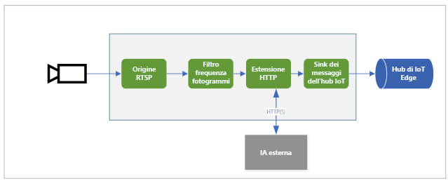

Il diagramma mostra il flusso dei segnali in questo argomento di avvio rapido. Un [modulo Edge](https://github.com/Azure/live-video-analytics/tree/master/utilities/rtspsim-live555) simula una videocamera IP che ospita un server RTSP (Real-Time Streaming Protocol). Un nodo di [origine RTSP](../../../media-graph-concept.md#rtsp-source) estrae il feed video da questo server e invia i fotogrammi video al nodo del [processore di filtro della frequenza dei fotogrammi](../../../media-graph-concept.md#frame-rate-filter-processor). Questo processore limita la frequenza dei fotogrammi dello streaming video che raggiunge il nodo del [processore di estensioni HTTP](../../../media-graph-concept.md#http-extension-processor). 

Il nodo di estensioni HTTP svolge il ruolo di proxy. Converte i fotogrammi video nel tipo di immagine specificato. Quindi inoltra l'immagine su REST a un altro modulo Edge che esegue un modello di intelligenza artificiale dietro un endpoint HTTP. In questo esempio, il modulo Edge viene creato usando il modello [YOLOv3](https://github.com/Azure/live-video-analytics/tree/master/utilities/video-analysis/yolov3-onnx), che è in grado di rilevare molti tipi di oggetti. Il nodo del processore di estensioni HTTP raccoglie i risultati del rilevamento e pubblica gli eventi nel nodo [sink dell'hub IoT](../../../media-graph-concept.md#iot-hub-message-sink). Il nodo invia quindi gli eventi all'[hub di IoT Edge](../../../../../iot-edge/iot-edge-glossary.md#iot-edge-hub).

Contenuto dell'avvio rapido:

1. Creare e distribuire il grafico multimediale.
1. Interpretare i risultati.
1. Pulire le risorse.
