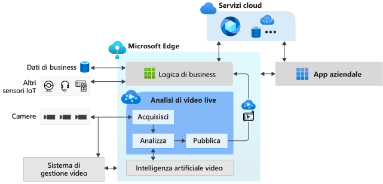

# Informazioni su Live Video Analytics in IoT Edge (anteprima)

Live Video Analytics in IoT Edge offre una piattaforma per creare applicazioni video intelligenti che vanno da Edge al cloud. La piattaforma offre la possibilità di acquisire, registrare e analizzare video live oltre alla pubblicazione dei risultati, ovvero video e/o analisi video, nei servizi di Azure, in particolare nel cloud e/o in Edge. La piattaforma può essere usata per migliorare le soluzioni IoT grazie all'analisi video. La funzionalità Live Video Analytics in IoT Edge può essere combinata con altri moduli di Azure IoT Edge, tra cui Analisi di flusso in IoT Edge, Servizi cognitivi in IoT Edge, e con servizi di Azure sul cloud come Servizi multimediali, Hub eventi, Servizi cognitivi e così via, per creare applicazioni ibride avanzate, ad esempio per dispositivi perimetrali e cloud.

La funzionalità Live Video Analytics in IoT Edge è progettata per essere una piattaforma estendibile, che consente di connettere diversi moduli perimetrali di analisi video (ad esempio, contenitori di servizi cognitivi, moduli Edge personalizzati compilati con modelli di Machine Learning open source o modelli personalizzati di cui è stato eseguito il training con i propri dati) e di usarli per analizzare i video live senza preoccuparsi della complessità della creazione e dell'esecuzione di una pipeline di video live.

## Accelerare lo sviluppo di soluzioni IoT 

Le soluzioni IoT che combinano l'analisi dei video con i segnali provenienti da altri sensori IoT e/o dati aziendali possono contribuire a rendere le decisioni aziendali automatiche o semi-automatiche, con conseguente miglioramento della produttività. Live Video Analytics in IoT Edge consente di creare tali soluzioni più rapidamente. L'utente può concentrarsi sulla creazione di moduli e logica di analisi di video specifici per l'azienda, consentendo alla piattaforma di nascondere le complessità di gestione ed esecuzione di una pipeline video.

Con Live Video Analytics in IoT Edge, l'utente può continuare a usare le [fotocamere CCTV](https://en.wikipedia.org/wiki/Closed-circuit_television_camera) con i [sistemi di gestione video (VM)](https://en.wikipedia.org/wiki/Video_management_system) esistenti e creare app di analisi video in modo indipendente. Live Video Analytics in IoT Edge può essere usato insieme all'SDK per la visione su computer e a toolkit per creare soluzioni IoT all'avanguardia. Il diagramma seguente illustra questo concetto.

## Ambienti supportati

Sono supportati gli ambienti Linux x86-64 e ARM64.
> [!NOTE]
> Il supporto per i dispositivi ARM64 è disponibile nelle build `1.0.4` e successive.
> Il supporto per l'esecuzione del runtime IoT Edge di Azure nei dispositivi ARM64 è in [anteprima pubblica](https://azure.microsoft.com/support/legal/preview-supplemental-terms/).

## Introduzione

Leggere gli articoli concettuali seguenti e quindi provare un avvio rapido per eseguire il rilevamento del movimento in un feed video live.

### Concetti

* [Grafo multimediale](media-graph-concept.md)
* [Registrazione di video](video-recording-concept.md)
* [Riproduzione di video](video-playback-concept.md)
* [Registrazione continua di video](continuous-video-recording-concept.md)
* [Registrazione di video basata su eventi](event-based-video-recording-concept.md)
* [Live Video Analytics senza registrazione video](analyze-live-video-concept.md)

## Passaggi successivi

* Seguire l'esercitazione [Avvio rapido: Eseguire Live Video Analytics con un modello personalizzato](use-your-model-quickstart.md) per ottenere informazioni su come eseguire il rilevamento del movimento in un feed video live.
* Esaminare la [terminologia](terminology.md)
* Esplorare i [materiali open source su Live Video Analytics](https://github.com/Azure/live-video-analytics)

