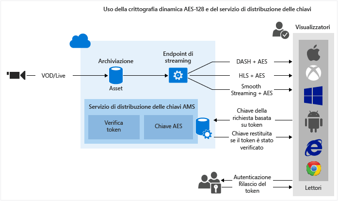

<properties 
	pageTitle="Informazioni generali sulla protezione dei contenuti" 
	description="Questi articoli forniscono informazioni generali sulla protezione dei contenuti con Servizi multimediali." 
	services="media-services" 
	documentationCenter="" 
	authors="Juliako" 
	manager="erikre" 
	editor=""/>

<tags 
	ms.service="media-services" 
	ms.workload="media" 
	ms.tgt_pltfrm="na" 
	ms.devlang="na" 
	ms.topic="article" 
	ms.date="06/22/2016" 
	ms.author="juliako"/>

#Informazioni generali sulla protezione dei contenuti

Servizi multimediali di Microsoft Azure consente di proteggere i file multimediali dal momento in cui escono dal computer fino alle fasi di archiviazione, elaborazione e recapito. Servizi multimediali consente di distribuire contenuti crittografati dinamicamente con AES (Advanced Encryption Standard), mediante chiavi di crittografia a 128 bit, e con la crittografia comune (CENC), mediante PlayReady e/o Widevine DRM. Servizi multimediali fornisce inoltre un servizio per la distribuzione di chiavi AES e licenze PlayReady ai client autorizzati. È anche possibile usare i partner AMS seguenti per facilitare la distribuzione di licenze Widevine: [Axinom](http://www.axinom.com/press/ibc-axinom-drm-6/), [EZDRM](http://ezdrm.com/), [castLabs](http://castlabs.com/company/partners/azure/).

- L'immagine seguente illustra il flusso di lavoro "crittografia comune dinamica PlayReady e/o Widevine DRM". Per informazioni dettagliate, vedere l'articolo relativo all'[uso della crittografia comune dinamica PlayReady e/o Widevine DRM](media-services-protect-with-drm.md).

- L'immagine seguente illustra il flusso di lavoro "crittografia dinamica AES-128". Per informazioni dettagliate, vedere [Uso della crittografia dinamica AES-128 e del servizio di distribuzione delle chiavi](media-services-protect-with-aes128.md).

>[AZURE.NOTE]Per poter usare la crittografia dinamica, è prima necessario ottenere almeno un'unità riservata di streaming nell'endpoint di streaming da cui si desidera trasmettere in streaming i contenuti crittografati.

##Opzioni di crittografia di asset

A seconda del tipo di contenuto che si vuole caricare, archiviare e distribuire, in Servizi multimediali è possibile scegliere tra varie opzioni di crittografia.

###None 

Non viene usata alcuna crittografia. Si tratta del valore predefinito. Quando si usa questa opzione il contenuto non è protetto durante il transito, né nell'archiviazione locale.

Se si prevede di distribuire un file MP4 tramite download progressivo, usare questa opzione per caricare il contenuto.

###StorageEncrypted 

Usare **StorageEncrypted** per crittografare localmente il contenuto non crittografato applicando la crittografia AES a 256 bit e quindi caricarlo nel servizio Archiviazione di Azure, dove viene archiviato in forma crittografata. Gli asset protetti con la crittografia di archiviazione vengono decrittografati automaticamente e inseriti in un file system crittografato prima della codifica. Se necessario, inoltre, possono essere ricrittografati prima del successivo caricamento come nuovo asset di output. La crittografia di archiviazione viene usata principalmente per proteggere file multimediali di input di alta qualità archiviati su disco applicando una crittografia avanzata.

Per poter trasmettere l'asset crittografato di archiviazione, è necessario configurare i criteri di distribuzione dell'asset in modo da informare Servizi multimediali della modalità di distribuzione del contenuto. Per potere permettere lo streaming dell'asset, il server di streaming rimuove la crittografia di archiviazione ed esegue lo streaming dei contenuti usando i criteri di recapito specificati (ad esempio, AES, crittografia comune o nessuna crittografia).

####Dettagli dell'implementazione

La crittografia di archiviazione AMS applica la crittografia in modalità **AES-CTR** all'intero file. La modalità CTR-AES è una crittografia a blocchi in grado di crittografare dati di lunghezza arbitraria senza bisogno di spaziatura interna. Funziona mediante la crittografia di un blocco di contatori con l'algoritmo AES e l'applicazione di XOR sull'output di AES con i dati da crittografare o decrittografare. Il blocco di contatori usato viene creato copiando il valore di InitializationVector nei byte da 0 a 7 del valore del contatore, mentre i byte da 8 a 15 del valore del contatore vengono impostati su zero. Nel blocco del contatore a 16 byte, i byte da 8 a 15, vale a dire i byte meno significativi, vengono usati come semplice numero intero a 64 bit senza firma che viene aumentato di uno per ogni blocco di dati elaborato successivo e viene mantenuto nell'ordine dei byte di rete. Si noti che quando il numero intero raggiunge il valore massimo 0xFFFFFFFFFFFFFFFF, un incremento azzera i byte da 8 a 15 del contatore del blocco, senza influenzare gli altri 64 bit del contatore, vale a dire i byte da 0 a 7. Per mantenere la sicurezza della crittografia in modalità AES-CTR, il valore InitializationVector di un KID specificato deve essere univoco per ogni file e i file devono essere di lunghezza inferiore a 2^64 blocchi. Questo metodo serve a garantire che un valore del contatore non venga mai riutilizzato con una chiave specificata. Per altre informazioni sulla modalità CTR, vedere questa [pagina wiki](https://en.wikipedia.org/wiki/Block_cipher_mode_of_operation#CTR). L'articolo wiki usa il termine "Nonce" anziché "InitializationVector".

Per vedere come funziona l'algoritmo di base, vedere l'implementazione di AMS .NET dei metodi seguenti:

- [ApplyEncryptionTransform](https://github.com/Azure/azure-sdk-for-media-services/blob/dev/src/net/Client/Common/Common.BlobTransfer/BlobTransferBase.cs)
- [AesCtr](https://github.com/Azure/azure-sdk-for-media-services/blob/dev/src/net/Client/Common/Common.FileEncryption/FileEncryptionTransform.cs)

###CommonEncryptionProtected 

Usare **CommonEncryptionProtected** per crittografare o caricare contenuto già crittografato e protetto con la crittografia comune. PlayReady e Widewine vengono crittografati in base alle specifiche della crittografia comune (CENC) e sono supportati da AMS.

###EnvelopeEncryptionProtected

Usare **EnvelopeEncryptionProtected** se si vuole proteggere o caricare contenuto HLS (HTTP Live Streaming) già protetto, crittografato con AES (Advanced Encryption Standard). Si noti che se si sta caricando contenuto HLS già crittografato con AES, la crittografia deve essere stata eseguita con Transform Manager.

##Crittografia dinamica

Servizi multimediali di Microsoft Azure consente di distribuire contenuti crittografati dinamicamente con AES (Advanced Encryption Standard), mediante chiavi di crittografia a 128 bit e con PlayReady e/o Widevine DRM.

Attualmente è possibile crittografare i formati di streaming seguenti: HLS, MPEG DASH e Smooth Streaming. Non è possibile crittografare il formato di streaming HDS o i download progressivi.

Per consentire a Servizi multimediali di crittografare un asset, è necessario associare una chiave di crittografia (CommonEncryption o EnvelopeEncryption) all'asset e configurare anche i criteri di autorizzazione per la chiave.

È anche necessario configurare i criteri di distribuzione degli asset. Se si vuole trasmettere in streaming un asset crittografato di archiviazione, assicurarsi di specificare come si intende recapitarlo configurando i criteri di distribuzione degli asset.

Quando un flusso viene richiesto da un lettore, Servizi multimediali usa la chiave specificata per crittografare dinamicamente i contenuti mediante AES o la crittografia comune. Per decrittografare il flusso, il lettore richiederà la chiave dal servizio di distribuzione delle chiavi. Per decidere se l'utente è autorizzato a ottenere la chiave, il servizio valuta i criteri di autorizzazione specificati.

>[AZURE.NOTE]Per avvalersi della crittografia dinamica, è necessario ottenere almeno un'unità di streaming su richiesta per l'endpoint di streaming da cui si intende distribuire i contenuti crittografati. Per altre informazioni, vedere la sezione relativa al [ridimensionamento di Servizi multimediali](media-services-manage-origins.md#scale_streaming_endpoints).

##Servizio di distribuzione di licenze e chiavi

Servizi multimediali offre un servizio per la distribuzione di licenze DRM (PlayReady e Widevine) e di chiavi non crittografate AES ai client autorizzati. È possibile usare il portale di Azure classico, l'API REST o l'SDK di Servizi multimediali per .NET per configurare i criteri di autorizzazione e autenticazione per le licenze e le chiavi.

Se si usa il portale, sarà possibile configurare un criterio AES, che verrà applicato a tutti i contenuti con crittografia AES, e un criterio PlayReady, che verrà applicato a tutti i contenuti con crittografia PlayReady. Usare l'SDK di Servizi multimediali per .NET se si vuole ottenere maggiore controllo sulle configurazioni.

##Licenze DRM 

###Licenza PlayReady 

Servizi multimediali offre un servizio per la distribuzione di licenze PlayReady. Quando il lettore dell'utente finale (ad esempio Silverlight) cerca di riprodurre il contenuto protetto con PlayReady, viene inviata una richiesta al servizio di distribuzione di licenze per ottenere una licenza. Se il servizio licenze approva la richiesta, la licenza viene rilasciata e inviata al client e potrà essere usata per decrittografare e riprodurre il contenuto specificato.

Le licenze contengono i diritti e le limitazioni che il runtime di PlayReady DSM imporrà quando un utente cerca di riprodurre contenuto protetto. Servizi multimediali fornisce API che permettono di configurare le licenze PlayReady. Per altre informazioni, vedere [Panoramica del modello di licenza PlayReady di Servizi multimediali](media-services-playready-license-template-overview.md).

###Licenza Widevine

AMS consente inoltre di recapitare contenuti DASH MPEG crittografati con Widevine DRM. PlayReady e Widewine vengono crittografati in base alle specifiche della crittografia comune (CENC). È possibile utilizzare [AMS .NET SDK](https://www.nuget.org/packages/windowsazure.mediaservices/) (iniziando con la versione 3.5.1) o l'API REST per configurare l’AssetDeliveryConfiguration per utilizzare Widevine.

A partire da Media Services .NET SDK versione 3.5.2, Servizi multimediali consente di configurare il [modello di licenza Widevine](media-services-widevine-license-template-overview.md) e ottenere licenze Widevine. È anche possibile usare i partner AMS seguenti per facilitare la distribuzione di licenze Widevine: [Axinom](http://www.axinom.com/press/ibc-axinom-drm-6/), [EZDRM](http://ezdrm.com/), [castLabs](http://castlabs.com/company/partners/azure/).

##Restrizione Token

I criteri di autorizzazione delle chiavi simmetriche possono avere una o più restrizioni di tipo Open o Token. I criteri con restrizione Token devono essere accompagnati da un token rilasciato da un servizio STS (Secure Token Service, servizio token di sicurezza). Servizi multimediali supporta i token nei formati Simple Web Tokens (SWT) e JSON Web Token (JWT). Servizi multimediali non fornisce servizi token di sicurezza. Per il rilascio di token è possibile creare un servizio token di sicurezza personalizzato oppure usare il Servizio di controllo di accesso di Microsoft Azure. Il servizio token di sicurezza deve essere configurato in modo da creare un token firmato con la chiave specificata e rilasciare le attestazioni specificate nella configurazione della restrizione token. Il servizio di distribuzione di chiavi di Servizi multimediali restituirà al client la chiave o la licenza richiesta se il token è valido e le attestazioni del token corrispondono a quelle configurate per la chiave o la licenza.

Quando si configurano i criteri di restrizione Token, è necessario specificare i parametri primary verification key, issuer e audience. Il parametro primary verification key include la chiave usata per firmare il token. Il parametro issuer è il servizio token di sicurezza che emette il token. Il parametro audience (talvolta denominato scope) descrive l'ambito del token o la risorsa a cui il token autorizza l'accesso. Il servizio di distribuzione delle chiavi di Servizi multimediali verifica che i valori nel token corrispondano ai valori nel modello.

##Scenari comuni

###Proteggere i contenuti nella memoria, distribuire i flussi multimediali crittografati dinamicamente, usare il servizio di distribuzione di licenze/chiavi AMS

1. Inserire un file in formato intermedio di qualità elevata in un asset. Applicare all'asset l'opzione di crittografia di archiviazione.
2. Configurare gli endpoint di streaming
1. Eseguire la codifica in Set MP4 a velocità in bit adattiva. Applicare all'asset di output l'opzione di crittografia di archiviazione.
1. Creare una chiave di crittografia simmetrica per l'asset a cui si desidera applicare la crittografia dinamica durante la riproduzione.
2. Configurare i criteri di autorizzazione della chiave simmetrica.
1. Configurare i criteri di distribuzione degli asset (usati per la creazione dinamica dei pacchetti e la crittografia dinamica).
1. Pubblicare l'asset creando un localizzatore OnDemand.
1. Trasmettere in streaming i contenuti pubblicati.

Per altre informazioni vedere [Proteggere tramite AES](media-services-protect-with-aes128.md) e [Proteggere con PlayReady e/o Widevine](media-services-protect-with-drm.md).

###Usare il servizio di distribuzione di licenze e chiavi di Servizi multimediali con i propri servizi di crittografia e streaming

Per altre informazioni, vedere l'articolo relativo all'[integrazione del servizio licenze Azure PlayReady con il server del componente di crittografia/streaming](http://mingfeiy.com/integrate-azure-playready-license-service-encryptorstreaming-server).

###Integrazione con i partner

[Uso di castLabs per distribuire licenze DRM a Servizi multimediali di Azure](media-services-castlabs-integration.md)

##Percorsi di apprendimento di Media Services

[AZURE.INCLUDE [media-services-learning-paths-include](../../includes/media-services-learning-paths-include.md)]

##Fornire commenti e suggerimenti

[AZURE.INCLUDE [media-services-user-voice-include](../../includes/media-services-user-voice-include.md)]

##Collegamenti correlati

[Annuncio di PlayReady come servizio e della crittografia dinamica AES con Servizi multimediali di Azure](http://mingfeiy.com/playready)

[Prezzi della distribuzione della licenza PlayReady di Servizi multimediali di Azure](http://mingfeiy.com/playready-pricing-explained-in-azure-media-services)

[Debug del flusso con crittografia AES in Servizi multimediali di Azure](http://mingfeiy.com/debug-aes-encrypted-stream-azure-media-services)

[Autenticazione dei token JWT](http://www.gtrifonov.com/2015/01/03/jwt-token-authentication-in-azure-media-services-and-dynamic-encryption/)

[Integrare l'app basata su OWIN MVC di Servizi multimediali di Azure con Azure Active Directory e limitare la distribuzione di chiavi simmetriche in base ad attestazioni JWT](http://www.gtrifonov.com/2015/01/24/mvc-owin-azure-media-services-ad-integration/).

[Usare il Servizio di controllo di accesso di Azure per il rilascio di token](http://mingfeiy.com/acs-with-key-services).

[content-protection]: ./media/media-services-content-protection-overview/media-services-content-protection.png

<!---HONumber=AcomDC_0629_2016-->