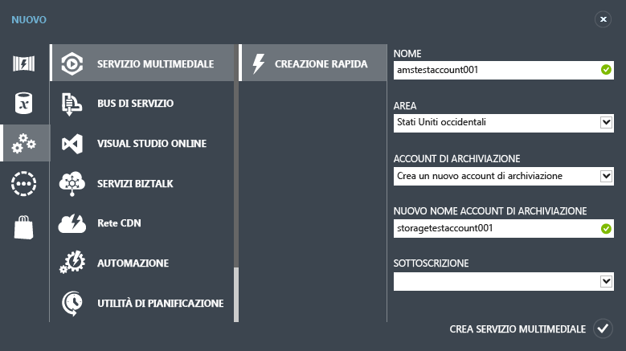

<properties
	pageTitle="Creare un account di Servizi multimediali | Microsoft Azure"
	description="Spiega come creare un nuovo account di Servizi multimediali in Azure."
	services="media-services"
	documentationCenter=""
	authors="Juliako"
	manager="erikre"
	editor=""/>

<tags
	ms.service="media-services"
	ms.workload="media"
	ms.tgt_pltfrm="na"
	ms.devlang="na"
	ms.topic="get-started-article"
	ms.date="09/26/2016"
	ms.author="juliako"/>

# Creare un account di Servizi multimediali di Azure

> [AZURE.SELECTOR]
- [Portale](media-services-create-account.md)
- [PowerShell](media-services-manage-with-powershell.md)
- [REST](http://msdn.microsoft.com/library/azure/dn194267.aspx)

> [AZURE.NOTE] Per completare l'esercitazione, è necessario un account Azure. Per informazioni dettagliate, vedere la pagina relativa alla [versione di valutazione gratuita di Azure](/pricing/free-trial/?WT.mc_id=A261C142F).
 
Nel portale di Azure classico è possibile creare rapidamente un account di Servizi multimediali di Azure. È possibile utilizzare l'account per accedere ai servizi multimediali che consentono di archiviare, crittografare, codificare, gestire e distribuire in streaming contenuti multimediali in Azure. Durante la creazione di un account di Servizi multimediali, viene creato l'account di archiviazione associato (se non si desidera utilizzarne uno esistente) nella stessa area geografica dell'account di Servizi multimediali.

Questo argomento descrive come usare il metodo di creazione rapida per creare un nuovo account di Servizi multimediali e quindi associarlo a un account di archiviazione.

## Concetti

Per accedere a Servizi multimediali è necessario disporre di due account associati:

-   **Account di Servizi multimediali**. L'account consente di accedere a un set di Servizi multimediali basati su cloud disponibili in Azure. In un account di Servizi multimediali non è possibile archiviare contenuti multimediali effettivi, ma è possibile archiviare i metadati relativi al contenuto multimediale e i processi di elaborazione dei file multimediali. Al momento della creazione dell'account, è necessario selezionare un'area di Servizi multimediali disponibile. L'area selezionata è un data center in cui sono archiviati i record dei metadati per l'account.

	Le aree di Servizi multimediali (AMS) disponibili includono: Europa settentrionale, Europa occidentale, Stati Uniti occidentali, Stati Uniti orientali, Asia sudorientale, Asia orientale, Giappone occidentale, Giappone orientale. In Servizi multimediali non vengono utilizzati gruppi di affinità.
	
	AMS è ora disponibile anche nei data center seguenti: Brasile meridionale, India occidentale, India meridionale e India centrale. È ora possibile usare il portale di Azure classico per [creare account di Servizi multimediali](media-services-create-account.md#create-a-media-services-account-using-quick-create) ed eseguire diverse attività descritte [qui](https://azure.microsoft.com/documentation/services/media-services/). In questi data center la codifica live non è tuttavia abilitata. Inoltre, non sono disponibili tutti i tipi di unità riservate di codifica.
	
	- Brasile meridionale: sono disponibili solo unità riservate di codifica Standard e Basic
	- India occidentale, India meridionale e India centrale: sono disponibili solo unità riservate di codifica Basic

-   **Account di archiviazione associato**. L'account di archiviazione è un account di archiviazione di Azure associato all'account di Servizi multimediali. L'account di archiviazione offre l'archiviazione BLOB per i file multimediali e deve trovarsi nella stessa area geografica dell'account di Servizi multimediali. Quando si crea un account di Servizi multimediali, è possibile scegliere un account di archiviazione esistente nella stessa area geografica oppure è possibile crearne uno nuovo, ma sempre nella stessa area. Se si elimina un account di Servizi multimediali, gli oggetti BLOB presenti nell'account di archiviazione associato non vengono eliminati.

## Creare un account di Servizi multimediali tramite Creazione rapida

1. Nel [portale di Azure classico][] fare clic su **Nuovo**, quindi su **Servizio multimediale** e infine su **Creazione rapida**.

2. In **NAME** immettere il nome per il nuovo account. Un nome di account di Servizi multimediali deve essere composto da tutte lettere minuscole o da numeri senza spazi con una lunghezza compresa tra 3 e 24 caratteri.

3. In **REGION** selezionare l'area geografica che verrà utilizzata per archiviare i record dei metadati per l'account di Servizi multimediali. Nell'elenco a discesa vengono visualizzate solo le aree di Servizi multimediali disponibili.

4. In **STORAGE ACCOUNT** selezionare un account di archiviazione per l'archiviazione BLOB del contenuto multimediale dell'account di Servizi multimediali. È possibile scegliere un account di archiviazione esistente nella stessa area geografica dell'account di Servizi multimediali oppure è possibile crearne uno nuovo. Un nuovo account di archiviazione viene creato nella stessa area geografica.

5. Se è stato creato un nuovo account di archiviazione, in **NEW STORAGE ACCOUNT NAME** specificare un nome per l'account di archiviazione. Per i nomi degli account di archiviazione vengono seguite le stesse regole dei nomi degli account di Servizi multimediali.

6. Nella parte inferiore del modulo fare clic su **Quick Create**.

È possibile monitorare lo stato di elaborazione nell'area dei messaggi, nella parte inferiore della finestra.

Lo stato passa a Active quando la creazione dell'account è stata completata. Verrà visualizzata la pagina **media services** con il nuovo account.

Nella parte inferiore della pagina viene visualizzato il pulsante **GESTISCI CHIAVI**. Quando si fa clic su questo pulsante, viene visualizzata una pagina con il nome dell'account di Servizi multimediali e le chiavi primaria e secondaria. Per accedere a livello di codice all'account di Servizi multimediali è richiesto il nome dell'account e la chiave primaria.

Quando si fa doppio clic sul nome dell'account, per impostazione predefinita viene visualizzata la pagina **Avvio rapido**. Questa pagina consente di eseguire alcune attività di gestione disponibili anche in altre pagine del portale. È ad esempio possibile caricare un file video sia da questa pagina sia dalla pagina **CONTENUTO**.

È inoltre possibile visualizzare il codice usato dall'SDK di Servizi multimediali di Azure per eseguire attività di caricamento, codifica e pubblicazione di video. È inoltre possibile fare clic su uno dei collegamenti disponibili nella sezione **SCRIVI CODICE**, copiare il codice e usarlo nella propria applicazione.

##Percorsi di apprendimento di Servizi multimediali

[AZURE.INCLUDE [media-services-learning-paths-include](../../includes/media-services-learning-paths-include.md)]

##Fornire commenti e suggerimenti

[AZURE.INCLUDE [media-services-user-voice-include](../../includes/media-services-user-voice-include.md)]

## Passaggi successivi

- [Introduzione a Distribuzione di contenuti Video on Demand (VoD) tramite .NET SDK](media-services-dotnet-get-started.md)

- [Usare .NET SDK per creare canali che eseguono la codifica live da un flusso a velocità in bit singola a un flusso a più velocità in bit](media-services-dotnet-creating-live-encoder-enabled-channel.md)

<!-- Reusable paths. -->

<!-- Anchors. -->
  [Concepts]: #concepts
  [Before you begin]: #begin
  [How to: Create a Media Services account using Quick Create]: #quick

<!-- URLs. -->
  [Web Platform Installer]: http://go.microsoft.com/fwlink/?linkid=255386

  [portale di Azure classico]: http://manage.windowsazure.com/

<!---HONumber=AcomDC_0928_2016-->