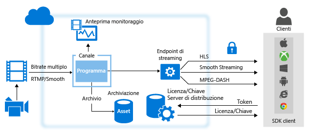
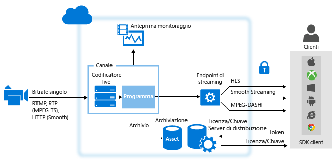

<properties 
	pageTitle="Panoramica di Live Streaming con Servizi multimediali di Azure" 
	description="Questo argomento offre una panoramica di Live Streaming con Servizi multimediali di Azure." 
	services="media-services" 
	documentationCenter="" 
	authors="Juliako" 
	manager="erikre" 
	editor=""/>

<tags 
	ms.service="media-services" 
	ms.workload="media" 
	ms.tgt_pltfrm="na" 
	ms.devlang="ne" 
	ms.topic="article" 
	ms.date="05/18/2016"
	ms.author="juliako"/>

#Panoramica di Live Streaming con Servizi multimediali di Azure

##Panoramica

Quando si distribuiscono eventi Live Streaming con Servizi multimediali di Azure, sono generalmente necessari i componenti seguenti:

- Una fotocamera da usare per trasmettere un evento.
- Un codificatore video attivo in grado di convertire i segnali provenienti dalla fotocamera in flussi inviati a un servizio di streaming live.

	Facoltativamente, più codificatori live con sincronizzazione dell'ora. In caso di eventi live critici per i quali sono richiesti livelli molto elevati di disponibilità e qualità dell'esperienza, è consigliabile usare codificatori ridondanti di tipo attivo-attivo con sincronizzazione dell'ora per ottenere un failover efficiente senza perdita di dati.
- Un servizio di streaming live che consenta di effettuare le seguenti operazioni:
	
	- inserire contenuti live usando vari protocolli di streaming live (ad esempio RTMP o Smooth Streaming),
	- (facoltativamente) codificare il flusso per il flusso a bitrate adattivo,
	- visualizzare in anteprima il flusso live,
	- registrare e archiviare il contenuto inserito perché possa essere riprodotto in streaming in un secondo momento (video on demand),
	- usare protocolli di streaming comuni (ad esempio, MPEG DASH, Smooth, HLS, HDS) per trasmettere i contenuti direttamente ai clienti o a una rete CDN (Content Delivery Network, rete per la distribuzione di contenuti) per una successiva ridistribuzione.

**Servizi multimediali di Microsoft Azure** (AMS) offre la possibilità di inserire, visualizzare in anteprima, archiviare e fornire il contenuto in streaming live.

Quando si distribuiscono contenuti ai clienti, l'obiettivo è riuscire a trasmettere video di alta qualità a vari tipi di dispositivi in diverse condizioni di rete. Per raggiungere questo obiettivo, usare codificatori live per codificare il flusso in un flusso video a bitrate multiplo (bitrate adattivo). Per garantire la trasmissione a diversi tipi di dispositivi, usare la funzione di [creazione dinamica dei pacchetti](media-services-dynamic-packaging-overview.md) di Servizi multimediali per riorganizzare dinamicamente il flusso in nuovi pacchetti creati con protocolli diversi. Servizi multimediali supporta operazioni di trasmissione nelle seguenti tecnologie di streaming a velocità in bit adattiva: HTTP Live Streaming (HLS), Smooth Streaming, MPEG DASH e HDS (solo per i titolari di licenza Adobe PrimeTime/Access).

In Servizi multimediali di Azure, la gestione di tutte le funzionalità di live streaming è affidata a entità **Channel**, **Program** e **StreamingEndpoint**, compresi inserimento, formattazione, DVR, sicurezza, scalabilità e ridondanza.

Un **Canale** rappresenta una pipeline per l'elaborazione di contenuto in streaming live. Un canale può ricevere i flussi di input live nei modi seguenti:

- Un codificatore live locale invia un flusso **RTMP** o **Smooth Streaming** (MP4 frammentato) a bitrate multiplo al canale configurato per il recapito **pass-through**. Il recapito **pass-through** avviene quando i flussi inseriti passano attraverso i **canali**senza altre elaborazioni. È possibile usare i codificatori live seguenti che generano output in formato Smooth Streaming a più velocità in bit: Elemental, Envivio, Cisco. I codificatori live seguenti generano output in formato RTMP: Adobe Flash Media Live Encoder (FMLE), Telestream Wirecast e transcodificatori Tricaster. Un codificatore live può anche inviare un flusso a bitrate singolo a un canale non abilitato per la codifica live, ma questa operazione non è consigliata. Quando richiesto, Servizi multimediali invia il flusso ai clienti.

	>[AZURE.NOTE] L'uso di un metodo pass-through è il modo più economico per realizzare lo streaming live quando si eseguono più eventi per un lungo periodo di tempo e si è già investito in codificatori locali. Vedere i dettagli sui [prezzi](/pricing/details/media-services/).
	
	
- Un codificatore live locale invia un flusso a bitrate singolo al canale abilitato per l'esecuzione della codifica live con Servizi multimediali in uno dei seguenti formati: RTMP o Smooth Streaming (MP4 frammentato). È supportato anche il formato RTP (MPEG-TS) ma, in questo caso, è necessario avere una connessione dedicata al data center di Azure. Con questo tipo di canali possono interagire i seguenti codificatori live con output RTMP: Telestream Wirecast, FMLE. Il canale esegue quindi la codifica live del flusso in ingresso a velocità in bit singola in un flusso video a più velocità in bit (adattivo). Quando richiesto, Servizi multimediali invia il flusso ai clienti.

A partire dalla versione 2.10 di Servizi multimediali, quando si crea un canale è possibile specificare in che modo il canale riceverà il flusso di input e se eseguirà o meno la codifica live del flusso. Sono disponibili due opzioni:

- **Nessuno** (pass-through): specificare questo valore se si prevede di usare un codificatore live locale che genera un flusso a bitrate multiplo (un flusso pass-through). In questo caso, il flusso in ingresso viene passato all'output senza codifica. Questo è il comportamento di un canale prima della versione 2.10.  

- **Standard** - scegliere questo valore se si prevede di usare Servizi multimediali per codificare il flusso live a velocità in bit singola in un flusso a più velocità in bit. Questo metodo è il più vantaggioso per aumentare rapidamente le unità in caso di eventi non frequenti. Tenere presente che la codifica live è soggetta a un costo e che se si lascia un canale di codifica live impostato sullo stato "In esecuzione", vengono aggiunti nuovi costi alla fatturazione. Per evitare costi orari aggiuntivi, quindi, è consigliabile arrestare immediatamente i canali in esecuzione al termine dell'evento in streaming live.

##Confronto tra tipi di canale

Nella tabella seguente vengono confrontati i due tipi di canale supportati in Servizi Multimediali

Funzionalità|Canale pass-through|Canale standard
---|---|---
Input a bitrate singolo codificato in bitrate multipli nel cloud|No|Sì
Risoluzione massima, numero di livelli|1080p, 8 livelli, oltre 60 fps|720p, 6 livelli, 30 fps
Protocolli di input|RTMP, Smooth Streaming|RTMP, Smooth Streaming e RTP
Prezzo|Vedere la [pagina dei prezzi](/pricing/details/media-services/) e fare clic sulla scheda "Video live"|Vedere la [pagina dei prezzi](/pricing/details/media-services/) 
Tempo di esecuzione massimo|24 x 7|8 ore
Supporto per l'inserimento di slate|No|Sì
Supporto per annunci pubblicitari|No|Sì
Pass-through di sottotitoli CEA 608/708|Sì|Sì
Possibilità di recuperare brevi fasi di stallo in feed di contributo|Sì|No (senza dati di input, il canale avvierà lo slate dopo 6 secondi)
Supporto per GOP di input non uniformi|Sì|No: l'input deve essere fisso (GOP di 2 secondi)
Supporto per input con frequenza dei fotogrammi variabile|Sì|No: l'input deve essere una frequenza di fotogrammi fissa. Sono tollerate lievi variazioni, ad esempio durante scene ad alta velocità. Il codificatore, tuttavia, non può scendere a 10 fotogrammi al secondo.
Arresto automatico dei canali in caso di perdita del feed di input|No|Dopo 12 ore, nessun programma è in esecuzione 

##Utilizzo di canali che ricevono il flusso live a bitrate multiplo da codificatori locali con il metodo pass-through

Il diagramma seguente illustra le parti principali della piattaforma AMS coinvolte nel flusso di lavoro **pass-through**.

Per altre informazioni, vedere l'articolo relativo all'[utilizzo di canali che ricevono il flusso live a bitrate multiplo da codificatori locali](media-services-live-streaming-with-onprem-encoders.md).

##Uso di canali abilitati per l'esecuzione della codifica live con Servizi multimediali di Azure

Il seguente diagramma mostra i componenti principali della piattaforma AMS interessati dal flusso di lavoro di streaming live dove un canale è abilitato a eseguire la codifica live con Servizi multimediali.

Per altre informazioni, vedere [Uso di canali abilitati per l'esecuzione della codifica live con Servizi multimediali di Azure](media-services-manage-live-encoder-enabled-channels.md).

##Descrizione di un canale e dei relativi componenti

###Canale

In Servizi multimediali le entità [Channel](https://msdn.microsoft.com/library/azure/dn783458.aspx) sono responsabili dell'elaborazione dei contenuti in streaming live. Un'entità Channel, o canale, fornisce un endpoint di input (URL di inserimento) che può essere a sua volta fornito al transcodificatore live. Un'entità Channel riceve flussi di input live dal trascodificatore live e li rende disponibili per lo streaming mediante uno o più StreamingEndpoints. I canali forniscono anche un endpoint di anteprima(URL di anteprima) che consente di visualizzare in anteprima e convalidare il flusso prima dell'ulteriore elaborazione e del recapito.

È possibile ottenere l'URL di inserimento e l'URL di anteprima quando si crea il canale. Per ottenere questi URL, non è necessario che il canale sia nello stato avviato. Quando si è pronti per avviare l'inserimento di dati da un transcodificatore live nel canale, il canale deve essere avviato. Una volta che il transcodificatore live inizia a inserire i dati, è possibile visualizzare in anteprima il flusso.

Ogni account di Servizi multimediali può contenere più entità Channel, Program e StreamingEndpoint. In base alle esigenze di sicurezza e alla larghezza di banda, i servizi di StreamingEndpoint possono essere dedicati a uno o più canali. Qualsiasi StreamingEndpoint può effettuare il pull da qualsiasi canale.

###Programma 

Un [programma](https://msdn.microsoft.com/library/azure/dn783463.aspx) consente di controllare la pubblicazione e l'archiviazione di segmenti in un flusso live. I programmi sono gestiti dai canali. La relazione tra queste due entità è molto simile a quella che intercorre tra di essi nei media tradizionali, in cui un canale è costituito da un flusso costante di contenuti, mentre un programma ha come ambito una serie di eventi programmati sul canale. È possibile specificare il numero di ore per cui si vuole mantenere il contenuto registrato per il programma impostando la proprietà **ArchiveWindowLength**. Il valore impostato può essere compreso tra 5 minuti e 25 ore.

La proprietà ArchiveWindowLength determina anche il limite di tempo per cui i client possono eseguire ricerche a ritroso nel tempo dalla posizione live corrente. I programmi possono essere eseguiti per la quantità di tempo specificata, ma il contenuto che va oltre la durata prevista viene scartato in modo continuo. Il valore della proprietà determina anche il tempo per cui i manifesti client possono crescere.

Ogni programma è associato a un asset. Per pubblicare il programma, è necessario creare un localizzatore per l'asset associato. Con questo localizzatore sarà possibile creare un URL di streaming da fornire ai client.

Un canale supporta fino a tre programmi in esecuzione simultanea, in modo da poter creare più archivi dello stesso flusso in ingresso. Questo consente di pubblicare e archiviare parti diverse di un evento a seconda delle necessità. Si consideri ad esempio uno scenario in cui un'azienda richiede l'archiviazione di 6 ore di un programma e la trasmissione solo degli ultimi 10 minuti. A tale scopo, è necessario creare due programmi in esecuzione contemporaneamente. Un programma è impostato per l'archiviazione di 6 ore dell'evento, ma non viene pubblicato. L'altro programma è impostato per l'archiviazione di 10 minuti e viene pubblicato.

##Implicazioni relative alla fatturazione

Un canale avvia la fatturazione non appena il suo stato viene impostato su "In esecuzione" tramite l'API.

La tabella seguente illustra il mapping degli stati del canale agli stati di fatturazione nell'API e nel portale di Azure classico. È possibile che gli stati visualizzati nell'API risultino leggermente diversi da quelli dell'interfaccia del portale. Non appena un canale viene impostato sullo stato "In esecuzione" tramite l'API o sullo stato "Pronto" o "Streaming" nel portale di Azure classico, viene attivata la fatturazione.

Per sospendere l'attività di fatturazione del canale, è necessario interrompere il canale tramite l'API o nel portale di Azure classico. L'utente ad è responsabile dell'interruzione dei canali al termine dell'utilizzo del canale. La mancata interruzione del canale comporta infatti il proseguimento della fatturazione.

>[AZURE.NOTE]Quando si usano i canali Standard, Servizi multimediali di Azure arresterà automaticamente eventuali canali con stato ancora "In esecuzione" 12 ore dopo la perdita del feed di input in assenza di programmi in esecuzione. Verrà tuttavia addebitato comunque il tempo in cui il canale è rimasto in stato "In esecuzione".

###Stati del canale e relativi metodi di mapping alla modalità di fatturazione 

Si tratta dello stato attuale del canale. I valori possibili sono:

- **Arrestato**. Lo stato iniziale del canale dopo la creazione (se nel portale non è stata selezionata l'opzione di avvio automatico.) In questo stato non viene eseguita alcuna attività di fatturazione. In questo stato le proprietà del canale possono essere aggiornate ma lo streaming non è consentito.
- **Avvio in corso**. È in corso l'avvio del canale. In questo stato non viene eseguita alcuna attività di fatturazione. In questo stato non è consentito alcun aggiornamento o streaming. Se si verifica un errore, il canale torna allo stato Interrotto.
- **In esecuzione**. Il canale è in grado di elaborare flussi live. La fatturazione è ora attiva. È necessario interrompere il canale per sospendere la fatturazione. 
- **Arresto in corso**. È in corso l'interruzione del canale. In questo stato di transizione non viene eseguita alcuna attività di fatturazione. In questo stato non è consentito alcun aggiornamento o streaming.
- **Eliminazione in corso**. È in corso l'eliminazione del canale. In questo stato di transizione non viene eseguita alcuna attività di fatturazione. In questo stato non è consentito alcun aggiornamento o streaming.

La tabella seguente illustra il mapping degli stati del canale alla modalità di fatturazione.
 
Stato del canale|Indicatori dell'interfaccia utente del portale|Fatturazione?
---|---|---
Avvio in corso|Avvio in corso|No (stato temporaneo)
In esecuzione|Pronto (nessun programma in esecuzione) o Streaming (almeno un programma in esecuzione)|SÌ
Arresto in corso|Arresto in corso|No (stato temporaneo)
Arrestato|Arrestato|No

##Percorsi di apprendimento di Media Services

[AZURE.INCLUDE [media-services-learning-paths-include](../../includes/media-services-learning-paths-include.md)]

##Fornire commenti e suggerimenti

[AZURE.INCLUDE [media-services-user-voice-include](../../includes/media-services-user-voice-include.md)]

##Argomenti correlati

[Specifica per l'inserimento live di un flusso MP4 frammentato con Servizi multimediali di Azure](media-services-fmp4-live-ingest-overview.md)

[Uso di canali abilitati per l'esecuzione della codifica live con Servizi multimediali di Azure](media-services-manage-live-encoder-enabled-channels.md)

[Uso di canali che ricevono il flusso live a più velocità in bit da codificatori locali](media-services-live-streaming-with-onprem-encoders.md)

[Quote e limitazioni](media-services-quotas-and-limitations.md).

[Concetti su Servizi multimediali di Azure](media-services-concepts.md)

<!---HONumber=AcomDC_0601_2016-->