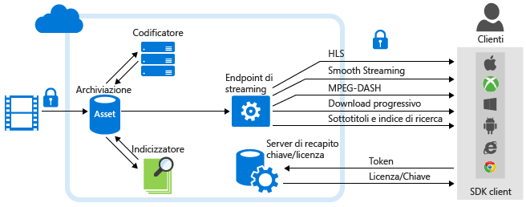

<properties 
	pageTitle="Panoramica e scenari comuni di Servizi multimediali di Azure" 
	description="Questo argomento fornisce informazioni generali su Servizi multimediali di Azure" 
	services="media-services" 
	documentationCenter="" 
	authors="Juliako" 
	manager="erikre" 
	editor=""/>

<tags 
	ms.service="media-services" 
	ms.workload="media" 
	ms.tgt_pltfrm="na" 
	ms.devlang="na" 
	ms.topic="hero-article" 
 	ms.date="05/03/2016" 
	ms.author="juliako;anilmur"/>

#Panoramica e scenari comuni di Servizi multimediali di Azure

Servizi multimediali di Microsoft Azure costituisce una piattaforma estensibile basata sul cloud che consente agli sviluppatori di creare applicazioni di distribuzione e gestione di contenuti multimediali altamente scalabili. Servizi multimediali si basa su API REST che consentono di caricare, archiviare e codificare in sicurezza contenuti video o audio, nonché creare pacchetti di tali contenuti per la distribuzione su richiesta e in modalità streaming live a vari tipi di client (ad esempio, TV, PC e dispositivi mobili).

È possibile creare flussi di lavoro end-to-end usando unicamente Servizi multimediali. È anche possibile usare componenti di terze parti per alcune parti del flusso di lavoro, ad esempio, la codifica con un codificatore di terze parti. Inoltre, sono possibili operazioni di caricamento, protezione, creazione di pacchetti e invio tramite Servizi multimediali.

È possibile scegliere di riprodurre in streaming i propri contenuti live o distribuire contenuti su richiesta. In questo argomento vengono illustrati scenari comuni per la distribuzione del contenuto [live](media-services-overview.md#live_scenarios) o [su richiesta](media-services-overview.md#vod_scenarios). L'argomento contiene inoltre collegamenti ad altri argomenti rilevanti.

## SDK e strumenti 

Per creare soluzioni di Servizi multimediali, è possibile usare:

- [API REST di Servizi multimediali](https://msdn.microsoft.com/library/azure/hh973617.aspx)
- Uno dei client SDK disponibili: 
	- [Azure Media Services SDK per .NET](https://github.com/Azure/azure-sdk-for-media-services) 
	- [Azure SDK per Java](https://github.com/Azure/azure-sdk-for-java), 
	- [Azure PHP SDK](https://github.com/Azure/azure-sdk-for-php), 
	- [Servizi multimediali di Azure per Node.js](https://github.com/michelle-becker/node-ams-sdk/blob/master/lib/request.js). Questa è una versione non Microsoft di Node.js SDK. È gestita da una community e attualmente non copre al 100% le API AMS. 
- Strumenti esistenti: 
	- [Portale di Azure classico](http://manage.windowsazure.com/) 
	- [Azure-Media-Services-Explorer](https://github.com/Azure/Azure-Media-Services-Explorer) (Azure Media Services Explorer (AMSE) è un'applicazione Winforms/C# per Windows)

##Percorsi di apprendimento di Servizi multimediali

È possibile visualizzare i percorsi di apprendimento AMS qui:

- [Flusso di lavoro AMS Live Streaming](https://azure.microsoft.com/documentation/learning-paths/media-services-streaming-live/)
- [Flusso di lavoro AMS Streaming su richiesta](https://azure.microsoft.com/documentation/learning-paths/media-services-streaming-on-demand/)

##Poster

[Qui](https://azure.microsoft.com/documentation/infographics/media-services/) è possibile visualizzare il poster di servizi multimediali di Azure che raffigura i flussi di lavoro AMS, dalla creazione del supporto tramite il consumo.

##Prerequisiti

Per iniziare a utilizzare Servizi multimediali di Azure, è necessario disporre di quanto segue:
 
3. Un account Azure. Se non si dispone di un account, è possibile creare un account di valutazione gratuita in pochi minuti. Per informazioni dettagliate, vedere la pagina relativa alla [versione di valutazione gratuita di Azure](azure.microsoft.com).
2. Un account di Servizi multimediali di Azure. Usare il portale di Azure classico, .NET o l'API REST per creare un account di Servizi multimediali di Azure. Per ulteriori informazioni, vedere [Creare un account](media-services-create-account.md).
3. (Facoltativo) Configurare l'ambiente di sviluppo. Scegliere .NET o API REST per l'ambiente di sviluppo. Per ulteriori informazioni, vedere [Configurare l’ambiente](media-services-dotnet-how-to-use.md). 

	Inoltre, sono disponibili informazioni su come connettersi a livello di programmazione [Connect](media-services-dotnet-connect-programmatically.md).
4. (Scelta consigliata) Allocare una o più unità di scala. Si consiglia di allocare una o più unità di scala per le applicazioni nell'ambiente di produzione. Per altre informazioni, vedere [Gestione degli endpoint di streaming](media-services-manage-origins.md).

##Panoramica e concetti

Per i concetti su Servizi multimediali di Azure, vedere [Concetti su Servizi multimediali di Azure](media-services-concepts.md).

Per una serie di procedure che illustra tutti i componenti principali di Servizi multimediali di Azure, vedere la pagina relativa alle [esercitazioni dettagliate di Servizi multimediali di Azure](https://docs.com/fukushima-shigeyuki/3439/english-azure-media-services-step-by-step-series). Questa serie offre un'ottima panoramica dei concetti e usa lo strumento AMSE per illustrare le attività AME. Si noti che AMSE è uno strumento di Windows. Questo strumento supporta la maggior parte delle attività che è possibile ottenere a livello di codice con [AMS SDK per .NET](https://github.com/Azure/azure-sdk-for-media-services), [Azure SDK per Java](https://github.com/Azure/azure-sdk-for-java) o [Azure PHP SDK](https://github.com/Azure/azure-sdk-for-php).

##Distribuzione di contenuti multimediali su richiesta con Servizi multimediali di Azure: scenari e attività comuni

In questa sezione vengono descritti scenari comuni e vengono forniti collegamenti agli argomenti rilevanti. Il seguente diagramma illustra le parti principali della piattaforma di Servizi multimediali che riguardano la fornitura di contenuti su richiesta.

###Protezione dei contenuti nella risorsa di archiviazione e distribuzione dei flussi multimediali in chiaro (non crittografati)

1. Caricare un file in formato intermedio di qualità elevata in un asset.
	
	Si consiglia di applicare all'asset l'opzione di crittografia di archiviazione, in modo da proteggere i contenuti sia durante il caricamento sia mentre si trovano nella risorsa di archiviazione.
 
1. Codificare in un set di file MP4 a velocità in bit adattiva.

	Si consiglia di applicare all'asset di output l'opzione di crittografia di archiviazione, in modo da proteggere i contenuti anche quando non vengono usati.
	
1. Configurare i criteri di distribuzione degli asset (usati per la creazione dinamica dei pacchetti).
	
	Se l'asset è protetto con crittografia di archiviazione, è **necessario** configurare i criteri di distribuzione degli asset.

1. Pubblicare l'asset creando un localizzatore OnDemand.

	Accertarsi che sia presente almeno un'unità riservata di streaming nell'endpoint di streaming da cui si desidera trasmettere i contenuti in streaming.

1. Trasmettere in streaming i contenuti pubblicati.

###Proteggere i contenuti nella risorsa di archiviazione e distribuire dinamicamente i flussi multimediali crittografati  

Per poter usare la crittografia dinamica, è prima necessario ottenere almeno un'unità riservata di streaming nell'endpoint di streaming da cui si desidera trasmettere in streaming i contenuti crittografati.

1. Caricare un file in formato intermedio di qualità elevata in un asset. Applicare all'asset l'opzione di crittografia di archiviazione.
1. Codificare in un set di file MP4 a velocità in bit adattiva. Applicare all'asset di output l'opzione di crittografia di archiviazione.
1. Creare una chiave di crittografia simmetrica per l'asset a cui si desidera applicare la crittografia dinamica durante la riproduzione.
2. Configurare i criteri di autorizzazione della chiave simmetrica.
1. Configurare i criteri di distribuzione degli asset (usati per la creazione dinamica dei pacchetti e la crittografia dinamica).
1. Pubblicare l'asset creando un localizzatore OnDemand.
1. Trasmettere in streaming i contenuti pubblicati. 

###Usare Analisi Servizi multimediali per derivare analisi approfondite di utilità pratica dai propri video 

Analisi Servizi multimediali è una raccolta di componenti per sintesi vocale e visione artificiale che permettono a organizzazioni e aziende di derivare in modo più semplice analisi approfondite di utilità pratica dai propri file video. Per altre informazioni, vedere [Panoramica di Analisi Servizi multimediali di Azure](media-services-analytics-overview.md).

1. Caricare un file in formato intermedio di qualità elevata in un asset.
2. Usare uno dei servizi di Analisi Servizi multimediali seguenti per elaborare i video:
	
	- **Indicizzatore**: [elaborazione di video con Azure Media Indexer 2](media-services-process-content-with-indexer2.md).
	- **Hyperlapse**: [file multimediali di Hyperlapse con Azure Media Hyperlapse](media-services-hyperlapse-content.md).
	- **Rilevamento movimento**: [rilevamento del movimento per Analisi Servizi multimediali di Azure](media-services-motion-detection.md).
	- **Rilevamento viso ed emozioni**: [rilevamento dei visi e delle emozioni per Analisi Servizi multimediali di Azure](media-services-face-and-emotion-detection.md).
	- **Riepilogo video**: [uso di anteprime video multimediali di Azure per creare un riepilogo video](media-services-video-summarization.md).
3. I processori di contenuti multimediali di Analisi Servizi multimediali producono file MP4 o JSON. Se un processore di contenuti multimediali produce un file MP4, è possibile scaricare progressivamente il file. Se un processore di contenuti multimediali produce un file JSON, è possibile scaricare il file dall'archiviazione BLOB di Azure. 

###Definizione del download progressivo 

1. Caricare un file in formato intermedio di qualità elevata in un asset.
1. Codificare in un singolo file MP4.
1. Pubblicare l'asset creando un localizzatore OnDemand o SAS.

	Se si usa un localizzatore OnDemand, accertarsi che sia presente almeno un'unità riservata di streaming nell'endpoint di streaming da cui si pianifica di trasmettere i contenuti in streaming.

	Se si usa un localizzatore SAS, i contenuti vengono scaricati dall'archiviazione BLOB di Azure. In questo caso, non è necessario disporre di unità riservate di streaming.
  
1. Eseguire il download progressivo.

###Vedere anche

- [Come caricare contenuti](media-services-manage-content.md#upload)
- [Come ottenere un'istanza del processore di contenuti multimediali](media-services-get-media-processor.md)
- [Procedura: Codificare contenuti](media-services-manage-content.md#encode)
- [Come monitorare i processi](media-services-portal-check-job-progress.md)
- [Come usare l'analisi](media-services-analytics-overview.md)
- [Come proteggere i contenuti](media-services-manage-content.md#encrypt)
- [Come proteggere la pubblicazione](media-services-manage-content.md#publish)
- [Come scalare la codifica](media-services-portal-encoding-units.md)

##Distribuzione di eventi Live Streaming con Servizi multimediali di Azure

Quando si usa Live Streaming sono generalmente necessari i seguenti componenti:

- Una fotocamera da usare per trasmettere un evento.
- Un codificatore video attivo in grado di convertire i segnali provenienti dalla fotocamera in flussi inviati a un servizio di streaming live. 
  
	Più codificatori attivi (facoltativi). In caso di eventi live critici per i quali sono richiesti livelli molto elevati di disponibilità e qualità di esperienza, è consigliabile usare codificatori ridondanti di tipo attivo-attivo in modo da conseguire un failover efficiente senza perdita di dati.
- Un servizio di streaming live che consenta di effettuare le seguenti operazioni: 
	- inserire contenuti live usando vari protocolli di streaming live (ad esempio RTMP o Smooth Streaming), 
	- codificare il flusso in flusso a velocità in bit adattiva,
	- visualizzare in anteprima il flusso live,
	- archiviare il contenuto inserito in modo che possa essere riprodotto in streaming in un secondo tempo (video on demand)
	- usare protocolli di streaming comuni (ad esempio, MPEG DASH, Smooth, HLS, HDS) per trasmettere i contenuti direttamente ai clienti o a una rete CDN (Content Delivery Network, rete per la distribuzione di contenuti) per una successiva ridistribuzione. 
	
		
**Servizi multimediali di Microsoft Azure** (AMS) offre la possibilità di inserire, visualizzare in anteprima, archiviare e fornire il contenuto in streaming live.

Quando si distribuiscono contenuti ai clienti, l'obiettivo è riuscire a trasmettere video di alta qualità a vari tipi di dispositivi in diverse condizioni di rete. Per garantire la qualità e le condizioni di rete, usare codificatori live per codificare il flusso video a più velocità in bit (velocità in bit adattiva). Per garantire la trasmissione a diversi tipi di dispositivi, usare la funzione di [creazione dinamica dei pacchetti](media-services-dynamic-packaging-overview.md) di Servizi multimediali per riorganizzare dinamicamente il flusso in nuovi pacchetti creati con protocolli diversi. Servizi multimediali supporta operazioni di trasmissione nelle seguenti tecnologie di streaming a velocità in bit adattiva: HTTP Live Streaming (HLS), Smooth Streaming, MPEG DASH e HDS (solo per i titolari di licenza Adobe PrimeTime/Access).

In Servizi multimediali di Azure, la gestione di tutte le funzionalità di live streaming è affidata a entità **Channel**, **Program** e **StreamingEndpoint**, compresi inserimento, formattazione, DVR, sicurezza, scalabilità e ridondanza.

Un **Canale** rappresenta una pipeline per l'elaborazione di contenuto in streaming live. Attualmente, un canale può ricevere flussi di input live nel modo seguente:

- Un codificatore live locale invia un flusso a velocità in bit singola al canale abilitato per l'esecuzione della codifica live con Servizi multimediali in uno dei seguenti formati: RTP (MPEG-TS), RTMP o Smooth Streaming (MP4 frammentato). Il canale esegue quindi la codifica live del flusso in ingresso a velocità in bit singola in un flusso video a più velocità in bit (adattivo). Quando richiesto, Servizi multimediali invia il flusso ai clienti.

	La codifica di un flusso live con Servizi multimediali è in **anteprima**.
- Un codificatore live locale invia al canale un flusso **RTMP** o **Smooth Streaming** (MP4 frammentato) a più velocità in bit. È possibile usare i codificatori live seguenti che generano output in formato Smooth Streaming a più velocità in bit: Elemental, Envivio, Cisco. I codificatori live seguenti generano output in formato RTMP: Adobe Flash Live, Telestream Wirecast e transcodificatori Tricaster. I flussi inseriti passano attraverso il **canale** senza altre elaborazioni. Il codificatore live può inoltre inviare un flusso a velocità in bit singola a un canale non abilitato per la codifica live, ma questa operazione è sconsigliata. Quando richiesto, Servizi multimediali invia il flusso ai clienti.

###Uso di canali abilitati per l'esecuzione della codifica live con Servizi multimediali di Azure

Il seguente diagramma mostra i componenti principali della piattaforma AMS interessati dal flusso di lavoro di streaming live dove un canale è abilitato a eseguire la codifica live con Servizi multimediali.

![Flusso di lavoro live][live-overview1]

Per altre informazioni, vedere [Uso di canali abilitati per l'esecuzione della codifica live con Servizi multimediali di Azure](media-services-manage-live-encoder-enabled-channels.md).

###Uso di canali che ricevono il flusso live a più velocità in bit da codificatori locali

Il seguente diagramma mostra i componenti principali della piattaforma AMS interessati dal flusso di lavoro di streaming live.

![Flusso di lavoro live][live-overview2]

Per altre informazioni, vedere [Uso di canali che ricevono il flusso live a più velocità in bit da codificatori locali](media-services-manage-channels-overview.md).

##Utilizzo di contenuto

Servizi multimediali di Azure fornisce gli strumenti necessari per creare applicazioni lettore client avanzate e dinamiche per la maggior parte delle piattaforme, inclusi dispositivi iOS, dispositivi Android, Windows, Windows Phone, Xbox e set-top box. Il seguente argomento fornisce collegamenti a SDK e Player Framework che è possibile usare per sviluppare le proprie applicazioni client in modo che utilizzino i flussi multimediali da Servizi multimediali.

[Sviluppo di applicazioni di lettore video](media-services-develop-video-players.md)

##Abilitazione della rete CDN di Azure

Servizi multimediali supporta l'integrazione con la rete CDN di Azure. Per informazioni su come abilitare la rete CDN di Azure, vedere [Come gestire gli endpoint di streaming in un account di Servizi multimediali](media-services-manage-origins.md#enable_cdn).

##Ridimensionamento di un account di Servizi multimediali

È possibile ridimensionare **Servizi multimediali** specificando il numero di **unità riservate di streaming** e **unità riservate di codifica** di cui si vuole effettuare il provisioning nell'account in uso.

È anche possibile ridimensionare l'account di Servizi multimediali aggiungendo account di archiviazione. Per ogni account di archiviazione è previsto un limite di 500 TB. Per espandere lo spazio di archiviazione oltre i limiti predefiniti, è possibile scegliere di collegare più account di archiviazione a un singolo account di Servizi Multimediali.

[Questo](media-services-how-to-scale.md) argomento include collegamenti agli argomenti rilevanti.

##Supporto

Il [supporto tecnico di Azure](https://azure.microsoft.com/support/options/) fornisce opzioni di supporto per Azure, compreso Servizi multimediali.

##Fornire commenti e suggerimenti

[AZURE.INCLUDE [media-services-user-voice-include](../../includes/media-services-user-voice-include.md)]

##Contratto di servizio (SLA)

- Per il servizio di codifica di Servizi multimediali, è garantita una disponibilità al 99,9% delle transazioni delle API REST.
- Con l'acquisto di almeno un'unità di trasmissione in flusso, per il servizio di streaming, è garantita una disponibilità al 99,9% per i contenuti multimediali esistenti.
- Per i canali live, è garantito che i canali in esecuzione avranno connettività esterna per almeno il 99,9% del tempo.
- Per la protezione del contenuto, è garantita l'evasione delle richieste di chiavi per almeno il 99,9% del tempo.
- Per l'indicizzatore, è garantito che verranno soddisfatte le richieste di attività dell'indicizzatore elaborate con un'unità riservata di codifica per il 99,9% del tempo.

	Per altre informazioni, vedere [Contratto di servizio di Microsoft Azure](https://azure.microsoft.com/support/legal/sla/).

<!-- Images -->
[overview]: ./media/media-services-overview/media-services-overview.png
[vod-overview]: ./media/media-services-video-on-demand-workflow/media-services-video-on-demand.png
[live-overview1]: ./media/media-services-live-streaming-workflow/media-services-live-streaming-new.png
[live-overview2]: ./media/media-services-live-streaming-workflow/media-services-live-streaming-current.png
 

<!---HONumber=AcomDC_0504_2016-->