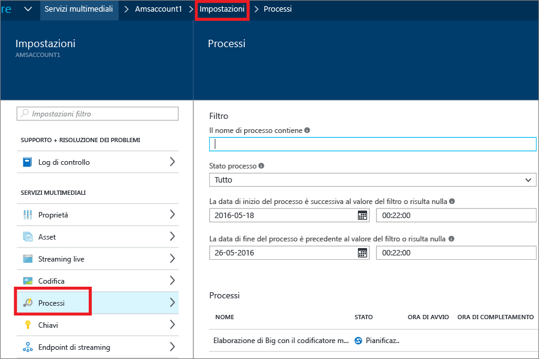

# Monitorare lo stato del processo di codifica con il portale di Azure
> [!div class="op_single_selector"]
> * [Portale](media-services-portal-check-job-progress.md)
> * [.NET](media-services-check-job-progress.md)
> * [REST](media-services-rest-check-job-progress.md)
> 
> 

## Overview
> [!NOTE]
> Per completare l'esercitazione, è necessario un account Azure. Per informazioni dettagliate, vedere la pagina relativa alla [versione di valutazione gratuita di Azure](https://azure.microsoft.com/pricing/free-trial/). 
> 
> 

Quando si esegue un processo, spesso è necessario monitorarne l'avanzamento. 

Per monitorare l'avanzamento del processo di codifica, fare clic su **Impostazioni** nella parte superiore della pagina e selezionare **Processi**.

È possibile fare clic sul processo per visualizzare altri dettagli.

## Passaggi successivi
Al termine del processo di codifica è possibile pubblicare e riprodurre gli asset, come descritto [qui](media-services-portal-publish.md).

## Percorsi di apprendimento di Servizi multimediali
[!INCLUDE [media-services-learning-paths-include](../../includes/media-services-learning-paths-include.md)]

## Fornire commenti e suggerimenti
[!INCLUDE [media-services-user-voice-include](../../includes/media-services-user-voice-include.md)]

<!--HONumber=Nov16_HO3-->

