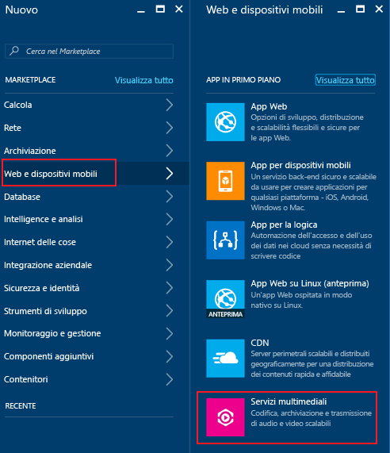
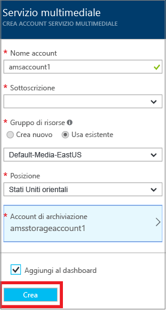

# Creare un account Servizi multimediali di Azure con il portale di Azure
> [!div class="op_single_selector"]
> * [Portale](media-services-portal-create-account.md)
> * [PowerShell](media-services-manage-with-powershell.md)
> * [REST](https://docs.microsoft.com/rest/api/media/mediaservice)
> 
> [!NOTE]
> Per completare l'esercitazione, è necessario un account Azure. Per informazioni dettagliate, vedere la pagina relativa alla [versione di valutazione gratuita di Azure](https://azure.microsoft.com/pricing/free-trial/). 
> 
> 

Nel portale di Azure è possibile creare rapidamente un account di Servizi multimediali di Azure (AMS). È possibile utilizzare l'account per accedere ai servizi multimediali che consentono di archiviare, crittografare, codificare, gestire e distribuire in streaming contenuti multimediali in Azure. Durante la creazione di un account di Servizi multimediali, viene creato l'account di archiviazione associato (se non si desidera utilizzarne uno esistente) nella stessa area geografica dell'account di Servizi multimediali.

Questo articolo illustra alcuni concetti comuni e come creare un account Servizi multimediali con il portale di Azure.

> [!NOTE]
> Per informazioni sulla disponibilità delle funzionalità di Servizi multimediali di Azure nelle diverse aree, vedere la [disponibilità delle funzionalità di AMS nei data center](scenarios-and-availability.md#availability).

## Concetti
Per accedere a Servizi multimediali è necessario disporre di due account associati:

* Account di Servizi multimediali. L'account consente di accedere a un set di Servizi multimediali basati su cloud disponibili in Azure. In un account di Servizi multimediali non è possibile archiviare contenuti multimediali effettivi, ma è possibile archiviare i metadati relativi al contenuto multimediale e i processi di elaborazione dei file multimediali. Al momento della creazione dell'account, è necessario selezionare un'area di Servizi multimediali disponibile. L'area selezionata è un data center in cui sono archiviati i record dei metadati per l'account.
  
* Un account di archiviazione di Azure. Gli account di archiviazione devono trovarsi nella stessa area geografica dell'account Servizi multimediali. Quando si crea un account di Servizi multimediali, è possibile scegliere un account di archiviazione esistente nella stessa area geografica oppure è possibile crearne uno nuovo, ma sempre nella stessa area. Se si elimina un account di Servizi multimediali, gli oggetti BLOB presenti nell'account di archiviazione associato non vengono eliminati.

  > [!NOTE]
  > Servizi multimediali limita l'account di archiviazione primario a un account di **archiviazione per utilizzo generico** con tabelle e code. Per altre informazioni sui tipi di archiviazione, vedere [Informazioni sugli account di archiviazione di Azure](https://docs.microsoft.com/azure/storage/common/storage-create-storage-account).

## Creare un account AMS
I passaggi descritti in questa sezione illustrano come creare un account Servizi multimediali di Azure.

1. Accedere al [portale di Azure](https://portal.azure.com/).
2. Fare clic su **+Nuovo** > **Web e dispositivi mobili** > **Servizi multimediali**.
   
    
3. In **CREARE UN ACCOUNT DEL SERVIZIO MULTIMEDIALE** immettere i valori richiesti.
   
    
   
   1. In **Nome account**immettere il nome del nuovo account di AMS. Un nome di account di Servizi multimediali deve essere composto solo da lettere minuscole o da numeri senza spazi con una lunghezza compresa tra 3 e 24 caratteri.
   2. In Sottoscrizione selezionare una delle diverse sottoscrizioni di Azure per le quali è disponibile l'accesso.
   3. In **Gruppo di risorse**selezionare la risorsa nuova o esistente.  Un gruppo di risorse è una raccolta di risorse che condividono il ciclo di vita, le autorizzazioni e i criteri. Fare clic [qui](../azure-resource-manager/resource-group-overview.md#resource-groups) per altre informazioni.
   4. In **Località** selezionare l'area geografica che verrà usata per archiviare i contenuti multimediali e  i record di metadati per l'account Servizi multimediali. Questa area verrà usata per elaborare e riprodurre in streaming il contenuto multimediale. Nella casella dell'elenco a discesa vengono visualizzate solo le aree di Servizi multimediali disponibili. 
   5. In **Account di archiviazione**selezionare un account di archiviazione per l'archivio BLOB del contenuto multimediale dell'account Servizi multimediali. È possibile scegliere un account di archiviazione esistente nella stessa area geografica dell'account Servizi multimediali oppure è possibile crearne uno. Un nuovo account di archiviazione viene creato nella stessa area geografica. Per i nomi degli account di archiviazione vengono seguite le stesse regole dei nomi degli account di Servizi multimediali.
      
       Altre informazioni sull'archiviazione sono disponibili [qui](../storage/common/storage-introduction.md).
   6. Selezionare **Aggiungi al dashboard** per visualizzare lo stato della distribuzione di account.
4. Fare clic su **Crea** nella parte inferiore del form.
   
    Dopo che l'account è stato creato, viene caricata la pagina della panoramica. Nella tabella dell'endpoint di streaming l'account avrà un endpoint di streaming predefinito con stato **Arrestato**. 

    >[!NOTE]
    >Quando l'account AMS viene creato, un endpoint di streaming **predefinito** viene aggiunto all'account con stato **Arrestato**. Per avviare lo streaming del contenuto e sfruttare i vantaggi della creazione dinamica dei pacchetti e della crittografia dinamica, l'endpoint di streaming da cui si vuole trasmettere il contenuto deve essere nello stato **In esecuzione**. 
   
## Per gestire l'account AMS

Selezionare **Impostazioni** a sinistra del portale per gestire l'account AMS, ad esempio connettersi all'API AMS a livello di codice, caricare video, codificare asset, configurare la protezione del contenuto e monitorare lo stato del processo. Da **Impostazioni** passare a uno dei pannelli disponibili, ad esempio **Accesso all'API**, **Asset**, **Processi** e **Protezione del contenuto**.

## Passaggi successivi

Ora è possibile caricare i file nell'account AMS. Per altre informazioni, vedere [Upload files](media-services-portal-upload-files.md)(Caricare file).

Se si prevede di accedere all'API AMS a livello di codice, vedere [Accedere all'API di Servizi multimediali di Azure con l'autenticazione di Azure AD](media-services-use-aad-auth-to-access-ams-api.md).

## Percorsi di apprendimento di Servizi multimediali
[!INCLUDE [media-services-learning-paths-include](../../includes/media-services-learning-paths-include.md)]

## Fornire commenti e suggerimenti
[!INCLUDE [media-services-user-voice-include](../../includes/media-services-user-voice-include.md)]

