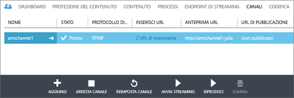
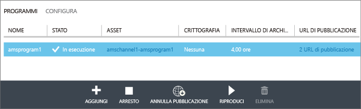
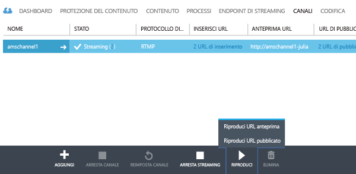
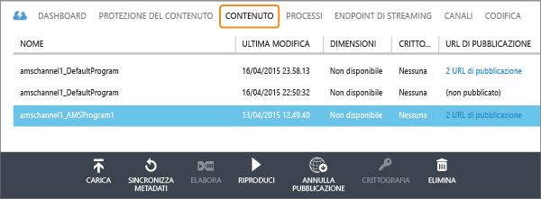

<properties 
	pageTitle="Come eseguire lo streaming live con Servizi multimediali di Azure per creare flussi a più bitrate con il portale di Azure classico" 
	description="Questa esercitazione illustra i passaggi per creare un canale che riceve un flusso live a velocità in bit singola e lo codifica in un flusso a più velocità in bit utilizzando il portale di Azure classico." 
	services="media-services" 
	documentationCenter="" 
	authors="juliako,anilmur" 
	manager="erikre" 
	editor=""/>

<tags 
	ms.service="media-services" 
	ms.workload="media" 
	ms.tgt_pltfrm="na" 
	ms.devlang="na" 
	ms.topic="get-started-article"
 	ms.date="05/05/2016" 
	ms.author="juliako"/>

#Come eseguire lo streaming live con Servizi multimediali di Azure per creare flussi a più bitrate con il portale di Azure classico

> [AZURE.SELECTOR]
- [Portale](media-services-portal-creating-live-encoder-enabled-channel.md)
- [.NET](media-services-dotnet-creating-live-encoder-enabled-channel.md)
- [API REST](https://msdn.microsoft.com/library/azure/dn783458.aspx)

Questa esercitazione illustra i passaggi per creare un **canale** che riceve un flusso live a velocità in bit singola e lo codifica in un flusso a più velocità in bit.

>[AZURE.NOTE]Per altre informazioni concettuali sui canali correlati abilitati per la codifica live, vedere [Uso di canali abilitati per l'esecuzione della codifica live con Servizi multimediali di Azure](media-services-manage-live-encoder-enabled-channels.md).

##Scenario comune di streaming live

Di seguito sono descritti i passaggi generali relativi alla creazione di applicazioni comuni di streaming live.

>[AZURE.NOTE] Attualmente, la durata massima consigliata per un evento live è 8 ore. Se è necessario eseguire un canale per lunghi periodi di tempo, contattare amslived in Microsoft.com.

1. Connettere una videocamera a un computer. Avviare e configurare un codificatore live locale che può restituire un flusso a velocità in bit singola in uno dei protocolli seguenti: RTMP, Smooth Streaming o RTP (MPEG-TS). Per altre informazioni, vedere l'argomento relativo a [codificatori live e supporto RTMP di Servizi multimediali di Azure](http://go.microsoft.com/fwlink/?LinkId=532824).
	
	Questa operazione può essere eseguita anche dopo la creazione del canale.

1. Creare e avviare un canale.

1. Recuperare l'URL di inserimento del canale.

	L'URL di inserimento viene usato dal codificatore live per inviare il flusso al canale.
1. Recuperare l'URL di anteprima del canale. 

	Usare questo URL per verificare che il canale riceva correttamente il flusso live.

3. Creare un programma (che creerà anche un asset).
1. Pubblicare il programma (che creerà un localizzatore OnDemand per l'asset associato).  

	Accertarsi che sia presente almeno un'unità riservata di streaming nell'endpoint di streaming da cui si desidera trasmettere i contenuti in streaming.
1. Avviare il programma quando si è pronti a iniziare lo streaming e l'archiviazione.
2. Facoltativamente, il codificatore live può ricevere il segnale per l'avvio di un annuncio. L'annuncio viene inserito nel flusso di output.
1. Arrestare il programma ogni volta che si vuole interrompere lo streaming e l'archiviazione dell'evento.
1. Eliminare il programma e, facoltativamente, eliminare l'asset.   

##Contenuto dell'esercitazione:

In questa esercitazione il portale di Azure classico viene usato per eseguire le attività seguenti:

2.  Configurare gli endpoint di streaming
3.  Creare un canale abilitato per eseguire la codifica live.
1.  Ottenere l'URL di inserimento per fornirlo al codificatore live. Il codificatore live userà questo URL per inserire il flusso nel canale.
1.  Creare un programma (e un asset).
1.  Pubblicare l'asset e ottenere gli URL di streaming.  
1.  Riprodurre i contenuti 
2.  + Cleaning up

##Prerequisiti
Per completare l'esercitazione è necessario quanto segue.

- Per completare l'esercitazione, è necessario un account Azure. Se non si dispone di un account, è possibile creare un account di valutazione gratuita in pochi minuti. Per informazioni dettagliate, vedere la pagina relativa alla [versione di valutazione gratuita di Azure](azure.microsoft.com).
- Account di Servizi multimediali. Per creare un account di Servizi multimediali, vedere l'argomento relativo alla [creazione di un account](media-services-create-account.md).
- Una webcam e un codificatore in grado di inviare un flusso live a velocità in bit singola.

##Configurare l'endpoint di streaming usando il portale

Quando si usa Servizi multimediali di Azure, uno degli scenari più frequenti consiste nella distribuzione di contenuti in streaming a velocità in bit adattiva ai client. Con lo streaming a velocità in bit adattiva, il client può passare a un flusso con velocità in bit maggiore o minore durante la visualizzazione del video, in base alla larghezza di banda attuale della rete, all'utilizzo della CPU e ad altri fattori. Servizi multimediali supporta le seguenti tecnologie di streaming a velocità in bit adattiva: HTTP Live Streaming (HLS), Smooth Streaming, MPEG DASH e HDS (solo per i titolari di licenza Adobe PrimeTime/Access).

Quando si usa lo streaming live, un codificatore live locale (in questo caso Wirecast) inserisce un flusso live a più velocità in bit nel canale. Quando il flusso viene richiesto da un utente, Servizi multimediali usa la creazione dinamica dei pacchetti per ricreare il pacchetto del flusso di origine nel flusso a velocità in bit adattiva richiesto (HLS, DASH o Smooth).

Per avvalersi della creazione dinamica dei pacchetti, è necessario ottenere almeno un'unità di streaming per l'**endpoint di streaming** da cui si intende distribuire i contenuti.

Per modificare il numero di unità riservate di streaming, effettuare le seguenti operazioni:

1. Nel [portale di Azure classico](https://manage.windowsazure.com/) fare clic su **Servizi multimediali**. Fare quindi clic sul nome del servizio multimediale.

2. Selezionare la pagina ENDPOINT DI STREAMING. Quindi, fare clic sull'endpoint di streaming da modificare.

3. Per specificare il numero di unità di streaming, selezionare la scheda RIDIMENSIONA e spostare il dispositivo di scorrimento **capacità riservata**.

	

4. Fare clic sul pulsante SAVE per salvare le modifiche apportate.

	L'allocazione di nuove unità richiede circa 20 minuti.

	 
	>[AZURE.NOTE] Attualmente, se si riporta a zero qualsiasi valore positivo delle unità di streaming, è possibile che lo streaming venga disabilitato per un periodo che può durare fino a un'ora.
	>
	> Il numero più alto di unità specificato in un periodo di 24 ore è quello che verrà usato per il calcolo del costo. Per informazioni sui prezzi, vedere [Dettagli prezzi di Servizi multimediali](http://go.microsoft.com/fwlink/?LinkId=275107).

 
##Creare un CANALE

1.	Nel [portale di Azure classico](http://manage.windowsazure.com/) fare clic su Servizi multimediali e quindi sul nome dell'account di Servizi multimediali.
2.	Selezionare la pagina CANALI.
3.	Selezionare Aggiungi+ per aggiungere un nuovo canale.

Scegliere i tipi di codifica **Standard**. Questo tipo specifica che si vuole creare un canale abilitato per la codifica live. Ciò significa che il flusso in ingresso a velocità in bit singola viene inviato al canale e codificato in un flusso a più velocità in bit usando le impostazioni del codificatore live specificato. Per altre informazioni, vedere [Uso di canali abilitati per l'esecuzione della codifica live con Servizi multimediali di Azure](media-services-manage-live-encoder-enabled-channels.md).

![standard0][standard0]

Per il tipo di codifica **Standard**, le opzioni valide per il protocollo di inserimento sono:

- MP4 frammentato (Smooth Streaming) a velocità in bit singola
- RTMP a velocità in bit singola
- RTP (MPEG-TS): MPEG-2 Transport Stream su RTP.

Per una descrizione dettagliata di ogni protocollo, vedere informazioni, vedere [Uso di canali abilitati per l'esecuzione della codifica live con Servizi multimediali di Azure](media-services-manage-live-encoder-enabled-channels.md).

![standard1][standard1]

Non è possibile modificare il protocollo di input durante l'esecuzione del canale o dei relativi programmi associati. Se sono necessari protocolli diversi, è consigliabile creare canali separati per ciascun protocollo di input.

Nella pagina **Configurazione annunci pubblicitari** è possibile specificare l'origine per i segnali dei marcatori di annunci. Quando si usa il portale, è possibile selezionare solo API, che indica che il codificatore live all'interno del canale deve restare in attesa di un'API Ad Marker asincrona. Quando si usa il portale, è possibile selezionare solo API.

Per altre informazioni, vedere [Uso di canali abilitati per l'esecuzione della codifica live con Servizi multimediali di Azure](media-services-manage-live-encoder-enabled-channels.md).

![standard2][standard2]

Nella pagina **Set di impostazioni di codifica** è possibile selezionare le impostazioni predefinite di sistema. Attualmente, l'unica impostazione predefinita di sistema che è possibile selezionare è **720p (valore predefinito)**.

![standard3][standard3]

Nella pagina **Creazione canale** è possibile definire gli indirizzi IP autorizzati a pubblicare video in questo canale. Gli indirizzi IP consentiti possono essere specificati come un singolo indirizzo IP, ad esempio '10.0.0.1', come un intervallo di indirizzi IP usando un indirizzo IP e una subnet mask CIDR, ad esempio '10.0.0.1/22' o come un intervallo di indirizzi IP usando un indirizzo IP e una subnet mask decimale puntata, ad esempio '10.0.0.1(255.255.252.0)').

Se non viene specificato alcun indirizzo IP e non è presente una definizione della regola, non sarà consentito alcun indirizzo IP. Per consentire qualsiasi indirizzo IP, creare una regola e impostare 0.0.0.0/0.

![standard4][standard4]

>[AZURE.NOTE] Attualmente, l'avvio del canale può richiedere più di 30 minuti. La reimpostazione del canale può richiedere fino a 5 minuti.

Una volta creato il canale, è possibile selezionare la scheda **CODIFICATORE** in cui sono mostrate le configurazioni dei canali. È anche possibile gestire gli annunci e gli slate.

![standard5][standard5]

Per altre informazioni, vedere [Uso di canali abilitati per l'esecuzione della codifica live con Servizi multimediali di Azure](media-services-manage-live-encoder-enabled-channels.md).

##Ottenere gli URL di inserimento

Dopo avere creato il canale, è possibile ottenere gli URL di inserimento da fornire al codificatore live. Questi URL vengono usati dal codificatore per inserire un flusso live.

##Creare e gestire un programma

###Panoramica

Un canale è associato a programmi che consentono di controllare la pubblicazione e l'archiviazione di segmenti in un flusso live. I programmi sono gestiti dai canali. La relazione tra queste due entità è molto simile a quella che intercorre tra di essi nei media tradizionali, in cui un canale è costituito da un flusso costante di contenuti, mentre un programma ha come ambito una serie di eventi programmati sul canale.

È possibile specificare il numero di ore per cui si vuole mantenere il contenuto registrato per il programma impostando il valore **Intervallo di archiviazione**. Il valore impostato può essere compreso tra 5 minuti e 25 ore. La lunghezza della finestra di archiviazione determina anche il limite di tempo per cui i client possono eseguire ricerche a ritroso nel tempo dalla posizione live corrente. I programmi possono essere eseguiti per la quantità di tempo specificata, ma il contenuto che va oltre la durata prevista viene scartato in modo continuo. Il valore della proprietà determina anche il tempo per cui i manifesti client possono crescere.

Ogni programma è associato a un asset. Per pubblicare il programma, è necessario creare un localizzatore OnDemand per l'asset associato. Con questo localizzatore sarà possibile creare un URL di streaming da fornire ai client.

Un canale supporta fino a tre programmi in esecuzione simultanea, in modo da poter creare più archivi dello stesso flusso in ingresso. Questo consente di pubblicare e archiviare parti diverse di un evento a seconda delle necessità. Si consideri ad esempio uno scenario in cui un'azienda richiede l'archiviazione di 6 ore di un programma e la trasmissione solo degli ultimi 10 minuti. A tale scopo, è necessario creare due programmi in esecuzione contemporaneamente. Un programma è impostato per l'archiviazione di 6 ore dell'evento, ma non viene pubblicato. L'altro programma è impostato per l'archiviazione di 10 minuti e viene pubblicato.

Non riutilizzare i programmi esistenti per nuovi eventi. Creare e avviare invece un nuovo programma per ogni evento, come descritto nella sezione relativa alla programmazione di applicazioni Live Streaming.

Avviare il programma quando si è pronti a iniziare lo streaming e l'archiviazione. Arrestare il programma ogni volta che si vuole interrompere lo streaming e l'archiviazione dell'evento.

Per eliminare il contenuto archiviato, arrestare ed eliminare il programma e quindi eliminare l'asset associato. Un asset non può essere eliminato se è usato da un programma. Per farlo, eliminare prima il programma.

Anche dopo l'arresto e l'eliminazione del programma, gli utenti possono trasmettere in streaming il contenuto archiviato sotto forma di video on demand, fintanto che non si elimina l'asset.

Se si desidera mantenere il contenuto archiviato ma non averlo disponibile per lo streaming, eliminare il localizzatore di streaming.

###Creare/avviare/arrestare programmi

Dopo l'avvio del flusso nel canale, è possibile iniziare l'evento di streaming creando un localizzatore di asset, programma e streaming. In questo modo il flusso viene archiviato e reso disponibile agli utenti tramite l'endpoint di streaming.

Per avviare l'evento è possibile procedere in due modi:

1. Nella pagina **CANALE** fare clic su **AGGIUNGI** per aggiungere un nuovo programma.

	Specificare il nome del programma, il nome dell'asset, l'intervallo di archiviazione e l'opzione di crittografia.
	
	
	
	Se l'opzione **Pubblica questo programma ora** è stata lasciata selezionata, verranno creati gli URL di pubblicazione.
	
	Per avviare lo streaming del programma, fare clic su **AVVIA**.

	Dopo avere avviato il programma, fare clic su RIPRODUCI per avviare la riproduzione del contenuto.

	

2. In alternativa, è possibile usare un collegamento e fare clic su **AVVIA STREAMING** nella pagina **CANALE**. In questo modo verrà creato un localizzatore di asset, programma e streaming.

	Il programma è denominato DefaultProgram e l'intervallo di archiviazione è impostato su 1 ora.

	Il programma pubblicato può essere riprodotto dalla pagina CANALE.

	

Se si fa clic su **ARRESTA STREAMING** nella pagina **CANALE**, il programma predefinito verrà arrestato ed eliminato. L'asset sarà ancora disponibile ed è possibile pubblicarlo o annullarne la pubblicazione dalla pagina **CONTENUTO**.

Se si passa alla pagina **CONTENUTO**, sarà possibile visualizzare gli asset creati per i programmi.

##Riproduzione del contenuto

Per fornire all'utente un URL che consente di trasmettere il contenuto in streaming, è necessario innanzitutto "pubblicare" l'asset (come descritto nella sezione precedente) creando un localizzatore (quando si pubblica un asset tramite il portale, i localizzatori vengono creati automaticamente). I localizzatori forniscono l'accesso ai file contenuti nell'asset.

A seconda del protocollo di streaming che si vuole usare per la riproduzione del contenuto, potrebbe essere necessario modificare l'URL che si ottiene mediante il collegamento **URL DI PUBBLICAZIONE** in canale\\programma.

La creazione dinamica dei pacchetti si occuperà di inserire il flusso live in un pacchetto nel protocollo specificato.

Per impostazione predefinita, un URL di streaming presenta il seguente formato e può essere usato per riprodurre asset Smooth Streaming:

	{streaming endpoint name-media services account name}.streaming.mediaservices.windows.net/{locator ID}/{filename}.ism/Manifest

Per creare un URL di streaming HLS, aggiungere (format=m3u8-aapl) all'URL.

	{streaming endpoint name-media services account name}.streaming.mediaservices.windows.net/{locator ID}/{filename}.ism/Manifest(format=m3u8-aapl)

Per creare un URL di streaming MPEG DASH, aggiungere (format=mpd-time-csf) all'URL.

	{streaming endpoint name-media services account name}.streaming.mediaservices.windows.net/{locator ID}/{filename}.ism/Manifest(format=mpd-time-csf)

Per altre informazioni sulla distribuzione del contenuto, vedere [Distribuzione di contenuto](media-services-deliver-content-overview.md).

È possibile riprodurre flussi Smooth Streaming mediante [AMS Player](http://amsplayer.azurewebsites.net/azuremediaplayer.html) oppure usare dispositivi iOS e Android per riprodurre flussi HLS versione 3.

##Eseguire la pulizia

Se al termine dello streaming degli eventi si vuole eliminare le risorse di cui in precedenza è stato effettuato il provisioning, attenersi alla procedura seguente.

- Interrompere il push del flusso dal codificatore.
- Arrestare il canale. Una volta arrestato, il canale non subirà modifiche. Quando occorrerà riavviarlo, avrà lo stesso URL di inserimento, per cui non sarà necessario riconfigurare il codificatore.
- È possibile arrestare l'endpoint di streaming, a meno che non si voglia continuare a fornire l'archivio dell'evento live come flusso su richiesta. Se il canale è arrestato, non subirà modifiche.
  

##Considerazioni

- Attualmente, la durata massima consigliata per un evento live è 8 ore. Se è necessario eseguire un canale per lunghi periodi di tempo, contattare amslived in Microsoft.com.
- Accertarsi che sia presente almeno un'unità riservata di streaming nell'endpoint di streaming da cui si desidera trasmettere i contenuti in streaming.

##Percorsi di apprendimento di Media Services

[AZURE.INCLUDE [media-services-learning-paths-include](../../includes/media-services-learning-paths-include.md)]

##Fornire commenti e suggerimenti

[AZURE.INCLUDE [media-services-user-voice-include](../../includes/media-services-user-voice-include.md)]

[standard0]: ./media/media-services-portal-creating-live-encoder-enabled-channel/media-services-create-channel-standard0.png
[standard1]: ./media/media-services-portal-creating-live-encoder-enabled-channel/media-services-create-channel-standard1.png
[standard2]: ./media/media-services-portal-creating-live-encoder-enabled-channel/media-services-create-channel-standard2.png
[standard3]: ./media/media-services-portal-creating-live-encoder-enabled-channel/media-services-create-channel-standard3.png
[standard4]: ./media/media-services-portal-creating-live-encoder-enabled-channel/media-services-create-channel-standard4.png
[standard5]: ./media/media-services-portal-creating-live-encoder-enabled-channel/media-services-create-channel-standard_encode.png

<!---HONumber=AcomDC_0511_2016-->