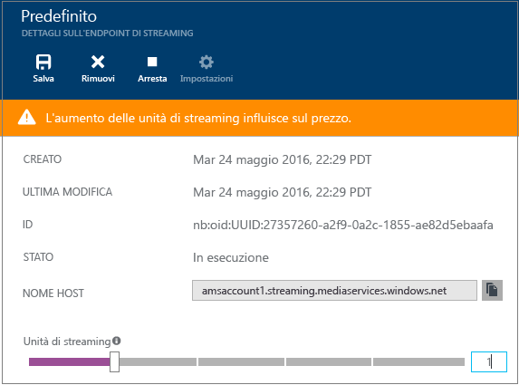
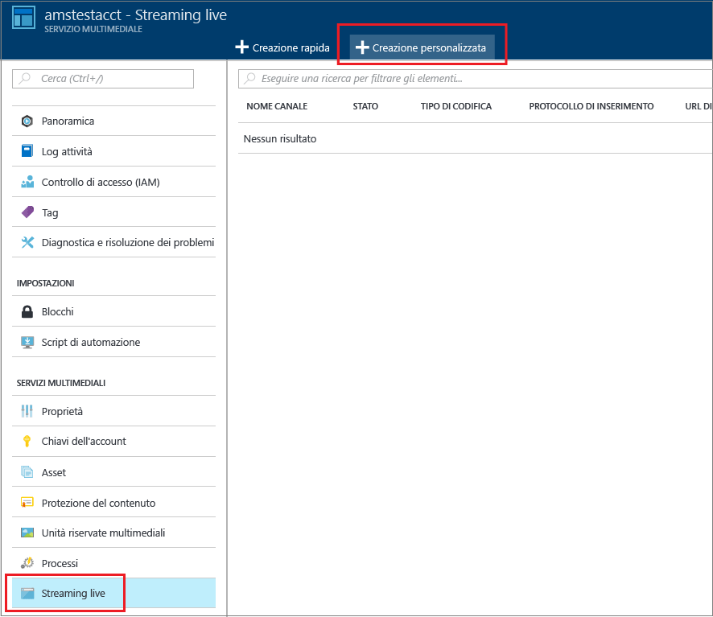
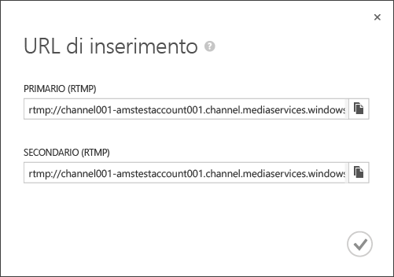
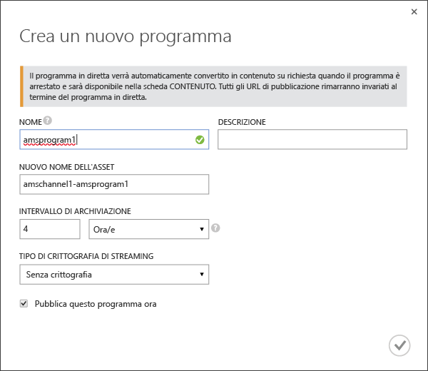
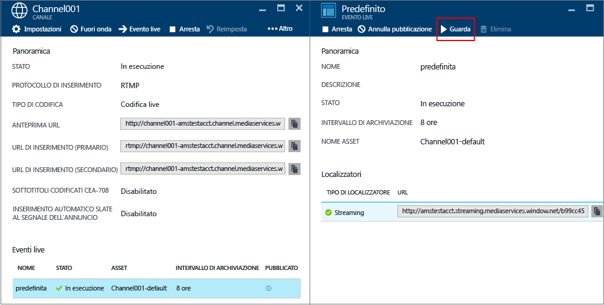
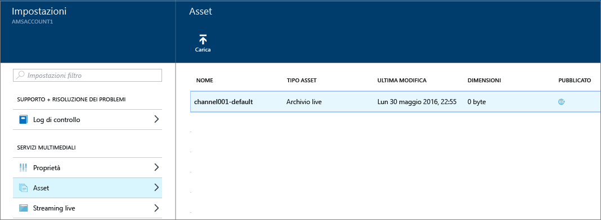

<properties 
	pageTitle="Come eseguire lo streaming live con Servizi multimediali di Azure per creare flussi a bitrate multipli con il portale di Azure | Microsoft Azure" 
	description="Questa esercitazione illustra i passaggi per creare un canale che riceve un flusso live a velocità in bit singola e lo codifica in un flusso a più velocità in bit utilizzando il portale di Azure." 
	services="media-services" 
	documentationCenter="" 
	authors="anilmur" 
	manager="erikre" 
	editor=""/>



<tags 
	ms.service="media-services" 
	ms.workload="media" 
	ms.tgt_pltfrm="na" 
	ms.devlang="na" 
	ms.topic="get-started-article"
	ms.date="09/06/2016"
	ms.author="juliako;juliako"/>



#Come eseguire lo streaming live con Servizi multimediali di Azure per creare flussi a bitrate multipli con il portale di Azure

> [AZURE.SELECTOR]
- [Portale](media-services-portal-creating-live-encoder-enabled-channel.md)
- [.NET](media-services-dotnet-creating-live-encoder-enabled-channel.md)
- [API REST](https://msdn.microsoft.com/library/azure/dn783458.aspx)

Questa esercitazione illustra i passaggi per creare un **canale** che riceve un flusso live a velocità in bit singola e lo codifica in un flusso a più velocità in bit.

>[AZURE.NOTE]Per altre informazioni concettuali sui canali correlati abilitati per la codifica live, vedere [Uso di canali abilitati per l'esecuzione della codifica live con Servizi multimediali di Azure](media-services-manage-live-encoder-enabled-channels.md).

##Scenario comune di streaming live

Di seguito sono descritti i passaggi generali relativi alla creazione di applicazioni comuni di streaming live.

>[AZURE.NOTE] Attualmente, la durata massima consigliata per un evento live è 8 ore. Se è necessario eseguire un canale per lunghi periodi di tempo, contattare amslived in Microsoft.com.

1. Connettere una videocamera a un computer. Avviare e configurare un codificatore live locale che può restituire un flusso a velocità in bit singola in uno dei protocolli seguenti: RTMP, Smooth Streaming o RTP (MPEG-TS). Per altre informazioni, vedere l'argomento relativo a [codificatori live e supporto RTMP di Servizi multimediali di Azure](http://go.microsoft.com/fwlink/?LinkId=532824).
	
	Questa operazione può essere eseguita anche dopo la creazione del canale.

1. Creare e avviare un canale.

1. Recuperare l'URL di inserimento del canale.

	L'URL di inserimento viene usato dal codificatore live per inviare il flusso al canale.
1. Recuperare l'URL di anteprima del canale.

	Usare questo URL per verificare che il canale riceva correttamente il flusso live.

3. Creare un evento o un programma, l'operazione creerà anche un asset.
1. Pubblicare l'evento, l'operazione creerà un localizzatore OnDemand per l'asset associato.

	Accertarsi che sia presente almeno un'unità riservata di streaming nell'endpoint di streaming da cui si desidera trasmettere i contenuti in streaming.
1. Avviare l'evento quando si è pronti ad avviare lo streaming e l'archiviazione.
2. Facoltativamente, il codificatore live può ricevere il segnale per l'avvio di un annuncio. L'annuncio viene inserito nel flusso di output.
1. Arrestare l'evento ogni volta che si vuole arrestare lo streaming e l'archiviazione dell'evento.
1. Eliminare l'evento e, facoltativamente, l'asset.

##Contenuto dell'esercitazione:

In questa esercitazione il portale di Azure viene usato per eseguire le attività seguenti:

2.  Configurare gli endpoint di streaming
3.  Creare un canale abilitato per eseguire la codifica live.
1.  Ottenere l'URL di inserimento per fornirlo al codificatore live. Il codificatore live userà questo URL per inserire il flusso nel canale.
1.  Creare un evento o un programma e un asset.
1.  Pubblicare l'asset e ottenere gli URL di streaming.
1.  Riprodurre i contenuti
2.  + Cleaning up

##Prerequisiti
Per completare l'esercitazione è necessario quanto segue.

- Per completare l'esercitazione, è necessario un account Azure. Se non si dispone di un account, è possibile creare un account di valutazione gratuita in pochi minuti. Per informazioni dettagliate, vedere la pagina relativa alla [versione di valutazione gratuita di Azure](https://azure.microsoft.com/pricing/free-trial/).
- Account di Servizi multimediali. Per creare un account di Servizi multimediali, vedere l'argomento relativo alla [creazione di un account](media-services-create-account.md).
- Una webcam e un codificatore in grado di inviare un flusso live a velocità in bit singola.

##Configurare gli endpoint di streaming 

Servizi multimediali include la funzionalità per la creazione dinamica dei pacchetti, che consente di distribuire file MP4 a più bitrate nei formati MPEG DASH, HLS, Smooth Streaming or HDS, senza dover ricreare i pacchetti con questi formati di streaming. Con la creazione dinamica dei pacchetti si archiviano e si pagano solo i file in un unico formato di archiviazione e Servizi multimediali crea e fornisce la risposta appropriata in base alle richieste di un client.

Per sfruttare i vantaggi della creazione dinamica dei pacchetti, è necessario ottenere almeno un'unità di streaming per l'endpoint di streaming da cui si prevede di distribuire il contenuto.

Per creare e modificare il numero di unità riservate di streaming, seguire questa procedura:

1. Accedere al [portale di Azure](https://portal.azure.com/).
1. Nella finestra **Impostazioni** fare clic su **Endpoint di streaming**.

2. Fare clic sull'endpoint di streaming predefinito.

	Verrà visualizzata la finestra **DETTAGLI ENDPOINT DI STREAMING PREDEFINITO**.

3. Per specificare il numero di unità di streaming, usare il dispositivo di scorrimento di **Unità di streaming**.

	



4. Fare clic sul pulsante **Salva** per salvare le modifiche apportate.

	>[AZURE.NOTE]Il completamento dell'allocazione di nuove unità può richiedere fino a 20 minuti.

##Creare un CANALE

1. Nel [portale di Azure](https://portal.azure.com/) fare clic su Servizi multimediali e quindi sul nome dell'account Servizi multimediali.
2. Selezionare **Streaming live**.
3. Selezionare **Creazione personalizzata**. Questa opzione permette di creare un canale abilitato per la codifica live.

	


	
4. Fare clic su **Impostazioni**.
	
	1.  Scegliere il tipo di canale **Codifica live**. Questo tipo specifica che si vuole creare un canale abilitato per la codifica live. Ciò significa che il flusso in ingresso a velocità in bit singola viene inviato al canale e codificato in un flusso a più velocità in bit usando le impostazioni del codificatore live specificato. Per altre informazioni, vedere [Streaming live con Servizi multimediali di Azure per creare flussi a bitrate multipli](media-services-manage-live-encoder-enabled-channels.md). Fare clic su OK.
	2. Specificare il nome di un canale.
	3. Fare clic su OK nella parte inferiore della schermata.
	
5. Selezionare la scheda **Inserisci**.

	1. In questa pagina è possibile selezionare un protocollo di streaming. Per il tipo di canale **Codifica live**, le opzioni del protocollo valide sono le seguenti:
		
		- MP4 frammentato (Smooth Streaming) a velocità in bit singola
		- RTMP a velocità in bit singola
		- RTP (MPEG-TS): MPEG-2 Transport Stream su RTP.
		
		Per una descrizione dettagliata di ogni protocollo, vedere [Streaming live con Servizi multimediali di Azure per creare flussi a bitrate multipli](media-services-manage-live-encoder-enabled-channels.md).
	
		Non è possibile modificare l'opzione relativa al protocollo durante l'esecuzione del canale o dei relativi eventi o programmi associati. Se sono necessari protocolli diversi, è necessario creare canali separati per ciascun protocollo di streaming.

	2. È possibile applicare la restrizione IP all'inserimento.
	
		È possibile definire gli indirizzi IP autorizzati a inserire video in questo canale. Gli indirizzi IP consentiti possono essere specificati come un singolo indirizzo IP, ad esempio '10.0.0.1', come un intervallo IP usando un indirizzo IP e una subnet mask CIDR, ad esempio '10.0.0.1/22' o come un intervallo IP usando un indirizzo IP e una subnet mask decimale puntata, ad esempio '10.0.0.1(255.255.252.0)'.

		Se non viene specificato alcun indirizzo IP e non è presente una definizione della regola, non sarà consentito alcun indirizzo IP. Per consentire qualsiasi indirizzo IP, creare una regola e impostare 0.0.0.0/0.

6. Nella scheda **Anteprima** applicare la restrizione IP sull'anteprima.
7. Nella scheda **Codifica** specificare il set di impostazioni di codifica.

	Attualmente, l'unica impostazione predefinita di sistema che è possibile selezionare è **720p (valore predefinito)**. Per specificare un set di impostazioni personalizzato, aprire un ticket di supporto Microsoft. Quindi, immettere il nome del set di impostazioni creato automaticamente.

>[AZURE.NOTE] Attualmente, l'avvio del canale può richiedere più di 30 minuti. La reimpostazione del canale può richiedere fino a 5 minuti.

Dopo aver creato il canale è possibile farvi clic e passare a **Impostazioni**, dove vengono visualizzate le configurazioni dei canali.

Per altre informazioni, vedere [Streaming live con Servizi multimediali di Azure per creare flussi a bitrate multipli](media-services-manage-live-encoder-enabled-channels.md).

##Ottenere gli URL di inserimento

Dopo avere creato il canale, è possibile ottenere gli URL di inserimento da fornire al codificatore live. Questi URL vengono usati dal codificatore per inserire un flusso live.





##Creare e gestire eventi

###Overview

Un canale è associato a programmi o eventi che consentono di controllare la pubblicazione e l'archiviazione di segmenti in un flusso live. Eventi e programmi sono gestiti dai canali. La relazione tra queste due entità è molto simile a quella che intercorre tra di essi nei media tradizionali, in cui un canale è costituito da un flusso costante di contenuti, mentre un programma ha come ambito una serie di eventi programmati sul canale.

È possibile specificare il numero di ore per cui si vuole mantenere il contenuto registrato per l'evento impostando la durata dell'**Intervallo di archiviazione**. Il valore impostato può essere compreso tra 5 minuti e 25 ore. La lunghezza della finestra di archiviazione determina anche il limite di tempo per cui i client possono eseguire ricerche a ritroso nel tempo dalla posizione live corrente. Gli eventi possono essere eseguiti per l'intervallo di tempo specificato, ma il contenuto che supera la durata prevista viene scartato in modo continuo. Il valore della proprietà determina anche il tempo per cui i manifesti client possono crescere.

Ogni evento è associato a un asset. Per pubblicare l'evento, è necessario creare un localizzatore OnDemand per l'asset associato. Con questo localizzatore sarà possibile creare un URL di streaming da fornire ai client.

Un canale supporta fino a tre eventi in esecuzione simultanea, quindi consente di creare più archivi dello stesso flusso in ingresso. Questo consente di pubblicare e archiviare parti diverse di un evento a seconda delle necessità. Si consideri ad esempio uno scenario in cui un'azienda richiede l'archiviazione di sei ore di un evento e la trasmissione solo degli ultimi 10 minuti. A tale scopo, è necessario creare due eventi in esecuzione simultanea. Uno è impostato per l'archiviazione di sei ore dell'evento, ma il programma non viene pubblicato. L'altro è impostato per l'archiviazione di 10 minuti e il programma viene pubblicato.

Non riutilizzare i programmi esistenti per nuovi eventi. Al contrario, creare e avviare un nuovo programma per ogni evento.

Avviare un programma o un evento quando si è pronti ad avviare lo streaming e l'archiviazione. Arrestare l'evento ogni volta che si vuole arrestare lo streaming e l'archiviazione dell'evento.

Per eliminare il contenuto archiviato, arrestare ed eliminare l'evento e quindi eliminare l'asset associato. Non è possibile eliminare un asset che sia usato da un evento. Per eliminarlo è prima necessario eliminare l'evento.

Anche dopo l'arresto e l'eliminazione dell'evento, gli utenti saranno in grado di riprodurre in streaming il contenuto archiviato sotto forma di video on demand, finché non si elimina l'asset.

Se si desidera mantenere il contenuto archiviato ma non averlo disponibile per lo streaming, eliminare il localizzatore di streaming.

###Creare, avviare o arrestare eventi

Dopo l'avvio del flusso nel canale, è possibile iniziare l'evento di streaming creando un localizzatore di asset, programma e streaming. In questo modo il flusso viene archiviato e reso disponibile agli utenti tramite l'endpoint di streaming.

Per avviare l'evento è possibile procedere in due modi:

1. Nella pagina **Canale** fare clic su **Evento live** per aggiungere un nuovo evento.

	Specificare il nome dell'evento, il nome dell'asset, l'intervallo di archiviazione e l'opzione di crittografia.
	
	


	
	Se l'opzione **Pubblica subito questo evento live** è stata lasciata selezionata, verranno creati gli URL di pubblicazione dell'evento.
	
	Per avviare lo streaming dell'evento, fare clic su **Avvia**.

	Dopo aver avviato l'evento, è possibile fare clic su **Guarda** per avviare la riproduzione del contenuto.

2. In alternativa, è possibile usare un collegamento e fare clic su **Go Live** nella pagina **Canale**. In questo modo verrà creato un localizzatore predefinito di asset, programma e streaming.

	L'evento è denominato **default** e l'intervallo di archiviazione è impostato su otto ore.

Per guardare l'evento pubblicato è possibile usare la pagina **Evento live**.

Facendo clic su **Sospendi trasmissione** vengono arrestati tutti gli eventi live.

##Guardare l'evento

Per guardare l'evento, fare clic su **Watch** (Guarda) nel portale di Azure o copiare l'URL di streaming e usare un lettore a propria scelta.
 




Quando viene arrestato, l'evento live converte automaticamente gli eventi in contenuto su richiesta.

##Eseguire la pulizia

Se al termine dello streaming degli eventi si vuole eliminare le risorse di cui in precedenza è stato effettuato il provisioning, attenersi alla procedura seguente.

- Interrompere il push del flusso dal codificatore.
- Arrestare il canale. Una volta arrestato, il canale non subirà modifiche. Quando occorrerà riavviarlo, avrà lo stesso URL di inserimento, per cui non sarà necessario riconfigurare il codificatore.
- È possibile arrestare l'endpoint di streaming, a meno che non si voglia continuare a fornire l'archivio dell'evento live come flusso su richiesta. Se il canale è arrestato, non subirà modifiche.
  
##Visualizzare il contenuto archiviato

Anche dopo l'arresto e l'eliminazione dell'evento, gli utenti saranno in grado di riprodurre in streaming il contenuto archiviato sotto forma di video on demand, finché non si elimina l'asset. Un asset non può essere eliminato se è usato da un evento. Per farlo, eliminare prima l'evento.

Per gestire gli asset, selezionare**Impostazione** e fare clic su **Asset**.





##Considerazioni

- Attualmente, la durata massima consigliata per un evento live è 8 ore. Se è necessario eseguire un canale per lunghi periodi di tempo, contattare amslived in Microsoft.com.
- Accertarsi che sia presente almeno un'unità riservata di streaming nell'endpoint di streaming da cui si desidera trasmettere i contenuti in streaming.

##Passaggio successivo

Analizzare i percorsi di apprendimento di Servizi multimediali.

[AZURE.INCLUDE [media-services-learning-paths-include](../../includes/media-services-learning-paths-include.md)]

##Fornire commenti e suggerimenti

[AZURE.INCLUDE [media-services-user-voice-include](../../includes/media-services-user-voice-include.md)]

 

<!---HONumber=AcomDC_0921_2016-->