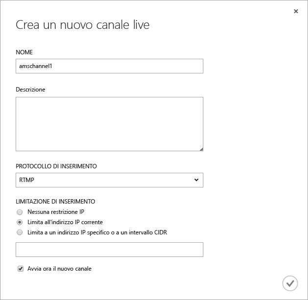
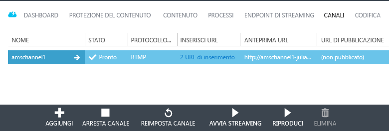
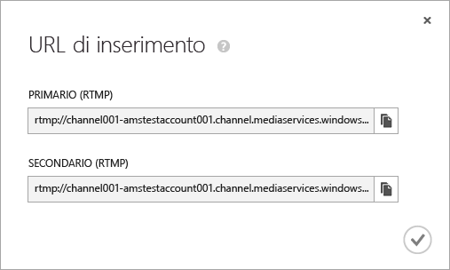
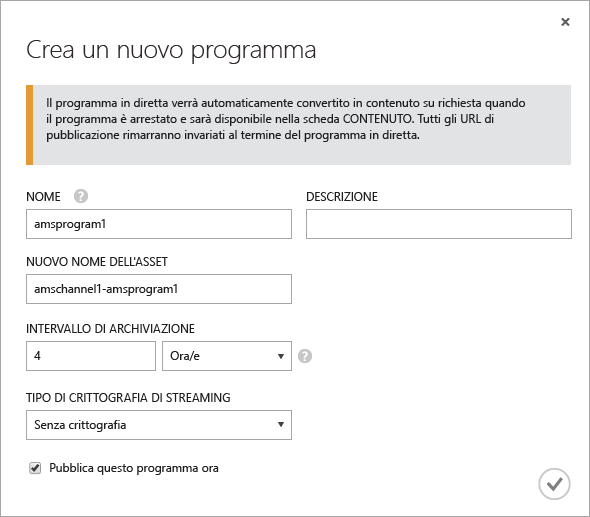
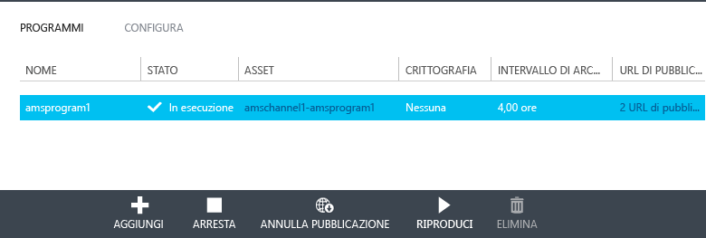
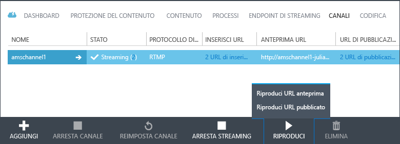
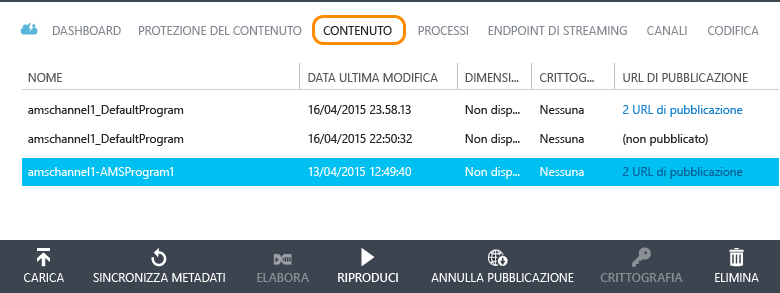

<properties
	pageTitle="Usare il portale di Azure per creare canali che ricevono il flusso live a più velocità in bit da codificatori locali | Microsoft Azure"
	description="Questa esercitazione illustra la procedura per implementare un'applicazione di streaming live di Servizi multimediali di base in cui un canale riceve un flusso live a più velocità in bit da un codificatore live locale."
	services="media-services"
	documentationCenter=""
	authors="Juliako"
	manager="dwrede"
	editor=""/>

<tags
	ms.service="media-services"
	ms.workload="media"
	ms.tgt_pltfrm="na"
	ms.devlang="ne"
	ms.topic="get-started-article"
	ms.date="09/07/2015"  
	ms.author="juliako"/>

# Usare il portale di Azure per creare canali che ricevono il flusso live a più velocità in bit da codificatori locali

[AZURE.INCLUDE [media-services-selector-manage-channels](../../includes/media-services-selector-manage-channels.md)]

Questa esercitazione illustra la procedura per implementare un'applicazione di streaming live di Servizi multimediali di base in cui un canale riceve un flusso live a più velocità in bit da un codificatore live locale. Per una panoramica più dettagliata dell'uso dei canali e dei componenti correlati, vedere [Uso dei canali che ricevono il flusso live a più velocità in bit da codificatori locali](media-services-manage-channels-overview.md).

In questa esercitazione il portale di Azure viene usato per eseguire le attività seguenti:

2.  Configurare gli endpoint di streaming
3.  Creare un canale.
1.  Configurare un codificatore live e inserire il flusso live nel canale (in questo passaggio viene usato Wirecast).
1.  Creare un programma (e un asset).
1.  Pubblicare l'asset e ottenere gli URL di streaming.  
1.  Riprodurre i contenuti.
2.  Eseguire la pulizia.

## Prerequisiti
Per completare l'esercitazione è necessario quanto segue.

- Per completare l'esercitazione, è necessario un account Azure. Se non si dispone di un account, è possibile creare un account di valutazione gratuita in pochi minuti. Per informazioni dettagliate, vedere la pagina relativa alla [versione di valutazione gratuita di Azure](azure.microsoft.com).
- Account di Servizi multimediali. Per creare un account di Servizi multimediali, vedere l'argomento relativo alla [creazione di un account](media-services-create-account.md).
- Una webcam e un codificatore in grado di inviare un flusso live a più velocità in bit.

## Configurare l'endpoint di streaming usando il portale di Azure

Quando si usa Servizi multimediali di Azure, uno degli scenari più frequenti consiste nella distribuzione di contenuti in streaming a velocità in bit adattiva ai client. Con lo streaming a bitrate adattivo, il client può passare a un flusso con velocità in bit maggiore o minore durante la visualizzazione del video, in base alla larghezza di banda attuale della rete, all'utilizzo della CPU e ad altri fattori. Servizi multimediali supporta le seguenti tecnologie di streaming a velocità in bit adattiva: HTTP Live Streaming (HLS), Smooth Streaming, MPEG DASH e HDS (solo per i titolari di licenza Adobe PrimeTime/Access).

Quando si usa lo streaming live, un codificatore live locale (in questo caso Wirecast) inserisce un flusso live a più velocità in bit nel canale. Quando il flusso viene richiesto da un utente, Servizi multimediali usa la creazione dinamica dei pacchetti per ricreare il pacchetto del flusso di origine nel flusso a velocità in bit adattiva richiesto (HLS, DASH o Smooth).

Per avvalersi della creazione dinamica dei pacchetti, è necessario ottenere almeno un'unità di streaming per l'*endpoint di streaming* da cui si intende distribuire i contenuti.

Per modificare il numero di unità riservate di streaming, effettuare le seguenti operazioni:

1. Nel [portale di Azure](https://manage.windowsazure.com/) fare clic su **Servizi multimediali**. Fare quindi clic sul nome del servizio multimediale.

2. Selezionare la pagina **ENDPOINT DI STREAMING**. Quindi, fare clic sull'endpoint di streaming che si desidera modificare.

3. Per specificare il numero di unità di streaming, selezionare la scheda **RIDIMENSIONA** e spostare il dispositivo di scorrimento capacità riservata.

	

4. Fare clic sul pulsante **SALVA** per salvare le modifiche apportate.

	L'allocazione di nuove unità richiede circa 20 minuti.

	>[AZURE.NOTE]Attualmente, se si riporta a zero qualsiasi valore positivo delle unità di streaming, è possibile che lo streaming venga disabilitato per un periodo che può durare fino a un'ora.
	>
	> Il numero più alto di unità specificato in un periodo di 24 ore è quello che verrà usato per il calcolo del costo. Per informazioni sui prezzi, vedere [Dettagli prezzi di Servizi multimediali](http://go.microsoft.com/fwlink/?LinkId=275107).

## Creare un canale

Nel portale di Azure selezionare la pagina **CANALI**. Fare clic su **NUOVO**. Nella finestra di dialogo **Crea un nuovo canale live** immettere un nome per il canale.

Nell'angolo inferiore destro della pagina, fare clic per inserire il segno di spunta per salvare gli aggiornamenti.

Dopo pochi minuti il canale viene creato e avviato.

## Ottenere gli URL di inserimento

Dopo avere creato il canale, è possibile ottenere gli URL di inserimento da fornire al codificatore live. Questi URL vengono usati dal codificatore per inserire un flusso live.

Per altre informazioni sugli URL di inserimento, vedere [Uso di codificatori locali per l'invio di un flusso live a più velocità in bit a un canale](../media-services-channels-overview.md).

## Configurare un codificatore live e inserire il flusso live

>[AZURE.NOTE]Questo passaggio richiede l'URL di inserimento del canale indicato nel passaggio precedente.

Per informazioni dettagliate su come configurare Wirecast e avviare l'inserimento del flusso, vedere [Configurazione di Wirecast](http://azure.microsoft.com/blog/2014/09/18/azure-media-services-rtmp-support-and-live-encoders/).

>[AZURE.NOTE]Se per qualsiasi motivo si arresta il codificatore e in seguito è necessario riavviarlo, è consigliabile reimpostare il canale scegliendo il comando **REIMPOSTA** nel portale di Azure.

## Creare e gestire un programma

### Panoramica

Un canale è associato a programmi che consentono di controllare la pubblicazione e l'archiviazione di segmenti in un flusso live. I programmi sono gestiti dai canali. La relazione tra queste due entità è molto simile a quella che intercorre tra di essi nei media tradizionali, in cui un canale è costituito da un flusso costante di contenuti, mentre un programma ha come ambito una serie di eventi programmati sul canale.

È possibile specificare il numero di ore per cui si vuole mantenere il contenuto registrato per il programma impostando il valore **Intervallo di archiviazione**. Il valore impostato può essere compreso tra 5 minuti e 25 ore. La lunghezza della finestra di archiviazione determina anche il limite di tempo per cui i client possono eseguire ricerche a ritroso nel tempo dalla posizione live corrente. I programmi possono essere eseguiti per la quantità di tempo specificata, ma il contenuto che va oltre la durata prevista viene scartato in modo continuo. Il valore della proprietà determina anche il tempo per cui i manifesti client possono crescere.

Ogni programma è associato a un asset. Per pubblicare il programma, è necessario creare un localizzatore OnDemand per l'asset associato. Con questo localizzatore sarà possibile creare un URL di streaming da fornire ai client.

Un canale supporta fino a tre programmi in esecuzione simultanea, in modo da poter creare più archivi dello stesso flusso in ingresso. Questo consente di pubblicare e archiviare parti diverse di un evento a seconda delle necessità. Si consideri ad esempio uno scenario in cui un'azienda richiede l'archiviazione di 6 ore di un programma e la trasmissione solo degli ultimi 10 minuti. A tale scopo, è necessario creare due programmi in esecuzione contemporaneamente. Un programma è impostato per l'archiviazione di 6 ore dell'evento, ma non viene pubblicato. L'altro programma è impostato per l'archiviazione di 10 minuti e viene pubblicato.

Non riutilizzare i programmi esistenti per nuovi eventi. Al contrario, creare e avviare un nuovo programma per ogni evento.

Avviare il programma quando si è pronti a iniziare lo streaming e l'archiviazione. Arrestare il programma ogni volta che si vuole interrompere lo streaming e l'archiviazione dell'evento.

Per eliminare il contenuto archiviato, arrestare ed eliminare il programma e quindi eliminare l'asset associato. Un asset non può essere eliminato se è usato da un programma. Per farlo, eliminare prima il programma.

Anche dopo l'arresto e l'eliminazione del programma, gli utenti possono trasmettere in streaming il contenuto archiviato sotto forma di video on demand, fintanto che non si elimina l'asset.

Se si desidera mantenere il contenuto archiviato ma non averlo disponibile per lo streaming, eliminare il localizzatore di streaming.

### Creare, avviare e interrompere i programmi

Dopo l'avvio del flusso nel canale, è possibile iniziare l'evento di streaming creando un localizzatore di asset, programma e streaming. In questo modo il flusso viene archiviato e reso disponibile agli utenti tramite l'endpoint di streaming.

Per avviare l'evento è possibile procedere in due modi:

1. Nella pagina **CANALE** fare clic su **AGGIUNGI** per aggiungere un nuovo programma.

	Nella pagina **Crea un nuovo programma**, specificare il nome del programma, il nome dell'asset, l'intervallo di archiviazione e l'opzione di crittografia.

	

	Se **Pubblica questo programma ora** è selezionato, vengono creati gli URL di pubblicazione.

	Per avviare lo streaming del programma, fare clic su **AVVIA**.

	Dopo avere avviato il programma, fare clic su **RIPRODUCI** per avviare la riproduzione del contenuto.

	

2. In alternativa, è possibile usare un collegamento e fare clic sul pulsante **AVVIA STREAMING** nella pagina **CANALI**. In questo modo verrà creato un localizzatore di asset, programma e streaming.

	Il programma è denominato DefaultProgram e l'intervallo di archiviazione è impostato su 1 ora.

	Il programma pubblicato può essere riprodotto dalla pagina **CANALI**.

	

Se si fa clic su **ARRESTA STREAMING** nella pagina **CANALI**, il programma predefinito verrà arrestato ed eliminato. L'asset sarà ancora disponibile ed è possibile pubblicarlo o annullarne la pubblicazione dalla pagina **CONTENUTO**.

Se si passa alla pagina **CONTENUTO**, sarà possibile visualizzare gli asset creati per i programmi.

## Riproduzione del contenuto

Per fornire all'utente un URL che consente di trasmettere il contenuto in streaming, è necessario innanzitutto *pubblicare* l'asset (come descritto nella sezione precedente) creando un localizzatore (quando si pubblica un asset tramite il portale di Azure, i localizzatori vengono creati automaticamente). I localizzatori forniscono l'accesso ai file contenuti nell'asset.

A seconda del protocollo di streaming che si vuole usare per la riproduzione del contenuto, potrebbe essere necessario modificare l'URL che si ottiene mediante il collegamento **URL DI PUBBLICAZIONE** in canale\\programma.

La creazione dinamica dei pacchetti si occuperà di inserire il flusso live in un pacchetto nel protocollo specificato.

Per impostazione predefinita, un URL di streaming presenta il seguente formato e può essere usato per riprodurre asset Smooth Streaming:

	{streaming endpoint name-media services account name}.streaming.mediaservices.windows.net/{locator ID}/{filename}.ism/Manifest

Per creare un URL di streaming HLS, aggiungere (format=m3u8-aapl) all'URL.

	{streaming endpoint name-media services account name}.streaming.mediaservices.windows.net/{locator ID}/{filename}.ism/Manifest(format=m3u8-aapl)

Per creare un URL di streaming MPEG DASH, aggiungere (format=mpd-time-csf) all'URL.

	{streaming endpoint name-media services account name}.streaming.mediaservices.windows.net/{locator ID}/{filename}.ism/Manifest(format=mpd-time-csf)

Per altre informazioni sulla distribuzione del contenuto, vedere [Distribuzione di contenuto](media-services-deliver-content-overview.md).

È possibile riprodurre flussi Smooth Streaming mediante [AMS Player](http://amsplayer.azurewebsites.net/azuremediaplayer.html) oppure usare dispositivi iOS e Android per riprodurre flussi HLS versione 3.

## Eseguire la pulizia

Se al termine dello streaming degli eventi si vuole eliminare le risorse di cui in precedenza è stato effettuato il provisioning, attenersi alla procedura seguente.

- Interrompere il push del flusso dal codificatore.
- Arrestare il canale. Una volta arrestato, il canale non subirà modifiche. Quando occorrerà riavviarlo, avrà lo stesso URL di inserimento, per cui non sarà necessario riconfigurare il codificatore.
- È possibile arrestare l'endpoint di streaming, a meno che non si voglia continuare a fornire l'archivio dell'evento live come flusso su richiesta. Se il canale è arrestato, non subirà modifiche.

##Passaggi successivi

###Percorsi di apprendimento di Media Services

È possibile visualizzare i percorsi di apprendimento AMS qui:

- [Flusso di lavoro AMS Live Streaming](http://azure.microsoft.com/documentation/learning-paths/media-services-streaming-live/)
- [Flusso di lavoro AMS Streaming su richiesta](http://azure.microsoft.com/documentation/learning-paths/media-services-streaming-on-demand/)

### Se si è alla ricerca di qualcos’altro.

Se questo argomento non contiene i risultati desiderati, manca un elemento o in altro modo non soddisfa le esigenze, si prega di inviarci dei suggerimenti tramite il thread di Disqus riportato di seguito.

## Risorse aggiuntive
- [Guida introduttiva a Live Streaming tramite il portale di gestione di Azure](http://azure.microsoft.com/blog/getting-started-with-live-streaming-using-the-azure-management-portal/)

<!-- URLs. -->
[Azure portal]: http://manage.windowsazure.com/

<!-- Images -->

<!---HONumber=Oct15_HO2-->