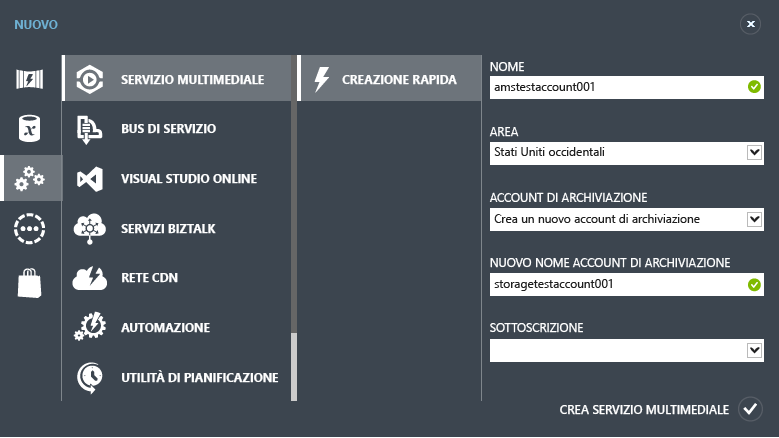
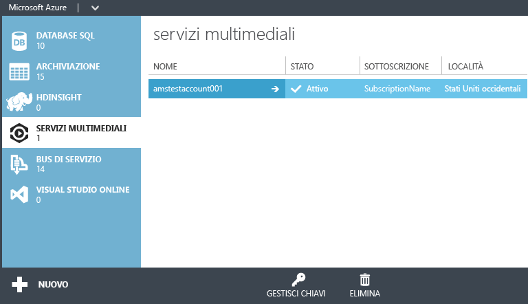

<properties
	pageTitle="Introduzione a Distribuzione di Video on Demand (VoD) tramite il portale di gestione di Azure"
	description="Questa esercitazione illustra il processo di implementazione di un'applicazione di distribuzione di contenuti Video on Demand (VoD) usando il portale di gestione di Servizi multimediali di Azure."
	services="media-services"
	documentationCenter=""
	authors="Juliako"
	manager="dwrede"
	editor=""/>

<tags
	ms.service="media-services"
	ms.workload="media"
	ms.tgt_pltfrm="na"
	ms.devlang="ne"
	ms.topic="get-started-article" 
	ms.date="04/08/2015"
	ms.author="juliako"/>

#Introduzione a Distribuzione di Video on Demand (VoD) tramite il portale di gestione di Azure

[AZURE.INCLUDE [media-services-selector-get-started](../../includes/media-services-selector-get-started.md)]

>[AZURE.NOTE]Per completare l'esercitazione, è necessario un account Azure. Se non si dispone di un account, è possibile creare un account di valutazione gratuita in pochi minuti. Per informazioni dettagliate, vedere la pagina relativa alla <a href="http://www.windowsazure.com/pricing/free-trial/?WT.mc_id=A8A8397B5" target="_blank">versione di valutazione gratuita di Azure</a>.

Questa esercitazione illustra il processo di implementazione di un'applicazione di distribuzione di contenuti Video on Demand (VoD) di base usando il portale di gestione di Azure.

Questa guida introduttiva illustra come effettuare le seguenti attività.

1.  Creare un account di Servizi multimediali
2.  Configurare endpoint di streaming
1.  Caricare un file video
1.  Codificare il file di origine in un set di file MP4 a velocità in bit adattiva
1.  Pubblicare l'asset e ottenere gli URL di streaming e di download progressivo  
1.  Riprodurre i contenuti

##Creare un account di Servizi multimediali

1. Nel [portale di gestione][] fare clic su **New**, quindi su **Media Service** e infine su **Quick Create**.

	

2. In **NAME** immettere il nome per il nuovo account. Un nome di account Servizi multimediali deve essere composto da tutte lettere minuscole o da numeri senza spazi con una lunghezza compresa tra 3 e 24 caratteri.

3. In **REGION** selezionare l'area geografica che verrà utilizzata per archiviare i record dei metadati per l'account di Servizi multimediali. Nell'elenco a discesa vengono visualizzate solo le aree di Servizi multimediali disponibili.

4. In **STORAGE ACCOUNT** selezionare un account di archiviazione per l'archiviazione BLOB del contenuto multimediale dell'account di Servizi multimediali. È possibile scegliere un account di archiviazione esistente nella stessa area geografica dell'account di Servizi multimediali oppure è possibile crearne uno nuovo. Un nuovo account di archiviazione viene creato nella stessa area geografica.

5. Se è stato creato un nuovo account di archiviazione, in **NEW STORAGE ACCOUNT NAME** specificare un nome per l'account di archiviazione. Per i nomi degli account di archiviazione vengono seguite le stesse regole dei nomi degli account di Servizi multimediali.

6. Nella parte inferiore del modulo fare clic su **Quick Create**.

	È possibile monitorare lo stato di elaborazione nell'area dei messaggi, nella parte inferiore della finestra.

	Dopo aver creato l'account, lo stato passa su Attivo.

	Nella parte inferiore della pagina viene visualizzato il pulsante **GESTISCI CHIAVI**. Quando si fa clic su questo pulsante, viene visualizzata una finestra di dialogo con il nome dell'account di Servizi multimediali e le chiavi primaria e secondaria. Per accedere a livello di codice all'account di Servizi multimediali è richiesto il nome dell'account e la chiave primaria.

	

	Quando si fa doppio clic sul nome dell'account, per impostazione predefinita viene visualizzata la pagina Avvio rapido. Questa pagina consente di eseguire alcune attività di gestione disponibili anche in altre pagine del portale. È ad esempio possibile caricare un file video sia da questa pagina sia dalla pagina CONTENUTO.

##Configurare l'endpoint di streaming usando il portale

Quando si usa Servizi multimediali di Azure, uno degli scenari più frequenti consiste nella distribuzione di contenuti in streaming a velocità in bit adattiva ai client. Con lo streaming a velocità in bit adattiva, il client può passare a un flusso con velocità in bit maggiore o minore durante la visualizzazione del video, in base alla larghezza di banda attuale della rete, all'utilizzo della CPU e ad altri fattori. Servizi multimediali supporta le seguenti tecnologie di streaming a velocità in bit adattiva: HTTP Live Streaming (HLS), Smooth Streaming, MPEG DASH e HDS (solo per i titolari di licenza Adobe PrimeTime/Access).

Servizi multimediali fornisce il servizio di creazione dinamica dei pacchetti, che consente di distribuire i contenuti codificati in formato MP4 o Smooth Streaming con velocità in bit adattiva in formati di streaming supportati da Servizi multimediali (MPEG DASH, HLS, Smooth Streaming, HDS), senza dover ricreare i pacchetti con questi formati di streaming.

Per sfruttare i vantaggi del servizio di creazione dinamica dei pacchetti, è necessario seguire questa procedura:

- Codificare il file in formato intermedio (di origine) in un set di file MP4 o Smooth Streaming a velocità in bit adattiva (i passaggi per la codifica sono descritti più avanti in questa esercitazione).  
- Ottenere almeno un'unità di streaming per l'**endpoint di streaming** da cui si pianifica la distribuzione dei contenuti.

Con la creazione dinamica dei pacchetti si archiviano e si pagano solo i file in un unico formato di archiviazione e Servizi multimediali crea e fornisce la risposta appropriata in base alle richieste di un client.

Per modificare il numero di unità riservate di streaming, effettuare le seguenti operazioni:

1. Nel [portale di gestione](https://manage.windowsazure.com/) fare clic su **Media Services**. Fare quindi clic sul nome del servizio multimediale.

2. Selezionare la pagina ENDPOINT DI STREAMING. Quindi, fare clic sull'endpoint di streaming da modificare.

3. Per specificare il numero di unità di streaming, selezionare la scheda RIDIMENSIONA e spostare il dispositivo di scorrimento **capacità riservata**.

	

4. Fare clic sul pulsante SAVE per salvare le modifiche apportate.

	L'allocazione di nuove unità richiede circa 20 minuti.

	>[AZURE.NOTE]Attualmente, se si riporta a zero qualsiasi valore positivo delle unità di streaming, è possibile che lo streaming venga disabilitato per un periodo che può durare fino a un'ora.
	>
	> Il numero più alto di unità specificato in un periodo di 24 ore è quello che verrà usato per il calcolo del costo. Per informazioni sui prezzi, vedere [Dettagli prezzi di Servizi multimediali](http://go.microsoft.com/fwlink/?LinkId=275107).

##Caricare contenuti

1. Nel [portale di gestione](http://go.microsoft.com/fwlink/?LinkID=256666&clcid=0x409) fare clic su **Media Services** e quindi sul nome dell'account di Servizi multimediali.
2. Selezionare la pagina CONTENT.
3. Fare clic sul pulsante **Upload** nella pagina o nella parte inferiore del portale.
4. Nella finestra di dialogo **Upload content** selezionare il file di asset desiderato. Fare clic sul file e quindi su **Open** oppure premere **INVIO**.

	![Finestra di dialogo Carica contenuto][uploadcontent]

5. Nella finestra di dialogo Carica contenuto fare clic sul pulsante con il segno di spunta per accettare il file e il nome del contenuto.
6. Verrà avviato il caricamento e sarà possibile visualizzarne lo stato nella parte inferiore del portale.  

	![Stato processo][status]

Al termine del caricamento, il nuovo asset verrà visualizzato nell'elenco dei contenuti. Per convenzione, al nome verrà aggiunto il suffisso "**-Source**" per consentire di tenere traccia del nuovo contenuto come contenuto di origine per le attività di codifica.

![ContentPage][contentpage]

Se il valore delle dimensioni del file non viene aggiornato al termine del processo di caricamento, premere il pulsante **Sync Metadata**. Le dimensioni del file di asset verranno sincronizzate con le dimensioni effettive del file nell'archivio e verrà aggiornato il valore nella pagina dei contenuti.

##Codificare contenuti

###Panoramica
Per distribuire un video digitale tramite Internet è necessario comprimere il file multimediale. Servizi multimediali fornisce un codificatore multimediale che consente di specificare la modalità di codifica dei contenuti (ad esempio, i codec da usare, il formato di file, la risoluzione e la velocità in bit).

Quando si usa Servizi multimediali di Azure, uno degli scenari più frequenti consiste nella distribuzione di contenuti in streaming a velocità in bit adattiva ai client. Con lo streaming a velocità in bit adattiva, il client può passare a un flusso con velocità in bit maggiore o minore durante la visualizzazione del video, in base alla larghezza di banda attuale della rete, all'utilizzo della CPU e ad altri fattori. Servizi multimediali supporta le seguenti tecnologie di streaming a velocità in bit adattiva: HTTP Live Streaming (HLS), Smooth Streaming, MPEG DASH e HDS (solo per i titolari di licenza Adobe PrimeTime/Access).

Servizi multimediali fornisce il servizio di creazione dinamica dei pacchetti, che consente di distribuire i contenuti codificati in formato MP4 o Smooth Streaming con velocità in bit adattiva in formati di streaming supportati da Servizi multimediali (MPEG DASH, HLS, Smooth Streaming, HDS), senza dover ricreare i pacchetti con questi formati di streaming.

Per sfruttare i vantaggi del servizio di creazione dinamica dei pacchetti, è necessario seguire questa procedura:

- Codificare il file in formato intermedio (di origine) in un set di file MP4 o Smooth Streaming a velocità in bit adattiva (i passaggi per la codifica sono descritti più avanti in questa esercitazione).
- Ottenere almeno un'unità di streaming on demand per l'endpoint di streaming da cui si pianifica la distribuzione dei contenuti. Per altre informazioni, vedere l'articolo sulla [procedura per scalare unità riservate di streaming on demand](media-services-manage-origins.md#scale_streaming_endpoints/).

Con la creazione dinamica dei pacchetti si archiviano e si pagano solo i file in un unico formato di archiviazione e Servizi multimediali crea e fornisce la risposta appropriata in base alle richieste di un client.

Oltre alle funzionalità di creazione dinamica dei pacchetti, le unità riservate di streaming on demand offrono capacità in uscita dedicate, acquistabili in incrementi di 200 Mbps. Per impostazione predefinita, lo streaming on demand è configurato in un modello di istanza condivisa in base al quale le risorse del server (ad esempio, calcolo, capacità in uscita e così via) vengono condivise con tutti gli altri utenti. Per migliorare la velocità effettiva dello streaming on demand, si consiglia di acquistare unità riservate di streaming on demand.

###Codificare

Questa sezione descrive la procedura per la codifica di contenuti con Azure Media Encoder tramite il portale di gestione.

1.  Selezionare il file da codificare. Se la codifica è supportata per questo tipo di file, il pulsante ELABORA viene abilitato nella parte inferiore della pagina CONTENUTO.
4. Nella finestra di dialogo **Elabora** scegliere il ** **processore Azure Media Encoder.5. Scegliere una delle **configurazioni di codifica**.

	![Process2][process2]

	L'argomento [Set di impostazioni di attività per il codificatore di Servizi multimediali](https://msdn.microsoft.com/library/azure/dn619392.aspx) spiega il significato di ciascun set di impostazioni nelle categorie **Set di impostazioni per streaming adattivo (creazione dinamica dei pacchetti)**, **Set di impostazioni per il download progressivo** e **Set di impostazioni legacy per streaming adattivo**.

	Le **altre** configurazioni sono descritte di seguito:

	+ **Codifica con protezione dei contenuti (PlayReady)**. Questo set di impostazioni produce un asset codificato con la protezione dei contenuti PlayReady.  

		Per impostazione predefinita, viene usato il servizio di licenza PlayReady di Servizi multimediali. Per specificare un altro servizio dal quale i client possono ottenere una licenza per riprodurre i contenuti crittografati con PlayReady, usare le API REST o Media Services .NET SDK. Per altre informazioni, vedere [Uso della crittografia statica per proteggere i contenuti]() e impostare la proprietà **licenseAcquisitionUrl** nel set di impostazioni di Media Encryptor. In alternativa, è possibile usare la crittografia dinamica e impostare la proprietà **PlayReadyLicenseAcquisitionUrl** come descritto in [Uso della crittografia dinamica PlayReady e del server di distribuzione di licenze PlayReady](http://go.microsoft.com/fwlink/?LinkId=507720).
	+ **Riproduzione su PC/Mac (tramite Flash/Silverlight)**. Questo set di impostazioni genera un asset Smooth Streaming con le seguenti caratteristiche: audio stereo a 16 bit e frequenza di campionamento di 44,1 kHz con codifica CBR a 96 kbps (compressione AAC) e video 720p con codifica CBR a 6 velocità in bit da 3400 kbps a 400 kbps tramite compressione H.264 Main Profile e GOP di 2 secondi.
	+ **Riproduzione tramite HTML5 (tramite IE/Chrome/Safari)**. Questo set di impostazioni genera un singolo file MP4 con le seguenti caratteristiche: audio stereo a 16 bit e frequenza di campionamento di 44,1 kHz con codifica CBR a 128 kbps (compressione AAC) e video 720p con codifica CBR a 4500 kbps tramite compressione H.264 Main Profile.
	+ **Riproduzione su dispositivi iOS e PC/Mac**. Questo set di impostazioni genera un asset con le stesse caratteristiche dell'asset Smooth Streaming (descritte in precedenza), ma in un formato utilizzabile per trasmettere flussi Apple HLS ai dispositivi iOS.

5. Quindi, immettere il nome del contenuto di output descrittivo desiderato oppure accettare il valore predefinito. Fare quindi clic sul pulsante con il segno di spunta per avviare l'operazione di codifica. Nella parte inferiore del portale sarà possibile monitorare l'avanzamento dell'operazione.
6. Premere OK.

	Al termine della codifica, la pagina CONTENUTO includerà il file codificato.

	Per visualizzare l'avanzamento del processo di codifica, passare alla pagina **PROCESSI**.

	Se il valore delle dimensioni del file non viene aggiornato al termine del processo di codifica, premere il pulsante **Sync Metadata**. Le dimensioni del file di asset di output verranno sincronizzate con le dimensioni effettive del file nell'archivio e verrà aggiornato il valore nella pagina Content.

##Pubblicare contenuti

###Panoramica

Per poter fornire all'utente un URL da usare per scaricare o trasmettere in streaming i contenuti distribuiti, è prima necessario "pubblicare" la risorsa creando un localizzatore. I localizzatori forniscono l'accesso ai file contenuti nell'asset. Servizi multimediali supporta due tipi di localizzatori: localizzatori OnDemandOrigin, usati per lo streaming dei file multimediali (ad esempio, MPEG DASH, HLS o Smooth Streaming) e localizzatori di firma di accesso condiviso, usati per scaricare i file multimediali.

Se per pubblicare gli asset si usa il portale di gestione di Azure, i localizzatori vengono creati automaticamente e viene fornito un URL basato su OnDemandOrigin (se l'asset contiene un file .ism) o un URL SAS.

Un URL di firma di accesso condiviso ha il seguente formato:

	{blob container name}/{asset name}/{file name}/{SAS signature}

Un URL di streaming presenta il seguente formato e può essere usato per riprodurre asset Smooth Streaming:

	{streaming endpoint name-media services account name}.streaming.mediaservices.windows.net/{locator ID}/{filename}.ism/Manifest

Per creare un URL di streaming HLS, aggiungere (format=m3u8-aapl) all'URL.

	{streaming endpoint name-media services account name}.streaming.mediaservices.windows.net/{locator ID}/{filename}.ism/Manifest(format=m3u8-aapl)

Per creare un URL di streaming MPEG DASH, aggiungere (format=mpd-time-csf) all'URL.

	{streaming endpoint name-media services account name}.streaming.mediaservices.windows.net/{locator ID}/{filename}.ism/Manifest(format=mpd-time-csf)

Per i localizzatori viene definita una data di scadenza. Quando si pubblicano asset attraverso il portale, vengono creati localizzatori con scadenza a 100 anni.

>[AZURE.NOTE]I localizzatori creati attraverso il portale prima del mese di marzo 2015 hanno una data di scadenza di due anni.

Per aggiornare la data di scadenza di un localizzatore, è possibile usare [REST](http://msdn.microsoft.com/library/azure/hh974308.aspx#update_a_locator) o [.NET](http://go.microsoft.com/fwlink/?LinkID=533259). Si noti che quando si aggiorna la data di scadenza di un localizzatore di firma di accesso condiviso, l'URL viene modificato.

###Publish

Per pubblicare un asset tramite il portale, seguire questa procedura:

1. Selezionare l'asset.
2. Quindi, fare clic sul pulsante Pubblica.

 ![Contenuto pubblicato][publishedcontent]

##Riprodurre contenuti dal portale

Il **portale di gestione di Azure** fornisce un lettore di contenuti che può essere usato per testare il proprio video.

Fare clic sul contenuto video desiderato e quindi sul pulsante **Riproduci** nella parte inferiore del portale.

Considerazioni applicabili:

- Verificare che il video sia stato pubblicato.
- Il **LETTORE DI CONTENUTI DI SERVIZI MULTIMEDIALI** esegue la riproduzione dall'endpoint di streaming predefinito. Se si vuole eseguire la riproduzione da un endpoint di streaming diverso, usare un altro lettore, ad esempio [Lettore di Servizi multimediali di Azure](http://amsplayer.azurewebsites.net/azuremediaplayer.html).

![AMSPlayer][AMSPlayer]

##Passaggio successivo

Ulteriori informazioni sulla compilazione di applicazioni Video on Demand [Compilare applicazioni VoD](media-services-video-on-demand-workflow.md)

###Risorse aggiuntive
- <a href="http://channel9.msdn.com/Shows/Azure-Friday/Azure-Media-Services-101-Get-your-video-online-now-">Servizi multimediali di Azure 101 - Pubblicare un video online</a>
- <a href="http://channel9.msdn.com/Shows/Azure-Friday/Azure-Media-Services-102-Dynamic-Packaging-and-Mobile-Devices">Servizi multimediali di Azure 102 - Creazione dinamica dei pacchetti e dispositivi mobili</a>

<!-- Anchors. -->

<!-- URLs. -->
[portale di gestione]: http://manage.windowsazure.com/

<!-- Images -->
[portaloverview]: ./media/media-services-portal-get-started/media-services-content-page.png
[publishedcontent]: ./media/media-services-portal-get-started/media-services-upload-content-published.png
[uploadcontent]: ./media/media-services-portal-get-started/UploadContent.png
[status]: ./media/media-services-portal-get-started/Status.png
[encoder]: ./media/media-services-manage-content/EncoderDialog2.png
[branding]: ./media/branding-reporting.png
[contentpage]: ./media/media-services-portal-get-started/media-services-content-page.png
[process]: ./media/media-services-manage-content/media-services-process-video.png
[process2]: ./media/media-services-portal-get-started/media-services-process-video2.png
[encrypt]: ./media/media-services-manage-content/media-services-encrypt-content.png
[AMSPlayer]: ./media/media-services-portal-get-started/media-services-portal-player.png
 

<!---HONumber=July15_HO3-->