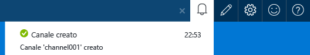
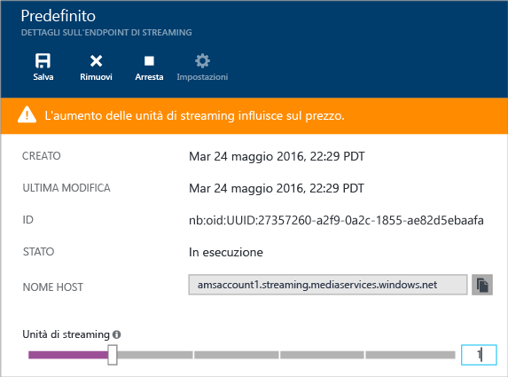
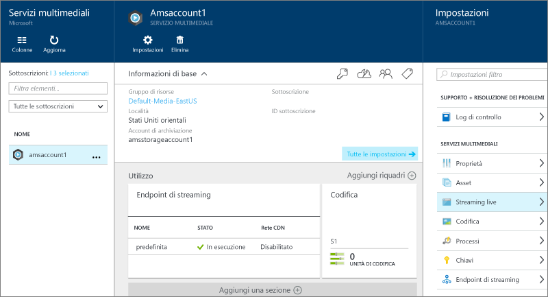
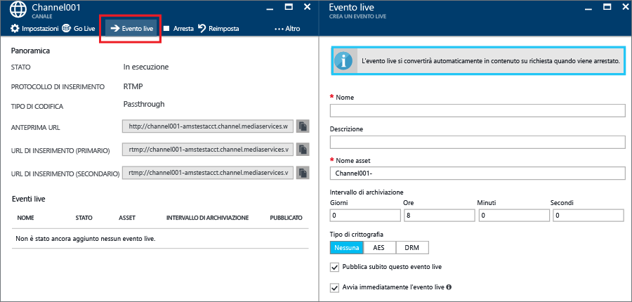
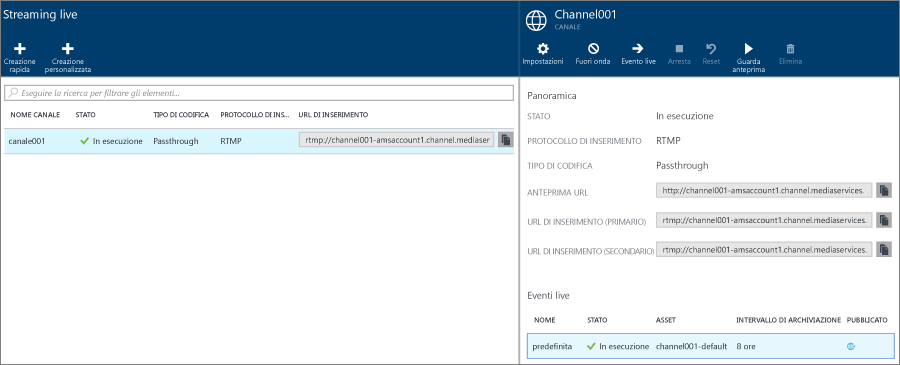
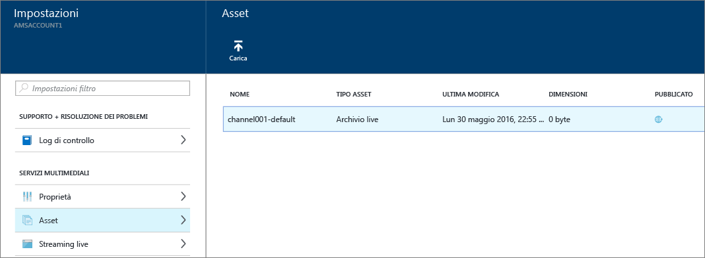

<properties 
	pageTitle="Come eseguire lo streaming live con codificatori locali tramite il portale di Azure | Microsoft Azure" 
	description="Questa esercitazione illustra come creare un canale configurato per la distribuzione pass-through." 
	services="media-services" 
	documentationCenter="" 
	authors="juliako" 
	manager="erikre" 
	editor=""/>

<tags 
	ms.service="media-services" 
	ms.workload="media" 
	ms.tgt_pltfrm="na" 
	ms.devlang="na" 
	ms.topic="get-started-article"
	ms.date="09/05/2016" 
	ms.author="juliako"/>

#Come eseguire lo streaming live con codificatori locali tramite il portale di Azure

> [AZURE.SELECTOR]
- [Portale](media-services-portal-live-passthrough-get-started.md)
- [.NET](media-services-dotnet-live-encode-with-onpremises-encoders.md)
- [REST](https://msdn.microsoft.com/library/azure/dn783458.aspx)

Questa esercitazione illustra come usare il portale di Azure per creare un **canale** configurato per la distribuzione pass-through.

##Prerequisiti

Per completare l'esercitazione è necessario quanto segue:

- Un account Azure. Per informazioni dettagliate, vedere la pagina relativa alla [versione di valutazione gratuita di Azure](https://azure.microsoft.com/pricing/free-trial/).
- Account di Servizi multimediali. Per creare un account di Servizi multimediali, vedere [Come creare un account di Servizi multimediali](media-services-create-account.md).
- Una webcam. Ad esempio, [codificatore Telestream Wirecast](http://www.telestream.net/wirecast/overview.htm).

È consigliabile vedere gli articoli seguenti:

- [Codificatori live e supporto RTMP di Servizi multimediali di Azure](https://azure.microsoft.com/blog/2014/09/18/azure-media-services-rtmp-support-and-live-encoders/)
- [Panoramica di Live Streaming con Servizi multimediali di Azure](media-services-manage-channels-overview.md)
- [Streaming live con codificatori locali che creano flussi a più velocità in bit](media-services-live-streaming-with-onprem-encoders.md)

##Scenario comune di streaming live

I passaggi seguenti descrivono le attività previste per la creazione di applicazioni di streaming live comuni che usano canali configurati per la distribuzione pass-through. Questa esercitazione illustra come creare e gestire un canale pass-through e gli eventi live.

1. Connettere una videocamera a un computer. Avviare e configurare un codificatore live locale che genera un flusso in formato RTMP o MP4 frammentato a più bitrate. Per altre informazioni, vedere l'argomento relativo a [codificatori live e supporto RTMP di Servizi multimediali di Azure](http://go.microsoft.com/fwlink/?LinkId=532824).
	
	Questa operazione può essere eseguita anche dopo la creazione del canale.

1. Creare e avviare un canale pass-through.
1. Recuperare l'URL di inserimento del canale.

	L'URL di inserimento viene usato dal codificatore live per inviare il flusso al canale.
1. Recuperare l'URL di anteprima del canale.

	Usare questo URL per verificare che il canale riceva correttamente il flusso live.

3. Creare un programma o un evento live.

	Quando si crea un evento live usando il portale di Azure, viene creato automaticamente anche un asset.
	  
	>[AZURE.NOTE]Accertarsi che sia presente almeno un'unità riservata di streaming nell'endpoint di streaming da cui si desidera trasmettere i contenuti in streaming.
1. Avviare il programma o l'evento quando si è pronti ad avviare lo streaming e l'archiviazione.
2. Facoltativamente, il codificatore live può ricevere il segnale per l'avvio di un annuncio. L'annuncio viene inserito nel flusso di output.
1. Arrestare il programma o l'evento ogni volta che si vuole arrestare lo streaming e l'archiviazione dell'evento.
1. Eliminare il programma o l'evento e, facoltativamente, l'asset.

>[AZURE.IMPORTANT] Per informazioni su considerazioni e concetti relativi allo streaming live con codificatori locali e canali pass-through, vedere [Streaming live con codificatori locali che creano flussi a bitrate multipli](media-services-live-streaming-with-onprem-encoders.md).

##Per visualizzare notifiche ed errori

Se occorre visualizzare le notifiche e gli errori generati dal portale di Azure, fare clic sull'icona di notifica.

##Configurare gli endpoint di streaming 

Servizi multimediali include la funzionalità per la creazione dinamica dei pacchetti, che consente di distribuire file MP4 a bitrate multipli nei formati MPEG DASH, HLS, Smooth Streaming o HDS, senza dover ricreare i pacchetti con questi formati di streaming. Con la creazione dinamica dei pacchetti si archiviano e si pagano solo i file in un singolo formato di archiviazione e Servizi multimediali crea e fornisce la risposta appropriata in base alle richieste di un client.

Per sfruttare i vantaggi della creazione dinamica dei pacchetti, è necessario ottenere almeno un'unità di streaming per l'endpoint di streaming da cui si prevede di distribuire il contenuto.

Per creare e modificare il numero di unità riservate di streaming, seguire questa procedura:

1. Accedere al [portale di Azure](https://portal.azure.com/).
1. Nella finestra **Impostazioni** fare clic su **Endpoint di streaming**.

2. Fare clic sull'endpoint di streaming predefinito.

	Verrà visualizzata la finestra **DETTAGLI ENDPOINT DI STREAMING PREDEFINITO**.

3. Per specificare il numero di unità di streaming, usare il dispositivo di scorrimento di **Unità di streaming**.

	

4. Fare clic sul pulsante **Salva** per salvare le modifiche apportate.

	>[AZURE.NOTE]Il completamento dell'allocazione di nuove unità può richiedere fino a 20 minuti.
	
##Creare e avviare eventi e canali pass-through

Un canale è associato a programmi o eventi che consentono di controllare la pubblicazione e l'archiviazione di segmenti in un flusso live. Gli eventi sono gestiti dai canali.
	
È possibile specificare il numero di ore per cui si vuole mantenere il contenuto registrato per il programma impostando il valore **Intervallo di archiviazione**. Il valore impostato può essere compreso tra 5 minuti e 25 ore. La lunghezza della finestra di archiviazione determina anche il limite di tempo per cui i client possono eseguire ricerche a ritroso nel tempo dalla posizione live corrente. Gli eventi possono essere eseguiti per l'intervallo di tempo specificato, ma il contenuto che supera la durata prevista viene scartato in modo continuo. Il valore della proprietà determina anche il tempo per cui i manifesti client possono crescere.

Ogni evento è associato a un asset. Per pubblicare l'evento, è necessario creare un localizzatore OnDemand per l'asset associato. Con questo localizzatore sarà possibile creare un URL di streaming da fornire ai client.

Un canale supporta fino a tre eventi in esecuzione simultanea, quindi consente di creare più archivi dello stesso flusso in ingresso. Questo consente di pubblicare e archiviare parti diverse di un evento a seconda delle necessità. Si consideri ad esempio uno scenario in cui un'azienda richiede l'archiviazione di 6 ore di un programma e la trasmissione solo degli ultimi 10 minuti. A tale scopo, è necessario creare due programmi in esecuzione contemporaneamente. Un programma è impostato per l'archiviazione di 6 ore dell'evento, ma non viene pubblicato. L'altro programma è impostato per l'archiviazione di 10 minuti e viene pubblicato.

Non riutilizzare eventi live esistenti, ma creare e avviare un nuovo evento per ogni evento.

Avviare l'evento quando si è pronti ad avviare lo streaming e l'archiviazione. Arrestare il programma ogni volta che si vuole interrompere lo streaming e l'archiviazione dell'evento.

Per eliminare il contenuto archiviato, arrestare ed eliminare l'evento e quindi eliminare l'asset associato. Un asset non può essere eliminato se è usato da un evento. Per farlo, eliminare prima l'evento.

Anche dopo l'arresto e l'eliminazione dell'evento, gli utenti saranno in grado di riprodurre in streaming il contenuto archiviato sotto forma di video on demand, finché non si elimina l'asset.

Se si desidera mantenere il contenuto archiviato ma non averlo disponibile per lo streaming, eliminare il localizzatore di streaming.

###Per usare il portale per creare un canale 

Questa sezione illustra come usare l'opzione **Creazione rapida** per creare un canale pass-through.

Per informazioni più dettagliate sui canali pass-through, vedere [Streaming live con codificatori locali che creano flussi a bitrate multipli](media-services-live-streaming-with-onprem-encoders.md).

1. Nella finestra **Impostazioni** fare clic su **Streaming live**.

	
	
	Verrà visualizzata la finestra **Streaming live**.

3. Fare clic su **Creazione rapida** per creare un canale pass-through con il protocollo di inserimento RTMP.

	Verrà visualizzata la finestra **CREATE A NEW CHANNEL** (CREA UN NUOVO CANALE).
4. Assegnare un nome al nuovo canale e fare clic su **Crea**.

	Verrà creato un canale pass-through con il protocollo di inserimento RTMP.

##Creare eventi

1. Selezionare un canale a cui si vuole aggiungere un evento.
2. Premere il pulsante **Evento live**.

##Ottenere gli URL di inserimento

Dopo avere creato il canale, è possibile ottenere gli URL di inserimento da fornire al codificatore live. Questi URL vengono usati dal codificatore per inserire un flusso live.

##Guardare l'evento

Per guardare l'evento, fare clic su **Watch** (Guarda) nel portale di Azure o copiare l'URL di streaming e usare un lettore a propria scelta.
 

Quando viene arrestato, l'evento live viene convertito automaticamente in contenuto su richiesta.

##Eseguire la pulizia

Per informazioni più dettagliate sui canali pass-through, vedere [Streaming live con codificatori locali che creano flussi a bitrate multipli](media-services-live-streaming-with-onprem-encoders.md).

- È possibile arrestare un canale solo quando tutti gli eventi o i programmi nel canale sono stati arrestati. Dopo l'arresto, il canale non è soggetto ad alcun addebito. Quando occorrerà riavviarlo, avrà lo stesso URL di inserimento, per cui non sarà necessario riconfigurare il codificatore.
- È possibile eliminare un canale solo quando tutti gli eventi live nel canale sono stati eliminati.

##Visualizzare il contenuto archiviato

Anche dopo l'arresto e l'eliminazione dell'evento, gli utenti saranno in grado di riprodurre in streaming il contenuto archiviato sotto forma di video on demand, finché non si elimina l'asset. Un asset non può essere eliminato se è usato da un evento. Per farlo, eliminare prima l'evento.

Per gestire gli asset, selezionare**Impostazione** e fare clic su **Asset**.

##Passaggio successivo

Analizzare i percorsi di apprendimento di Servizi multimediali.

[AZURE.INCLUDE [media-services-learning-paths-include](../../includes/media-services-learning-paths-include.md)]

##Fornire commenti e suggerimenti

[AZURE.INCLUDE [media-services-user-voice-include](../../includes/media-services-user-voice-include.md)]

<!---HONumber=AcomDC_0907_2016-->