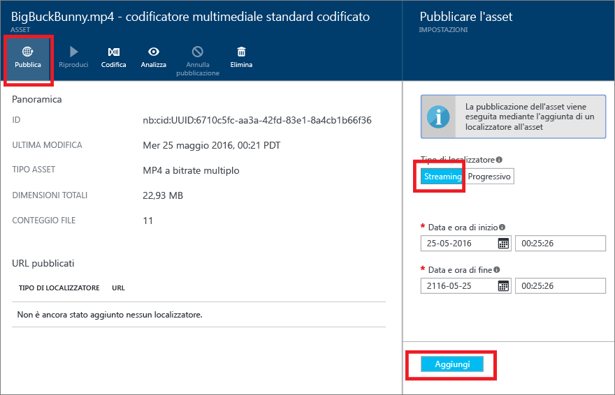

# Pubblicare contenuti con il portale di Azure
> [!div class="op_single_selector"]
> * [Portale](media-services-portal-publish.md)
> * [.NET](media-services-deliver-streaming-content.md)
> * [REST](media-services-rest-deliver-streaming-content.md)
> 
> 

## Overview
> [!NOTE]
> Per completare l'esercitazione, è necessario un account Azure. Per informazioni dettagliate, vedere la pagina relativa alla [versione di valutazione gratuita di Azure](https://azure.microsoft.com/pricing/free-trial/). 
> 
> 

Perché l'utente possa avere a disposizione un URL da usare per scaricare o riprodurre in streaming i contenuti, è prima necessario "pubblicare" un asset creando un localizzatore. I localizzatori forniscono l'accesso ai file contenuti nell'asset. Servizi multimediali supporta due tipi di localizzatori: 

* Localizzatori di streaming (OnDemandOrigin) usati per lo streaming adattivo, ad esempio per riprodurre in streaming file MPEG DASH, HLS o Smooth Streaming. Per creare un localizzatore di streaming, l'asset deve contenere un file con estensione ISM. 
* Localizzatori progressivi (SAS) usati per la distribuzione di video tramite download progressivo.

Un URL di streaming presenta il formato seguente e può essere usato per riprodurre asset Smooth Streaming.

    {streaming endpoint name-media services account name}.streaming.mediaservices.windows.net/{locator ID}/{filename}.ism/Manifest

Per creare un URL di streaming HLS, aggiungere (format=m3u8-aapl) all'URL.

    {streaming endpoint name-media services account name}.streaming.mediaservices.windows.net/{locator ID}/{filename}.ism/Manifest(format=m3u8-aapl)

Per creare un URL di streaming MPEG DASH, aggiungere (format=mpd-time-csf) all'URL.

    {streaming endpoint name-media services account name}.streaming.mediaservices.windows.net/{locator ID}/{filename}.ism/Manifest(format=mpd-time-csf)

Un URL di firma di accesso condiviso ha il formato seguente.

    {blob container name}/{asset name}/{file name}/{SAS signature}

Per altre informazioni, vedere [Panoramica della distribuzione di contenuti](media-services-deliver-content-overview.md).

> [!NOTE]
> I localizzatori creati attraverso il portale prima del mese di marzo 2015 hanno una data di scadenza di due anni.  
> 
> 

Per aggiornare la data di scadenza di un localizzatore, è possibile usare le API [REST](http://msdn.microsoft.com/library/azure/hh974308.aspx#update_a_locator) o [.NET](http://go.microsoft.com/fwlink/?LinkID=533259). Si noti che quando si aggiorna la data di scadenza di un localizzatore di firma di accesso condiviso, l'URL viene modificato.

### Per usare il portale per la pubblicazione di un asset
Per pubblicare un asset tramite il portale, seguire questa procedura:

1. Nel [portale di Azure ](https://portal.azure.com/) selezionare l'account Servizi multimediali di Azure.
2. Selezionare **Impostazioni** > **Asset**.
3. Selezionare l'asset da pubblicare.
4. Fare clic sul pulsante **Pubblica** .
5. Selezionare il tipo di localizzatore.
6. Fare clic su **Aggiungi**.
   
    

L'URL verrà aggiunto all'elenco di **URL pubblicati**.

## Riprodurre contenuti dal portale
Il portale di Azure fornisce un lettore di contenuti che può essere usato per testare il proprio video.

Fare clic sul video richiesto e quindi sul pulsante **Riproduci** .

Considerazioni applicabili:

* Verificare che il video sia stato pubblicato.
* **Media Player** esegue la riproduzione dall'endpoint di streaming predefinito. Se si vuole eseguire la riproduzione da un endpoint di streaming diverso, fare clic per copiare l'URL e usare un altro lettore, ad esempio [Lettore di Servizi multimediali di Azure](http://amsplayer.azurewebsites.net/azuremediaplayer.html).
* L'endpoint di streaming da cui si effettua lo streaming deve essere in esecuzione.  
* Per eseguire lo streaming da un endpoint di streaming è necessario aggiungere almeno un'unità di streaming. Per altre informazioni, vedere [questo](media-services-portal-scale-streaming-endpoints.md) argomento.   

## Passaggi successivi
Analizzare i percorsi di apprendimento di Servizi multimediali.

[!INCLUDE [media-services-learning-paths-include](../../includes/media-services-learning-paths-include.md)]

## Fornire commenti e suggerimenti
[!INCLUDE [media-services-user-voice-include](../../includes/media-services-user-voice-include.md)]

<!--HONumber=Nov16_HO3-->

