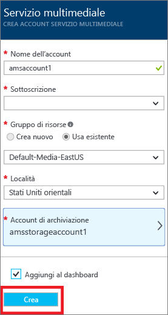
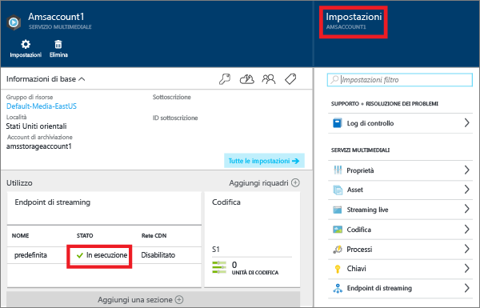
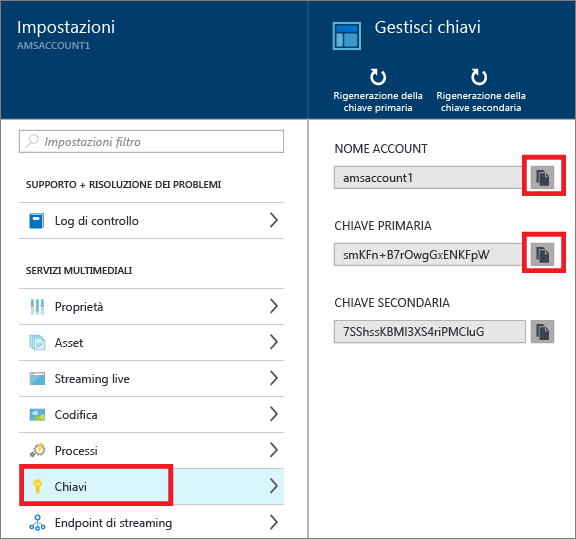
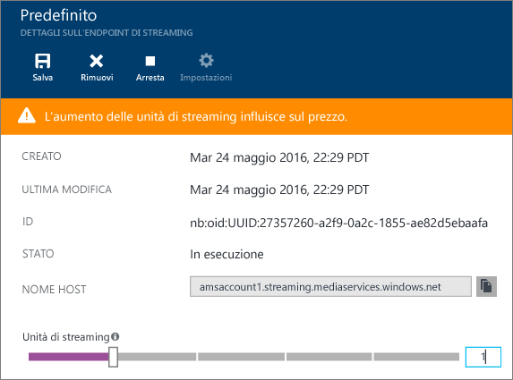
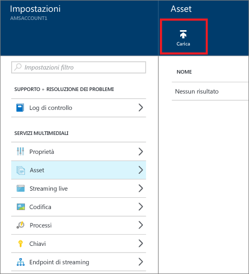
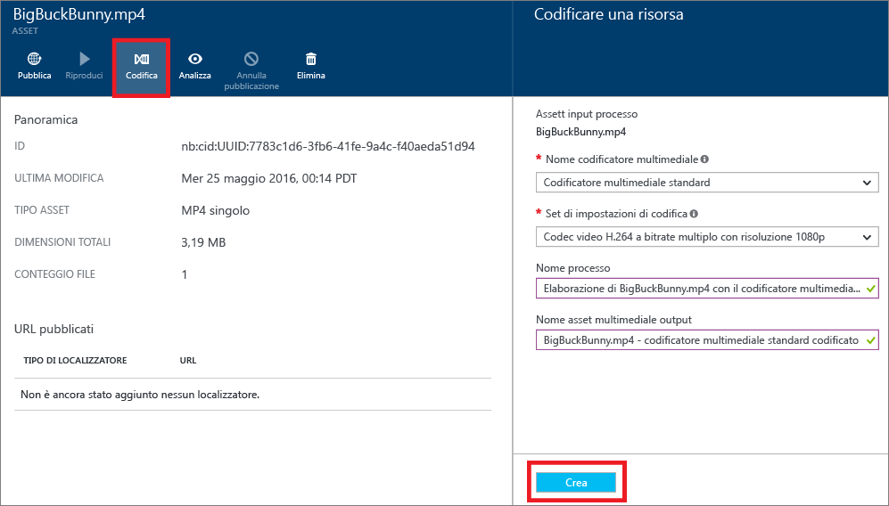

<properties
	pageTitle=" Introduzione alla distribuzione di contenuto su richiesta tramite il portale di Azure | Microsoft Azure"
	description="Questa esercitazione illustra il processo di implementazione di un servizio per la distribuzione di contenuto video on demand (VoD) di base con l'applicazione Servizi multimediali di Azure (AMS) usando il portale di Azure."
	services="media-services"
	documentationCenter=""
	authors="Juliako"
	manager="erikre"
	editor=""/>

<tags
	ms.service="media-services"
	ms.workload="media"
	ms.tgt_pltfrm="na"
	ms.devlang="na"
	ms.topic="get-started-article"
	ms.date="06/22/2016"
	ms.author="juliako"/>

# Introduzione alla distribuzione di contenuto su richiesta con il portale di Azure

Questa esercitazione illustra il processo di implementazione di un servizio per la distribuzione di contenuto video on demand (VoD) di base con l'applicazione Servizi multimediali di Azure (AMS) usando il portale di Azure.

Servizi multimediali di Azure è attualmente in anteprima nel portale di Azure.

> [AZURE.NOTE] Per completare l'esercitazione, è necessario un account Azure. Per informazioni dettagliate, vedere la pagina relativa alla [versione di valutazione gratuita di Azure](https://azure.microsoft.com/pricing/free-trial/).

Questa esercitazione include le attività seguenti:

1.  Creare un account di Servizi multimediali di Azure.
2.  Configurare endpoint di streaming.
1.  Caricare un file video.
1.  Codificare il file di origine in un set di file MP4 a velocità in bit adattiva.
1.  Pubblicare l'asset e ottenere gli URL di streaming e di download progressivo.
1.  Riprodurre i contenuti.

## Creare un account di Servizi multimediali di Azure

I passaggi descritti in questa sezione illustrano come creare un nuovo account Servizi multimediali di Azure.

1. Accedere al [portale di Azure](https://portal.azure.com/).
2. Fare clic su **+Nuovo** > **Contenuti multimediali e rete CDN** > **Servizi multimediali**.

	

3. In **CREARE UN ACCOUNT DEL SERVIZIO MULTIMEDIALE** immettere i valori richiesti.

	
	
	1. In **Nome account** immettere il nome del nuovo account di AMS. Un nome di account di Servizi multimediali deve essere composto da tutte lettere minuscole o da numeri senza spazi con una lunghezza compresa tra 3 e 24 caratteri.
	2. In Sottoscrizione selezionare una delle diverse sottoscrizioni di Azure per le quali è disponibile l'accesso.
	
	2. In **Gruppo di risorse** selezionare la risorsa nuova o esistente. Un gruppo di risorse è una raccolta di risorse che condividono lo stesso ciclo di vita, le stesse autorizzazioni e gli stessi criteri. fare clic [qui](resource-group-overview.md#resource-groups) per ulteriori informazioni.
	3. In **Località** selezionare l'area geografica che verrà usata per archiviare i record di metadati e contenuto multimediale per l'account Servizi multimediali. Questa area verrà usata per elaborare e riprodurre in streaming il contenuto multimediale. Nella casella dell'elenco a discesa vengono visualizzate solo le aree di Servizi multimediali disponibili.
	
	3. In **Account di archiviazione** selezionare un account di archiviazione per l'archivio BLOB del contenuto multimediale dell'account Servizi multimediali. È possibile scegliere un account di archiviazione esistente nella stessa area geografica dell'account di Servizi multimediali oppure è possibile crearne uno nuovo. Un nuovo account di archiviazione viene creato nella stessa area geografica. Per i nomi degli account di archiviazione vengono seguite le stesse regole dei nomi degli account di Servizi multimediali.

		Altre informazioni sull'archiviazione sono disponibili [qui](storage-introduction.md).

	4. Selezionare **Aggiungi al dashboard** per visualizzare lo stato della distribuzione di account.
	
7. Fare clic su **Crea** nella parte inferiore del form.

	Dopo aver creato l'account, lo stato diventa **In esecuzione**.

	

	Per gestire l'account AMS, ad esempio per caricare video, codificare asset, monitorare lo stato dei processi, usare la finestra **Impostazioni**.

## Gestione delle chiavi

Per accedere a livello di codice all'account Servizi multimediali, sono necessarie le informazioni relative al nome dell'account e alla chiave primaria.

1. Nel portale di Azure selezionare l'account.

	Su lato destro verrà visualizzata la finestra **Impostazioni**.

2. Nella finestra **Impostazioni** selezionare **Chiavi**.

	Nella finestra **Gestisci chiavi** sono visualizzati il nome dell'account e le chiavi primaria e secondaria.
3. Per copiare i valori, scegliere il pulsante Copia.
	
	

## Configurare gli endpoint di streaming

Uno degli scenari più frequenti dell'utilizzo di Servizi multimediali di Azure riguarda la distribuzione ai client di contenuto video in streaming a bitrate adattivo. Con lo streaming a velocità in bit adattiva, il client può passare a un flusso con velocità in bit maggiore o minore durante la visualizzazione del video, in base alla larghezza di banda attuale della rete, all'utilizzo della CPU e ad altri fattori. Servizi multimediali supporta le seguenti tecnologie di streaming a velocità in bit adattiva: HTTP Live Streaming (HLS), Smooth Streaming, MPEG DASH e HDS (solo per i titolari di licenza Adobe PrimeTime/Access).

Servizi multimediali include la funzionalità per la creazione dinamica dei pacchetti, che consente di distribuire contenuto con codifica MP4 a bitrate adattivo nei formati supportati dal servizio, come MPEG DASH, HLS, Smooth Streaming, HDS, in modalità JIT senza dover archiviare le versioni in pacchetti di ognuno di questi formati di streaming.

Per sfruttare i vantaggi del servizio di creazione dinamica dei pacchetti, è necessario seguire questa procedura:

- Codificare il file (di origine) in formato intermedio in un set di file MP4 a bitrate adattivo. La procedura per la codifica è descritti più avanti in questa esercitazione.
- Creare almeno un'unità di streaming per l'*endpoint di streaming* da cui si prevede di distribuire il contenuto. I passaggi seguenti illustrano come modificare il numero di unità di streaming.

Con la creazione dinamica dei pacchetti si archiviano e si pagano solo i file in un unico formato di archiviazione e Servizi multimediali crea e fornisce la risposta appropriata in base alle richieste di un client.

Per creare e modificare il numero di unità riservate di streaming, seguire questa procedura:

1. Nella finestra **Impostazioni** fare clic su **Endpoint di streaming**.

2. Fare clic sull'endpoint di streaming predefinito.

	Verrà visualizzata la finestra **DEFAULT STREAMING ENDPOINT DETAILS** (DETTAGLI ENDPOINT DI STREAMING PREDEFINITO).

3. Per specificare il numero di unità di streaming, usare il dispositivo di scorrimento di **Unità di streaming**.

	

4. Fare clic sul pulsante **Salva** per salvare le modifiche apportate.

	>[AZURE.NOTE]Il completamento dell'allocazione di nuove unità può richiedere fino a 20 minuti.

## Caricare file

Per riprodurre video in streaming con Servizi multimediali di Azure, è necessario caricare i video di origine, codificarli in più bitrate e pubblicare il risultato. Il primo passaggio è illustrato in questa sezione.

1. Nella finestra **Impostazione** fare clic su **Asset**.

	

3. Fare clic sul pulsante **Upload**.

	Verrà visualizzata la finestra **Upload a video asset** (Carica un asset video).

	>[AZURE.NOTE] Non esistono limiti alle dimensioni dei file.
	
4. Passare al video desiderato nel computer locale, selezionarlo e fare clic su OK.

	Il caricamento viene avviato ed è possibile visualizzare l'avanzamento sotto il nome del file.

Al termine del caricamento, il nuovo asset verrà visualizzato nella finestra **Asset**.

## Codificare gli asset

Quando si usa Servizi multimediali di Azure, uno degli scenari più frequenti consiste nella distribuzione di contenuti in streaming a velocità in bit adattiva ai client. Servizi multimediali supporta le seguenti tecnologie di streaming a velocità in bit adattiva: HTTP Live Streaming (HLS), Smooth Streaming, MPEG DASH e HDS (solo per i titolari di licenza Adobe PrimeTime/Access). Per preparare i video per lo streaming a bitrate adattivo, è necessario codificare il video di origine in file a più bitrate. Per codificare i video, è consigliabile usare il codificatore **Media Encoder Standard**.

Servizi multimediali include la funzionalità per la creazione dinamica dei pacchetti, che consente di distribuire file MP4 a più bitrate nei formati MPEG DASH, HLS, Smooth Streaming or HDS, senza dover ricreare i pacchetti con questi formati di streaming. Con la creazione dinamica dei pacchetti si archiviano e si pagano solo i file in un unico formato di archiviazione e Servizi multimediali crea e fornisce la risposta appropriata in base alle richieste di un client.

Per sfruttare i vantaggi del servizio di creazione dinamica dei pacchetti, è necessario seguire questa procedura:

- Codificare il file di origine in un set di file MP4 a più bitrate. La procedura per la codifica è descritta più avanti in questa esercitazione.
- Ottenere almeno un'unità di streaming per l'endpoint di streaming da cui si pianifica la distribuzione dei contenuti. Per altre informazioni, vedere [Configurazione degli endpoint di streaming](media-services-portal-vod-get-started.md#configure-streaming-endpoints).

### Per usare il portale per la codifica

Questa sezione descrive la procedura per la codifica di contenuti con Media Encoder Standard.

1.  Nella finestra **Impostazioni** selezionare **Asset**.
2.  Nella finestra **Asset** selezionare la risorsa che si vuole codificare.
3.  Fare clic sul pulsante **Codifica**.
4.  Nella finestra **Encode an asset** (Codifica un asset), selezionare il processore "Media Encoder Standard" e un set di impostazioni. Ad esempio, se è noto che il video di input ha una risoluzione di 1920x1080 pixel, è possibile usare il set di impostazioni "Codec video H.264 a bitrate multiplo con risoluzione 1080p". Per altre informazioni sui set di impostazioni, vedere [questo](https://msdn.microsoft.com/library/azure/mt269960.aspx) articolo. È importante selezionare il set di impostazioni più appropriato per il video di input. Se il video disponibile è a bassa risoluzione (640x360), non usare il set di impostazioni "Codec video H.264 a bitrate multiplo con risoluzione 1080p".
	
	Per una gestione più semplice, è possibile modificare il nome dell'asset di output e il nome del processo.
		
	
5. Fare clic su **Crea**.

### Monitorare lo stato del processo di codifica

Per monitorare lo stato del processo di codifica, fare clic su **Impostazioni** nella parte superiore della pagina e quindi selezionare **Processi**.

## Pubblicare contenuti

Per poter fornire all'utente un URL da usare per scaricare o trasmettere in streaming i contenuti distribuiti, è prima necessario "pubblicare" la risorsa creando un localizzatore. I localizzatori forniscono l'accesso ai file contenuti nell'asset. Servizi multimediali supporta due tipi di localizzatori:

- Localizzatori di streaming (OnDemandOrigin) usati per lo streaming adattivo, ad esempio per riprodurre in streaming file MPEG DASH, HLS o Smooth Streaming. Per creare un localizzatore di streaming, l'asset deve contenere un file con estensione ISM.
- Localizzatori progressivi (SAS) usati per la distribuzione di video tramite download progressivo.

Un URL di streaming presenta il formato seguente e può essere usato per riprodurre asset Smooth Streaming.

	{streaming endpoint name-media services account name}.streaming.mediaservices.windows.net/{locator ID}/{filename}.ism/Manifest

Per creare un URL di streaming HLS, aggiungere (format=m3u8-aapl) all'URL.

	{streaming endpoint name-media services account name}.streaming.mediaservices.windows.net/{locator ID}/{filename}.ism/Manifest(format=m3u8-aapl)

Per creare un URL di streaming MPEG DASH, aggiungere (format=mpd-time-csf) all'URL.

	{streaming endpoint name-media services account name}.streaming.mediaservices.windows.net/{locator ID}/{filename}.ism/Manifest(format=mpd-time-csf)

Un URL di firma di accesso condiviso ha il formato seguente.

	{blob container name}/{asset name}/{file name}/{SAS signature}

>[AZURE.NOTE] I localizzatori creati attraverso il portale prima del mese di marzo 2015 hanno una data di scadenza di due anni.

Per aggiornare la data di scadenza di un localizzatore, è possibile usare le API [REST](http://msdn.microsoft.com/library/azure/hh974308.aspx#update_a_locator) o [.NET](http://go.microsoft.com/fwlink/?LinkID=533259). Si noti che quando si aggiorna la data di scadenza di un localizzatore di firma di accesso condiviso, l'URL viene modificato.

### Per usare il portale per la pubblicazione di un asset

Per pubblicare un asset tramite il portale, seguire questa procedura:

1. Selezionare **Impostazioni** > **Asset**.
1. Selezionare l'asset da pubblicare.
1. Fare clic sul pulsante **Pubblica**.
1. Selezionare il tipo di localizzatore.
2. Fare clic su **Aggiungi**.

	

L'URL verrà aggiunto all'elenco di **Published URLs** (URL pubblicati).

## Riprodurre contenuti dal portale

Il portale di Azure fornisce un lettore di contenuti che può essere usato per testare il proprio video.

Fare clic sul video desiderato e quindi sul pulsante **Riproduci**.

Considerazioni applicabili:

- Verificare che il video sia stato pubblicato.
- Il *Lettore multimediale** esegue la riproduzione dall'endpoint di streaming predefinito. Se si vuole eseguire la riproduzione da un endpoint di streaming diverso, fare clic per copiare l'URL e usare un altro lettore, ad esempio [Lettore di Servizi multimediali di Azure](http://amsplayer.azurewebsites.net/azuremediaplayer.html).

##Passaggi successivi: Percorsi di apprendimento di Servizi multimediali

[AZURE.INCLUDE [media-services-learning-paths-include](../../includes/media-services-learning-paths-include.md)]

##Fornire commenti e suggerimenti

[AZURE.INCLUDE [media-services-user-voice-include](../../includes/media-services-user-voice-include.md)]

<!---HONumber=AcomDC_0713_2016-->