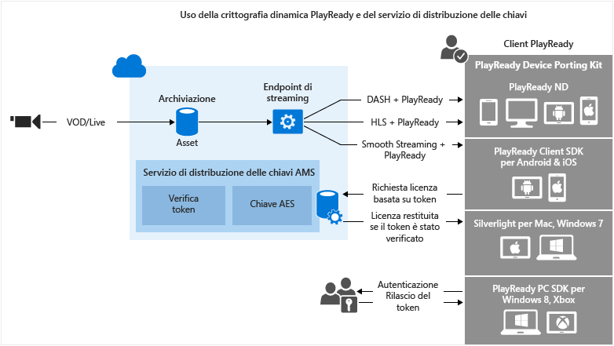

<properties
	pageTitle="Uso della crittografia dinamica DRM PlayReady e del servizio di distribuzione delle licenze"
	description="Servizi multimediali di Microsoft Azure consente di distribuire flussi MPEG-DASH, Smooth Streaming e Http-Live-Streaming (HLS) protetti con Microsoft PlayReady DRM. In questo argomento viene illustrato come crittografare con DRM PlayReady e utilizzare il servizio di distribuzione delle chiavi in modo dinamico."
	services="media-services"
	documentationCenter=""
	authors="Juliako"
	manager="dwrede"
	editor=""/>

<tags
	ms.service="media-services"
	ms.workload="media"
	ms.tgt_pltfrm="na"
	ms.devlang="na"
	ms.topic="get-started-article" 
	ms.date="09/07/2015"
	ms.author="juliako"/>

#Uso della crittografia dinamica DRM PlayReady e del servizio di distribuzione delle licenze

> [AZURE.SELECTOR]
- [.NET](media-services-protect-with-drm.md)
- [Java](https://github.com/southworkscom/azure-sdk-for-media-services-java-samples)

Servizi multimediali di Microsoft Azure consente di distribuire flussi MPEG-DASH, Smooth Streaming e Http-Live-Streaming (HLS) protetti con [Microsoft PlayReady DRM](https://www.microsoft.com/playready/overview/).

Servizi multimediali offre un servizio per la distribuzione di licenze Microsoft PlayReady. Servizi multimediali inoltre fornisce le API che consentono di configurare i diritti e le restrizioni che il runtime di PlayReady DRM deve applicare quando l'utente prova a riprodurre contenuti protetti. Quando un utente richiede di vedere contenuti protetti con PlayReady, l’applicazione del lettore client richiede il contenuto da Servizi multimediali di Azure. Servizi multimediali di Azure quindi reindirizza il client a un server licenze PlayReady di Servizi multimediali di Azure che autentica e autorizza l'accesso dell'utente al contenuto. Una licenza PlayReady contiene la chiave di decrittografia che può essere utilizzata dal lettore client per decrittografare e trasmettere il contenuto.

Servizi multimediali supporta più modalità di autenticazione degli utenti che eseguono richieste di chiavi. I criteri di autorizzazione delle chiavi simmetriche possono avere una o più restrizioni di tipo Open, Token o IP. I criteri con restrizione Token devono essere accompagnati da un token rilasciato da un servizio STS (Secure Token Service, servizio token di sicurezza). Servizi multimediali supporta i token nei formati [Simple Web Tokens](https://msdn.microsoft.com/library/gg185950.aspx#BKMK_2) (SWT) e [JSON Web Token](https://msdn.microsoft.com/library/gg185950.aspx#BKMK_3) (JWT). Per altre informazioni, vedere l'argomento Configurare i criteri di autorizzazione della chiave simmetrica.

Per sfruttare la crittografia dinamica, è necessario disporre di un asset che contenga un set di file MP4 con velocità in bit multipla o di file di origine Smooth Streaming con velocità in bit multipla. È inoltre necessario configurare i criteri di distribuzione dell'asset (descritti più avanti in questo argomento). Quindi, in base al formato specificato nell'URL del flusso, il server di streaming on demand garantirà che il flusso sia distribuito nel protocollo scelto. Di conseguenza, si archiviano e si pagano solo i file in un singolo formato di archiviazione e il servizio Servizi multimediali crea e fornisce la risposta appropriata in base alle richieste di un client.

Questo argomento potrebbe essere utile per gli sviluppatori che utilizzano applicazioni che forniscono contenuti protetti. L'argomento illustra come configurare il servizio di distribuzione della licenza PlayReady con criteri di autorizzazione, in modo che solo i client autorizzati possano ricevere licenze PlayReady. Inoltre illustra come utilizzare la crittografia dinamica.

>[AZURE.NOTE]Per iniziare a utilizzare la crittografia dinamica, è prima necessario ottenere almeno un'unità di scala (nota anche come unità di streaming). Per altre informazioni, vedere la sezione relativa al [ridimensionamento di un servizio multimediale](media-services-manage-origins.md#scale_streaming_endpoints).

##Flusso di lavoro della crittografia dinamica PlayReady e del servizio di distribuzione delle licenze PlayReady

Di seguito sono indicati i passaggi generali da eseguire quando si proteggono gli asset con PlayReady, tramite il servizio di distribuzione delle licenze di Servizi multimediali e tramite la crittografia dinamica.

1. Creare un asset e caricare file al suo interno. 
1. Codificare l'asset contenente il file per il set di file MP4 con velocità in bit adattiva.
1. Creare una chiave simmetrica e associarla all'asset codificato. In Servizi multimediali, la chiave simmetrica contiene la chiave di crittografia dell'asset. Per altre informazioni, vedere Chiave simmetrica.
1. Configurare i criteri di autorizzazione della chiave simmetrica. I criteri di autorizzazione della chiave simmetrica devono essere configurati dall'utente e soddisfatti dal client affinché la chiave simmetrica possa essere distribuita al client. 
1. Configurare i criteri di distribuzione di un asset. La configurazione dei criteri di distribuzione include: protocollo di recapito (ad esempio, MPEG DASH, HLS, HDS, Smooth Streaming o tutti), tipo di crittografia dinamica (ad esempio, crittografia comune), URL di acquisizione della licenza PlayReady. 
 
	È possibile applicare criteri diversi per ogni protocollo allo stesso asset. Ad esempio, è possibile applicare la crittografia PlayReady a Smooth/DASH e AES Envelope ad HLS. Gli eventuali protocolli non definiti nei criteri di distribuzione (ad esempio quando si aggiunge un singolo criterio che specifica soltanto HLS come protocollo) verranno esclusi dallo streaming. Questo comportamento non si verifica quando non è presente alcun criterio di distribuzione degli asset. In tal caso, sono consentiti tutti i protocolli in chiaro.
1. Creare un localizzatore OnDemand per ottenere un URL di streaming.

Si noterà un esempio .NET completo alla fine dell'argomento.

Nell'immagine seguente viene illustrato il flusso di lavoro descritto in precedenza. Di seguito viene utilizzato il token per l'autenticazione.

Nella parte rimanente di questo argomento vengono fornite spiegazioni dettagliate, esempi di codice e collegamenti ad argomenti che illustrano come eseguire le attività descritte in precedenza.

##Limitazioni correnti

Se si aggiungono o si aggiornano i criteri di distribuzione dell'asset, è necessario eliminare l'eventuale localizzatore esistente e creare un nuovo localizzatore.

##Creare un asset e caricare file nell'asset

Per gestire, codificare e trasmettere i video, è innanzitutto necessario caricare il contenuto in Servizi multimediali di Microsoft Azure. Dopo aver caricato i file, i contenuti vengono archiviati in modo sicuro nel cloud per altre operazioni di elaborazione e streaming.

Il frammento di codice seguente illustra come creare un asset e caricare il file specificato al suo interno.

	static public IAsset UploadFileAndCreateAsset(string singleFilePath)
	{
	    if(!File.Exists(singleFilePath))
	    {
	        Console.WriteLine("File does not exist.");
	        return null;
	    }
	
	    var assetName = Path.GetFileNameWithoutExtension(singleFilePath);
	    IAsset inputAsset = _context.Assets.Create(assetName, AssetCreationOptions.StorageEncrypted);
	
	    var assetFile = inputAsset.AssetFiles.Create(Path.GetFileName(singleFilePath));
	
	    Console.WriteLine("Created assetFile {0}", assetFile.Name);
	
	    var policy = _context.AccessPolicies.Create(
	                            assetName,
	                            TimeSpan.FromDays(30),
	                            AccessPermissions.Write | AccessPermissions.List);
	
	    var locator = _context.Locators.CreateLocator(LocatorType.Sas, inputAsset, policy);
	
	    Console.WriteLine("Upload {0}", assetFile.Name);
	
	    assetFile.Upload(singleFilePath);
	    Console.WriteLine("Done uploading {0}", assetFile.Name);
	
	    locator.Delete();
	    policy.Delete();
	
	    return inputAsset;
	}

##Codificare l'asset contenente il file per il set di file MP4 con velocità in bit adattiva

Con la crittografia dinamica, è necessario solamente creare un asset che contenga un set di file MP4 con velocità in bit multipla o di file di origine Smooth Streaming con velocità in bit multipla. In base al formato specificato nella richiesta del manifesto o del frammento, il server di streaming on demand garantirà che il flusso sia ricevuto nel protocollo scelto. Di conseguenza, si archiviano e si pagano solo i file in un singolo formato di archiviazione e il servizio Servizi multimediali crea e fornisce la risposta appropriata in base alle richieste di un client. Per ulteriori informazioni, vedere l’argomento [Panoramica della creazione dinamica dei pacchetti](media-services-dynamic-packaging-overview.md).

Il seguente frammento di codice illustra come codificare un asset per il set di MP4 con velocità in bit adattiva:

	static public IAsset EncodeToAdaptiveBitrateMP4Set(IAsset inputAsset)
	{
	    var encodingPreset = "H264 Adaptive Bitrate MP4 Set 720p";
	
	    IJob job = _context.Jobs.Create(String.Format("Encoding into Mp4 {0} to {1}",
	                            inputAsset.Name,
	                            encodingPreset));
	
	    var mediaProcessors = 
	        _context.MediaProcessors.Where(p => p.Name.Contains("Media Encoder")).ToList();
	
	    var latestMediaProcessor = 
	        mediaProcessors.OrderBy(mp => new Version(mp.Version)).LastOrDefault();
	
	
	
	    ITask encodeTask = job.Tasks.AddNew("Encoding", latestMediaProcessor, encodingPreset, TaskOptions.None);
	    encodeTask.InputAssets.Add(inputAsset);
	    encodeTask.OutputAssets.AddNew(String.Format("{0} as {1}", inputAsset.Name, encodingPreset), AssetCreationOptions.StorageEncrypted);
	
	    job.StateChanged += new EventHandler<JobStateChangedEventArgs>(JobStateChanged);
	    job.Submit();
	    job.GetExecutionProgressTask(CancellationToken.None).Wait();
	
	    return job.OutputMediaAssets[0];
	}
	
	static private void JobStateChanged(object sender, JobStateChangedEventArgs e)
	{
	    Console.WriteLine(string.Format("{0}\n  State: {1}\n  Time: {2}\n\n",
	        ((IJob)sender).Name,
	        e.CurrentState,
	        DateTime.UtcNow.ToString(@"yyyy_M_d__hh_mm_ss")));
	}

##Creare una chiave simmetrica e associarla all'asset codificato

In Servizi multimediali, la chiave simmetrica contiene la chiave con cui si desidera crittografare un asset.

Per informazioni dettagliate, vedere [Creare una chiave simmetrica](media-services-dotnet-create-contentkey.md).

##Configurare i criteri di autorizzazione della chiave simmetrica

Servizi multimediali supporta più modalità di autenticazione degli utenti che eseguono richieste di chiavi. I criteri di autorizzazione della chiave simmetrica devono essere configurati dall'utente e soddisfatti dal client (lettore) affinché la chiave possa essere distribuita al client. I criteri di autorizzazione delle chiavi simmetriche possono avere una o più restrizioni di tipo Open, Token o IP.

Per informazioni dettagliate, vedere l'argomento [Configurare i criteri di autorizzazione della chiave simmetrica](media-services-dotnet-configure-content-key-auth-policy.md#playready-dynamic-encryption).

##Configurare i criteri di distribuzione dell’asset 

Configurare i criteri di distribuzione dell'asset. Alcuni aspetti inclusi nella configurazione dei criteri di distribuzione dell’asset:

- L'URL di acquisizione della licenza PlayReady. 
- Il protocollo di recapito dell’asset (ad esempio, MPEG DASH, HLS, HDS, Smooth Streaming o tutti). 
- Il tipo di crittografia dinamica (in questo caso, crittografia comune). 

Per informazioni dettagliate, vedere [Configurare il criterio di distribuzione dell’asset](media-services-rest-configure-asset-delivery-policy.md).

##Creare un localizzatore di streaming OnDemand per ottenere un URL di streaming

È necessario fornire all'utente l'URL del flusso per Smooth, DASH o HLS.

>[AZURE.NOTE]Se si aggiungono o si aggiornano i criteri di distribuzione dell'asset, è necessario eliminare l'eventuale localizzatore esistente e creare un nuovo localizzatore.

Per istruzioni su come pubblicare un asset e creare un URL di streaming, vedere la sezione [Creare URL di streaming](media-services-deliver-streaming-content.md).

##Ottenere un token di test

Ottenere un token di test basato sulla restrizione Token usata per i criteri di autorizzazione della chiave.

	// Deserializes a string containing an Xml representation of a TokenRestrictionTemplate
	// back into a TokenRestrictionTemplate class instance.
	TokenRestrictionTemplate tokenTemplate = 
	    TokenRestrictionTemplateSerializer.Deserialize(tokenTemplateString);
	
	// Generate a test token based on the data in the given TokenRestrictionTemplate.
	//The GenerateTestToken method returns the token without the word “Bearer” in front
	//so you have to add it in front of the token string. 
	string testToken = TokenRestrictionTemplateSerializer.GenerateTestToken(tokenTemplate);
	Console.WriteLine("The authorization token is:\nBearer {0}", testToken);

	
È possibile utilizzare il [lettore AMS](http://amsplayer.azurewebsites.net/azuremediaplayer.html) per testare il flusso.

##Esempio

1. Creare un nuovo progetto Console.
1. Usare NuGet per installare e aggiungere le estensioni dell'SDK di Servizi multimediali di Azure per .NET. Insieme al pacchetto viene installato anche l'SDK di Servizi multimediali per .NET e vengono aggiunte tutte le altre dipendenze necessarie.
2. Aggiungere il file di configurazione che contiene il nome dell'account e le informazioni sulla chiave:

	
		<?xml version="1.0" encoding="utf-8"?>
		<configuration>
		    <startup> 
		        <supportedRuntime version="v4.0" sku=".NETFramework,Version=v4.5" />
		    </startup>
			  <appSettings>
			
			    <add key="MediaServicesAccountName" value="AccountName"/>
			    <add key="MediaServicesAccountKey" value="AccountKey"/>
			
			    <add key="Issuer" value="http://testacs.com"/>
			    <add key="Audience" value="urn:test"/>
			  </appSettings>
		</configuration>

1. Sovrascrivere il codice nel file Program.cs con il codice riportato in questa sezione.
	
	Assicurarsi di aggiornare le variabili in modo da puntare alle cartelle in cui si trovano i file di input.

		using System;
		using System.Collections.Generic;
		using System.Configuration;
		using System.IO;
		using System.Linq;
		using System.Text;
		using System.Threading;
		using System.Threading.Tasks;
		using System.Xml.Linq;
		using Microsoft.WindowsAzure.MediaServices.Client;
		using Microsoft.WindowsAzure.MediaServices.Client.ContentKeyAuthorization;
		using Microsoft.WindowsAzure.MediaServices.Client.DynamicEncryption;
		
		namespace PlayReadyDynamicEncryptAndKeyDeliverySvc
		{
		    class Program
		    {
		        // Read values from the App.config file.
		        private static readonly string _mediaServicesAccountName =
		            ConfigurationManager.AppSettings["MediaServicesAccountName"];
		        private static readonly string _mediaServicesAccountKey =
		            ConfigurationManager.AppSettings["MediaServicesAccountKey"];
		
		        private static readonly Uri _sampleIssuer =
		            new Uri(ConfigurationManager.AppSettings["Issuer"]);
		        private static readonly Uri _sampleAudience =
		            new Uri(ConfigurationManager.AppSettings["Audience"]);
		
		        // Field for service context.
		        private static CloudMediaContext _context = null;
		        private static MediaServicesCredentials _cachedCredentials = null;
		
		        private static readonly string _mediaFiles =
		            Path.GetFullPath(@"../..\Media");
		
		        private static readonly string _singleMP4File =
		            Path.Combine(_mediaFiles, @"BigBuckBunny.mp4");
		
		        static void Main(string[] args)
		        {
		            // Create and cache the Media Services credentials in a static class variable.
		            _cachedCredentials = new MediaServicesCredentials(
		                            _mediaServicesAccountName,
		                            _mediaServicesAccountKey);
		            // Used the cached credentials to create CloudMediaContext.
		            _context = new CloudMediaContext(_cachedCredentials);
		
		            bool tokenRestriction = false;
		            string tokenTemplateString = null;
		
		            IAsset asset = UploadFileAndCreateAsset(_singleMP4File);
		            Console.WriteLine("Uploaded asset: {0}", asset.Id);
		
		            IAsset encodedAsset = EncodeToAdaptiveBitrateMP4Set(asset);
		            Console.WriteLine("Encoded asset: {0}", encodedAsset.Id);
		
		            IContentKey key = CreateCommonTypeContentKey(encodedAsset);
		            Console.WriteLine("Created key {0} for the asset {1} ", key.Id, encodedAsset.Id);
		            Console.WriteLine("PlayReady License Key delivery URL: {0}", key.GetKeyDeliveryUrl(ContentKeyDeliveryType.PlayReadyLicense));
		            Console.WriteLine();
		    
		            if (tokenRestriction)
		                tokenTemplateString = AddTokenRestrictedAuthorizationPolicy(key);
		            else
		                AddOpenAuthorizationPolicy(key);
		
		            Console.WriteLine("Added authorization policy: {0}", key.AuthorizationPolicyId);
		            Console.WriteLine();
		
		            CreateAssetDeliveryPolicy(encodedAsset, key);
		            Console.WriteLine("Created asset delivery policy. \n");
		            Console.WriteLine();
		
		            if (tokenRestriction && !String.IsNullOrEmpty(tokenTemplateString))
		            {
		                // Deserializes a string containing an Xml representation of a TokenRestrictionTemplate
		                // back into a TokenRestrictionTemplate class instance.
		                TokenRestrictionTemplate tokenTemplate =
		                    TokenRestrictionTemplateSerializer.Deserialize(tokenTemplateString);
		
		                // Generate a test token based on the the data in the given TokenRestrictionTemplate.
		                // Note, you need to pass the key id Guid because we specified 
		                // TokenClaim.ContentKeyIdentifierClaim in during the creation of TokenRestrictionTemplate.
		                Guid rawkey = EncryptionUtils.GetKeyIdAsGuid(key.Id);
		
		                //The GenerateTestToken method returns the token without the word “Bearer” in front
		                //so you have to add it in front of the token string. 
		                string testToken = TokenRestrictionTemplateSerializer.GenerateTestToken(tokenTemplate, null, rawkey, DateTime.UtcNow.AddDays(365));
		                Console.WriteLine("The authorization token is:\nBearer {0}", testToken);
		                Console.WriteLine();
		            }
		
		            // You can use the http://smf.cloudapp.net/healthmonitor player 
		            // to test the smoothStreamURL URL.
		            //
		            string url = GetStreamingOriginLocator(encodedAsset);
		            Console.WriteLine("Encrypted Smooth Streaming URL: {0}/manifest", url);
		
		
		            Console.ReadLine();
		        }
		
		        static public IAsset UploadFileAndCreateAsset(string singleFilePath)
		        {
		            if (!File.Exists(singleFilePath))
		            {
		                Console.WriteLine("File does not exist.");
		                return null;
		            }
		
		            var assetName = Path.GetFileNameWithoutExtension(singleFilePath);
		            IAsset inputAsset = _context.Assets.Create(assetName, AssetCreationOptions.StorageEncrypted);
		
		            var assetFile = inputAsset.AssetFiles.Create(Path.GetFileName(singleFilePath));
		
		            Console.WriteLine("Created assetFile {0}", assetFile.Name);
		
		            var policy = _context.AccessPolicies.Create(
		                                    assetName,
		                                    TimeSpan.FromDays(30),
		                                    AccessPermissions.Write | AccessPermissions.List);
		
		            var locator = _context.Locators.CreateLocator(LocatorType.Sas, inputAsset, policy);
		
		            Console.WriteLine("Upload {0}", assetFile.Name);
		
		            assetFile.Upload(singleFilePath);
		            Console.WriteLine("Done uploading {0}", assetFile.Name);
		
		            locator.Delete();
		            policy.Delete();
		
		            return inputAsset;
		        }
		
		
		        static public IAsset EncodeToAdaptiveBitrateMP4Set(IAsset inputAsset)
		        {
		            var encodingPreset = "H264 Adaptive Bitrate MP4 Set 720p";
		
		            IJob job = _context.Jobs.Create(String.Format("Encoding into Mp4 {0} to {1}",
		                                    inputAsset.Name,
		                                    encodingPreset));
		
		            var mediaProcessors =
		                _context.MediaProcessors.Where(p => p.Name.Contains("Media Encoder")).ToList();
		
		            var latestMediaProcessor =
		                mediaProcessors.OrderBy(mp => new Version(mp.Version)).LastOrDefault();
		
		
		
		            ITask encodeTask = job.Tasks.AddNew("Encoding", latestMediaProcessor, encodingPreset, TaskOptions.None);
		            encodeTask.InputAssets.Add(inputAsset);
		            encodeTask.OutputAssets.AddNew(String.Format("{0} as {1}", inputAsset.Name, encodingPreset), AssetCreationOptions.StorageEncrypted);
		
		            job.StateChanged += new EventHandler<JobStateChangedEventArgs>(JobStateChanged);
		            job.Submit();
		            job.GetExecutionProgressTask(CancellationToken.None).Wait();
		
		            return job.OutputMediaAssets[0];
		        }
		
		
		        static public IContentKey CreateCommonTypeContentKey(IAsset asset)
		        {
		            // Create envelope encryption content key
		            Guid keyId = Guid.NewGuid();
		            byte[] contentKey = GetRandomBuffer(16);
		
		            IContentKey key = _context.ContentKeys.Create(
		                                    keyId,
		                                    contentKey,
		                                    "ContentKey",
		                                    ContentKeyType.CommonEncryption);
		
		            // Associate the key with the asset.
		            asset.ContentKeys.Add(key);
		
		            return key;
		        }
		
		    static public void AddOpenAuthorizationPolicy(IContentKey contentKey)
		    {
		
		        // Create ContentKeyAuthorizationPolicy with Open restrictions 
		        // and create authorization policy          
		
		        List<ContentKeyAuthorizationPolicyRestriction> restrictions = new List<ContentKeyAuthorizationPolicyRestriction>
		        {
		            new ContentKeyAuthorizationPolicyRestriction 
		            { 
		                Name = "Open", 
		                KeyRestrictionType = (int)ContentKeyRestrictionType.Open, 
		                Requirements = null
		            }
		        };
		
		        // Configure PlayReady license template.
		        string newLicenseTemplate = ConfigurePlayReadyLicenseTemplate();
		
		        IContentKeyAuthorizationPolicyOption policyOption =
		            _context.ContentKeyAuthorizationPolicyOptions.Create("",
		                ContentKeyDeliveryType.PlayReadyLicense,
		                    restrictions, newLicenseTemplate);
		
		        IContentKeyAuthorizationPolicy contentKeyAuthorizationPolicy = _context.
		                    ContentKeyAuthorizationPolicies.
		                    CreateAsync("Deliver Common Content Key with no restrictions").
		                    Result;
		
		
		        contentKeyAuthorizationPolicy.Options.Add(policyOption);
		
		        // Associate the content key authorization policy with the content key.
		        contentKey.AuthorizationPolicyId = contentKeyAuthorizationPolicy.Id;
		        contentKey = contentKey.UpdateAsync().Result;
		    }
		
		        public static string AddTokenRestrictedAuthorizationPolicy(IContentKey contentKey)
		        {
		            string tokenTemplateString = GenerateTokenRequirements();
		
		            IContentKeyAuthorizationPolicy policy = _context.
		                                    ContentKeyAuthorizationPolicies.
		                                    CreateAsync("HLS token restricted authorization policy").Result;
		
		            List<ContentKeyAuthorizationPolicyRestriction> restrictions = new List<ContentKeyAuthorizationPolicyRestriction>
		            {
		                new ContentKeyAuthorizationPolicyRestriction 
		                { 
		                    Name = "Token Authorization Policy", 
		                    KeyRestrictionType = (int)ContentKeyRestrictionType.TokenRestricted,
		                    Requirements = tokenTemplateString, 
		                }
		            };
		
		            // Configure PlayReady license template.
		            string newLicenseTemplate = ConfigurePlayReadyLicenseTemplate();
		
		            IContentKeyAuthorizationPolicyOption policyOption =
		                _context.ContentKeyAuthorizationPolicyOptions.Create("Token option",
		                    ContentKeyDeliveryType.PlayReadyLicense,
		                        restrictions, newLicenseTemplate);
		
		            IContentKeyAuthorizationPolicy contentKeyAuthorizationPolicy = _context.
		                        ContentKeyAuthorizationPolicies.
		                        CreateAsync("Deliver Common Content Key with no restrictions").
		                        Result;
		            
		            policy.Options.Add(policyOption);
		
		            // Add ContentKeyAutorizationPolicy to ContentKey
		            contentKeyAuthorizationPolicy.Options.Add(policyOption);
		
		            // Associate the content key authorization policy with the content key
		            contentKey.AuthorizationPolicyId = contentKeyAuthorizationPolicy.Id;
		            contentKey = contentKey.UpdateAsync().Result;
		
		            return tokenTemplateString;
		        }
		
		        static private string GenerateTokenRequirements()
		        {
		            TokenRestrictionTemplate template = new TokenRestrictionTemplate(TokenType.SWT);
		
		            template.PrimaryVerificationKey = new SymmetricVerificationKey();
		            template.AlternateVerificationKeys.Add(new SymmetricVerificationKey());
		            template.Audience = _sampleAudience;
		            template.Issuer = _sampleIssuer;
		            template.RequiredClaims.Add(TokenClaim.ContentKeyIdentifierClaim);
		
		            return TokenRestrictionTemplateSerializer.Serialize(template);
		        } 
		
		        static private string ConfigurePlayReadyLicenseTemplate()
		        {
		            // The following code configures PlayReady License Template using .NET classes
		            // and returns the XML string.
		             
		            PlayReadyLicenseResponseTemplate responseTemplate = new PlayReadyLicenseResponseTemplate();
		            PlayReadyLicenseTemplate licenseTemplate = new PlayReadyLicenseTemplate();
		
		            responseTemplate.LicenseTemplates.Add(licenseTemplate);
		
		            return MediaServicesLicenseTemplateSerializer.Serialize(responseTemplate);
		        }
		
		        static public void CreateAssetDeliveryPolicy(IAsset asset, IContentKey key)
		        {
		            Uri acquisitionUrl = key.GetKeyDeliveryUrl(ContentKeyDeliveryType.PlayReadyLicense);
		
		            Dictionary<AssetDeliveryPolicyConfigurationKey, string> assetDeliveryPolicyConfiguration =
		                new Dictionary<AssetDeliveryPolicyConfigurationKey, string>
		            {
		                {AssetDeliveryPolicyConfigurationKey.PlayReadyLicenseAcquisitionUrl, acquisitionUrl.ToString()},
		            };
		
		            var assetDeliveryPolicy = _context.AssetDeliveryPolicies.Create(
		                    "AssetDeliveryPolicy",
		                AssetDeliveryPolicyType.DynamicCommonEncryption,
		                AssetDeliveryProtocol.SmoothStreaming,
		                assetDeliveryPolicyConfiguration);
		
		            // Add AssetDelivery Policy to the asset
		            asset.DeliveryPolicies.Add(assetDeliveryPolicy);
		
		            Console.WriteLine();
		            Console.WriteLine("Adding Asset Delivery Policy: " +
		                assetDeliveryPolicy.AssetDeliveryPolicyType);
		        }
		
		
		        /// 

		        /// Gets the streaming origin locator.
		        /// 

		        /// <param name="assets"></param>
		        /// <returns></returns>
		        static public string GetStreamingOriginLocator(IAsset asset)
		        {
		
		            // Get a reference to the streaming manifest file from the  
		            // collection of files in the asset. 
		
		            var assetFile = asset.AssetFiles.Where(f => f.Name.ToLower().
		                                         EndsWith(".ism")).
		                                         FirstOrDefault();
		
		            // Create a 30-day readonly access policy. 
		            IAccessPolicy policy = _context.AccessPolicies.Create("Streaming policy",
		                TimeSpan.FromDays(30),
		                AccessPermissions.Read);
		
		            // Create a locator to the streaming content on an origin. 
		            ILocator originLocator = _context.Locators.CreateLocator(LocatorType.OnDemandOrigin, asset,
		                policy,
		                DateTime.UtcNow.AddMinutes(-5));
		
		            // Create a URL to the manifest file. 
		            return originLocator.Path + assetFile.Name;
		        }
		
		        static private void JobStateChanged(object sender, JobStateChangedEventArgs e)
		        {
		            Console.WriteLine(string.Format("{0}\n  State: {1}\n  Time: {2}\n\n",
		                ((IJob)sender).Name,
		                e.CurrentState,
		                DateTime.UtcNow.ToString(@"yyyy_M_d__hh_mm_ss")));
		        }
		
		        static private byte[] GetRandomBuffer(int length)
		        {
		            var returnValue = new byte[length];
		
		            using (var rng =
		                new System.Security.Cryptography.RNGCryptoServiceProvider())
		            {
		                rng.GetBytes(returnValue);
		            }
		
		            return returnValue;
		        }
		    }
		}

##Percorsi di apprendimento di Media Services

È possibile visualizzare i percorsi di apprendimento AMS qui:

- [Flusso di lavoro AMS Live Streaming](http://azure.microsoft.com/documentation/learning-paths/media-services-streaming-live/)
- [Flusso di lavoro AMS Streaming su richiesta](http://azure.microsoft.com/documentation/learning-paths/media-services-streaming-on-demand/)

<!---HONumber=Sept15_HO2-->