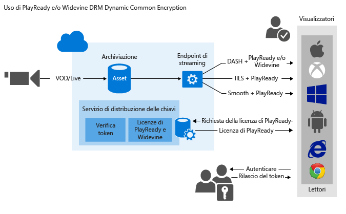

# <a name="use-playready-andor-widevine-dynamic-common-encryption"></a>Usare la crittografia comune dinamica Widevine e/o PlayReady

> [!div class="op_single_selector"]
> * [.NET](media-services-protect-with-playready-widevine.md)
> * [Java](https://github.com/southworkscom/azure-sdk-for-media-services-java-samples)
> * [PHP](https://github.com/Azure/azure-sdk-for-php/tree/master/examples/MediaServices)
>

> [!NOTE]
> Per ottenere la versione più recente di Java SDK e iniziare a sviluppare con Java, vedere [Introduzione a Java Client SDK per Servizi multimediali di Azure](https://docs.microsoft.com/azure/media-services/media-services-java-how-to-use). <br/>
> Per scaricare la versione più recente di PHP SDK per Servizi multimediali, cercare la versione 0.5.7 del pacchetto Microsoft/WindowAzure nel [repository Packagist](https://packagist.org/packages/microsoft/windowsazure#v0.5.7). 

## <a name="overview"></a>Panoramica

 È possibile usare Servizi multimediali per distribuire flussi MPEG-DASH, Smooth Streaming e HTTP Live Streaming (HLS) protetti con [PlayReady DRM (Digital Rights Management)](https://www.microsoft.com/playready/overview/). È anche possibile distribuire flussi DASH crittografati con licenze Widevine DRM. Sia per PlayReady che per Widevine la crittografia avviene in base alla specifica di crittografia comune (ISO/IEC 23001-7 CENC). È possibile usare [Media Services SDK per .NET](https://www.nuget.org/packages/windowsazure.mediaservices/) (a partire dalla versione 3.5.1) o l'API REST per configurare AssetDeliveryConfiguration per l'uso di Widevine.

Servizi multimediali rende disponibili servizi per la distribuzione di licenze PlayReady e Widevine DRM. Servizi multimediali fornisce anche API che è possibile usare per configurare i diritti e le restrizioni che il runtime di PlayReady o Widevine DRM deve applicare quando un utente riproduce contenuto protetto. Quando un utente richiede contenuto protetto tramite DRM, l'applicazione lettore richiede una licenza dal servizio licenze di Servizi multimediali. Se l'applicazione lettore viene autorizzata, il servizio licenze di Servizi multimediali rilascia una licenza per il lettore. Una licenza PlayReady o Widevine contiene la chiave di decrittografia che può essere usata dal lettore client per decrittografare e trasmettere il contenuto.

Per distribuire le licenze Widevine, è anche possibile ricorrere ai partner di Servizi multimediali seguenti: 

* [Axinom](http://www.axinom.com/press/ibc-axinom-drm-6/) 
* [EZDRM](http://ezdrm.com/) 
* [castLabs](http://castlabs.com/company/partners/azure/) 

Per altre informazioni, vedere gli articoli relativi all'integrazione con [Axinom](media-services-axinom-integration.md) e [castLabs](media-services-castlabs-integration.md).

Servizi multimediali supporta più modalità di autenticazione degli utenti che richiedono le chiavi. I criteri di autorizzazione della chiave simmetrica possono avere una o più restrizioni di autorizzazione, ad esempio restrizione aperta o di tipo token. I criteri con restrizione di tipo token richiedono la presenza di un token rilasciato da un servizio token di sicurezza. Servizi multimediali supporta i token nei formati [SWT](https://msdn.microsoft.com/library/gg185950.aspx#BKMK_2) (Simple Web Token, token Web semplice) e [JWT](https://msdn.microsoft.com/library/gg185950.aspx#BKMK_3) (JSON Web Token, token JSON Web). 

Per altre informazioni, vedere [Configurare i criteri di autorizzazione della chiave simmetrica](media-services-protect-with-aes128.md#configure_key_auth_policy).

Per sfruttare la crittografia dinamica, è necessario un asset contenente un set di file MP4 a bitrate multipli o di file di origine Smooth Streaming a bitrate multipli. È anche necessario configurare i criteri di distribuzione dell'asset, descritti più avanti in questo argomento. Quindi, in base al formato specificato nell'URL di streaming, il server di streaming on demand garantisce che il flusso venga distribuito nel protocollo scelto. Di conseguenza, si archiviano, e si pagano, file in un solo formato di archiviazione. Servizi multimediali crea e fornisce la risposta HTTP appropriata in base a ogni richiesta del client.

Questo articolo è utile per gli sviluppatori che lavorano ad applicazioni per la distribuzione di contenuto multimediale protetto tramite diverse tecnologie DRM, ad esempio PlayReady e Widevine. L'articolo illustra come configurare il servizio di distribuzione delle licenze PlayReady con criteri di autorizzazione, in modo che solo i client autorizzati possano ricevere licenze PlayReady o Widevine. Descrive anche come usare la crittografia dinamica con PlayReady o Widevine DRM tramite DASH.

>[!NOTE]
>Quando viene creato l'account di Servizi multimediali, viene aggiunto all'account un endpoint di streaming predefinito con stato "Arrestato". Per avviare lo streaming del contenuto e sfruttare i vantaggi della creazione dinamica dei pacchetti e della crittografia dinamica, l'endpoint di streaming da cui si vuole trasmettere il contenuto deve essere nello stato "In esecuzione". 

## <a name="download-the-sample"></a>Scaricare l'esempio
È possibile scaricare l'esempio descritto in questo articolo dal sito di [esempi di Azure su GitHub](https://github.com/Azure-Samples/media-services-dotnet-dynamic-encryption-with-drm).

## <a name="configure-dynamic-common-encryption-and-drm-license-delivery-services"></a>Configurare la crittografia comune dinamica e i servizi di distribuzione delle licenze DRM

Eseguire i passaggi generali illustrati di seguito quando si proteggono gli asset con PlayReady usando il servizio di distribuzione delle licenze di Servizi multimediali e la crittografia dinamica:

1. Creare un asset e caricare file al suo interno.

2. Codificare l'asset contenente il file nel set MP4 con velocità in bit adattiva.

3. Creare una chiave simmetrica e associarla all'asset codificato. In Servizi multimediali la chiave simmetrica contiene la chiave di crittografia dell'asset.

4. Configurare i criteri di autorizzazione della chiave simmetrica. È necessario configurare i criteri di autorizzazione della chiave simmetrica. Il client deve soddisfare i criteri prima che la chiave simmetrica venga distribuita al client stesso.

    Quando si creano i criteri di autorizzazione della chiave simmetrica, è necessario specificare il metodo di distribuzione (PlayReady o Widevine) e le restrizioni (aperta o token). È anche necessario indicare le informazioni specifiche per il tipo di distribuzione della chiave al client (modello di licenza [PlayReady](media-services-playready-license-template-overview.md) o [Widevine](media-services-widevine-license-template-overview.md)).

5. Configurare i criteri di distribuzione di un asset. La configurazione dei criteri di distribuzione include il protocollo di recapito (ad esempio MPEG-DASH, HLS, Smooth Streaming o tutti). La configurazione include anche il tipo di crittografia dinamica (ad esempio, crittografia comune) e l'URL di acquisizione della licenza PlayReady o Widevine.

    È possibile applicare criteri diversi per ogni protocollo nello stesso asset. È ad esempio possibile applicare la crittografia PlayReady a Smooth/DASH e AES Envelope ad HLS. I protocolli non definiti nei criteri di distribuzione (ad esempio se si aggiunge un singolo criterio che specifica solo HLS come protocollo) verranno esclusi dallo streaming. Questo comportamento non si verifica quando non sono definiti criteri di distribuzione degli asset. In tal caso, sono consentiti tutti i protocolli in chiaro.

6. Creare un localizzatore OnDemand per ottenere un URL di streaming.

Alla fine dell'articolo è disponibile un esempio .NET completo.

L'immagine seguente illustra il flusso di lavoro descritto in precedenza. Per l'autenticazione viene usato il token.



La parte rimanente di questo articolo fornisce spiegazioni dettagliate, esempi di codice e collegamenti ad argomenti che illustrano come eseguire le attività descritte in precedenza.

## <a name="current-limitations"></a>Limitazioni correnti
Se si aggiungono o si aggiornano i criteri di distribuzione degli asset, è necessario eliminare ogni eventuale localizzatore associato e crearne uno nuovo.

Attualmente non sono supportate più chiavi simmetriche quando si esegue la crittografia usando Widevine con Servizi multimediali. 

## <a name="create-an-asset-and-upload-files-into-the-asset"></a>Creare un asset e caricare file nell'asset
Per gestire, codificare e trasmettere in streaming i video, è prima di tutto necessario caricare il contenuto in Servizi multimediali. Dopo il caricamento, il contenuto viene archiviato in modo sicuro nel cloud per consentire altre operazioni di elaborazione e streaming.

Per altre informazioni, vedere [Caricare file in un account di Servizi multimediali](media-services-dotnet-upload-files.md).

## <a name="encode-the-asset-that-contains-the-file-to-the-adaptive-bitrate-mp4-set"></a>Codificare l'asset contenente il file nel set MP4 a bitrate adattivo
Con la crittografia dinamica, si crea un asset contenente un set di file MP4 a bitrate multipli o di file di origine Smooth Streaming a bitrate multipli. In base al formato specificato nella richiesta del manifesto o del frammento, il server di streaming on demand garantisce che il flusso venga ricevuto nel protocollo scelto. Quindi si archiviano, e si pagano, file in un solo formato di archiviazione. Servizi multimediali crea e fornisce la risposta appropriata in base alle richieste di un client. Per altre informazioni, vedere [Creazione dinamica dei pacchetti](media-services-dynamic-packaging-overview.md).

Per istruzioni su come eseguire la codifica, vedere [Codificare un asset con Media Encoder Standard](media-services-dotnet-encode-with-media-encoder-standard.md).

## <a id="create_contentkey"></a>Creare una chiave simmetrica e associarla all'asset codificato
In Servizi multimediali, la chiave simmetrica contiene la chiave con cui si desidera crittografare un asset.

Per altre informazioni, vedere [Creare una chiave simmetrica](media-services-dotnet-create-contentkey.md).

## <a id="configure_key_auth_policy"></a>Configurare i criteri di autorizzazione della chiave simmetrica
Servizi multimediali supporta più modalità di autenticazione degli utenti che eseguono richieste di chiavi. È necessario configurare i criteri di autorizzazione della chiave simmetrica. Il client (lettore) deve soddisfare i criteri prima che la chiave venga distribuita al client stesso. I criteri di autorizzazione della chiave simmetrica possono avere una o più restrizioni di autorizzazione, ad esempio restrizione aperta o di tipo token.

Per altre informazioni, vedere [Configurare i criteri di autorizzazione della chiave simmetrica](media-services-dotnet-configure-content-key-auth-policy.md#playready-dynamic-encryption).

## <a id="configure_asset_delivery_policy"></a>Configurare i criteri di distribuzione degli asset
Configurare i criteri di distribuzione degli asset. La configurazione dei criteri di distribuzione degli asset include:

* URL di acquisizione della licenza DRM.
* Protocollo di recapito degli asset (ad esempio, MPEG-DASH, HLS, Smooth Streaming o tutti).
* Tipo di crittografia dinamica (in questo caso, crittografia comune).

Per altre informazioni, vedere [Configurare i criteri di distribuzione degli asset](media-services-dotnet-configure-asset-delivery-policy.md).

## <a id="create_locator"></a>Creare un localizzatore di streaming on demand per ottenere un URL di streaming
È necessario fornire all'utente l'URL di streaming per Smooth Streaming, DASH o HLS.

> [!NOTE]
> Se si aggiungono o si aggiornano i criteri di distribuzione degli asset, è necessario eliminare qualsiasi localizzatore esistente e crearne uno nuovo.
>
>

Per istruzioni su come pubblicare un asset e creare un URL di streaming, vedere la sezione [Creare URL di streaming](media-services-deliver-streaming-content.md).

## <a name="get-a-test-token"></a>Ottenere un token di test
Ottenere un token di test basato sulla restrizione Token usata per i criteri di autorizzazione della chiave.

    // Deserializes a string containing an XML representation of a TokenRestrictionTemplate
    // back into a TokenRestrictionTemplate class instance.
    TokenRestrictionTemplate tokenTemplate =
        TokenRestrictionTemplateSerializer.Deserialize(tokenTemplateString);

    // Generate a test token based on the data in the given TokenRestrictionTemplate.
    //The GenerateTestToken method returns the token without the word "Bearer" in front,
    //so you have to add it in front of the token string.
    string testToken = TokenRestrictionTemplateSerializer.GenerateTestToken(tokenTemplate);
    Console.WriteLine("The authorization token is:\nBearer {0}", testToken);


Per testare il flusso, è possibile usare il [lettore di Servizi multimediali di Azure](http://amsplayer.azurewebsites.net/azuremediaplayer.html).

## <a name="create-and-configure-a-visual-studio-project"></a>Creare e configurare un progetto di Visual Studio

1. Configurare l'ambiente di sviluppo e popolare il file app.config con le informazioni di connessione, come descritto in [Sviluppo di applicazioni di Servizi multimediali con .NET](media-services-dotnet-how-to-use.md).

2. Aggiungere gli elementi seguenti alla sezione **appSettings** definita nel file app.config:

        <add key="Issuer" value="http://testacs.com"/>
        <add key="Audience" value="urn:test"/>

## <a name="example"></a>Esempio

L'esempio seguente illustra una funzionalità introdotta in Media Services SDK per .NET, versione 3.5.2. In particolare, include la possibilità di definire un modello di licenza Widevine e richiedere una licenza Widevine da Servizi multimediali.

Sovrascrivere il codice nel file Program.cs con il codice riportato in questa sezione.

>[!NOTE]
>È previsto un limite di un milione di criteri per i diversi criteri di Servizi multimediali (ad esempio per i criteri del localizzatore o ContentKeyAuthorizationPolicy). Se si usano sempre gli stessi giorni/autorizzazioni di accesso, usare lo stesso ID criteri. Ad esempio, usare lo stesso ID per i criteri dei localizzatori che devono rimanere sul posto per molto tempo (criteri di non caricamento). 

Per altre informazioni, vedere [Gestione di asset ed entità correlate con Media Services .NET SDK](media-services-dotnet-manage-entities.md#limit-access-policies).

Assicurarsi di aggiornare le variabili in modo da puntare alle cartelle in cui si trovano i file di input.

```
using System;
using System.Collections.Generic;
using System.Configuration;
using System.IO;
using System.Linq;
using System.Threading;
using Microsoft.WindowsAzure.MediaServices.Client;
using Microsoft.WindowsAzure.MediaServices.Client.ContentKeyAuthorization;
using Microsoft.WindowsAzure.MediaServices.Client.DynamicEncryption;
using Microsoft.WindowsAzure.MediaServices.Client.Widevine;
using Newtonsoft.Json;

namespace DynamicEncryptionWithDRM
{
    class Program
    {
        // Read values from the App.config file.
        private static readonly string _AADTenantDomain =
            ConfigurationManager.AppSettings["AMSAADTenantDomain"];
        private static readonly string _RESTAPIEndpoint =
            ConfigurationManager.AppSettings["AMSRESTAPIEndpoint"];
        private static readonly string _AMSClientId =
            ConfigurationManager.AppSettings["AMSClientId"];
        private static readonly string _AMSClientSecret =
            ConfigurationManager.AppSettings["AMSClientSecret"];

        private static readonly Uri _sampleIssuer =
            new Uri(ConfigurationManager.AppSettings["Issuer"]);
        private static readonly Uri _sampleAudience =
            new Uri(ConfigurationManager.AppSettings["Audience"]);

        // Field for service context.
        private static CloudMediaContext _context = null;

        private static readonly string _mediaFiles =
            Path.GetFullPath(@"../..\Media");

        private static readonly string _singleMP4File =
            Path.Combine(_mediaFiles, @"BigBuckBunny.mp4");

        static void Main(string[] args)
        {
            AzureAdTokenCredentials tokenCredentials =
                new AzureAdTokenCredentials(_AADTenantDomain,
                    new AzureAdClientSymmetricKey(_AMSClientId, _AMSClientSecret),
                    AzureEnvironments.AzureCloudEnvironment);

            var tokenProvider = new AzureAdTokenProvider(tokenCredentials);

            _context = new CloudMediaContext(new Uri(_RESTAPIEndpoint), tokenProvider);

            bool tokenRestriction = false;
            string tokenTemplateString = null;

            IAsset asset = UploadFileAndCreateAsset(_singleMP4File);
            Console.WriteLine("Uploaded asset: {0}", asset.Id);

            IAsset encodedAsset = EncodeToAdaptiveBitrateMP4Set(asset);
            Console.WriteLine("Encoded asset: {0}", encodedAsset.Id);

            IContentKey key = CreateCommonTypeContentKey(encodedAsset);
            Console.WriteLine("Created key {0} for the asset {1} ", key.Id, encodedAsset.Id);
            Console.WriteLine("PlayReady License Key delivery URL: {0}", key.GetKeyDeliveryUrl(ContentKeyDeliveryType.PlayReadyLicense));
            Console.WriteLine();

            if (tokenRestriction)
                tokenTemplateString = AddTokenRestrictedAuthorizationPolicy(key);
            else
                AddOpenAuthorizationPolicy(key);

            Console.WriteLine("Added authorization policy: {0}", key.AuthorizationPolicyId);
            Console.WriteLine();

            CreateAssetDeliveryPolicy(encodedAsset, key);
            Console.WriteLine("Created asset delivery policy. \n");
            Console.WriteLine();

            if (tokenRestriction && !String.IsNullOrEmpty(tokenTemplateString))
            {
                // Deserializes a string containing an XML representation of a TokenRestrictionTemplate
                // back into a TokenRestrictionTemplate class instance.
                TokenRestrictionTemplate tokenTemplate =
                    TokenRestrictionTemplateSerializer.Deserialize(tokenTemplateString);

                // Generate a test token based on the data in the given TokenRestrictionTemplate.
                // Note that you need to pass the key ID GUID because 
                // TokenClaim.ContentKeyIdentifierClaim was specified during the creation of TokenRestrictionTemplate.
                Guid rawkey = EncryptionUtils.GetKeyIdAsGuid(key.Id);
                string testToken = TokenRestrictionTemplateSerializer.GenerateTestToken(tokenTemplate, null, rawkey,
                                            DateTime.UtcNow.AddDays(365));
                Console.WriteLine("The authorization token is:\nBearer {0}", testToken);
                Console.WriteLine();
            }

            // You can use the http://amsplayer.azurewebsites.net/azuremediaplayer.html player to test streams.
            // Note that DASH works on Internet Explorer 11 (via PlayReady), Edge (via PlayReady), and Chrome (via Widevine).

            string url = GetStreamingOriginLocator(encodedAsset);
            Console.WriteLine("Encrypted DASH URL: {0}/manifest(format=mpd-time-csf)", url);

            Console.ReadLine();
        }

        static public IAsset UploadFileAndCreateAsset(string singleFilePath)
        {
            if (!File.Exists(singleFilePath))
            {
                Console.WriteLine("File does not exist.");
                return null;
            }

            var assetName = Path.GetFileNameWithoutExtension(singleFilePath);
            IAsset inputAsset = _context.Assets.Create(assetName, AssetCreationOptions.None);

            var assetFile = inputAsset.AssetFiles.Create(Path.GetFileName(singleFilePath));

            Console.WriteLine("Created assetFile {0}", assetFile.Name);

            Console.WriteLine("Upload {0}", assetFile.Name);

            assetFile.Upload(singleFilePath);
            Console.WriteLine("Done uploading {0}", assetFile.Name);

            return inputAsset;
        }

        static public IAsset EncodeToAdaptiveBitrateMP4Set(IAsset inputAsset)
        {
            var encodingPreset = "Adaptive Streaming";

            IJob job = _context.Jobs.Create(String.Format("Encoding into Mp4 {0} to {1}",
                        inputAsset.Name,
                        encodingPreset));

            var mediaProcessors =
            _context.MediaProcessors.Where(p => p.Name.Contains("Media Encoder Standard")).ToList();

            var latestMediaProcessor =
            mediaProcessors.OrderBy(mp => new Version(mp.Version)).LastOrDefault();

            ITask encodeTask = job.Tasks.AddNew("Encoding", latestMediaProcessor, encodingPreset, TaskOptions.None);
            encodeTask.InputAssets.Add(inputAsset);
            encodeTask.OutputAssets.AddNew(String.Format("{0} as {1}", inputAsset.Name, encodingPreset), AssetCreationOptions.StorageEncrypted);

            job.StateChanged += new EventHandler<JobStateChangedEventArgs>(JobStateChanged);
            job.Submit();
            job.GetExecutionProgressTask(CancellationToken.None).Wait();

            return job.OutputMediaAssets[0];
        }


        static public IContentKey CreateCommonTypeContentKey(IAsset asset)
        {

            Guid keyId = Guid.NewGuid();
            byte[] contentKey = GetRandomBuffer(16);

            IContentKey key = _context.ContentKeys.Create(
                        keyId,
                        contentKey,
                        "ContentKey",
                        ContentKeyType.CommonEncryption);

            // Associate the key with the asset.
            asset.ContentKeys.Add(key);

            return key;
        }

        static public void AddOpenAuthorizationPolicy(IContentKey contentKey)
        {

            // Create ContentKeyAuthorizationPolicy with open restrictions
            // and create an authorization policy.         

            List<ContentKeyAuthorizationPolicyRestriction> restrictions = new List<ContentKeyAuthorizationPolicyRestriction>
                {
                new ContentKeyAuthorizationPolicyRestriction
                {
                    Name = "Open",
                    KeyRestrictionType = (int)ContentKeyRestrictionType.Open,
                    Requirements = null
                }
                };

            // Configure PlayReady and Widevine license templates.
            string PlayReadyLicenseTemplate = ConfigurePlayReadyLicenseTemplate();

            string WidevineLicenseTemplate = ConfigureWidevineLicenseTemplate();

            IContentKeyAuthorizationPolicyOption PlayReadyPolicy =
            _context.ContentKeyAuthorizationPolicyOptions.Create("",
                ContentKeyDeliveryType.PlayReadyLicense,
                restrictions, PlayReadyLicenseTemplate);

            IContentKeyAuthorizationPolicyOption WidevinePolicy =
            _context.ContentKeyAuthorizationPolicyOptions.Create("",
                ContentKeyDeliveryType.Widevine,
                restrictions, WidevineLicenseTemplate);

            IContentKeyAuthorizationPolicy contentKeyAuthorizationPolicy = _context.
                ContentKeyAuthorizationPolicies.
                CreateAsync("Deliver Common Content Key with no restrictions").
                Result;


            contentKeyAuthorizationPolicy.Options.Add(PlayReadyPolicy);
            contentKeyAuthorizationPolicy.Options.Add(WidevinePolicy);
            // Associate the content key authorization policy with the content key.
            contentKey.AuthorizationPolicyId = contentKeyAuthorizationPolicy.Id;
            contentKey = contentKey.UpdateAsync().Result;
        }

        public static string AddTokenRestrictedAuthorizationPolicy(IContentKey contentKey)
        {
            string tokenTemplateString = GenerateTokenRequirements();

            List<ContentKeyAuthorizationPolicyRestriction> restrictions = new List<ContentKeyAuthorizationPolicyRestriction>
                {
                new ContentKeyAuthorizationPolicyRestriction
                {
                    Name = "Token Authorization Policy",
                    KeyRestrictionType = (int)ContentKeyRestrictionType.TokenRestricted,
                    Requirements = tokenTemplateString,
                }
                };

            // Configure PlayReady and Widevine license templates.
            string PlayReadyLicenseTemplate = ConfigurePlayReadyLicenseTemplate();

            string WidevineLicenseTemplate = ConfigureWidevineLicenseTemplate();

            IContentKeyAuthorizationPolicyOption PlayReadyPolicy =
            _context.ContentKeyAuthorizationPolicyOptions.Create("Token option",
                ContentKeyDeliveryType.PlayReadyLicense,
                restrictions, PlayReadyLicenseTemplate);

            IContentKeyAuthorizationPolicyOption WidevinePolicy =
            _context.ContentKeyAuthorizationPolicyOptions.Create("Token option",
                ContentKeyDeliveryType.Widevine,
                restrictions, WidevineLicenseTemplate);

            IContentKeyAuthorizationPolicy contentKeyAuthorizationPolicy = _context.
                ContentKeyAuthorizationPolicies.
                CreateAsync("Deliver Common Content Key with token restrictions").
                Result;

            contentKeyAuthorizationPolicy.Options.Add(PlayReadyPolicy);
            contentKeyAuthorizationPolicy.Options.Add(WidevinePolicy);

            // Associate the content key authorization policy with the content key.
            contentKey.AuthorizationPolicyId = contentKeyAuthorizationPolicy.Id;
            contentKey = contentKey.UpdateAsync().Result;

            return tokenTemplateString;
        }

        static private string GenerateTokenRequirements()
        {
            TokenRestrictionTemplate template = new TokenRestrictionTemplate(TokenType.SWT);

            template.PrimaryVerificationKey = new SymmetricVerificationKey();
            template.AlternateVerificationKeys.Add(new SymmetricVerificationKey());
            template.Audience = _sampleAudience.ToString();
            template.Issuer = _sampleIssuer.ToString();
            template.RequiredClaims.Add(TokenClaim.ContentKeyIdentifierClaim);

            return TokenRestrictionTemplateSerializer.Serialize(template);
        }

        static private string ConfigurePlayReadyLicenseTemplate()
        {
            // The following code configures the PlayReady license template by using .NET classes
            // and returns the XML string.

            //The PlayReadyLicenseResponseTemplate class represents the template for the response sent back to the end user.
            //It contains a field for a custom data string between the license server and the application
            //(which might be useful for custom app logic) as well as a list of one or more license templates.
            PlayReadyLicenseResponseTemplate responseTemplate = new PlayReadyLicenseResponseTemplate();

            // The PlayReadyLicenseTemplate class represents a license template you can use to create PlayReady licenses
            // to be returned to end users.
            //It contains the data on the content key in the license and any rights or restrictions to be
            //enforced by the PlayReady DRM runtime when you use the content key.
            PlayReadyLicenseTemplate licenseTemplate = new PlayReadyLicenseTemplate();
            //Configure whether the license is persistent (saved in persistent storage on the client)
            //or nonpersistent (held in memory only while the player uses the license).  
            licenseTemplate.LicenseType = PlayReadyLicenseType.Nonpersistent;

            // AllowTestDevices controls whether test devices can use the license or not.  
            // If true, the MinimumSecurityLevel property of the license
            // is set to 150. If false (the default), the MinimumSecurityLevel property of the license is set to 2,000.
            licenseTemplate.AllowTestDevices = true;

            // You also can configure the PlayRight in the PlayReady license by using the PlayReadyPlayRight class.
            // It grants the user the ability to play back the content subject to the zero or more restrictions
            // configured in the license and on the PlayRight itself (for playback-specific policy).
            // Much of the policy on the PlayRight has to do with output restrictions,
            // which control the types of outputs that the content can be played over and
            // any restrictions that must be put in place when you use a given output.
            // For example, if DigitalVideoOnlyContentRestriction is enabled,
            // the DRM runtime allows the video to be displayed only over digital outputs
            //(analog video outputs aren't allowed to pass the content).

            //IMPORTANT: These types of restrictions can be very powerful but also can affect the consumer experience.
            // If output protections are too restrictive, 
            // content might be unplayable on some clients. For more information, see the PlayReady Compliance Rules document.

            // For example:
            //licenseTemplate.PlayRight.AgcAndColorStripeRestriction = new AgcAndColorStripeRestriction(1);

            responseTemplate.LicenseTemplates.Add(licenseTemplate);

            return MediaServicesLicenseTemplateSerializer.Serialize(responseTemplate);
        }

        private static string ConfigureWidevineLicenseTemplate()
        {
            var template = new WidevineMessage
            {
                allowed_track_types = AllowedTrackTypes.SD_HD,
                content_key_specs = new[]
            {
                    new ContentKeySpecs
                    {
                    required_output_protection = new RequiredOutputProtection { hdcp = Hdcp.HDCP_NONE},
                    security_level = 1,
                    track_type = "SD"
                    }
                },
                policy_overrides = new
                {
                    can_play = true,
                    can_persist = true,
                    can_renew = false
                }
            };

            string configuration = JsonConvert.SerializeObject(template);
            return configuration;
        }

        static public void CreateAssetDeliveryPolicy(IAsset asset, IContentKey key)
        {
            // Get the PlayReady license service URL.
            Uri acquisitionUrl = key.GetKeyDeliveryUrl(ContentKeyDeliveryType.PlayReadyLicense);

            // GetKeyDeliveryUrl for Widevine attaches the KID to the URL.
            // For example: https://amsaccount1.keydelivery.mediaservices.windows.net/Widevine/?KID=268a6dcb-18c8-4648-8c95-f46429e4927c.  
            // WidevineBaseLicenseAcquisitionUrl (used in the following) also tells dynamic encryption
            // to append /? KID =< keyId > to the end of the URL when you create the manifest.
            // As a result, the Widevine license acquisition URL has the KID appended twice,
            // so you need to remove the KID in the URL when you call GetKeyDeliveryUrl.

            Uri widevineUrl = key.GetKeyDeliveryUrl(ContentKeyDeliveryType.Widevine);
            UriBuilder uriBuilder = new UriBuilder(widevineUrl);
            uriBuilder.Query = String.Empty;
            widevineUrl = uriBuilder.Uri;

            Dictionary<AssetDeliveryPolicyConfigurationKey, string> assetDeliveryPolicyConfiguration =
            new Dictionary<AssetDeliveryPolicyConfigurationKey, string>
            {
                    {AssetDeliveryPolicyConfigurationKey.PlayReadyLicenseAcquisitionUrl, acquisitionUrl.ToString()},
                    {AssetDeliveryPolicyConfigurationKey.WidevineBaseLicenseAcquisitionUrl, widevineUrl.ToString()}

            };

            // In this case, we specify only the DASH streaming protocol in the delivery policy.
            // All other protocols are blocked from streaming.
            var assetDeliveryPolicy = _context.AssetDeliveryPolicies.Create(
                "AssetDeliveryPolicy",
            AssetDeliveryPolicyType.DynamicCommonEncryption,
            AssetDeliveryProtocol.Dash,
            assetDeliveryPolicyConfiguration);


            // Add AssetDelivery Policy to the asset.
            asset.DeliveryPolicies.Add(assetDeliveryPolicy);

        }

        /// <summary>
        /// Gets the streaming origin locator.
        /// </summary>
        /// <param name="assets"></param>
        /// <returns></returns>
        static public string GetStreamingOriginLocator(IAsset asset)
        {

            // Get a reference to the streaming manifest file from the 
            // collection of files in the asset.

            var assetFile = asset.AssetFiles.Where(f => f.Name.ToLower().
                         EndsWith(".ism")).
                         FirstOrDefault();

            // Create a 30-day read-only access policy.
            IAccessPolicy policy = _context.AccessPolicies.Create("Streaming policy",
            TimeSpan.FromDays(30),
            AccessPermissions.Read);

            // Create a locator to the streaming content on an origin.
            ILocator originLocator = _context.Locators.CreateLocator(LocatorType.OnDemandOrigin, asset,
            policy,
            DateTime.UtcNow.AddMinutes(-5));

            // Create a URL to the manifest file.
            return originLocator.Path + assetFile.Name;
        }

        static private void JobStateChanged(object sender, JobStateChangedEventArgs e)
        {
            Console.WriteLine(string.Format("{0}\n  State: {1}\n  Time: {2}\n\n",
            ((IJob)sender).Name,
            e.CurrentState,
            DateTime.UtcNow.ToString(@"yyyy_M_d__hh_mm_ss")));
        }

        static private byte[] GetRandomBuffer(int length)
        {
            var returnValue = new byte[length];

            using (var rng =
            new System.Security.Cryptography.RNGCryptoServiceProvider())
            {
                rng.GetBytes(returnValue);
            }

            return returnValue;
        }
    }
}
```

## <a name="next-steps"></a>Passaggi successivi

[!INCLUDE [media-services-learning-paths-include](../../includes/media-services-learning-paths-include.md)]

## <a name="provide-feedback"></a>Fornire commenti e suggerimenti
[!INCLUDE [media-services-user-voice-include](../../includes/media-services-user-voice-include.md)]

## <a name="see-also"></a>Vedere anche 
* [Usare la crittografia comune con più tecnologie DRM e il controllo di accesso](media-services-cenc-with-multidrm-access-control.md)
* [Configure Widevine packaging with Media Services (Configurare pacchetti Widewine con Servizi multimediali)](http://mingfeiy.com/how-to-configure-widevine-packaging-with-azure-media-services)
* [Annuncio dei servizi di distribuzione delle licenze Google Widevine in Servizi multimediali di Azure](https://azure.microsoft.com/blog/announcing-general-availability-of-google-widevine-license-services/)
