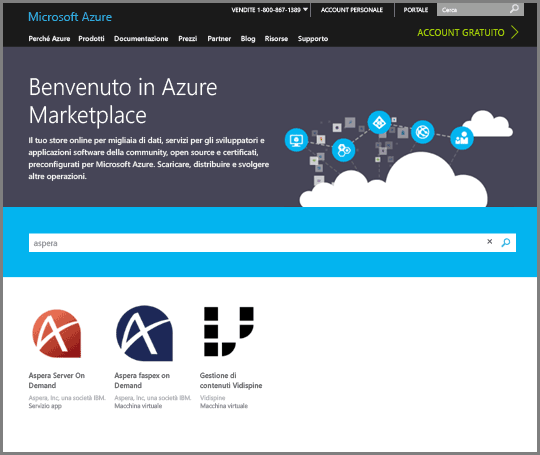
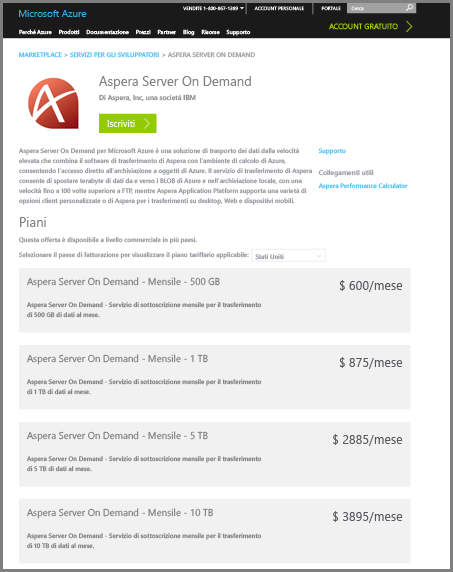
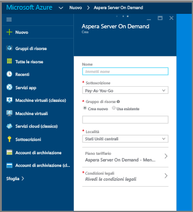
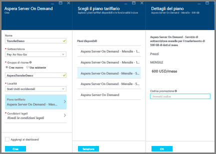
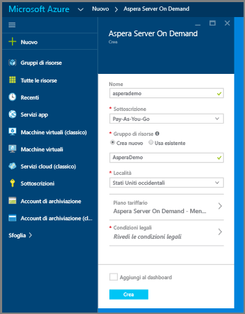
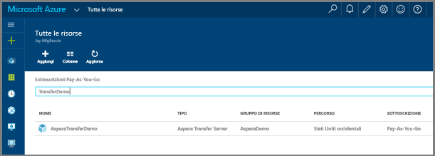
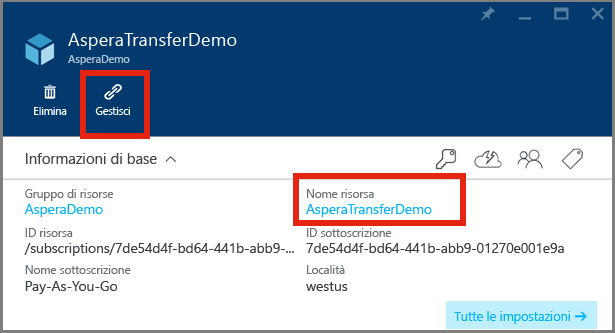

# Caricare file in un account Servizi multimediali usando il servizio Aspera Server On Demand in Azure

## Panoramica

**Aspera** è un software di trasferimento di file ad alta velocità. **Aspera Server On Demand** per Azure consente il caricamento ad alta velocità e il download di file di grandi dimensioni direttamente nell'archivio di oggetti BLOB di Azure. Per informazioni su **Aspera On Demand**, vedere il sito [Aspera Cloud](http://cloud.asperasoft.com/). 
  
**Aspera Server On Demand** per Azure è acquistabile in [Azure Marketplace](https://azure.microsoft.com/en-us/marketplace/). Per completare un acquisto di **Aspera Server On Demand** per Azure, accedere ad Azure Marketplace con il Windows Live ID.

Questa esercitazione illustra la procedura per caricare file in un account di archiviazione associato a un account Servizi multimediali usando il servizio **Aspera Server On Demand** in Azure. 

Per un esempio che illustra come usare le funzioni di Azure con Aspera e Servizi multimediali, vedere [qui](https://github.com/Azure-Samples/media-services-dotnet-functions-integration/tree/master/103-aspera-ingest).

>[!NOTE]
>È previsto un limite per le dimensioni massime dei file supportate per l'elaborazione con i processori di contenuti multimediali di Servizi multimediali di Azure. Vedere [questo](media-services-quotas-and-limitations.md) argomento per informazioni dettagliate sulla limitazione per le dimensioni dei file.
>

## Prerequisiti 

Per completare questa esercitazione, sono necessari:

* Un Windows Live ID.
* Un [account Azure](https://azure.microsoft.com). Per informazioni dettagliate, vedere la pagina relativa alla [versione di valutazione gratuita di Azure](https://azure.microsoft.com/pricing/free-trial/). 
* Un [account Servizi multimediali di Azure](media-services-portal-create-account.md).

## Acquistare Aspera On Demand per Azure

Dopo l'accesso ad Azure Marketplace, seguire questi semplici passaggi per completare l'acquisto di Aspera On Demand per Azure.

1. Cercare Aspera e selezionare "Server On Demand".

   

2. Esaminare i piani di sottoscrizione e fare clic su "Iscriviti".

   

3. Immettere le specifiche per la sottoscrizione di Server on Demand.

   

4. Fare clic su **Piano tariffario** e selezionare il volume mensile desiderato nel pannello secondario. Nel pannello **Plan details** (Dettagli piano) fare clic su **OK**. Nel pannello **Scegliere il piano tariffario** fare quindi clic su **Seleziona**.

   

5. Fare clic su **Note legali** per visualizzare e accettare le note legali nel pannello secondario. Dopo avere esaminato le note legali, fare clic su **Acquisto**.

   

6. Completare l'acquisto facendo clic su **Crea**.

   

7. Il dashboard di Azure informerà che è in corso il provisioning del servizio.  Al termine del provisioning, è possibile trovare la nuova sottoscrizione cercando nelle risorse il nome del servizio. Dopo averlo trovato, fare doppio clic sul servizio per avviare il portale di gestione del servizio.

   

8. Avviare il portale di gestione di Aspera. Dopo avere trovato il nuovo servizio Aspera, è possibile accedere al portale di gestione facendo clic sul servizio.  Verrà aperto un nuovo pannello. In questo nuovo pannello è necessario fare clic sul **nome della risorsa** del nuovo servizio.  Nello screenshot seguente il nome della risorsa è "AsperaTransferDemo". Dopo avere fatto clic sul nome della risorsa, viene aperto un altro pannello. Nel nuovo pannello aperto sarà visualizzato un collegamento "Manage" (Gestisci). Fare clic sul collegamento "Manage" (Gestisci) per avviare il portale di gestione di Aspera.

   

9. Facendo clic sul collegamento Manage (Gestisci), si aprirà la pagina di registrazione, necessaria per accedere al servizio.

   

10. A questo punto, si avrà accesso al portale di gestione del servizio Aspera, dove è possibile creare chiavi di accesso, scaricare client e licenze di Aspera, visualizzare l'utilizzo e trovare informazioni sulle API.

    Lo screenshot seguente illustra la creazione dell'accesso. 

   

    Lo screenshot seguente illustra le interfacce di creazione di report sull'utilizzo nel portale. 

   

## Caricare file con Aspera

1. Scaricare e installare il software client Aspera:
    
    * [Plug-in del browser](http://downloads.asperasoft.com/connect2/)
    * [Rich client](http://downloads.asperasoft.com/en/downloads/2)

2. Eseguire il primo trasferimento. Per usare il client Aspera per il trasferimento con il servizio di trasferimento Aspera, è necessario completare le operazioni seguenti: 

    1. Creare una chiave di accesso usando il portale di Aspera.  
    2. Scaricare, installare e concedere in licenza il client Aspera. Il software è disponibile nel portale di Aspera.  

    >[!NOTE]
    >Leggere la guida al client Aspera per informazioni sulla configurazione.
    
    3. Recuperare alcune informazioni dell'account di archiviazione associato all'account multimediale di Azure usando il [portale di Azure](https://portal.azure.com/), in particolare il nome e la chiave e il nome del contenitore BLOB di archiviazione in cui si vuole inserire il contenuto. 

        * Per ottenere le informazioni di archiviazione dal portale: trovare l'account di archiviazione, fare clic sulle chiavi di accesso e copiare il nome e la chiave dell'account.
        * Per ottenere il nome del contenitore: trovare l'account di archiviazione, selezionare **Blobs** (BLOB) e selezionare il nome del contenitore in cui si vuole caricare il contenuto. 

    Il seguente è lo screenshot del client Aspera **Connection Manager** (Gestione connessioni) in cui è necessario specificare il tipo di archiviazione "Azure" e le credenziali, oltre al contenitore BLOB.

    

## Risorse

Le risorse seguenti sono state citate in questo articolo. 

* [Collegare il plug-in del browser](http://downloads.asperasoft.com/connect2/)
* [Guida alla connessione](http://downloads.asperasoft.com/en/documentation/8)
* [Client Aspera](http://downloads.asperasoft.com/en/downloads/2)
* [Guida al client](http://downloads.asperasoft.com/en/documentation/2)

## Passaggi successivi

È ora possibile [copiare BLOB da un account di archiviazione in un account AMS](media-services-copying-existing-blob.md#copy-blobs-from-a-storage-account-into-an-ams-account).

## Percorsi di apprendimento di Servizi multimediali
[!INCLUDE [media-services-learning-paths-include](../../includes/media-services-learning-paths-include.md)]

## Fornire commenti e suggerimenti
[!INCLUDE [media-services-user-voice-include](../../includes/media-services-user-voice-include.md)]

