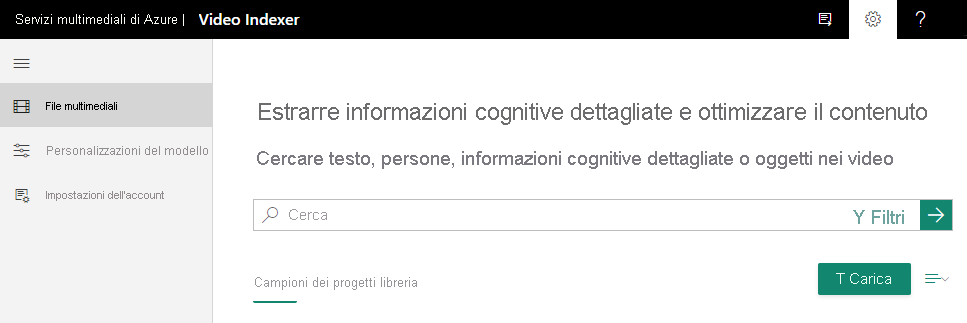

# Guida introduttiva: Come iscriversi e caricare il primo video

Questa esercitazione introduttiva illustra come iscriversi a Video Indexer e come caricare il primo video.

Al momento della creazione di un account di Video Indexer, è possibile scegliere un account di valutazione gratuito (in cui si ottiene un certo numero di minuti di indicizzazione gratuita) o un'opzione a pagamento (in cui non si è limitati dalla quota). Con la versione di valutazione gratuita, Video Indexer offre fino a 600 minuti di indicizzazione gratuita per gli utenti di siti Web e fino a 2400 minuti di indicizzazione gratuita per gli utenti di API. Con l'opzione a pagamento, si crea un account di Video Indexer [collegato alla sottoscrizione di Azure e un account di Servizi multimediali di Azure](connect-to-azure.md). Il pagamento viene effettuato per i minuti di indicizzazione, nonché in base ai costi correlati all'account di Azure Media Services. 

## Iscriversi a Video Indexer

Per iniziare a eseguire attività di sviluppo con Video Indexer, visitare il sito Web di [Video Indexer](https://www.videoindexer.com) e iscriversi.

## Caricare un video usando il sito Web di Video Indexer

> [!NOTE]
> Il nome del video non può contenere più di 80 caratteri.

1. Accedere al sito Web di [Video Indexer](https://www.videoindexer.ai/).
2. Per caricare un video, premere il pulsante o il collegamento **Upload** (Carica).

    

    Dopo il caricamento del video, Video Indexer avvia l'indicizzazione e l'analisi.

     

    Al termine dell'analisi si riceverà una notifica con un collegamento al video e una breve descrizione di ciò che è stato trovato nel video. Ad esempio: persone, argomenti, OCR.

## Passaggi successivi

A questo punto si può usare il sito Web di [Video Indexer](video-indexer-use-apis.md) o il [portale per sviluppatori di Video Indexer](video-indexer-view-edit.md) per visualizzare le informazioni dettagliate del video. 

## Vedere anche

[Panoramica di Video Indexer](video-indexer-overview.md)

[Iniziare a usare le API](video-indexer-use-apis.md).

