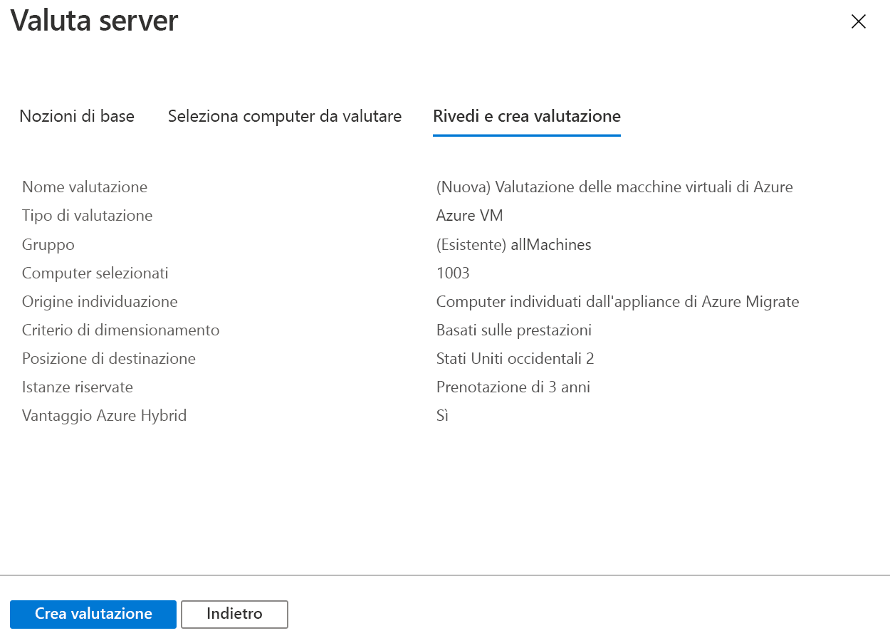

# <a name="assess-vmware-vms-with-azure-migrate-server-assessment"></a>Valutare le macchine virtuali VMware con Azure Migrate: Valutazione server

Questo articolo descrive come valutare le macchine virtuali VMware locali con lo strumento Azure Migrate: Valutazione server.

[Azure Migrate](migrate-services-overview.md) offre un hub di strumenti che consentono di individuare, valutare ed eseguire la migrazione di app, infrastruttura e carichi di lavoro a Microsoft Azure. L'hub include gli strumenti di Azure Migrate e offerte di fornitori di software indipendenti (ISV) di terze parti.


Questa esercitazione è la seconda di una serie che illustra come valutare le macchine virtuali VMware ed eseguirne la migrazione ad Azure. In questa esercitazione si apprenderà come:
> [!div class="checklist"]
> * Configurare un progetto di Azure Migrate.
> * Configurare un'appliance Azure Migrate da eseguire in locale per valutare le macchine virtuali.
> * Avviare l'individuazione continua di macchine virtuali locali. L'appliance invia ad Azure i dati sulla configurazione e le prestazioni delle macchine virtuali individuate.
> * Raggruppare le macchine virtuali individuate e valutare il gruppo di VM.
> * Esaminare la valutazione.


> [!NOTE]
> Le esercitazioni illustrano il percorso di distribuzione più semplice per uno scenario, per consentire di configurare rapidamente un modello di verifica. Quando possibile vengono usate le opzioni predefinite e non sono riportati tutti i percorsi e le impostazioni possibili. Per istruzioni dettagliate, vedere gli articoli sulle procedure.

Se non si ha una sottoscrizione di Azure, creare un [account gratuito](https://azure.microsoft.com/pricing/free-trial/) prima di iniziare.


## <a name="prerequisites"></a>Prerequisiti

- [Completare](tutorial-prepare-vmware.md) la prima esercitazione di questa serie. In caso contrario, le istruzioni di questa esercitazione non funzioneranno.
- Ecco le operazioni che dovrebbero essere state completate nella prima esercitazione:
    - [Configurare le autorizzazioni di Azure ](tutorial-prepare-vmware.md#prepare-azure) per Azure Migrate.
    - [Preparare VMware](tutorial-prepare-vmware.md#prepare-for-vmware-vm-assessment) per la valutazione. Le impostazioni di VMware devono essere verificate e occorre avere le autorizzazioni per creare una macchina virtuale VMware con un modello OVA. È necessario anche un account configurato per l'individuazione di macchine virtuali. Le porte necessarie devono essere disponibili e occorre essere a conoscenza degli URL necessari per l'accesso ad Azure.


## <a name="set-up-an-azure-migrate-project"></a>Configurare un progetto di Azure Migrate

Per configurare un nuovo progetto di Azure Migrate, seguire questa procedura.

1. Nel portale di Azure selezionare **Tutti i servizi** e cercare **Azure Migrate**.
2. In **Servizi** selezionare **Azure Migrate**.
3. In **Individuare, valutare ed eseguire la migrazione dei server** della pagina **Panoramica** fare clic su **Valutare ed eseguire la migrazione dei server**.

    

4. In **Attività iniziali** fare clic su **Aggiungi strumenti**.
5. In **Progetto di migrazione** selezionare la sottoscrizione di Azure e creare un gruppo di risorse, se non se ne ha già uno.     
6. In **Dettagli del progetto** specificare il nome del progetto e l'area geografica in cui lo si vuole creare. Sono supportate le aree Asia, Europa, Regno Unito e Stati Uniti.

    - L'area geografica del progetto viene usata solo per archiviare i metadati raccolti dalle macchine virtuali locali.
    - Per la migrazione è possibile selezionare qualsiasi area di destinazione.

    


7. Fare clic su **Avanti**.
8. In **Selezionare lo strumento di valutazione** selezionare **Azure Migrate: Valutazione server** > **Avanti**.

    

9. In **Selezione strumento di migrazione** selezionare **Ignora l'aggiunta di uno strumento di migrazione per adesso** > **Avanti**.
10. In **Rivedi e aggiungi strumenti** rivedere le impostazioni e fare clic su **Aggiungi strumenti**.
11. Attendere alcuni minuti durante la distribuzione del progetto di Azure Migrate. Verrà visualizzata la pagina del progetto. Se il progetto non viene visualizzato, è possibile accedervi da **Server** nel dashboard di Azure Migrate.


## <a name="set-up-the-appliance-vm"></a>Configurare l'appliance VM

Azure Migrate: Valutazione server esegue un'appliance VM VMware leggera.

- L'appliance esegue l'individuazione delle macchine virtuali e ne invia i metadati e i dati sulle prestazioni allo strumento Valutazione server di Azure Migrate.
- Per configurare l'appliance occorre:
    - Scaricare un file modello OVA e importarlo nel server vCenter.
    - Creare l'appliance e verificare che riesca a connettersi allo strumento Valutazione server di Azure Migrate.
    - Configurare l'appliance per la prima volta e registrarla con il progetto di Azure Migrate.
- È possibile configurare più appliance per un singolo progetto di Azure Migrate. È supportata l'individuazione di un massimo di 35.000 VM fra tutte le appliance. Una singola appliance può individuare fino a 10.000 server.

### <a name="download-the-ova-template"></a>Scaricare il modello OVA

1. In **Obiettivi della migrazione** > **Server** > **Azure Migrate: Valutazione server** fare clic su **Individua**.
2. In **Individua macchine virtuali** > **I computer sono virtualizzati?** fare clic su **Sì, con VMware vSphere Hypervisor**.
3. Fare clic su **Scarica** per scaricare il file di modello OVA.

    


### <a name="verify-security"></a>Verificare la sicurezza

Prima di distribuire il file OVA, verificarne la sicurezza.

1. Nel computer in cui è stato scaricato il file aprire una finestra di comando con privilegi di amministratore.
2. Eseguire il comando seguente per generare il valore hash per il file con estensione ova:
    - ```C:\>CertUtil -HashFile <file_location> [Hashing Algorithm]```
    - Esempio di utilizzo: ```C:\>CertUtil -HashFile C:\AzureMigrate\AzureMigrate.ova SHA256```
3. Per la versione 1.19.06.27 l'hash generato deve corrispondere a questi valori. 

  **Algoritmo** | **Valore hash**
  --- | ---
  MD5 | 605d208ac5f4173383f616913441144e
  SHA256 | 447d16bd55f20f945164a1189381ef6e98475b573d6d1c694f3e5c172cfc30d4


### <a name="create-the-appliance-vm"></a>Creare l'appliance VM

Importare il file scaricato e creare una macchina virtuale.

1. Nella console di vSphere Client fare clic su **File** > **Deploy OVF Template** (Distribuisci modello OVF).

    

2. Nella procedura guidata Distribuire il modello OVF > **Origine** specificare il percorso del file con estensione ova.
3. In **Name** (Nome) e **Location** (Posizione) specificare un nome descrittivo per la VM. Selezionare l'oggetto inventario in cui verrà ospitata la VM.
5. In **Host/Cluster** specificare l'host o il cluster in cui verrà eseguita la macchina virtuale.
6. In **Storage** (Archiviazione) specificare la destinazione di archiviazione della macchina virtuale.
7. In **Disk Format** (Formato disco) specificare il tipo e la dimensione del disco.
8. In **Network Mapping** (Mapping di rete) specificare la rete a cui si connetterà la macchina virtuale. La rete richiede la connettività Internet per l'invio dei metadati allo strumento Valutazione server di Azure Migrate.
9. Rivedere e confermare le impostazioni e quindi fare clic su **Finish** (Fine).


### <a name="verify-appliance-access-to-azure"></a>Verificare l'accesso dell'appliance ad Azure

Assicurarsi che l'appliance VM sia in grado di connettersi agli [URL di Azure](migrate-support-matrix-vmware.md#assessment-url-access-requirements).


### <a name="configure-the-appliance"></a>Configurare l'appliance

Per configurare l'appliance, seguire questa procedura.

1. Nella console di vSphere Client fare clic con il pulsante destro del mouse su VM > **Open Console** (Apri console).
2. Specificare la lingua, il fuso orario e la password per l'appliance.
3. Aprire un browser in un computer in grado di connettersi alla VM, quindi aprire l'URL dell'app Web dell'appliance: **https://*nome o indirizzo IP dell'appliance*: 44368**.

   In alternativa, è possibile aprire l'app dal desktop dell'appliance facendo clic sul relativo collegamento.
4. Nell'app Web selezionare **Set up prerequisites** (Configura i prerequisiti) ed eseguire le operazioni seguenti:
    - **License** (Licenza): Accettare le condizioni di licenza e leggere le informazioni di terze parti.
    - **Connectivity** (Connettività): l'app verifica che la macchina virtuale abbia accesso a Internet. Se la VM usa un proxy:
        - Fare clic su **Proxy settings** (Impostazioni proxy) e specificare l'indirizzo e la porta di ascolto del proxy in formato http://ProxyIPAddress o http://ProxyFQDN.
        - Se il proxy richiede l'autenticazione, specificare le credenziali.
        - È supportato solo il proxy HTTP.
    - **Time sync** (Sincronizzazione dell'ora): per il corretto funzionamento dell'individuazione, l'ora dell'appliance deve essere sincronizzata con l'ora di Internet.
    - **Install updates** (Installa aggiornamenti): l'appliance verifica che siano installati gli aggiornamenti più recenti.
    - **Install VDDK** (Installa VDDK): l'appliance verifica che VMWare vSphere Virtual Disk Development Kit (VDDK) sia installato.
        - Azure Migrate: Migrazione server usa VDDK per replicare le VM durante la migrazione ad Azure.
        - Scaricare VDDK 6.7 da VMware ed estrarre il contenuto dello ZIP scaricato nella posizione specificata nell'appliance.

### <a name="register-the-appliance-with-azure-migrate"></a>Registrare l'appliance con Azure Migrate

1. Fare clic su **Log in** (Accedi). Se l'opzione non è visualizzata, verificare di aver disabilitato il blocco popup nel browser.
2. Nella nuova scheda accedere con le credenziali di Azure.
    - Accedere con il proprio nome utente e la password.
    - L'accesso con un PIN non è supportato.
3. Dopo aver eseguito l'accesso, tornare all'app Web.
2. Selezionare la sottoscrizione in cui è stato creato il progetto di Azure Migrate, quindi selezionare il progetto.
3. Specificare un nome per l'appliance. Il nome deve essere costituito da un massimo di 14 caratteri alfanumerici.
4. Fare clic su **Register**.


## <a name="start-continuous-discovery"></a>Avviare l'individuazione continua

A questo punto occorre connettersi dall'appliance al server vCenter e avviare l'individuazione delle VM.

1. In **Specificare i dettagli del server vCenter** specificare il nome di dominio completo o l'indirizzo IP del server vCenter. È possibile lasciare la porta predefinita o specificare una porta personalizzata su cui il server vCenter rimane in ascolto.
2. In **Nome utente** e **Password** specificare le credenziali dell'account di sola lettura che verranno usate dall'appliance per individuare le macchine virtuali nel server vCenter. Verificare che l'account abbia le [autorizzazioni necessarie per l'individuazione](migrate-support-matrix-vmware.md#assessment-vcenter-server-permissions). È possibile definire l'ambito dell'individuazione limitando l'accesso all'account vCenter di conseguenza. Altre informazioni su come definire l'ambito dell'individuazione sono disponibili [qui](tutorial-assess-vmware.md#scoping-discovery).
3. Fare clic su **Convalida connessione** per verificare che l'appliance sia in grado di connettersi al server vCenter.
4. Una volta stabilita la connessione, fare clic su **Salva e avvia individuazione**.

Viene avviata l'individuazione. Per visualizzare i metadati delle VM individuate nel portale occorre attendere circa 15 minuti.

### <a name="scoping-discovery"></a>Definire l'ambito dell'individuazione

È possibile definire l'ambito dell'individuazione limitando l'accesso dell'account vCenter usato per l'individuazione. L'ambito può essere impostato su data center, cluster, cartella di cluster, host, cartella di host o singole VM del server vCenter. 

> [!NOTE]
> Attualmente lo strumento Valutazione server non è in grado di individuare le VM se all'account vCenter è stato concesso l'accesso al livello di cartella di VM vCenter. Se si vuole definire l'ambito dell'individuazione in base alle cartelle di VM, è possibile farlo verificando che all'account vCenter sia assegnato l'accesso di sola lettura a livello di VM.  A questo scopo seguire le istruzioni seguenti:
>
> 1. Assegnare autorizzazioni di sola lettura su tutte le VM nelle cartelle a cui si vuole limitare l'ambito dell'individuazione. 
> 2. Concedere l'accesso in sola lettura a tutti gli oggetti padre in cui sono ospitate le VM. Devono essere inclusi tutti gli oggetti padre (host, cartella di host, cluster, cartella di cluster) nella gerarchia fino al data center. Non è necessario propagare le autorizzazioni a tutti gli oggetti figlio.
> 3. Usare le credenziali per l'individuazione selezionando il data center come *Ambito raccolta*. La configurazione del controllo degli accessi in base al ruolo assicura che l'utente di vCenter corrispondente possa accedere solo alle VM specifiche del tenant.
>
> Sono supportate le cartelle di host e cluster.

### <a name="verify-vms-in-the-portal"></a>Verificare le macchine virtuali nel portale

Dopo l'individuazione è possibile verificare che le VM siano visualizzate nel portale di Azure.

1. Aprire il dashboard di Azure Migrate.
2. In **Azure Migrate - Server** > **Azure Migrate: Valutazione server** fare clic sull'icona che mostra il numero di **Server individuati**.

## <a name="set-up-an-assessment"></a>Configurare una valutazione

È possibile creare due tipi di valutazioni con Azure Migrate: Valutazione server.

**Valutazione** | **Dettagli** | **Dati**
--- | --- | ---
**Basata sulle prestazioni** | Valutazioni basate sui dati sulle prestazioni raccolti | **Dimensioni VM consigliate**: in base ai dati sull'utilizzo di CPU e memoria.<br/><br/> **Tipo di disco consigliato (disco gestito Standard o Premium)** : in base alle operazioni di I/O al secondo e alla velocità effettiva dei dischi locali.
**Come in locale** | Valutazioni basate sul dimensionamento locale. | **Dimensioni VM consigliate**: in base alle dimensioni delle VM locali<br/><br> **Tipo di disco consigliato**: in base all'impostazione del tipo di archiviazione selezionata per la valutazione.


### <a name="run-an-assessment"></a>Eseguire una valutazione

Eseguire una valutazione nel modo seguente:

1. Rivedere le [procedure consigliate](best-practices-assessment.md) per la creazione di valutazioni.
2. Nella scheda **Server**, nel riquadro **Azure Migrate: Valutazione server**, fare clic su **Valuta**.

    

2. In **Valuta server** specificare un nome per la valutazione.
3. Fare clic su **Visualizza tutto** per rivedere le proprietà di valutazione.

    

3. In **Selezionare o creare un gruppo** selezionare **Crea nuovo** e specificare un nome per il gruppo. Un gruppo raccoglie una o più VM per la valutazione.
4. In **Aggiungere le macchine virtuali al gruppo** selezionare le VM da aggiungere al gruppo.
5. Fare clic su **Crea valutazione** per creare il gruppo ed eseguire la valutazione.

    

6. Dopo aver creato la valutazione, visualizzarla in **Server** > **Azure Migrate: Valutazione server** > **Valutazioni**.
7. Fare clic su **Esporta valutazione** per scaricarla come file di Excel.


## <a name="review-an-assessment"></a>Esaminare una valutazione

Una valutazione descrive:

- **Idoneità per Azure**: se le VM sono idonee per la migrazione ad Azure.
- **Stima dei costi mensili**: i costi mensili di calcolo e archiviazione stimati per l'esecuzione delle VM in Azure.
- **Stima costo di archiviazione mensile**: i costi stimati per l'archiviazione su disco dopo la migrazione.

### <a name="view-an-assessment"></a>Visualizzare una valutazione

1. In **Obiettivi della migrazione** >  **Server** fare clic su **Valutazioni** in **Azure Migrate: Valutazione server**.
2. In **Valutazioni** fare clic su una valutazione per aprirla.

    

### <a name="review-azure-readiness"></a>Esaminare l'idoneità per Azure

1. In **Idoneità per Azure** verificare se le VM sono pronte per la migrazione ad Azure.
2. Verificare lo stato delle VM:
    - **Idonea per Azure**: Azure Migrate consiglia le dimensioni e le stime dei costi per le VM nella valutazione.
    - **Idonea con condizioni**: mostra i problemi e le correzioni consigliate.
    - **Non idonea per Azure**: mostra i problemi e le correzioni consigliate.
    - **Idoneità sconosciuta**: stato usato quando Azure Migrate non è in grado di valutare l'idoneità a causa di problemi di disponibilità dei dati.

2. Fare clic su uno stato di **Idoneità per Azure**. È possibile visualizzare i dettagli sull'idoneità delle VM ed eseguire il drill-down per visualizzare i dettagli delle VM, incluse le impostazioni di calcolo, archiviazione e rete.


### <a name="review-cost-details"></a>Esaminare i dettagli dei costi

Questa visualizzazione mostra il costo stimato di calcolo e archiviazione associato all'esecuzione delle macchine virtuali in Azure.

1. Esaminare i costi mensili di calcolo e archiviazione. I costi sono aggregati per tutte le VM nel gruppo valutato.

    - Le stime dei costi sono basate sulle dimensioni consigliate per una VM e sui relativi dischi e proprietà.
    - Vengono visualizzati i costi mensili stimati per il calcolo e l'archiviazione.
    - La stima dei costi è relativa all'esecuzione delle VM locali come VM IaaS. Valutazione server di Azure Migrate non considera i costi per PaaS o SaaS.

2. È possibile esaminare le stime dei costi di archiviazione mensile. Questa visualizzazione mostra i costi di archiviazione aggregati per il gruppo valutato, suddivisi sui diversi tipi di dischi di archiviazione.
3. È possibile eseguire il drill-down per visualizzare i dettagli relativi a VM specifiche.


### <a name="review-confidence-rating"></a>Esaminare la classificazione di attendibilità

Quando si eseguono valutazioni basate sulle prestazioni, alla valutazione viene assegnata una classificazione di attendibilità.


- La classificazione è compresa tra 1 stella (minima) e 5 stelle (massima).
- La classificazione di attendibilità aiuta a stimare l'affidabilità delle indicazioni relative alle dimensioni fornite dalla valutazione.
- La classificazione di attendibilità è basata sulla disponibilità dei punti dati necessari per calcolare la valutazione.

Di seguito sono elencate le classificazioni di attendibilità per una valutazione.

**Disponibilità dei punti dati** | **Classificazione di attendibilità**
--- | ---
0%-20% | 1 stella
21%-40% | 2 stelle
41%-60% | 3 stelle
61%-80% | 4 stelle
81%-100% | 5 stelle

[Altre informazioni](best-practices-assessment.md#best-practices-for-confidence-ratings) sulle procedure consigliate per le classificazioni di attendibilità.


## <a name="next-steps"></a>Passaggi successivi

In questa esercitazione:

> [!div class="checklist"]
> * È stata configurata un'appliance di Azure Migrate
> * È stata creata ed esaminata una valutazione

Continuare con le terza esercitazione della serie per imparare a eseguire la migrazione di VM VMware ad Azure con lo strumento Migrazione server di Azure Migrate.

> [!div class="nextstepaction"]
> [Eseguire la migrazione di VM VMware](./tutorial-migrate-vmware.md)
