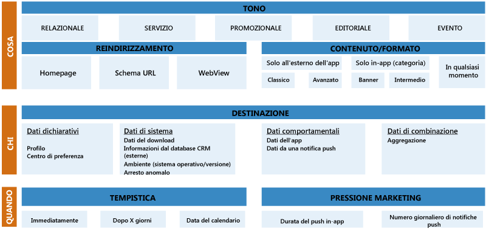
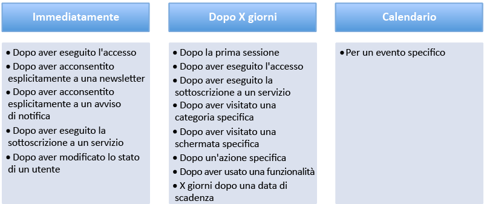

<properties 
	pageTitle="Azure Mobile Engagement - Guida introduttiva con procedure consigliate"
	description="Guida introduttiva ad Azure Mobile Engagement e alle procedure consigliate per il caricamento" 
	services="mobile-engagement" 
	documentationCenter="mobile" 
	authors="wesmc7777"
	manager="erikre"
	editor=""/>

<tags
	ms.service="mobile-engagement"
	ms.devlang="na"
	ms.topic="get-started-article"
	ms.tgt_pltfrm="mobile-multiple"
	ms.workload="mobile" 
	ms.date="10/04/2016"
	ms.author="wesmc;ricksal"/>

# Azure Mobile Engagement - Guida introduttiva con procedure consigliate

## Overview

**Lo schermo del dispositivo mobile è uno spazio molto affollato:** uno studio del 2013 ha evidenziato che in un dispositivo mobile sono installate in media 27 applicazioni. Gli utenti in genere hanno dedicato alle app 30 ore al mese, la maggior parte delle quali al social networking e ai giochi (circa 20 ore). Alla fine del 2014, gli utenti del mercato Android potevano scegliere tra circa 1,5 milioni di applicazioni. L'Apple Store conteneva circa 1,2 milioni di app. L'uso di app per dispositivi mobili continua ad aumentare grazie alla competizione tra gli sviluppatori in questo mercato in crescita.

L'utente mobile medio installerà e disinstallerà le app con grande frequenza man mano che cambiano i suoi interessi e le esperienze in-app. Per determinare il successo di un'app, è indispensabile sapere di più oltre al numero di utenti che installerà l'app. È importante sapere quanto è utile l'app e se la tendenza di utilizzo è destinata a cambiare. È bene porsi le domande seguenti:

- Gli utenti stanno iniziando a considerare l'app poco interessante o obsoleta?
- Quanti utenti hanno smesso del tutto di usare l'app?
- La tendenza agli acquisti in-app sta salendo o scendendo?
- Gli utenti stanno incontrando difficoltà a completare i flussi di lavoro a causa di problemi con l'app o per mancanza di interesse?
- È possibile fare in modo che l'app continui a essere utile e rilevante proponendo nuovi contenuti alla base utenti?
- Questi nuovi contenuti dovrebbero essere gli stessi per tutti gli utenti o differenziati per ogni segmento di utenti a seconda del comportamento nell'app?
 
Le risposte a domande di questo tipo potrebbero essere utili per prolungare il ciclo di vita dell'app e i relativi ricavi oltre che per definire e conservare la base utenti.

Le app correlate a elementi multimediali di solito sono quelle con i tassi di fidelizzazione più alti tra gli utenti. Uno dei motivi è che forniscono contenuto sempre nuovo agli utenti. L'adozione tempestiva di utili notifiche push dirette a un segmento di utenti ha in genere un impatto elevato sulla fidelizzazione all'app.

Il programma Azure Mobile Engagement è progettato per consentire di estendere il ciclo di vita e la fidelizzazione dell'app fornendo un metodo per raccogliere e analizzare informazioni dettagliate sull'uso dell'app. Consentirà di classificare la base utenti in base al comportamento e di creare campagne mirate per inviare notifiche push e messaggi in-app ai segmenti di utenti identificati. Gli indicatori di prestazioni chiave (KPI) misurano il livello di attività degli utenti nei diversi ambiti dell'app. Azure Mobile Engagement fornisce i metodi necessari per determinare questi KPI. Consente di aumentare il rendimento del capitale investito fornendo l'infrastruttura necessaria per migliorare l'interesse verso l'app per dispositivi mobili.

Per ottenere il massimo da Azure Mobile Engagement, è necessario partire da un piano mirato ben concepito. Il piano consentirà di identificare i dati granulari necessari per poter segmentare la base utenti a partire dal comportamento e dalle esperienze in-app. Per la riuscita del piano, è consigliabile definire con precisione l'indicatore KPI che misurerà gli obiettivi dell'app. Con gli indicatori di prestazioni chiaramente definiti, è possibile incorporare facilmente nell'app la logica necessaria per raccogliere dati con granularità fine che si useranno per analizzare e valutare gli indicatori KPI. Questo argomento è una guida alle procedure consigliate per definire gli indicatori KPI che si useranno con il piano di engagement.

## Passaggio 1: Definire gli indicatori KPI per il modello BET

Definire correttamente gli indicatori KPI può non essere semplice. Le app progettate per settori diversi hanno le proprie specifiche e i propri obiettivi e questo può confondere l'approccio. Per evitare questo problema, gli obiettivi e gli indicatori KPI dovrebbero essere classificati in tre categorie principali: **Business**, **Engagement** (interesse) e **Technical** (tecnici), ovvero ciò che è chiamato il **modello BET**.

Un piano valido in genere includerà gli obiettivi con gli indicatori KPI che misurano i successi in ciascuna delle categorie seguenti del modello BET.

#### KPI per il business

Gli indicatori KPI per il business dovrebbero essere i più semplice da definire. Probabilmente sono già stati in qualche modo definiti quando si è pianificata l'app per dispositivi mobili. Questi KPI di solito consentono di misurare i ricavi e il rendimento del capitale investito per l'app. L'elenco seguente include alcuni KPI per il business di esempio che possono essere d'aiuto per definire i propri indicatori di prestazioni:

- KPI per il business relativi a elementi multimediali
	- Numero di annunci su cui si è fatto clic
	- Numero di visite di pagina per utente
	- Numero di sottoscrizioni correnti
- KPI per il business relativi a giochi
	- Numero di acquisti in-app
	- Ricavi medi per utente
	- Tempo dedicato a ogni sessione
	- Giorni di gioco e livello attuale raggiunto nel gioco
- KPI per il business relativi all'e-commerce
	- Giorni di utilizzo dell'app
	- Ricavi medi per utente
	- Quantità media nel carrello durante il completamento della transazione
	- Categoria prodotto per la maggior parte delle visualizzazioni e degli acquisti
- KPI per il business relativi a banche e assicurazioni
	- Numero di conti
	- Funzionalità attivate
	- Pagine di offerte visitate
	- Avvisi selezionati o attivati

#### KPI per l'interesse

Un indicatore KPI per l'interesse è un indicatore di prestazioni per misurare l'interesse degli utenti. Le tendenze in quest'area consentono di determinare la fidelizzazione all'app. Ecco alcuni indicatori delle prestazioni di esempio per questo tipo di KPI:

- Utenti attivi negli ultimi 7 giorni
- Conteggio utenti inattivi negli ultimi 7 giorni
- Conteggio degli utenti che non hanno usato l'app in 30 giorni

Alcuni ovvi fattori esterni possono influenzare gli indicatori in quest'area. Considerare, ad esempio, la possibilità che un utente abbia sempre con sé un dispositivo mobile. Questo può essere vero o meno. Un'app di gioco potrebbe tendenzialmente essere utilizzata di più durante le festività quando un giocatore gioca di più non essendo al lavoro o a scuola.

Indicatori KPI ben definiti in questa categoria dovrebbero consentire di misurare la relazione tra l'app e i clienti.

#### KPI tecnici

Gli indicatori di prestazioni in questa categoria consentono di determinare se l'app funziona correttamente, si blocca o si arresta in modo anomalo. Questi indicatori possono misurare l'integrità dell'app e determinare i problemi di usabilità che possono impedire agli utenti di usare l'app. Le informazioni raccolte per questa categoria possono contenere anche dati sulle prestazioni che potrebbero essere rilevanti per i team di marketing. I dati possono anche essere utili per la risoluzione dei problemi da parte del reparto IT e dei team di supporto che potrebbero identificare bug non segnalati.
 
Ecco alcuni esempi di KPI tecnici:

- Informazioni e conteggio di eccezioni non gestite e gestite
- Timestamp per l'ultimo arresto anomalo
- Ultimo pulsante selezionato o ultima pagina visitata
- Utilizzo memoria dell'app
- Frequenza dei fotogrammi dell'app
- Versione del sistema operativo su cui l'app è in esecuzione
- Versione dell'app

Definire questi KPI consente di misurare le prestazioni dell'app e di individuare potenziali bug. Questi indicatori dovrebbero aiutare a ridurre il tempo necessario per fornire una correzione ai clienti, oltre che a definire un segmento di utenti che ha riscontrato un particolare problema. È possibile usare tale segmentazione degli utenti per creare campagne per inviare notifiche relative alle correzioni disponibili e alle potenziali promozioni per recuperare la soddisfazione dei clienti.

#### Esercizio di strategia 1: Creare il dashboard KPI

Quando si definisce la strategia di marketing, gli indicatori KPI dovrebbero offrire una panoramica di ogni obiettivo principale. Dovrebbero essere punti dati chiaramente definiti che consentano di raccogliere informazioni cruciali per monitorare l'app e il comportamento dell'utente finale.

Compilare un dashboard KPI contenente le informazioni seguenti

1.	Quali sono gli indicatori KPI per l'app?
2.	Quali punti dati si useranno per rappresentare ogni KPI?
3.	Dove si trovano questi dati per l'applicazione (ad esempio, schermo, impostazioni, sistema)?
4.	È possibile riprodurre una sequenza di interesse per questo KPI?

Per esempi e materiale sussidiario, è possibile usare il foglio di lavoro **KPI Builder** nel modello [Media Playbook Template][Media Playbook link].

## Passaggio 2: Programma di interesse

Un buon programma di engagement mobile dovrebbe essere considerato un componente chiave dell'app e dovrebbe assolutamente includere un valido programma di benvenuto da eseguire automaticamente durante i primi giorni di utilizzo dell'app. In questo modo si ottiene di solito un effetto molto positivo sull'interesse e sulla fidelizzazione all'app. Alcuni studi hanno evidenziato che la maggior parte degli utenti smette di usare un'app pochi giorni dopo l'installazione. Se l'obiettivo è soddisfare o superare le aspettative dei clienti suscitando interesse fin dall'inizio, mentre l'utente è ancora coinvolto dall'app, assicurarsi di presentare il valore chiave e i vantaggi dell'app ai clienti.

Le notifiche push sono l'approccio migliore per interessare fin dall'inizio gli utenti di dispositivi mobili. Si deve tuttavia prestare molta attenzione quando si segmentano gli utenti per le notifiche push. Infatti, se l'utente ha la sensazione di ricevere posta indesiderata o notifiche non interessanti, le conseguenze possono essere gravi. Con pochi clic un utente può eliminare l'applicazione e non installarla mai più. L'utente dovrebbe ricevere contenuti di valore in-app altamente personalizzati e non posta indesiderata generica.

Una volta che gli utenti sono attivamente coinvolti, il programma di interesse può aiutare a mettere in evidenza altri aspetti dell'app.

Ad esempio, è possibile impostare una campagna per chiedere agli utenti attivi di classificare l'app. Poiché questo segmento di utenti è il più attivo e ha la maggiore esperienza con l'app, ci si può aspettare che stabilisca la classificazione più precisa. Una classificazione delle app elevata, una volta raggiunta, consente di far aumentare il download organico dell'app oltre che di ridurre i costi di acquisizione di nuovi clienti.

#### Sequenza di interesse

Un programma di interesse completo include diverse sequenze di interesse. Ogni sequenza mira a raggiungere più obiettivi.

###### Sequenza di push del ciclo di vita

Gli obiettivi per una sequenza di push di questo tipo variano a seconda della durata dell'interesse dell'utente per l'app. Un particolare utente può essere nuovo, inattivo o molto attivo. Nelle diverse fasi del ciclo di vita di un interesse, gli utenti possono sfruttare il nuovo contenuto sotto forma di suggerimenti o di collegamenti alla documentazione.

Ad esempio, potrebbe essere necessario orientare un nuovo utente a un'app o fare in modo che tragga vantaggio da un incentivo per i nuovi utenti, simile al seguente, la prima volta che avvia l'app...

*"Benvenuto a bordo! Ricorda di effettuare l'accesso per ottenere il tuo primo mese di uso gratuito."*

###### Sequenza di push comportamentale

La sequenza di push comportamentale ha lo scopo di aumentare l'utilizzo in base al comportamento dell'utente raccolto per l'app.

Ad esempio, un utente molto attivo di un'app di fantacalcio potrebbe ottenere dei vantaggi nell'essere coinvolto con la notifica push seguente...

*"Gianni, sei un vero appassionato di calcio! Entra nella nostra sezione dedicata alla Champions League e vinci un biglietto gratuito per la finale!"*

###### Sequenza di push di avviso

Gli utenti apprezzeranno le notizie rilevanti per i propri interessi. Una sequenza di push di avviso accresce l'interesse inviando avvisi basati sulle preferenze chiaramente dimostrate da un utente. Questo può avvenire in modo esplicito quando un utente seleziona i propri interessi nell'app oppure può essere determinato implicitamente in base ai dati raccolti durante un'interazione dell'utente con l'app.

Ad esempio, l'utente di un'app di e-commerce può acquistare regolarmente una specifica marca di caffè acquisita con un indicatore KPI per il business. L'avviso seguente può accrescere l'interesse di questo utente per l'app.
 
*"Ciao Marco, una delle tue marche di caffè preferite sarà scontata del 25% la prima settimana di settembre 2015. Dal momento che sei uno dei nostri migliori clienti, abbiamo voluto informarti."*

###### Sequenza di push di fidelizzazione

Questa sequenza ha lo scopo di fidelizzare gli utenti con una campagna di notifiche push ripetitive per suscitare un interesse costante per l'app. Se gli utenti amano le interazioni, può essere utile per migliorare la fidelizzazione all'app.

Ad esempio, l'utente di un'app relativa agli sport potrebbe ricevere ogni settimana la notifica push seguente a seconda delle squadre preferite dell'utente:

*"Per avere la possibilità di vincere 200 punti, partecipa al sondaggio se questa settimana il Milan vincerà la partita contro la Juventus!"*

#### Approccio 3W

Conoscere a fondo le diverse sequenze push permette di coinvolgere gli utenti finali. Per personalizzare le notifiche, tuttavia, è necessario usare l'approccio 3W. L'approccio 3W dovrebbe considerare chi, cosa e quando (in inglese, Who, What e When) per ogni notifica. Se si risponde correttamente a queste tre domande, le notifiche dovrebbero risultare mirate al coinvolgimento degli utenti.

###### Chi: il segmento di utenti che riceverà i messaggi

Il push di notifiche agli utenti deve essere considerato un canale di comunicazione molto sensibile. Assicurarsi di definire l'ambito delle notifiche da inviare a un segmento di utenti in modo che siano limitate agli interessi di tale segmento. Una notifica non correttamente instradata avrà molto probabilmente un effetto negativo sull'utente che potrebbe considerarla posta indesiderata e disinstallare l'app.

Usare una combinazione di criteri tecnici e comportamentale specifici quando si definiscono i segmenti di utenti che riceveranno le notifiche. L'istruzione seguente potrebbe essere un semplice esempio di definizione di un segmento di utenti:

"Tutti gli utenti che hanno avviato l'applicazione per dispositivi mobili per la prima volta 3 giorni fa e hanno visitato la pagina di accesso due volte senza completare effettivamente l'accesso".
 
Tale istruzione consente di identificare i dati da raccogliere per supportare uno scenario specifico.

###### Cosa: Il messaggio che si invierà

**Tono**

Negli impegni usare un tono appropriato per gli utenti segmentati. È decisamente un buon modo per contattare gli utenti finali e suscitare l'interesse di un utente per l'app.

**Reindirizzamento**

Una notifica push può essere usata non solo per aprire l'applicazione. Se il messaggio di notifica fornisce un contesto, ad esempio un notiziario o la promozione di un prodotto, questa notifica può collegare direttamente al contenuto appropriato all'interno dell'applicazione. Per supportare questa funzionalità, è necessario creare uno schema URL per consentire all'applicazione di gestire il reindirizzamento. Questo è un importante passaggio da non dimenticare quando si usano le sequenze di interesse.

Il reindirizzamento può essere gestito anche per altri sistemi. Ad esempio, con un URL di azione è possibile reindirizzare gli utenti finali a diversi altri sistemi, inclusi i seguenti:

- Un sito Web
- Una cassetta postale con la posta elettronica già configurata
- Una casella SMS
- Un servizio di chiamata
- Direttamente all'archivio delle applicazioni per classificare l'applicazione.

Ciò offre diverse possibilità di coinvolgere gli utenti finali e di creare regole automatiche per migliorare le prestazioni.

**Formato/Contenuto**

Formati di notifica push e tipi diversi:

1. **Annunci**: consentono di inviare messaggi pubblicitari agli utenti in momenti diversi (al di fuori dell'app, in-app o in qualsiasi momento).
2. **Sondaggi**: consentono di raccogliere informazioni dagli utenti finali ponendo loro domande. Le risposte saranno quindi disponibili per la creazione di criteri per gli utenti finali.
3. **Push di dati**: consentono di inviare un file di dati binario o base64 per aggiornare l'app. Le informazioni contenute in un push di dati vengono inviate all'applicazione per personalizzare l'esperienza degli utenti nell'app. L'applicazione deve essere progettata per supportare i dati di un push di dati.
4. **Riquadri (solo Windows Phone)**: consentono di usare Servizi di notifica push di Microsoft (MPNS) per inviare una notifica push nativa contenente dati XML. I riquadri sono supportati dall'SDK versione 0.9.0. Il payload finale per i riquadri non può superare i 32 KB. Il messaggio viene visualizzato direttamente nel riquadro della schermata.
5. **Visualizzazione Web**: Una visualizzazione Web è un popup con contenuto Web. Questo popup viene visualizzato quando l'utente finale fa clic sulla notifica push. Una visualizzazione Web consente una maggiore interazione con l'utente finale.
 
>[AZURE.NOTE] Assicurarsi che il contenuto da inviare come notifiche push sia conforme alle linee guida delle rispettive piattaforme (iOS, Android, Windows) per lo sviluppo di app e l'invio di notifiche push.

 

###### Quando: il momento di attivazione della campagna

Qual è il momento migliore per attivare una campagna che genera notifiche push? Dovrebbero essere manuali o automatiche? Dovrebbero essere ricorrenti? Determinare il momento opportuno o la frequenza è indispensabile per coinvolgere gli utenti con i migliori risultati. Per ogni scenario e sequenza di interesse, è necessario specificare quale sarà il momento migliore per inviare notifiche push. Di seguito sono riportati alcuni possibili esempi:

Se si intende inviare molte notifiche ogni giorno, è necessario prendere in seria considerazione la possibilità che gli utenti percepiscano le comunicazioni come posta indesiderata.

Azure Mobile Engagement offre due modi per evitare che le comunicazioni vengano percepite come posta indesiderata. Usare innanzitutto la segmentazione con granularità fine per assicurarsi di non rivolgersi agli stessi utenti. Azure Mobile Engagement fornisce anche una funzionalità di "quota" che può limitare le notifiche inviate per una campagna. Ad esempio, impostando la quota predefinita su 5 a settimana, un utente incluso nel segmento di utenti per la campagna non riceverà più di 5 notifiche in tale settimana.

#### Esercizio di strategia 2: Creare il programma di interesse

Dedicare tempo sufficiente al riepilogo degli obiettivi e alla definizione delle campagne che si prevede di condurre con sequenze specifiche. Assicurarsi di applicare l'approccio 3W alle notifiche delle campagne.

Per esempi e materiale sussidiario, usare il foglio di lavoro **Engagement Program** nel modello [Media Playbook Template][Media Playbook link].

## Passaggio 3: Integrazione con l'app

#### Creare un piano di tag

Per integrare Azure Mobile Engagement nell'app, sarà necessario creare un piano di tag. Il piano di tag è il fondamento del progetto. Definisce la relazione tra le specifiche di marketing, il flusso di lavoro dell'applicazione e i dati dei tag reali raccolti nell'app per misurare gli indicatori KPI. Indica quale analisi sarà possibile visualizzare nel portale. Consente anche di definire i segmenti di utenti e di inviare notifiche push mirate per coinvolgere gli utenti finali. Una volta definito il piano di tag, aggiungere il codice per integrarlo nell'app è semplice con Azure Mobile Engagement SDK.

Un piano di tag non dovrebbe contrassegnare qualsiasi elemento in un'applicazione, ma solo includere i dati dei tag che fanno parte della strategia di engagement mobile, che sarà probabilmente diversa a seconda dell'applicazione. Il modello [Media Playbook Template][Media Playbook link] fornito da Azure Mobile Engagement consente di compilare un piano di tag con un determinato metodo. Usare il foglio di lavoro **Tag Plan** come guida alla compilazione del piano di tag.

Quando si definisce una sezione di tag nel foglio di lavoro, è necessario essere molto specifici. È molto importante per evitare confusione. Descrivere in dettaglio ogni scenario previsto in cui verrà inviato ogni tag. Includere il nome dell'attività in cui viene incorporato ogni tag. Tutto questo deve essere incluso nella parte **Informative** del foglio di lavoro. Il foglio di lavoro del piano di tag dovrebbe essere il riferimento principale per la verifica tramite test.

Nella sezione **Data to collect** il team di sviluppo dovrebbe trovare i tipi, i nomi, i valori e le coppie chiave/valore delle informazioni aggiuntive necessari per ogni tag che verrà incorporato nell'applicazione.

Si consiglia di esaminare il piano di tag con tutti i team associati al progetto. Apportare le correzioni necessarie e verificare che sia tutto chiaro per i team del marketing e dello sviluppo.

Il foglio di lavoro **Statement of work** può essere un'utile guida per tutte le persone coinvolte nel progetto.

#### Tipi di dati

Si tratta di tipi di dati comuni supportati da Azure Mobile Engagement.

###### Dispositivi e utenti

Azure Mobile Engagement identifica gli utenti generando un identificatore univoco per ogni dispositivo, detto identificatore di dispositivo o deviceid. L'identificatore viene generato in modo che tutte le applicazioni in esecuzione in tale dispositivo condividano lo stesso identificatore di dispositivo.

###### Sessioni e attività

Una sessione è un'istanza dell'app eseguita da un utente. La sessione dura dal momento in cui l'utente avvia l'app al momento in cui la arresta.

Un'attività è un raggruppamento logico di un set di elementi eseguibili dall'app durante una sessione. Di solito si tratta di una particolare schermata dell'app, ma può essere qualsiasi cosa definita dalla logica dell'applicazione. Come minimo è consigliabile contrassegnare ogni schermata o attività per l'app. Questo permetterà di comprendere il percorso dell'utente.

###### Eventi

Gli eventi sono usati per segnalare l'interazione dell'utente con l'app. Possono essere azioni istantanee, come la condivisione di contenuto o l'avvio di un video. Gli eventi di tag forniranno le raccolte di dati che mostrano come gli utenti interagiscono con l'app.

###### Processi

I processi sono usati per segnalare azioni con una durata. Di seguito sono riportati alcuni esempi:

- Esecuzione di chiamate API
- Tempo di visualizzazione degli annunci
- Durata delle attività in background
- Durata dei processi di acquisto
- Visualizzazione di un video

###### Errori

Gli errori sono usati per segnalare i problemi rilevati dall'app, ad esempio azioni utente non corrette o errori delle chiamate API.

###### Informazioni sull'applicazione

Le informazioni sull'applicazione (App-Info) sono usate per contrassegnare i dati correlati all'esperienza di un utente con un'applicazione. Vengono generate dall'interazione di un utente con l'applicazione.

Per una determinata chiave app-info, Azure Mobile Engagement tiene traccia solo dell'ultimo valore (senza cronologia). App-info indica lo stato dell'app o degli utenti finali, ad esempio lo stato di accesso o il gruppo di prodotti preferiti di un utente.

###### Dati sugli arresti anomali

I dati sugli arresti anomali raccolti automaticamente da Mobile Engagement SDK segnalano gli errori dell'applicazione non gestiti dall'applicazione, ad esempio un'eccezione non gestita.

###### Dati aggiuntivi

Eventi, errori, attività e processi possono essere migliorati con i parametri, ovvero informazioni aggiuntive che uno sviluppatore può fornire come dati specifici dall'applicazione. Si tratta di un aspetto importante per definire una segmentazione con granularità fine.

Ad esempio, il valore di un tag "articolo" consentirà di segmentare gli utenti finali in base a chi ha visualizzato quel particolare articolo. Questo però potrebbe non bastare. È meglio se lo stesso tag "articolo" include anche informazioni aggiuntive, ad esempio "categoria\_notizie" in un'attività. Questa operazione è utile per determinare dinamicamente le categorie preferite per l'utente.

Le informazioni aggiuntive vengono segnalate come coppia chiave/valore. Nell'esempio per questa applicazione multimediale le informazioni aggiuntive per "categoria\_notizie" sarebbero il valore per tale categoria. Ad esempio, "sport", "economia" o "politica".

#### Integrazione tag e SDK 

Per istruzioni dettagliate sull'integrazione di Azure Mobile Engagement SDK nell'app, seguire la documentazione di [Integrazione di Engagement SDK](mobile-engagement-windows-store-integrate-engagement.md) sul sito Web di Azure. Scegliere la piattaforma di destinazione tra i collegamenti nella parte superiore della pagina.

Si consiglia di creare i progetti per due app basate su Azure Mobile Engagement. Uno per la gestione temporanea di sviluppo e test e l'altro per la gestione temporanea della produzione. Il team IT può quindi alzare il livello passando dalla gestione temporanea dei test alla produzione quando il test di accettazione utente viene superato.

#### Test di accettazione utente

Il test di accettazione utente ha lo scopo di verificare che tutto funzioni come previsto. I flussi di lavoro possono essere completati e possono raccogliere tutti i dati necessari in base al piano di tag:
 
- L'aggiunta di tag alle informazioni dovrebbe essere configurata in base ai concetti AZME documentati
- Tutte le informazioni necessarie vengono raccolte (inclusi il valore Extra info e il valore App info)
- La nomenclatura corrisponde al piano di tag
- Non sono stati inviati tag duplicati

Testare accuratamente tutti i tipi di comportamento delle notifiche incorporati nell'app

- Annunci, sondaggi, push di dati al di fuori dell'app e in-app
- Visualizzazione Web/testo
- Aggiornamento di notifiche, categorie

#### Configurazione

Configurare Azure Mobile Engagement è molto semplice. Tutta la documentazione correlata all'interfaccia utente è disponibile nel sito Web di Azure Mobile Engagement, [Come spostarsi nell'interfaccia utente](mobile-engagement-user-interface-home.md).

È consigliabile iniziare a configurare i ruoli corretti e le appartenenze ai ruoli per gli utenti del progetto. In questo modo è possibile gestire l'accesso adeguato alla piattaforma per tutti gli utenti. I ruoli possono includere:

- Amministratori:
- Sviluppatori:
- Visualizzatori

Successivamente:
- Registrare l'ID dispositivo per testare il proprio dispositivo.
- Passare alle impostazioni dell'account e impostare il fuso orario dell'ora di recapito delle notifiche e dei grafici.
- Passare alle impostazioni dell'applicazione e registrare le informazioni sull'app necessarie per rivolgersi all'utente finale all'interno della copertura.

Per altre informazioni su come eseguire la prima campagna di notifiche push, vedere [Come iniziare a usare e gestire le notifiche push per raggiungere gli utenti finali](mobile-engagement-how-tos.md).

## Conclusione

I programmi di interesse sono iterativi e devono essere continuamente migliorati man mano che si determina cosa funziona meglio con l'app.

All'inizio, durante lo sviluppo dell'esperienza con le strategie di interesse, non cercare di creare un'intera strategia di interesse completa. Adottare un approccio graduale che permetta di identificare gli indicatori KPI e di capire come usarli al meglio. La strategia di interesse sarà univoca per ogni app.

Dopo avere accumulato un po' di esperienza, è possibile considerare l'aggiunta degli elementi seguenti ai programmi di interesse:

- Rilevamento: si acquisiscono utenti e probabilmente si definiscono le origini per la raccolta dati. Azure mobile Engagement può essere collegato alle origini per la raccolta dati. Consente di monitorare le prestazioni di ogni origine. Queste informazioni saranno importanti per ottimizzare l'investimento per l'acquisizione.

- Test A/B: è una parte essenziale del programma di interesse. Ogni app ha le proprie specifiche. Con il test A/B, è possibile migliorare il programma di interesse.

- Georilevazione: è una grande opportunità per i marchi. Grazie a questa funzionalità, è possibile essere nel posto giusto e al momento opportuno. Si consiglia di verificare di avere raccolto dati sufficienti sul comportamento degli utenti finali prima di iniziare a usare la georilevazione.

- Push di dati: Il push di dati è un push invisibile. Il push di dati consente di personalizzare l'applicazione in base al comportamento degli utenti finali. Se, ad esempio, un segmento di utenti visualizza spesso prodotti high-tech, il proprietario dell'app può inviare un push di dati che personalizzerà la home page con contenuto high-tech.

## Passaggi successivi

- [Creare un account Azure Mobile Engagement](mobile-engagement-create.md).
- Per altre informazioni sulla definizione della strategia di Mobile Engagement, vedere [Definire la strategia di Mobile Engagement](mobile-engagement-define-your-mobile-engagement-strategy.md).

  

<!--Image references-->

<!--Link references-->
[Media Playbook link]: https://github.com/Azure/azure-mobile-engagement-samples/tree/master/Playbooks

<!---HONumber=AcomDC_1005_2016-->