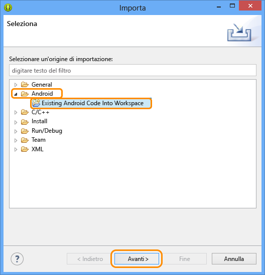
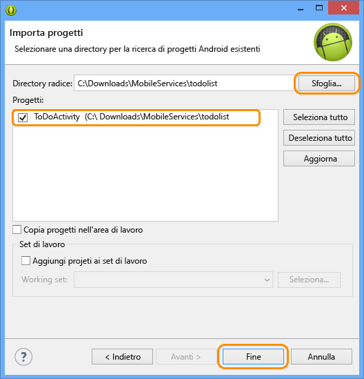

<properties linkid="develop-mobile-tutorials-get-started-with-data-android" urlDisplayName="Get Started with Data - Android" pageTitle="Get started with data (Android) | Mobile Dev Center" metaKeywords="Azure android data, Azure mobile services data, windows droid, windows android, microsoft droid, microsoft android" description="Learn how to get started using Mobile Services to leverage data in your Android app." metaCanonical="" services="" documentationCenter="Mobile" title="Get started with data in Mobile Services" authors="ricksal,glenga" solutions="" manager="" editor="" />

Introduzione ai dati in Servizi mobili
======================================

[Windows Store C\#](/en-us/develop/mobile/tutorials/get-started-with-data-dotnet "Windows Store C#")[Windows Store JavaScript](/en-us/develop/mobile/tutorials/get-started-with-data-js "Windows Store JavaScript")[Windows Phone](/en-us/develop/mobile/tutorials/get-started-with-data-wp8 "Windows Phone")[iOS](/en-us/develop/mobile/tutorials/get-started-with-data-ios "iOS")[Android](/en-us/develop/mobile/tutorials/get-started-with-data-android "Android")[HTML](/en-us/develop/mobile/tutorials/get-started-with-data-html "HTML")[Xamarin.iOS](/en-us/develop/mobile/tutorials/get-started-with-data-xamarin-ios "Xamarin.iOS")[Xamarin.Android](/en-us/develop/mobile/tutorials/get-started-with-data-xamarin-android "Xamarin.Android")

In questo argomento viene illustrato come utilizzare Servizi mobili di Azure per sfruttare i dati in un'app per Android. In questa esercitazione si scaricherà un'app che archivia dati in memoria, si creerà un nuovo servizio mobile e lo si integrerà con l'app e quindi si effettuerà l'accesso al portale di gestione di Azure per visualizzare le modifiche apportate ai dati durante l'esecuzione dell'app.

[guarda l'esercitazione](http://channel9.msdn.com/Series/Windows-Azure-Mobile-Services/Android-Getting-Started-With-Data-Connecting-your-app-to-Windows-Azure-Mobile-Services) [Riproduci video](http://channel9.msdn.com/Series/Windows-Azure-Mobile-Services/Android-Getting-Started-With-Data-Connecting-your-app-to-Windows-Azure-Mobile-Services) 15:32

**Nota**

In questa esercitazione viene descritto come è possibile utilizzare Servizi mobili di Azure per archiviare e recuperare i dati da un'app per Android e vengono pertanto riproposte molte delle procedure già completate nella guida introduttiva a Servizi mobili. Se si tratta della prima esperienza con Servizi mobili, è consigliabile iniziare dall'esercitazione [Introduzione a Servizi mobili](/en-us/develop/mobile/tutorials/get-started-android).

In questa esercitazione vengono descritte le operazioni di base seguenti:

1.  [Download del progetto dell'app per Android](#download-app)
2.  [Creazione del servizio mobile](#create-service)
3.  [Aggiunta di una tabella dati per l'archiviazione](#add-table)
4.  [Aggiornamento dell'app per l'utilizzo di Servizi mobili](#update-app)
5.  [Test dell'app in Servizi mobili](#test-app)

**Nota**

Per completare l'esercitazione, è necessario un account Azure. Se non si dispone di un account, è possibile creare un account di valutazione gratuita in pochi minuti. Per informazioni dettagliate, vedere la pagina relativa alla [versione di valutazione gratuita di Azure](http://www.windowsazure.com/en-us/pricing/free-trial/?WT.mc_id=AED8DE357).

Per completare questa esercitazione, è necessario disporre di [Mobile Services Android SDK](http://go.microsoft.com/fwlink/p/?LinkID=280126), [Android SDK](https://go.microsoft.com/fwLink/p/?LinkID=280125) che include l'IDE (Integrated Development Environment) di Eclipse, il plug-in Android Developer Tools (ADT) e Android 4.2 o versione successiva.

**Nota**

In questa esercitazione vengono fornite le istruzioni per installare Android SDK e Mobile Services Android SDK. Il progetto GetStartedWithData scaricato richiede Android 4.2 o versione successiva invece con Mobile Services SDK è richiesto solo Android 2.2 o versione successiva.

Download del progettoDownload del progetto GetStartedWithData
-------------------------------------------------------------

### Scaricare il codice di esempio

Questa esercitazione è basata sull'[app GetStartedWithData](http://go.microsoft.com/fwlink/p/?LinkID=282122) che è un'app per Android. L'interfaccia utente di questa app è identica a quella dell'app generata dalla guida introduttiva di Servizi mobili per Android, ma in questo caso gli elementi aggiunti vengono archiviati nella memoria locale. Si procederà quindi all'aggiunta del codice necessario per rendere i dati persistenti nell'archiviazione.

1.  Scaricare l'app di esempio `GetStartedWithData` ed espandere i file nel computer.

2.  In Eclipse fare clic su **File**, quindi su **Import**, espandere **Android**, fare clic su **Existing Android Code into Workspace** e quindi su **Next**.

	

1.  Fare clic su **Browse**, individuare il percorso dei file espansi del progetto, fare clic su **OK** e verificare che il progetto TodoActivity sia selezionato. Se si desidera che il progetto venga copiato nell'area di lavoro, selezionare la casella **Copy projects into workspace**. Infine, fare clic su **Finish**.

	

    I file del progetto verranno importati nell'area di lavoro corrente.

### Verificare la versione di Android SDK

[WACOM.INCLUDE [Verifica SDK](../includes/mobile-services-verify-android-sdk-version.md)]

### Esaminare ed eseguire il codice di esempio

1.  In Package Explorer espandere **GetStartedWithData**, **src** e **.com.example.GetStartedWithData**, quindi esaminare il file ToDoActivity.java.

    

    Si noti che sono presenti commenti `//TODO` in cui vengono specificate le procedure da eseguire per il funzionamento dell'app con il servizio mobile.

2.  Scegliere **Run** dal menu **Run** e fare clic su **Android Application** per avviare il progetto.

    **Nota**

    È possibile eseguire il progetto utilizzando un telefono Android o l'emulatore di Android. L'esecuzione in un telefono Android richiede il download di un driver USB specifico del telefono.

    Per eseguire il progetto nell'emulatore di Android, è necessario definire almeno un Android Virtual Device (AVD). Utilizzare AVD Manager per creare e gestire questi dispositivi.

3.  Nell'app digitare un testo significativo, ad esempio *Complete the tutorial* e quindi fare clic su **Add**.

    

    Si noti che il testo salvato è archiviato in una raccolta in memoria e visualizzato nell'elenco riportato di seguito.

Creazione del servizio mobileCreazione di un nuovo servizio mobile nel portale di gestione
------------------------------------------------------------------------------------------

[WACOM.INCLUDE [mobile-services-create-new-service-data](../includes/mobile-services-create-new-service-data.md)]

Aggiunta di una nuova tabellaAggiunta di una nuova tabella al servizio mobile
-----------------------------------------------------------------------------

[WACOM.INCLUDE [mobile-services-create-new-service-data-2](../includes/mobile-services-create-new-service-data-2.md)]

Aggiornamento dell'appAggiornamento dell'app per l'utilizzo del servizio mobile per l'accesso ai dati
-----------------------------------------------------------------------------------------------------

Ora che il servizio mobile è pronto, è possibile aggiornare l'app in modo che gli elementi vengano archiviati in Servizi mobili anziché nella raccolta locale.

1.  Se non si dispone di [Mobile Services Android SDK](http://go.microsoft.com/fwlink/p/?LinkID=280126), scaricarlo adesso ed espandere i file compressi.

2.  Copiare i file `.jar` dalla cartella `mobileservices` dell'SDK nella cartella `libs` del progetto GetStartedWithData.

3.  In Package Explorer in Eclipse fare clic con il pulsante destro del mouse sulla cartella `libs`, quindi scegliere **Refresh** per visualizzare i file jar copiati

	Il riferimento a Mobile Services SDK verrà copiato nell'area di lavoro.

1.  Aprire il file AndroidManifest.xml e aggiungere la riga seguente che consente all'app di accedere a Servizi mobili in Azure.

        <uses-permission android:name="android.permission.INTERNET" />

2.  In Package Explorer aprire il file TodoActivity.java disponibile nel pacchetto com.example.getstartedwithdata e rimuovere i simboli di commento dalle righe di codice seguenti:

        import com.microsoft.windowsazure.mobileservices.MobileServiceClient;
        import com.microsoft.windowsazure.mobileservices.MobileServiceTable;
        import com.microsoft.windowsazure.mobileservices.NextServiceFilterCallback;
        import com.microsoft.windowsazure.mobileservices.ServiceFilter;
        import com.microsoft.windowsazure.mobileservices.ServiceFilterRequest;
        import com.microsoft.windowsazure.mobileservices.ServiceFilterResponse;
        import com.microsoft.windowsazure.mobileservices.ServiceFilterResponseCallback;
        import com.microsoft.windowsazure.mobileservices.TableOperationCallback;
        import com.microsoft.windowsazure.mobileservices.TableQueryCallback;

        import java.net.MalformedURLException;

3.  Si procederà quindi alla rimozione dell'elenco in memoria attualmente utilizzato dall'app in modo da poterlo sostituire con un servizio mobile. Nella classe **ToDoActivity** impostare come commento la riga di codice seguente che definisce l'elenco **toDoItemList** esistente.

        public List<ToDoItem> toDoItemList = new ArrayList<ToDoItem>();

4.  Dopo avere completato il passaggio precedente, il progetto indicherà la presenza di errori di compilazione. Cercare le altre tre posizioni in cui viene utilizzata la variabile `toDoItemList` e impostare come commento le sezioni indicate. Rimuovere inoltre `import java.util.ArrayList` per procedere alla rimozione completa dell'elenco in memoria.

5.  Ora si procederà all'aggiunta del servizio mobile. Rimuovere quindi i simboli di commento dalle righe di codice seguenti:

        private MobileServiceClient mClient;
        private private MobileServiceTable<ToDoItem> mToDoTable;

6.  Individuare la classe ProgressFilter verso la fine del file e rimuovere i simboli di commento. Questa classe visualizza un indicatore 'loading' mentre MobileServiceClient esegue le operazioni di rete.

7.  Nel portale di gestione fare clic su **Mobile Services** e quindi sul servizio mobile appena creato.

8.  Fare clic sulla scheda **Dashboard** e prendere nota del valore di **Site URL**, quindi fare clic su **Manage keys** e prendere nota del valore di **Application key**.

	

	Questi valori sono necessari per accedere al servizio mobile dal codice dell'app.

1.  Nel metodo **onCreate** rimuovere i simboli di commento dalle righe di codice seguenti che definiscono la variabile **MobileServiceClient**:

        try {
        // Create the Mobile Service Client instance, using the provided
        // Mobile Service URL and key
            mClient = new MobileServiceClient(
                    "MobileServiceUrl",
                    "AppKey", 
                    this).withFilter(new ProgressFilter());

            // Get the Mobile Service Table instance to use
            mToDoTable = mClient.getTable(ToDoItem.class);
        } catch (MalformedURLException e) {
            createAndShowDialog(new Exception("There was an error creating the Mobile Service. Verify the URL"), "Error");
            }

	Verrà creata una nuova istanza di MobileServiceClient utilizzata per accedere al servizio mobile. Verrà inoltre creata l'istanza di MobileServiceTable utilizzata per comunicare con l'archiviazione dati nel servizio mobile.

1.  Nel codice precedente sostituire `MobileServiceUrl` e `AppKey` con l'URL del servizio mobile e la chiave applicazione, in quest'ordine.

2.  Rimuovere i simboli di commento dalle righe seguenti del metodo **checkItem**:

        mToDoTable.update(item, new TableOperationCallback<ToDoItem>() { 
            public void onCompleted(ToDoItem entity, Exception exception,
                    ServiceFilterResponse response) {
                if(exception == null){
                    if (entity.isComplete()) {
                        mAdapter.remove(entity);
                    }
                } else {
                    createAndShowDialog(exception, "Error");  
                }
            }
        });

	Verrà quindi inviato un aggiornamento dell'elemento al servizio mobile e verranno rimossi gli elementi dall'adattatore.

1.  Rimuovere i simboli di commento dalle righe seguenti del metodo **addItem**:

        mToDoTable.insert(item, new TableOperationCallback<ToDoItem>() {
                
            public void onCompleted(ToDoItem entity, Exception exception,
                    ServiceFilterResponse response) {
                if(exception == null){
                    if (!entity.isComplete()) {
                        mAdapter.add(entity);
                    }
                } else {
                    createAndShowDialog(exception, "Error");
                }               
            }
        });

	Verrà creato e inserito un nuovo elemento nella tabella nel servizio mobile remoto.

1.  Rimuovere i simboli di commento dalle righe seguenti del metodo **refreshItemsFromTable**:

        mToDoTable.where().field("complete").eq(false)
        .execute(new TableQueryCallback<ToDoItem>() {
             public void onCompleted(List<ToDoItem> result, 
                     int count, Exception exception, 
                     ServiceFilterResponse response) {
                            
                        if(exception == null){
                            mAdapter.clear();

                            for (ToDoItem item : result) {
                                mAdapter.add(item);
                            }
                        } else {
                            createAndShowDialog(exception, "Error");
                        }
                    }
                }); 

    Verrà interrogato il servizio mobile e verranno restituiti gli oggetti non contrassegnati come completati. Gli elementi verranno aggiunti all'adattatore per l'associazione.

Test dell'appTest dell'app nel nuovo servizio mobile
----------------------------------------------------

Ora che l'app è stata aggiornata per consentire l'utilizzo di Servizi mobili per l'archiviazione back-end, è possibile verificarne il funzionamento in Servizi mobili utilizzando l'emulatore di Android o un telefono Android.

1.  Nel menu **Run** scegliere **Run** per avviare il progetto.

    L'app, compilata tramite Android SDK che utilizza la libreria client per inviare una query che restituisce gli elementi per il servizio mobile, verrà eseguita.

2.  Come in precedenza, digitare un testo significativo e quindi fare clic su **Add**.

    Un nuovo elemento verrà inviato come inserimento al servizio mobile.

3.  Nel [portale di gestione](https://manage.windowsazure.com/) fare clic su **Mobile Services** e quindi sul servizio mobile.

4.  Fare clic sulla scheda **Data** e quindi su **Browse**.

    
          
    Si noti che la tabella **TodoItem** ora contiene dati, con alcuni valori generati da Servizi mobili, e che alla tabella sono state aggiunte automaticamente colonne per garantire la corrispondenza con la classe TodoItem nell'app.

L'esercitazione **Introduzione ai dati** per Android è terminata.

Passaggi successivi
-------------------

In questa esercitazione sono state illustrate le nozioni di base per consentire a un'app per Android di utilizzare dati in Servizi mobili.

In seguito, è consigliabile eseguire una delle esercitazioni seguenti, basate sull'app GetStartedWithData creata in questa esercitazione:

-   [Utilizzo di script per la convalida e la modifica di dati](/en-us/develop/mobile/tutorials/validate-modify-and-augment-data-dotnet)
    Ulteriori informazioni sull'utilizzo di script del server in Servizi mobili per convalidare e modificare i dati inviati dall'app.

-   [Utilizzo del paging per ridefinire le query](/en-us/develop/mobile/tutorials/add-paging-to-data-android)
    Ulteriori informazioni su come utilizzare il paging nelle query per controllare la quantità di dati gestiti in un'unica richiesta.

Una volta completata la serie relativa ai dati, provare a eseguire le esercitazioni per Android seguenti:

-   [Introduzione all'autenticazione](/en-us/develop/mobile/tutorials/get-started-with-users-android)
    Informazioni sull'autenticazione degli utenti dell'app.

-   [Introduzione alle notifiche push](/en-us/develop/mobile/tutorials/get-started-with-push-android)
    Informazioni sull'invio di una notifica push di base all'app con Servizi mobili.

