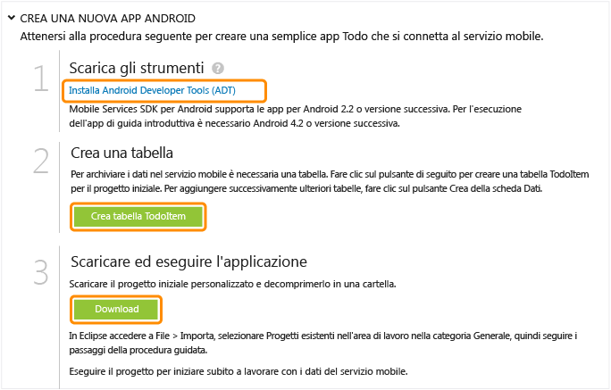

<properties  pageTitle="Get Started with Azure Mobile Services for Android apps" metaKeywords="Azure android application, mobile service android, getting started Azure android, azure droid, getting started droid windows" description="Follow this tutorial to get started using Azure Mobile Services for Android development." metaCanonical="" services="" documentationCenter="Mobile" title="Get started with Mobile Services" authors="glenga" solutions="" manager="" editor="" />

# Introduzione a Servizi mobili

 

	<a  href="/it-it/documentation/articles/mobile-services-windows-store-get-started" title="Windows Store">Windows Store</a> <a  href="/it-it/documentation/articles/mobile-services-windows-phone-get-started" title="Windows Phone">Windows Phone</a> <a  href="/it-it/documentation/articles/mobile-services-ios-get-started" title="iOS">iOS</a> <a  href="/it-it/documentation/articles/mobile-services-android-get-started" title="Android" class="current">Android</a> <a  href="/it-it/documentation/articles/mobile-services-html-get-started" title="HTML">HTML</a> <a  href="/it-it/documentation/articles/partner-xamarin-mobile-services-ios-get-started" title="Xamarin.iOS">Xamarin.iOS</a> <a  href="/it-it/documentation/articles/partner-xamarin-mobile-services-android-get-started" title="Xamarin.Android">Xamarin.Android</a> <a  href="/it-it/documentation/articles/partner-sencha-mobile-services-get-started/" title="Sencha">Sencha</a> <a  href="/it-it/documentation/articles/mobile-services-javascript-backend-phonegap-get-started/" title="PhoneGap">PhoneGap</a>

 

	<a  href="/it-it/documentation/articles/mobile-services-dotnet-backend-android-get-started/" title=".NET backend">Back-end .NET</a> | <a  href="/it-it/documentation/articles/mobile-services-android-get-started/" title="JavaScript backend" class="current">Back-end JavaScript</a>

 

In questa esercitazione viene illustrato come aggiungere un servizio back-end basato su cloud a un'app per Android mediante Servizi mobili di Azure. In questa esercitazione si creeranno sia un nuovo servizio mobile che una semplice app <em>To do list</em> che archivia i dati dell'app nel nuovo servizio mobile.

Di seguito è riportata una schermata dell'app completata:

 

<a  href="http://channel9.msdn.com/Series/Windows-Azure-Mobile-Services/Android-Support-in-Windows-Azure-Mobile-Services" target="_blank" class="label">guarda l'esercitazione</a> <a  style="background-image: url('/media/devcenter/mobile/videos/mobile-get-started-android-180x120.png') !important;" href="http://channel9.msdn.com/Series/Windows-Azure-Mobile-Services/Android-Support-in-Windows-Azure-Mobile-Services" target="_blank" class="dev-onpage-video">Riproduci video</a> 7:26

 

Per completare questa esercitazione, è necessario disporre di [Android Developer Tools][1] che include l'IDE (Integrated Development Environment) di Eclipse, il plug-in Android Developer Tools (ADT) e l'ultima piattaforma Android. È necessario Android 4.2 o versione successiva.

Il progetto di guida introduttiva scaricato contiene l'SDK di Servizi mobili per Android. Questo progetto richiede Android 4.2 o versione successiva, invece l'SDK di Servizi mobili richiede solo Android 2.2 o versione successiva.

 

<strong>Nota</strong> 
Per completare l'esercitazione, è necessario un account Azure. Se non si dispone di un account, è possibile creare un account di valutazione gratuita in pochi minuti. Per informazioni dettagliate, vedere la pagina relativa alla <a  href="http://www.windowsazure.com/it-it/pricing/free-trial/?WT.mc_id=AE564AB28" target="_blank">versione di valutazione gratuita di Azure</a>.

## Creazione di un nuovo servizio mobile

[WACOM.INCLUDE [mobile-services-create-new-service](../includes/mobile-services-create-new-service.md)]

## <h2 >Creazione di una nuova appCreazione di una nuova app per Android</h2>

Dopo aver creato il servizio mobile, è possibile seguire una facile guida introduttiva nel portale di gestione per creare una nuova app o modificare un'app esistente per connettersi al servizio mobile.

In questa sezione si creerà una nuova app per Android connessa al servizio mobile.

1.  Nel portale di gestione fare clic su **Mobile Services** e quindi sul servizio mobile appena creato.

2.  Nella scheda Quickstart fare clic su **Android** in **Choose platform** ed espandere **Create a new Android app**.
    
	![][6]

	Di seguito sono visualizzati i tre semplici passaggi per creare un'app per Android connessa al servizio mobile.

	

1.	Se necessario, scaricare e installare [Android Developer Tools][1] nel computer locale o nella macchina virtuale.

2.  Fare clic su **Create TodoItem table** per creare una tabella in cui archiviare i dati dell'app.

3.  In **Download and run your app** fare clic su **Download**.

 Verrà scaricato il progetto per l'applicazione *To do list* di esempio connessa al servizio mobile. Salvare il file del progetto compresso nel computer locale e prendere nota del percorso.

## Esecuzione dell'app per Android

La fase finale di questa esercitazione prevede la compilazione el'esecuzione della nuova app.

1.  Individuare il percorso in cui sono stati salvati i file compressi del progetto ed espanderli sul computer in uso.

2.  In Eclipse fare clic su **File**, quindi su **Import**, espandere **Android**, fare clic su **Existing Android Code into Workspace** e quindi su **Next**.

	

1.  Fare clic su **Browse**, individuare il percorso dei file espansi del progetto, fare clic su **OK**, verificare che il progetto TodoActivity sia selezionato, quindi fare clic su **Finish**.

	

	I file del progetto verranno importati nell'area di lavoro corrente.

	

1.	Scegliere **Run** dal menu **Run** per avviare il progetto nell'emulatore di Android.
    

	**Nota**
	Per poter eseguire il progetto nell emulatore di Android, è necessario definire almeno un Android Virtual Device (AVD).Utilizzare AVD Manager per creare e gestire questi dispositivi.

2.  Nell'app digitare un testo significativo, ad esempio *Complete the  tutorial* e quindi fare clic su **Add**.
    
	![][10]

	Verrà inviata una richiesta POST al nuovo servizio mobile ospitato in Azure. I dati della richiesta vengono inseriti nella tabella TodoItem. Gli elementi archiviati nella tabella vengono restituiti dal servizio mobile e i dati vengono visualizzati nell'elenco.
    

	<b>Nota</b>
	
È possibile esaminare il codice che accede al servizio mobile per eseguire una query e inserire i dati trovati nel file ToDoActivity.java.

3.  Nel portale di gestione fare clic sulla scheda **Data** e quindi sulla tabella **TodoItems**.
    
	![][11]

	In questo modo sarà possibile visualizzare i dati inseriti nella tabella dall'app.

	![][12]

## Passaggi successivi

Dopo aver completato la guida introduttiva, è possibile eseguire altre importanti attività in Servizi mobili:

* [Introduzione ai dati](/en-us/develop/mobile/tutorials/get-started-with-data-android)  
  
	Ulteriori informazioni sull'archiviazione e sulle query dei dati mediante Servizi mobili.

* [Introduzione all'autenticazione](/en-us/develop/mobile/tutorials/get-started-with-users-android)
  
	Informazioni sull'autenticazione degli utenti
  dell'app con un provider di identità.

* [Introduzione alle notifiche Push](/en-us/develop/mobile/tutorials/get-started-with-push-android)  
  
	Informazioni sull'invio di una notifica push  di base all'app.

<!-- Anchors. -->
[Getting started with Mobile Services]:#getting-started
[Create a new mobile service]:#create-new-service
[Define the mobile service instance]:#define-mobile-service-instance
[Next Steps]:#next-steps

<!-- Images. -->
[0]: ./media/mobile-services-android-get-started/mobile-quickstart-completed-android.png

[6]: ./media/mobile-services-android-get-started/mobile-portal-quickstart-android.png
[7]: ./media/mobile-services-android-get-started/mobile-quickstart-steps-android.png
[8]: ./media/mobile-services-android-get-started/mobile-eclipse-quickstart.png

[10]: ./media/mobile-services-android-get-started/mobile-quickstart-startup-android.png
[11]: ./media/mobile-services-android-get-started/mobile-data-tab.png
[12]: ./media/mobile-services-android-get-started/mobile-data-browse.png

[14]: ./media/mobile-services-android-get-started/mobile-services-import-android-workspace.png
[15]: ./media/mobile-services-android-get-started/mobile-services-import-android-project.png

<!-- URLs. -->

[1]: https://go.microsoft.com/fwLink/p/?LinkID=280125

    

<!-- Anchors. -->

<!-- Images. -->

<!-- URLs. -->

[1]: https://go.microsoft.com/fwLink/p/?LinkID=280125