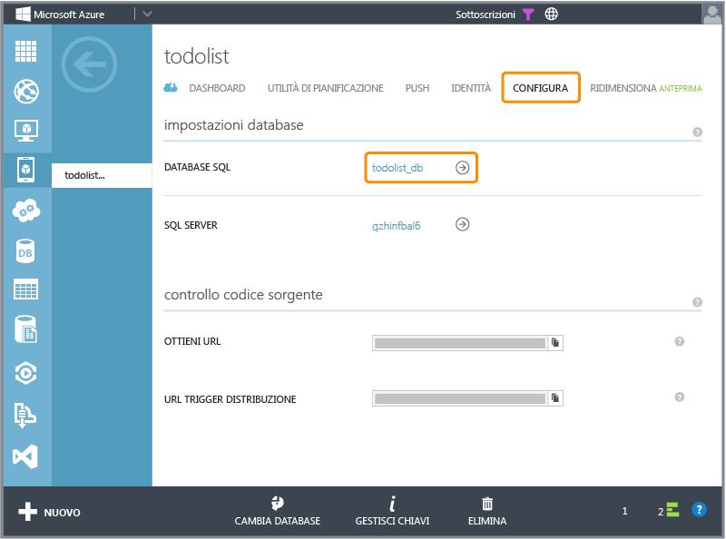

<properties pageTitle="How to use Code First Migrations .NET backend (Mobile Services)" metaKeywords="" description="" metaCanonical="" services="" documentationCenter="" title="Considerations for supporting multiple clients from a single mobile service" authors="glenga" solutions="" writer="glenga" manager="dwrede" editor="" />

Come modificare un modello di dati in un servizio mobile back-end .NET
======================================================================

In un progetto di servizio mobile back-end .NET l'inizializzatore predefinito di database Code First di Entity Framework deriva dalla classe [DropCreateDatabaseIfModelChanges]. L'inizializzatore consente a Entity Framework di eliminare e ricreare il database ogni volta che rileva una modifica nel modello di dati esposta da [DbContext]. Nello sviluppo locale del progetto di servizio mobile è necessario continuare a utilizzare questo inizializzatore, inoltre nelle esercitazioni relative a back-end .NET si presuppone l'utilizzo di questo inizializzatore. Tuttavia, nelle situazioni in cui si intenda apportare modifiche al modello di dati e conservare i dati esistenti nel database, è necessario utilizzare Migrazioni Code First. L'utilizzo di Migrazioni Code First è inoltre un'ottima soluzione per la pubblicazione in Azure delle modifiche al modello di dati, poiché non è possibile eliminare un database SQL.

In questo argomento viene illustrato come utilizzare Migrazioni Code First per apportare modifiche al modello di dati in un database SQL esistente senza perdere dati esistenti. Per questa procedura si presuppone che il progetto di servizio mobile sia già stato pubblicato in Azure, che vi siano dati esistenti nel database e che i modelli di dati remoti e locali siano ancora sincronizzati.

> [WACOM.NOTE]È consigliabile completare il più possibile lo sviluppo del modello di dati sul computer locale prima di procedere alla pubblicazione in Azure. Se il progetto di servizio mobile back-end .NET è già stato pubblicato in Azure, e lo schema di tabella del database SQL non corrisponde al modello di dati corrente del progetto, è necessario eliminare le tabelle oppure sincronizzarle manualmente prima di tentare la pubblicazione con Migrazioni Code First.

Durante lo sviluppo di un progetto di servizio mobile back-end .NET sul computer locale, il modo più semplice per apportare modifiche al modello di dati consiste nel continuare a utilizzare l'inizializzatore predefinito, che elimina e ricrea il database ogni volta che rileva una modifica nel modello di dati. Questo approccio non funziona nel caso in cui il progetto venga ripubblicato in Azure. L'inizializzatore non funziona poiché, molto opportunamente, il runtime non ha le autorizzazioni per eliminare un database SQL in Azure.

> [WACOM.NOTE]Quando si sviluppa e si testa un progetto di servizio mobile in servizi di Azure attivi, è necessario utilizzare sempre un'istanza del servizio mobile dedicata al test. È sempre sconsigliabile che i servizi mobili in fase di produzione o utilizzati da app client siano oggetto di sviluppo o test.

Eliminazione di tabelle nel database SQL
----------------------------------------

Per poter avviare Migrazioni in Azure su un database SQL, è necessario eliminare manualmente le tabelle esistenti nello schema del database utilizzato dal servizio mobile. Per eliminare dal database SQL le tabelle esistenti, attenersi alla procedura seguente. Se lo schema del database è già sincronizzato con il modello di dati corrente, è possibile ignorare questo passaggio e avviare [Migrazioni](#migrations).

1.  Accedere a [Azure Management Portal], selezionare il servizio mobile, fare clic sulla scheda **Configure** e fare clic sul collegamento **SQL Database**.

    

    Il collegamento consente di accedere alla pagina del portale relativa al database utilizzato dal servizio mobile.

2.  Fare clic sul pulsante **Manage** e accedere al server di database SQL.

    

3.  Nella gestione del database SQL fare clic su **Design**, fare clic su **Tables**, selezionare una tabella nello schema del servizio mobile, fare clic su **Drop table** e quindi su **OK** per confermare.

    

4.  Ripetere i passaggi precedenti per tutte le tabelle nello schema del servizio mobile.

    Dopo la rimozione delle tabelle esistenti, è possibile inizializzare Migrazioni Code First sul database SQL. Le tabelle che non appartengono allo schema del servizio mobile non influiscono sul servizio mobile e non devono essere eliminate.

Abilitazione di Migrazioni Code First
-------------------------------------

Migrazioni Code First utilizza un metodo snapshot per generare il codice che, se eseguito, apporta modifiche allo schema del database. Con Migrazioni, è possibile apportare modifiche incrementali al modello di dati e conservare i dati esistenti nel database. Per abilitare Migrazioni e apportare modifiche al modello di dati nel progetto, nel database locale e in Azure, attenersi alla procedura seguente.

1.  In Esplora soluzioni di Visual Studio fare clic con il pulsante destro del mouse sul progetto di servizio mobile e scegliere **Imposta come progetto di avvio**.

2.  Espandere Gestione pacchetti **Gestione pacchetti NuGet** dal menu **Strumenti**, quindi fare clic su **Console di Gestione pacchetti**.

    Verrà visualizzata la finestra Console di Gestione pacchetti, che verrà utilizzata per gestire Migrazioni Code First.

3.  Nella finestra Console di Gestione pacchetti eseguire il comando seguente:

         PM> Enable-Migrations

    Questo comando consente di avviare Migrazioni Code First per il progetto.

4.  Nella console, eseguire il comando seguente:

         PM> Add-Migration Initial

    Questo comando crea una nuova migrazione denominata *Iniziale*. Il codice di migrazione verrà archiviato nella cartella del progetto Migrazioni.

5.  Espandere la cartella App\_Start, aprire il file WebApiConfig.cs e aggiungere l'istruzione **using** seguente:

         using System.Data.Entity.Migrations;
         using todolistService.Migrations;

    Nel codice precedente, è necessario sostituire la stringa *todolistService* con lo spazio dei nomi del progetto che, per il progetto di guida introduttiva scaricato, è Servizio *mobile\_service\_name*.

6.  Nello stesso file di codice, impostare come commento la chiamata al metodo **Database.SetInitializer** e aggiungere di seguito il codice seguente:

         var migrator = new DbMigrator(new Configuration());
         migrator.Update();

    Verrà così disabilitato l'inizializzatore predefinito di database Code First che elimina e ricrea il database, e verrà sostituito con una richiesta esplicita di applicazione dell'ultima migrazione. A questo punto, ogni modifica al modello di dati genererà un'eccezione InvalidOperationException al momento dell'accesso ai dati, a meno che non sia stata creata una migrazione. Per il futuro, per il servizio utilizzare Migrazioni Code First per la migrazione di modifiche al modello di dati al database.

7.  Premere F5 per avviare il progetto di servizio mobile sul computer locale.

    A questo punto, il database è sincronizzato con il modello di dati. Se sono stati forniti dati di seeding, è possibile effettuare una verifica facendo clic su **Try it out**, **GET tables/todoitem** e quindi su **Try this out** e **Send**. Per ulteriori informazioni, vedere [Seeding di dati nelle migrazioni](#seeding).

8.  Apportare una modifica al modello di dati, ad esempio aggiungere una nuova proprietà al tipo TodoItem, ricreare il progetto e quindi eseguire il comando seguente nella Gestione pacchetti:

    	PM\> Add-Migration NewUserId

    Questo comando crea una nuova migrazione denominata *NewUserId*. Verrà aggiunto nella cartella Migrazioni un nuovo file del codice che implementa questa modifica.  

9.  Premere nuovamente F5 per riavviare il progetto di servizio mobile sul computer locale.

    La migrazione verrà applicata al database e il database sarà nuovamente sincronizzato con il modello di dati. Se sono stati forniti dati di seeding, è possibile effettuare una verifica facendo clic su **Try it out**, **GET tables/todoitem** e quindi su **Try this out** e **Send**. Per ulteriori informazioni, vedere [Seeding di dati nelle migrazioni](#seeding).

10.  Ripubblicare il servizio mobile in Azure e quindi eseguire l'app client per accedere ai dati, verificare che siano caricati e che non si verifichino errori.

11.  (Facoltativo) Accedere a [Azure Management Portal], selezionare il servizio mobile, fare clic sulla scheda **Configure** e fare clic sul collegamento **SQL Database**.

    

    Verrà visualizzata la pagina del database SQL per il database del servizio mobile.

12.  (Facoltativo) Fare clic su **Manage**, accedere al server di database SQL e quindi fare clic su **Design** e verificare che le modifiche allo schema siano state riportate in Azure.

    

Seeding di dati nelle migrazioni.
---------------------------------

Quando si esegue una migrazione, è possibile fare in modo che Migrazioni effettui il seeding di dati nel database. La classe delle configurazioni dispone di un metodo di seeding di cui è possibile eseguire l'override per inserire o aggiornare dati. Quando Migrazioni viene abilitato, il file di codice Configuration.cs viene aggiunto alla cartella Migrazioni. Questi esempi illustrano come eseguire l'override del metodo [Seed] per effettuare il seeding dei dati nella tabella **TodoItems**. Il metodo [Seed] viene chiamato dopo la migrazione alla versione più recente.

### Seeding di una nuova tabella

Il codice seguente esegue il seeding della tabella **TodoItems** con nuove righe di dati:

        List<TodoItem> todoItems = new List<TodoItem>
        {
            new TodoItem { Id = "1", Text = "First item", Complete = false },
            new TodoItem { Id = "2", Text = "Second item", Complete = false },
        };

        foreach (TodoItem todoItem in todoItems)
        {
            context.Set<TodoItem>().Add(todoItem);
        }
        base.Seed(context);

### Seeding di una nuova colonna in una tabella

Con il codice seguente è possibile eseguire il seeding nella sola colonna UserId:

        context.TodoItems.AddOrUpdate(
            t => t.UserId,
                new TodoItem { UserId = 1 },
                new TodoItem { UserId = 1 },
                new TodoItem { UserId = 2 }
            );
        base.Seed(context);

Nel codice viene chiamato il metodo [AddOrUpdate] con estensione helper per aggiungere dati di seeding alla nuova colonna UserId. Utilizzando [AddOrUpdate] non vengono creati duplicati di riga.

[DropCreateDatabaseIfModelChanges]: http://msdn.microsoft.com/query/dev12.query?appId=Dev12IDEF1&l=EN-US&k=k("System.Data.Entity.DropCreateDatabaseIfModelChanges\`1");k(TargetFrameworkMoniker-.NETFramework,Version%3Dv4.5);k(DevLang-csharp)&rd=true 
[Seed]: http://msdn.microsoft.com/en-us/library/hh829453(v=vs.113).aspx 
[Azure Management Portal]: https://manage.windowsazure.com/ 
[DbContext]: http://msdn.microsoft.com/en-us/library/system.data.entity.dbcontext(v=vs.113).aspx 
[AddOrUpdate]: http://msdn.microsoft.com/en-us/library/system.data.entity.migrations.idbsetextensions.addorupdate(v=vs.103).aspx

<!-- Anchors -->
[Migrations]: #migrations
[Seeding data in migrations]: #seeding

<!-- Images -->
[0]: ./media/mobile-services-dotnet-backend-how-to-use-code-first-migrations/navagate-to-sql-database.png
[1]: ./media/mobile-services-dotnet-backend-how-to-use-code-first-migrations/manage-sql-database.png
[2]: ./media/mobile-services-dotnet-backend-how-to-use-code-first-migrations/sql-database-drop-tables.png

<!-- URLs -->
[DropCreateDatabaseIfModelChanges]: http://msdn.microsoft.com/query/dev12.query?appId=Dev12IDEF1&l=EN-US&k=k("System.Data.Entity.DropCreateDatabaseIfModelChanges`1");k(TargetFrameworkMoniker-.NETFramework,Version%3Dv4.5);k(DevLang-csharp)&rd=true
[Seed]: http://msdn.microsoft.com/en-us/library/hh829453(v=vs.113).aspx
[Azure Management Portal]: https://manage.windowsazure.com/
[DbContext]: http://msdn.microsoft.com/en-us/library/system.data.entity.dbcontext(v=vs.113).aspx
[AddOrUpdate]: http://msdn.microsoft.com/en-us/library/system.data.entity.migrations.idbsetextensions.addorupdate(v=vs.103).aspx