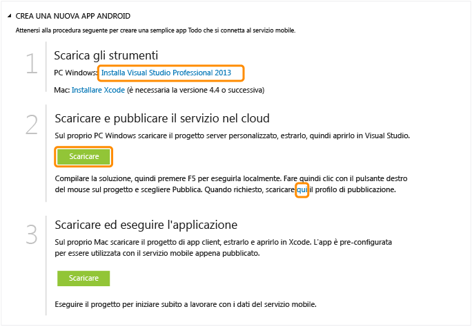

<properties pageTitle="Get Started with Azure Mobile Services for iOS apps" metaKeywords="Azure iOS application, mobile service iOS, getting started Azure iOS" description="Follow this tutorial to get started using Azure Mobile Services for iOS development. " metaCanonical="" services="" documentationCenter="Mobile" title="Get started with Mobile Services" authors="glenga" solutions="" manager="" editor="" />

Introduzione a Servizi mobili
=============================

[Windows Store C\#](/it-it/documentation/articles/mobile-services-dotnet-backend-windows-store-dotnet-get-started "Windows Store C#") [Windows Store JavaScript](/it-it/documentation/articles/mobile-services-dotnet-backend-windows-store-javascript-get-started "Windows Store JavaScript") [Windows Phone](/it-it/documentation/articles/mobile-services-dotnet-backend-windows-phone-get-started "Windows Phone") [iOS](/it-it/documentation/articles/mobile-services-dotnet-backend-ios-get-started "iOS") [Android](/it-it/documentation/articles/mobile-services-dotnet-backend-android-get-started "Android")

[Back-end .NET](/it-it/documentation/articles/mobile-services-dotnet-backend-ios-get-started/ "Back-end .NET") | [Back-end JavaScript](/it-it/documentation/articles/mobile-services-ios-get-started/ "Back-end JavaScript")

In questa esercitazione viene illustrato come aggiungere un servizio back-end basato su cloud a un'app per iOS mediante Servizi mobili di Azure. In questa esercitazione si creeranno sia un nuovo servizio mobile che una semplice app *To do list* che archivia i dati dell'app nel nuovo servizio mobile. Il servizio mobile che verrà creato utilizza i linguaggi .NET supportati tramite Visual Studio per la logica di business sul lato server e per la gestione del servizio mobile. Per creare un servizio mobile che consenta di scrivere la logica di business sul lato server in JavaScript, vedere la [versione per back-end JavaScript](/it-it/documentation/articles/mobile-services-ios-get-started) di questo argomento.

Di seguito è riportata una schermata dell'app completata:

Per completare questa esercitazione, è necessario disporre di XCode 4.5 e iOS 5.0 o versioni successive.

**Nota**

Per completare l'esercitazione, è necessario un account Azure. Se non si dispone di un account, è possibile creare un account di valutazione gratuita in pochi minuti. Per informazioni dettagliate, vedere la pagina relativa alla [versione di valutazione gratuita di Azure](http://www.windowsazure.com/it-it/pricing/free-trial/?WT.mc_id=AE564AB28&returnurl=http%3A%2F%2Fwww.windowsazure.com%2Fen-us%2Fdevelop%2Fmobile%2Ftutorials%2Fget-started-ios%2F).

Creazione di un nuovo servizio mobile
-------------------------------------

[WACOM.INCLUDE [mobile-services-create-new-service](../includes/mobile-services-create-new-service.md)]

Download del servizio mobile sul computer locale
------------------------------------------------

Dopo aver creato il servizio mobile scaricare il progetto di servizio mobile personalizzato da eseguire sul computer locale o sulla macchina virtuale.

1.  Fare clic sul servizio mobile appena creato, quindi nella scheda Quickstart fare clic su **iOS** in **Choose platform** ed espandere **Create a new iOS app**.

    

2.  Se necessario, scaricare e installare Visual Studio Professional 2013 o una versione successiva.

3.  Fare clic su **Download** in **Download and publish your service to the cloud**.

    Verrà scaricato il progetto di Visual Studio che implementerà il servizio mobile. Salvare il file del progetto compresso nel computer locale e prendere nota del percorso.

4.  Inoltre, scaricare il proprio profilo di pubblicazione, salvare il file scaricato nel computer locale e prendere nota del percorso.

Test del servizio mobile
------------------------

[WACOM.INCLUDE [mobile-services-dotnet-backend-test-local-service](../includes/mobile-services-dotnet-backend-test-local-service.md)]

Pubblicazione del servizio mobile
---------------------------------

[WACOM.INCLUDE [mobile-services-dotnet-backend-publish-service](../includes/mobile-services-dotnet-backend-publish-service.md)]

Creazione di una nuova app per iOS
----------------------------------

In questa sezione si creerà una nuova app per iOS connessa al servizio mobile.

1.  Nel portale di gestione fare clic su **Mobile Services** e quindi sul servizio mobile appena creato.

2.  Nella scheda Quickstart fare clic su **iOS** in **Choose platform** ed espandere **Create a new iOS app**.

3.  Se necessario, scaricare e installare [Xcode](https://go.microsoft.com/fwLink/p/?LinkID=266532) 4.4 o versione successiva.

4.  Fare clic su **Create TodoItems table** per creare una tabella in cui archiviare i dati dell'app.

5.  In **Download and run your app** fare clic su **Download**.

Verrà scaricato il progetto per l'applicazione *To do list* di esempio connessa al servizio mobile, unitamente a Mobile Services SDK per iOS. Salvare il file del progetto compresso nel computer locale e prendere nota del percorso.

Esecuzione della nuova app per iOS
----------------------------------

[WACOM.INCLUDE [mobile-services-ios-run-app](../includes/mobile-services-ios-run-app.md)]

Viene mostrato come eseguire la nuova app client nel servizio mobile in esecuzione in Azure. Per poter testare l'app per iOS con il servizio mobile in esecuzione in un computer locale, è necessario configurare il server Web e il firewall in modo da consentire l'accesso dal computer di sviluppo iOS. Per ulteriori informazioni, vedere [Configurazione del server Web locale per consentire le connessioni a un servizio mobile locale](/it-it/documentation/articles/mobile-services-dotnet-backend-how-to-configure-iis-express).

